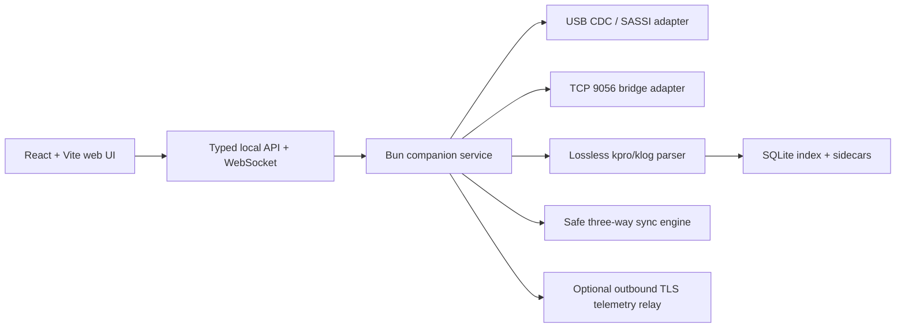

# Nano 7 USB protocol and native file formats

Status: interoperability specification draft
Research date: 18 July 2026
Evidence: official documentation, public USB registry, local `.kpro`/`.klog` samples, static analysis of installed Studio 7.4.3, read-only host-side observation, and a bounded read-only hardware-in-the-loop session with an attached Nano 7

## 1. What is known, and what still needs capture

The current Type-C Nano 7 does **not** present itself as HID or as an ordinary mounted disk. Studio expects an RP2040 USB CDC serial interface and implements an ASCII protocol named SASSI. The roaster's internal filesystem is synchronized over that protocol.

Public corroboration:

- Kaffelogic support describes the connection as USB serial and `Board CDC (Interface 0)`: [official community response](https://community.kaffelogic.com/viewtopic.php?t=584).
- Raspberry Pi assigns `0x2e8a:0x000a` to the Pico SDK CDC UART: [official Raspberry Pi USB PID registry](https://github.com/raspberrypi/usb-pid).
- RP2040 provides USB 1.1 full-speed device support: [RP2040 specifications](https://www.raspberrypi.com/products/rp2040/specifications/).
- Kaffelogic's Connect guide describes built-in storage reached through Studio: [Connect guide](https://webservices.kaffelogic.com/downloads/manuals/connect%20manual%20insert.pdf).

The roaster was unavailable during the initial pass. A later IORegistry inspection verified its RP2040 CDC ACM interfaces while Studio owned the serial port. After Studio exited, `/dev/cu.usbmodem2101` and `/dev/tty.usbmodem2101` were unowned, and a read-only, nonblocking open of the callout node captured repeated SASSI type-2 connection requests. The first capture wrote no application bytes or modem-control operations. A later bounded hardware-in-the-loop run used the implemented serial adapter at Studio's settings, received and validated type 2, sent type 3, validated the matching type-4 acknowledgement, then sent type-13 reads for operational status (code 9) and system information (code 3). The Nano returned type-14 responses and the system payload yielded firmware `7.20.6`.

The same session sent the read-only type-5 inventory request for `kaffelogic/roast-logs`. The attached Nano returned a final type-6 response with lower outcome `103` (`busy`) and sequence `0`. Its operational status concurrently reported `sassi_file_lock=7`. Static inspection of Studio confirms that Studio also defers filesystem synchronization until this field becomes `0`. Tan Studio therefore remains connected, reports the busy state, and automatically retries synchronization after a later not-busy type-30 status notification. This verifies the request/error path without inventing a command or bypassing the device lock. A successful directory payload and complete type-8 file transfer still require a capture while the Nano reports an unlocked filesystem. Live-roast traffic and every mutating command remain disabled and uncaptured.

## 2. USB serial transport

| Property | Value | Confidence |
| --- | --- | --- |
| USB device shape | IAD-style composite, device class/subclass/protocol `0xef/0x02/0x01`; one configuration | Live IORegistry |
| Product string | Generic Raspberry Pi `Pico`; do not trust this alone as product identity | Live IORegistry |
| Interface 0 | `Board CDC`, Communications class `0x02`, ACM subclass `0x02`; bound to `AppleUSBACMControl` | Live IORegistry |
| Interface 1 | CDC Data class `0x0a`, two endpoints; bound to `AppleUSBACMData` / `IOSerialBSDClient` | Live IORegistry |
| Vendor ID | `0x2e8a` | Public + live IORegistry |
| Product ID | `0x000a` | Public + live IORegistry |
| Link speed class | USB full-speed; `bcdUSB=0x0200`, endpoint-zero maximum packet 64 | Live IORegistry |
| macOS node | Observed as `/dev/cu.usbmodem2101` with paired `/dev/tty.usbmodem2101`; the numeric suffix is ephemeral and implementations must enumerate `/dev/cu.usbmodem*` | Live observation |
| Serial configuration | 115200 baud, 8 data bits, no parity, and 1 stop bit; the implemented adapter completed the read-only handshake with these settings. | Static analysis + live HIL |
| Flow/control lines | DTR asserted; XON/XOFF and RTS/CTS off. This matches Studio and completed the read-only handshake on the attached Nano. Whether all firmware/OS combinations require DTR remains unknown. | Static analysis + live HIL |
| Read timeout | 10 ms | Local static analysis |
| Initial capture access | `O_RDONLY`, `O_NONBLOCK`, and `O_NOCTTY`; no application writes or explicit ioctls/termios changes | Live observation |
| Implemented adapter | Rust `serialport` 4.9.0 helper with exclusive open, opaque candidate/session IDs, bounded JSONL/base64 IPC, and no SASSI knowledge; TypeScript owns framing and commands | Implemented + live HIL |
| Port ownership | One owner at a time. Studio must be closed before Tan Studio acquires the callout node; exclusive ownership was verified during the bounded HIL session. | Static analysis + live HIL |
| Device emission | Repeated 74-byte type-2 frames arrived without an application-level host write; the first was observed about 1.0 s after open and subsequent frames about 0.5 s apart. Treat this as an observed short-run cadence, not a guaranteed retry interval. | Live observation |
| Packet terminator | Carriage return, `\r` | Static analysis + live type-2 frames |

USB 3 is unnecessary for a future bridge. A compatible accessory needs to implement the CDC host/device relationship and SASSI behavior correctly; telemetry volume is tiny.

## 3. SASSI v1 framing

The installed app names the protocol SASSI, version 1. No public protocol specification or public reference implementation was found.

The attached Nano independently confirms the type-2 prefix, decimal message type, pipe-delimited fields, hexadecimal elapsed value, carriage-return terminator, and seeded CRC behavior. Other message contracts remain derived from Studio analysis until captured.

```text
KL*<decimal-type>|<lowercase-hex-ms-timestamp>|<field-1>|...|<four-hex-crc>\r
```

Rules:

- Text is ASCII/UTF-8 compatible.
- Fields are separated with `|`.
- No escaping for a literal `|` was found, so field validation must exclude it until the device-side constraints are known.
- `\r` ends a frame.
- The timestamp is lowercase hexadecimal elapsed milliseconds since the sender process/module initialized. It has no `0x` prefix or fixed width and is not wall-clock time.
- CRC is CRC-16/CCITT-XMODEM using polynomial `0x1021`, MSB-first, no reflection, and no final XOR. Two independently captured type-2 frames validated using the seed contained in each frame.
- CRC covers the frame body through the `|` immediately before the CRC.
- The type-2 connection request supplies the CRC initial state in its final payload field. Some internal indexing calls this field 11 because it counts the timestamp; the payload itself contains the ten values listed below. Pre-handshake fallback is zero.
- Default maximum frame size is 256 bytes until negotiated.
- Default maximum field count is 16.
- File data is Base64 encoded and split into sequence-numbered chunks.
- A final-chunk bit (`0x80`) is carried in the relevant outcome/action field.
- Chunk acknowledgement timeout is 10 seconds.

### 3.1 Connection request

The roaster request contains:

```text
platform
capabilities
serial
sassi-version
model
manufacturer-domain
description
max-packet-size
max-filename-size
crc-seed
```

#### 3.1.1 Observed Nano 7 type-2 request

The attached Nano emitted this structure repeatedly while no host response was sent:

```text
KL*2|<elapsed-hex>|1|128|<serial-redacted>|1|KN1007B|kaffelogic.com||4064|192|<crc-seed>|<crc>\r
```

| Field | Observed value |
| --- | --- |
| Platform | `1` |
| Capability bitset | `128` |
| Device serial | 10-byte value; intentionally redacted |
| SASSI version | `1` |
| Model | `KN1007B` |
| Manufacturer domain | `kaffelogic.com` |
| Description | Empty |
| Maximum packet bytes | `4064` |
| Maximum filename bytes | `192` |
| CRC seed | Hexadecimal and different across observed frames |
| CRC | Four hexadecimal digits; validated with that frame's seed |

This is a structural example, not a CRC-valid fixture: replacing the serial changes the CRC input. Any committed test fixture must use a synthetic serial and recompute its CRC rather than combining a redacted body with an original CRC. The meaning of capability value `128` remains unknown. The live type-3/type-4 exchange accepted these limits for the connected session.

The host identifies as platform 10 and returns capability/version data and UTC time in this form:

```text
YYYYMMDDdHHMMSS
```

`d` is weekday with Sunday equal to zero.

### 3.2 Minimum read-only connection sequence

An initial compatibility client must stage this sequence by evidence. Steps 1-7 and the busy filesystem response in step 8 are implemented and verified against the attached Nano. The successful directory/file payload path remains fixture-tested but awaits an unlocked hardware capture; live behavior remains capture-gated:

1. Select the CDC port whose USB VID/PID is `0x2e8a:0x000a`.
2. Open it at 115200 baud, assert DTR, and buffer bytes until `\r`.
3. Require the `KL*` prefix, split the CRC at the final `|`, and retain the raw frame for diagnostics.
4. For the first type-2 connection request, parse the candidate CRC seed from its payload and use that seed to validate the same frame. Reject it if the computed CRC does not match.
5. Validate manufacturer domain, supported Nano model, SASSI version, limits, and required capabilities. VID/PID alone identifies a candidate RP2040 CDC device, not a trusted Kaffelogic target.
6. Reply as host platform 10 with capability 256, SASSI version 1, and UTC time; require a matching type-4 acknowledgement before reporting connected.
7. Request operational status code 9 and system information code 3 serially. System information currently supplies the displayed firmware; operational status supplies `sassi_file_lock` and the current stage.
8. When `sassi_file_lock` is `0`, list the profile and roast-log directories with type 5, then pull changed files with type 7. If the device returns outcome `103` or reports a nonzero file lock, expose `busy`, keep the connection open, and defer synchronization until a later not-busy type-30 status. Continue consuming type-30 status and acknowledge every type-32 incremental-file chunk with type 1 while busy.
9. On disconnect, keep all complete frames and partial live-log state, then restart negotiation on the next port open.

Frame decoding should be incremental: a serial read can contain half a frame or several frames. Never assume one read equals one packet, and cap the pre-terminator buffer at the negotiated maximum plus a small framing allowance.

### 3.3 Platform codes

| Code | Platform |
| ---: | --- |
| 1 | RP2040 appliance |
| 2 | Legacy AT90USB1287 appliance |
| 10 | Host computer |
| 11 | TCP/Wi-Fi bridge |

### 3.4 Core message types

Field positions below start after the type: `p1` is always the timestamp, followed by the listed fields. An empty/reserved interior slot remains on the wire, for example `KL*5|<ts>|<path>||1|<crc>\r`.

| Type | Name and direction | Fields after `p1` timestamp |
| ---: | --- | --- |
| 1 | Packet ACK, either direction | None |
| 2 | Connection request, device -> host | `p2` platform; `p3` capability bitset; `p4` serial; `p5` SASSI version; `p6` model; `p7` manufacturer domain; `p8` description; `p9` maximum packet bytes; `p10` maximum filename bytes; `p11` CRC seed in hex |
| 3 | Time sync, host -> device | `p2` host platform 10; `p3` host capabilities; `p4` UTC `YYYYMMDDdHHMMSS`; `p5` SASSI version 1 |
| 4 | Time-sync ACK, device -> host | None |
| 5 | Directory-list request, host -> device | `p2` directory path; `p3` reserved/empty; `p4` format 1 |
| 6 | Directory-list response, device -> host | `p2` likely path echo; `p3` outcome/final; `p4` likely format echo; `p5` sequence; `p6` Base64 data. The likely echo fields are ignored by Studio and need capture confirmation. |
| 7 | File request, host -> device | `p2` source path |
| 8 | File response, device -> host | `p2` likely source-path echo; `p3` outcome/final; `p4` UTC modification time; `p5` sequence; `p6` Base64 bytes. The echo is ignored by Studio and needs capture confirmation. |
| 9 | File push, host -> device | `p2` destination path; `p3` action, normally save = 1 with `0x80` set on the final chunk; `p4` UTC modification time; `p5` sequence; `p6` Base64 bytes |
| 10 | File-push ACK, device -> host | `p2` filepath; `p3` outcome |
| 11 | File delete, host -> device | `p2` filepath; `p3` reserved/empty |
| 12 | File-delete ACK, device -> host | `p2` filepath; `p3` outcome |
| 13 | Information request, host -> device | `p2` information data, possibly empty; `p3` information code |
| 14 | Information response, device -> host | `p2` information data; `p3` information code, not an outcome |
| 15 | Action, host -> device | `p2` action data, possibly empty; `p3` action code; `p4` connected roaster serial injected by Studio |
| 16 | Action ACK, device -> host | `p2` unconsumed, likely action data; `p3` outcome; `p4` unconsumed, likely serial. `p2`/`p4` require capture confirmation. |
| 20 | Time-sync request, device -> host | None; host queues a new type 3 |
| 30 | Status notification, device -> host | `p2` information data; `p3` information code |
| 31 | Nominal status ACK, host -> device | Declared but unused in direct Studio; exact fields unknown |
| 32 | Incremental file notification, device -> host | `p2` filepath; `p3` outcome/final; `p4` positional date-modified field ignored by Studio; `p5` sequence; `p6` Base64 bytes |
| 33 | Nominal file-notification ACK, host -> device | Declared but unused; Studio sends a type-1 ACK for every type-32 chunk |
| 255 | Debug string, device -> host | Debug payload exists, but its complete field contract was not needed by the compatibility path and remains capture-dependent |

Wi-Fi bridge variants include 109/110, 113/114, 115/116, and 130/131. A bridge must not be assumed to be a byte-transparent serial tunnel.

Studio's serializer can collapse all-empty declared payload slots and can emit `KL*<type>|<ts>|<crc>\r` when its payload object is absent. A parser should therefore use each message contract but tolerate the shorter no-payload form where the peer legitimately sends it.

Studio's initial type-3 response advertises host capability `1 << 8` (256, multi-packet ACK). When type 20 requests another time sync, Studio emits the same logical type 3 with an empty capability slot: `10||<date>|1` after the timestamp.

#### 3.4.1 Sequence, final bit, and outcomes

- Transfer sequence numbers are decimal, begin at 1, and increment by 1.
- `0x80` is the final-packet bit; the lower outcome is selected with `0x7f`.
- For type 6 and 8 streams, Studio accepts exact `0` as intermediate success and exact `128` as final success. Any other value completes as an error.
- Type 6/8 strictly validates sequence continuity; a mismatch clears accumulated data and produces local outcome 101.
- Type 32 clears its fragment accumulator at sequence 1 but Studio does not enforce continuity. A replacement should retain compatibility while reporting gaps/out-of-order chunks rather than silently concatenating them.
- A type-32 final bit ends one notification fragment, not necessarily the whole roast. Later notifications append more live-log text.
- Type 9 carries the final bit in its action slot: intermediate save is 1, final save is 129. Even an empty file is sent as one final chunk with sequence 1 and empty Base64.

Known lower outcome codes:

| Code | Meaning | Code | Meaning |
| ---: | --- | ---: | --- |
| 0 | Success | 1 | No room |
| 2 | Not valid | 3 | Not found |
| 4 | System error | 5 | Too big |
| 6 | Directory not empty | 7 | Corrupt file |
| 10 | LittleFS error | 20 | Unspecified error |
| 30 | Action denied | 50 | Cannot save |
| 51 | Cannot open | 52 | Cannot rename |
| 53 | Cannot delete | 54 | Cannot create directory |
| 100 | Name too long | 101 | Data sequence error |
| 102 | Timeout | 103 | Busy |

The attached Nano produced a valid final busy response shaped as `path`, `231` (`0x80 | 103`), format `1`, sequence `0`, and an empty data field. Sequence `0` is therefore valid for a terminal transfer error that contains no data; successful transfer chunks still begin at sequence `1`.

#### 3.4.2 ACK and timeout state machine

- Only one response-bearing request is in flight. Normal pairs are 3 -> 4, 5 -> 6, 7 -> 8, 9 -> 10, 11 -> 12, 13 -> 14, and 15 -> 16, with a 10-second response deadline.
- For type 6/8 receive streams, the host sends a no-payload type 1 after every intermediate chunk. It completes on the expected final response and normally does not additionally ACK that final chunk.
- For a type-9 push, the host sends the first chunk and queues the rest. Each device type-1 ACK releases the next chunk; after the final chunk the host waits for type 10. Type 10 may abort the transfer early and clears unsent chunks on error.
- For every type-32 notification chunk, including the final chunk, Studio sends a no-payload type 1. It does not use type 33.
- Direct type-30 status notifications receive no ACK in Studio; type 31 is unused. The bridge path differs: type 130 queues type 131.
- Studio enables multi-packet ACK behavior unconditionally, including USB, rather than gating it on the peer capability bit.

#### 3.4.3 CRC algorithm and safe fixtures

The CRC update is CRC-16/CCITT-XMODEM, polynomial `0x1021`, MSB first, no reflection, and no final XOR. The initial value is the negotiated seed rather than textbook XMODEM's fixed zero.

For each UTF-8 byte: XOR `byte << 8` into the CRC, then perform eight left shifts; when bit `0x8000` is set, XOR `0x1021` after the shift. Mask to 16 bits after every shift.

CRC input begins at the `K` in `KL*` and includes the `|` immediately before the CRC. It excludes the four CRC digits and `\r`. For type 2, Studio reads `p11` and installs that seed before validating the same frame.

Two captured requests validated exactly when their own `p11` seed was applied to the bytes from `K` through the final separator. Their seeds changed between frames. Because the serial is covered by the CRC, a privacy-safe fixture must replace the serial and recompute the CRC; retaining the captured CRC after redaction produces an invalid fixture.

Safe synthetic fixtures, independently cross-checked with `binascii.crc_hqx`:

```text
seed 0x1d0f, input KL*1|0| -> ece2 -> KL*1|0|ece2\r
seed 0x0000, input KL*1|0| -> f490 -> KL*1|0|f490\r
```

#### 3.4.4 Remaining wire-capture ambiguities

The bounded read-only handshake does not establish:

1. Whether type-6 `p2`/`p4` and type-8 `p2` echo the request exactly.
2. The meaning/population of type-16 `p2` and `p4`.
3. Direct type-31/type-33 payloads; Studio does not use them.
4. Type-32 `p4`, intended handling of gaps/out-of-order chunks, or error-plus-final combinations.
5. Whether firmware accepts/produces lower-error values ORed with `0x80`.
6. Whether every supported firmware/OS combination relies on the requested USB CDC line coding or DTR. The attached Nano connected with Studio-compatible 115200 8N1 and asserted DTR.
7. Field character constraints beyond the observed absence of `|` escaping.
8. Whether the observed roughly 0.5-second pre-handshake repetition is a fixed retry interval or a temporary startup cadence.

### 3.5 Directory list encoding

Directory entries decode to:

```text
<mode>\t<name>\t<YYYYMMDDdHHMMSS>\t<size>\r
```

`>` denotes a directory; a space denotes a regular file.

### 3.6 Information codes

| Code | Meaning |
| ---: | --- |
| 1 | Folder updated |
| 2 | Fault |
| 3 | System |
| 4 | Filesystem |
| 5 | Technical |
| 6 / 7 | Busy / not busy |
| 8 | File updated |
| 9 | Operational status |
| 100-104 | Bridge status, device info, stored SSIDs, scan, and log fetch |

The device reports busy during a roast. Full synchronization must defer while busy; incremental live-log handling continues.

### 3.7 Actions relevant to compatibility

Core device-management actions include save, restart, filesystem format, and connection control. Restart subtypes include power-up, reset, firmware install, rescue, and RP2040 BOOTSEL.

Application actions found in Studio include:

| Action | Meaning |
| ---: | --- |
| 100 | Load profile |
| 101 | Set next log number |
| 102 | Record roast event |
| 103 | Stop roasting |
| 104 / 105 | Enable / disable licensed feature |
| 106 | Load profile pack |
| 107 | Fan calibration |
| 108 | Load language |
| 109 | Set roaster preference |
| 151 / 152 | Wi-Fi credentials / refresh scan |

Live event numbers:

| Event | Code |
| --- | ---: |
| Colour Change | 0 |
| First Crack | 1 |
| First Crack End | 2 |
| Second Crack | 3 |
| Second Crack End | 4 |

Backdated event form:

```text
<event>=<milliseconds-ago>@<temperature-C>
```

For SASSI action 102 (`RECORD_EVENT`), `<eventIndex>=X` commands a connected roaster to delete that event. This is an on-wire action payload, not `.klog` syntax.

These numeric values are interoperability observations, not authorization to expose every action in the new UI. Format, restart, firmware, delete, stop, calibration, and preference writes require separate capability and confirmation gates.

## 4. Remote filesystem and synchronization

```text
kaffelogic/
├── roast-profiles/
├── roast-logs/
├── firmware/
├── languages/
└── profile-packs/
```

Current Studio maintains a local per-roaster mirror and uses a hidden `.sync_base` file for three-way reconciliation. That file is a Python protocol-0 pickle.

Replacement requirements:

- Never deserialize the existing pickle as trusted data. Python pickle is unsafe for attacker-controlled input.
- Build an independent safe sync ledger in SQLite.
- Compare path, size, modified time, and preferably content hash.
- Model local, remote, and common-base versions explicitly.
- Preserve both versions on conflict and ask the user; never silently overwrite.
- Defer non-live sync while the device is busy.
- Treat file notifications as hints and verify final content.

## 5. `.kpro` profile format

### 5.1 Container and common text grammar

`.kpro` is plain UTF-8 text with one `key:value` property per line.

- Studio writes LF. Its reader accepts CR, LF, CRLF, or LFCR, normalizes internally, converts every tab to a comma, collapses two or more blank breaks to one blank separator, and trims trailing whitespace at EOF.
- Split at the first colon only; values may contain later colons. Lines without a colon are ignored and there is no comment syntax.
- Spaces in keys become underscores; key case is otherwise significant. There is no general key/value whitespace trim, quoting, or backslash-escape layer.
- Commas delimit numeric arrays. There is no quoted-comma mechanism, so stored numeric values must use finite dot-decimal notation.
- UI multiline text uses the literal two-character sequence `\v` for each newline. A literal `\v` in user text is therefore not losslessly representable by Studio.
- No file-level checksum, signature, or encryption was present in inspected files.

Duplicate and override behavior:

- Scalar duplicate keys are last-wins semantically, while Studio keeps the first occurrence's position when serializing.
- Each valid duplicate `roast_profile` or `fan_profile` resets the curve; the last valid array wins. A curve whose token count is not divisible by six is ignored.
- Unknown scalar keys enter Studio's in-memory map, but its writer filters them out on save. The replacement must instead preserve unknown keys, duplicates, ordering, raw values, and original bytes in an ordered document model.

No key is syntactically required by Studio's loader: it loads a default template first, then overlays present records. Firmware-side minimums remain capture-dependent.

### 5.2 Known profile registry

The standard Nano template contains 59 core keys plus the automatically written modified time. Studio also knows 22 schema/style-gated keys. Defaults below are shipped editor defaults, not a claim that every firmware accepts a sparse or default-only file.

| Family | Known keys, defaults, and units |
| --- | --- |
| Identity and phase | `profile_short_name=""`; `profile_designer=""`; `profile_description=""`; `profile_schema_version=1.8`; `reference_load_size=120 g`; `emulation_mode=0`; `recommended_level=3.0`; `expect_fc=209 °C`; `expect_colrchange=0 °C` where zero is effectively unspecified in normal UI paths |
| Auto-written | `profile_modified` as UTC `DD/MM/YYYY HH:MM:SS UTC`, written immediately before the curve records |
| Preheat | `preheat_power=950 W`; `preheat_nominal_temperature=240 °C`; `preheat_min_power_offset=10%`; `preheat_min_time=20 s`; `preheat_max_time=60 s`; `preheat_check_gradient_time=30 s`; `preheat_target_in_future=30 s`; `preheat_mode=5`; `preheat_end_detection_count=5`; `preheat_temperature_proximity=8.5 °C` delta |
| Roasting | `roast_required_power=1200 W`; `roast_min_desired_rate_of_rise=1.3 °C/min`; `roast_target_in_future=25 s`; `roast_use_prediction_method=1`; `roast_target_timeshift=1 s`; `roast_end_by_time_ratio=0.333`; `roast_levels` as seven increasing temperatures |
| PID/control | `roast_PID_Kp=0.717`; `roast_PID_Ki=0`; `roast_PID_Kd=3.55`; `roast_PID_min_i=0`; `roast_PID_max_i=0`; `roast_PID_iLimitApplyAtZero=1`; `roast_PID_differentialOnError=1`; `specific_heat_adj_upper_temperature_limit=180 °C`; `specific_heat_adj_lower_temperature_limit=80 °C`; `specific_heat_adj_multiplier_Kp=2.1`; `specific_heat_adj_multiplier_Kd=4` |
| Zones | For `N=1..3`: `zoneN_time_start=0 s`, `zoneN_time_end=0 s`, `zoneN_multiplier_Kp=1`, `zoneN_multiplier_Kd=1`, `zoneN_boost=0`. Boost is normally °C/min; when both multipliers are zero the zone becomes power profiling and boost represents percent power. |
| Corner | `corner1_time_start=0 s`; `corner1_time_end=0 s` |
| Cooling | `cooldown_hi_speed=16500 RPM`; `cooldown_lo_speed=16000 RPM`; `cooldown_lo_temperature=100 °C` |
| Curves | `roast_profile`; `fan_profile` |
| Optional visual FC zone | `fc_zone_time_start=0 s`; `fc_zone_time_end=0 s` in the style template that supplies them. Studio treats these as visual-only, without controller effect. |
| Optional fan steps | For `N=1..10`: `fan_stepN_time` in seconds and `fan_stepN_adjust` as an additive fan-multiplier adjustment, default zero in the supporting style. Schema 1.9 exposes steps 1-4 and 1.10 exposes 5-10; these schemas are not yet approved for Nano output in this specification. |

Time values are seconds on disk even when the UI presents `min:sec`. Boolean-like values are numeric 0/1. `preheat_mode` and non-native `emulation_mode` meanings are not sufficiently established to publish as user-facing enums.

### 5.3 Bezier curves

`roast_profile` and `fan_profile` are flat numeric arrays grouped in sixes:

```text
x, y, leftControlX, leftControlY, rightControlX, rightControlY
```

The handle coordinates are absolute, not offsets from the node. Segment `i -> i+1` uses these four cubic points exactly:

```text
node i
node i right handle
node i+1 left handle
node i+1
```

Units and parser behavior:

- Node and handle `x`: seconds.
- Roast node and handle `y`: degrees Celsius.
- Fan node and handle `y`: RPM.
- `(0,0)` is a sentinel for an absent/automatic handle. The parser forces the first node's left handle and final node's right handle to this sentinel; calculated display handles must not overwrite the stored sentinel.
- Nodes stay in file order; Studio does not sort them. Evaluation consumes adjacent nodes in that order.
- UI validation requires x never to turn backward and adjacent nodes to be at least one second apart.

Studio internally scales RPM for graphing; the file stores full RPM.

### 5.4 Roast levels, compatibility, and validation

`roast_levels` contains exactly seven increasing Celsius thresholds indexed 0 through 6. Integer level `n` maps to threshold `n`; decimal levels interpolate linearly between adjacent thresholds. Normal selectable/recommended levels are 0.1-5.9, so the outer values act as boundaries. The inverse mapping clamps below the first threshold to level 0 and treats the final threshold or above as outside the normal interpolation range. Studio requires at least 1 °C between thresholds and, in standard mode, a range of 150-242.5 °C.

| Schema | Firmware floor shown by Studio | Feature |
| ---: | --- | --- |
| 1.4 | 7.2+ | Baseline |
| 1.5 | 7.3.5+ | Blank short name |
| 1.6 | 7.4.5+ | Zone 1/2 power profiling; zone 3 boost-only |
| 1.7 | 7.4.6+ | Zone 3 multipliers and power profiling |
| 1.8 | 7.10+ | Non-default reference load size |

Kaffelogic's separate reference-load help states 7.11.1+, which is the safer practical floor. [Reference load size](https://kaffelogic.atlassian.net/wiki/spaces/RWK/pages/11698443)

Studio's registry also knows schema 1.9 for fan steps 1-4 and 1.10 for steps 5-10 in other style/product paths. Do not emit either schema for Nano 7 merely because its firmware version number is higher; validate the target family and capture native fixtures first.

Observed editor constraints:

- 3-15 roast-curve nodes and at least 3 fan-curve nodes; the fan/device maximum still needs capture.
- 20-minute maximum roast duration.
- 300 °C maximum profile temperature.
- 8,000-18,000 RPM fan range.
- 50-200 g reference load.
- Short name: 15 ASCII characters.
- Designer: 31 UTF-8 bytes.

### 5.5 Minimal parser example

This is an intentionally sparse parser illustration, not a claimed firmware-minimum profile:

```text
profile_short_name:Example
profile_designer:Redacted
profile_description:Line one\vLine two
profile_schema_version:1.8
recommended_level:3.0
roast_levels:200,205,210,215,220,225,230
roast_profile:0,20,0,0,20,50,60,110,40,85,90,130,120,160,100,145,0,0
fan_profile:0,14700,0,0,18,14700,60,14500,42,14700,90,14000,120,13500,100,13800,0,0
```

Each curve has three nodes. The first-left and final-right `(0,0)` pairs are sentinels; the other handle pairs are absolute coordinates.

## 6. `.klog` roast-log format

### 6.1 Container and table rules

`.klog` is also plain text and embeds the complete profile/settings used for the roast.

```text
metadata-key:value
metadata-key:value
...

offsets\t...
time\tchannel-1\tchannel-2\t...
sample...
sample...
```

The `offsets` row is optional. Native device output is tab-delimited; Studio's common normalization converts tabs to commas, so it also accepts comma-delimited input. There is no CSV quoting.

- The first header token is the x axis, normally `time` in seconds. Remaining tokens define y series.
- `offsets` is followed by one time offset in seconds per y series. The offset is added to that series' row timestamp; absent offsets default to zero.
- A numeric row is retained only when it has at least as many cells as the header. Extra cells are ignored and a short row is discarded.
- Studio converts blank or non-numeric numeric cells to `0.0`. The replacement should preserve compatibility but surface a diagnostic instead of silently implying a real zero.
- Duplicate logical column names merge in Studio and are unsafe. The replacement must reject or require disambiguation.
- Lines beginning `!` after the separator are incidentals/late overrides, not sample rows; their generic behavior is described below.

Metadata values should first be retained as strings. Some are decorated rather than purely numeric.

### 6.2 Native channels

Observed current header:

```text
time
#spot_temp
#=temp
=mean_temp
=profile
profile_ROR
=actual_ROR
#=desired_ROR
power_kW
#volts-9
#Kp
#Ki
#Kd
#^actual_fan_RPM
```

Prefix grammar:

| Prefix | Meaning |
| --- | --- |
| `#` | Hidden/disabled initially |
| `=` | Reuse previous graph scale / do not independently autoscale |
| `@` | Absolute temperature |
| `&` | Temperature delta or RoR |
| `~` | Special processing |
| `^` | Fan RPM |

Prefixes are consumed in the order shown. Combinations such as `#=@temp`, `&actual_ROR`, and `#^actual_fan_RPM` are valid. Older/native headers often omit `@`/`&`; Studio infers temperature for `spot_temp`, `temp`, `mean_temp`, and `profile`, and temperature delta/RoR for `profile_ROR`, `actual_ROR`, and `desired_ROR`.

| Logical channel | Unit/behavior |
| --- | --- |
| `time` | Seconds |
| `spot_temp`, `temp`, `mean_temp`, `profile` | °C |
| `profile_ROR`, `actual_ROR`, `desired_ROR` | °C/min |
| `power_kW` | kW |
| `volts-9` | Unitless/display motor-supply trace |
| `Kp`, `Ki`, `Kd` | Unitless |
| `actual_fan_RPM`, `fan_speed` | RPM |
| `fan_speed_with_steps` | Derived by Studio; not required as a stored column |

The parser is generic and accepts other uniquely named numeric series.

Current local logs sample at approximately 1 Hz. Treat this as observed, not guaranteed.

### 6.3 Known log metadata

Every profile key from section 5 may be embedded. Additional recognized families are:

| Family | Known fields and semantics |
| --- | --- |
| Identity/version | `log_file_name`, `profile_file_name`, `profile_modified`, `native_schema_version`, `firmware_version`, `profile_family`, `profile_pack` |
| Roast | `roasting_level`; `boost_load_size` in g; numeric `fan_adjust` and `species_trim`; `roast_date`; `development_percent`; `tasting_notes`; integer `roast_end_reason`; standard event timestamps in seconds |
| Roast technical | `back2back_count`; dimensionless `power_factor`, `density_factor`, `boost_load_power_multiplier`, `boost_load_fan_multiplier`; `time_jump` in seconds; `preheat_heater_percent` |
| Environment | `altitude_trim`, `air_speed_trim`; `ambient_temperature`, `reference_temperature`; `mains_voltage`; `heater_power_available` in W |
| Device technical | `model`; `motor_hours`; `heater_hours`; `calibration_data`; `motor_supply_noise` percent |
| Legacy preference snapshot | `ambient_cutoff_reference`, `ambient_cutoff_probe`, `ambient_cutoff_difference`, `ambient_default_temperature`, `cooldown_end_temperature`, `cooldown_end_ror_1st`, `cooldown_end_ror_b2b`, `cooldown_slow_time` |

No metadata key is enforced as required by Studio's parser. `ambient_temperature`, `mains_voltage`, and `calibration_data` can be decorated/display strings; retain them as opaque raw values until cross-version fixtures define a stable machine contract.

`roast_end_reason` values known to Studio:

| Value | Reason | Value | Reason |
| ---: | --- | ---: | --- |
| 0 | Level | 1 | DTR from user First Crack |
| 2 | User | 3 | User from Studio |
| 4 | Too slow | 5 | Too fast |
| 6 | Too long | 7 | Interrupted |
| 8 | Thermal runaway | 9 | Thermal dip |
| 10 | DTR from expected First Crack | 11 | Dialled DTR without lock |

### 6.4 Events, incidentals, and editable data

Events may appear as metadata or incremental lines:

```text
first_crack:<seconds>
!first_crack:<seconds>
```

Supported event names include:

- `colour_change`
- `first_crack`
- `first_crack_end`
- `second_crack`
- `second_crack_end`
- `roast_end`
- `anti_beanlock`

A nonzero negative `roast_end` is observed on a user-stopped preheat. It is a valid interrupted-roast marker, not a chart anchor or a completed roast duration. Tan Studio preserves it as native event/metadata evidence, classifies the recording as interrupted, and does not insert it into the nonnegative chart-event table. Zero retains its separate override meaning of deleting the event.

Every post-separator `!key:value` line is stripped from the numeric stream and applied after the original metadata. It is a generic late override, not an event-only syntax; the last duplicate wins. For example, a live level change may arrive as `!roasting_level:3.1`.

When deleting an event from an offline or saved log, Studio appends an incidental override such as `!first_crack:0`. A zero event value removes the existing event; later nonzero overrides replace it. This expresses the same user intent as the live `=X` command at a different layer. A capture is still required before claiming firmware itself emits the zero-value line. `tasting_notes` uses `\v` for line breaks.

Richer replacement-only annotations should live in the app database/sidecar keyed by a stable logical roast identity. Content fingerprints identify immutable native-file revisions and aliases, but must not be the sole annotation key because an intentional native-field edit changes the hash. Only native fields and standard event overrides should be written into a newly derived `.klog` revision; the imported bytes remain immutable.

### 6.5 Minimal parser example

This illustrates grammar and override order, not the firmware's minimum required metadata:

```text
profile_short_name:Example
profile_schema_version:1.8
roasting_level:3.0
roast_date:2026-01-01 12:00:00
roast_levels:200,205,210,215,220,225,230
roast_profile:0,20,0,0,20,50,60,110,40,85,90,130,120,160,100,145,0,0
fan_profile:0,14700,0,0,18,14700,60,14500,42,14700,90,14000,120,13500,100,13800,0,0

offsets\t0\t0
time\t@temp\t&actual_ROR
0\t20.0\t0.0
1\t20.2\t12.0
!colour_change:95
!roasting_level:3.1
2\t20.5\t18.0
```

### 6.6 Native-format capture gaps

Static reader/editor behavior does not prove:

- The firmware's minimum required profile/log keys, accepted precision/ranges beyond Studio validation, line/file/text limits, or BOM tolerance.
- Whether firmware accepts comma-delimited tables merely because Studio does.
- Exact `preheat_mode` and non-native `emulation_mode` enumerations.
- Stable structured forms for decorated ambient, mains-voltage, and calibration values across firmware releases.
- Whether every Studio header-prefix combination is produced or consumed by firmware.
- Nano acceptance of `fc_zone_*`, schema 1.9/1.10, and all fan-step fields.

The golden-fixture set should therefore include a native profile pull; completed and live-growing logs; event and level changes; user abort; saved-log edit; fan steps; zone power profiling; non-default reference load; and re-save/reload semantic comparison.

### 6.7 Implemented compatibility and ingestion contract

Parser version 2 is grounded in three independent evidence sets:

- Static inspection of the installed Kaffelogic Studio 7.4.3 reader established line normalization, first-colon properties, last-value-wins metadata, generic `!` overrides, header-prefix behavior, time-offset application, short/extra-row behavior, and Studio's invalid-number-to-zero recovery.
- The attached Nano corpus contains 13 native firmware 7.20.6 logs, 6,167 total samples, one 13-channel schema, completed and interrupted recordings, negative pre-roast timestamps down to approximately -5.6 seconds, and cooldown data beyond 14 minutes. All 13 parse as `exact` with byte-identical raw retention and no diagnostics.
- Kaffelogic's own support forum documents a firmware/storage failure in which one valid roast was split across two `.klog` files, with approximately six seconds lost; Studio support instructed users to stitch the numeric continuation manually. A headerless continuation is therefore known evidence, not a complete independently importable roast. Tan Studio retains/quarantines it until fragment reconciliation exists rather than inventing a header or second roast. [Kaffelogic: log file split in two](https://community.kaffelogic.com/viewtopic.php?t=128)

The compatibility claim is deliberately bounded: no finite corpus can prove every past or future log. Tan Studio instead guarantees these safety properties:

1. Every accepted source remains available byte-for-byte with its SHA-256, parser version, channel-schema fingerprint, diagnostics, and provenance.
2. Unknown metadata keys and unknown numeric channels are preserved; they do not need a schema release merely to survive import and round-trip.
3. Semantic projection has an explicit `exact`, `compatible`, or `degraded` result. Any error-level recovery, absent master temperature, empty table, unsafe integer conversion, unsafe physical value, oversized projection, or invalid ordering makes the document ineligible for typed roast tables.
4. An ineligible source is stored once in `native_file_quarantine` by content hash (up to the 64 MiB retention limit), with stable error code and retry count. It creates no `roasts`, `roast_sample_streams`, `roast_series_points`, profile, event, library, or FTS row.
5. A device sync continues after quarantining one file, so one corrupt historical log cannot hide the remaining library.
6. Import is transactional and SQLite triggers independently enforce JSON shape/size, byte-length equality, elapsed bounds, and typed telemetry ranges if application validation is bypassed.
7. Parser diagnostics are capped at 256, files at 64 MiB, lines at 1 MiB, properties at 1,000, channels at 256, and rows at 250,000. Numeric projection uses safe integers only.

Run the privacy-safe corpus auditor against any Studio mirror or fixture directory:

```bash
bun run audit:klog -- "/path/to/kaffelogic/roast-logs"
```

The report emits filenames, hashes, structural keys/channels, time/count ranges, fingerprints, and diagnostic codes; it does not emit telemetry values, metadata values, device serials, or tasting-note content. A rejected file produces a nonzero exit status. Public/user fixtures must be redacted before entering version control.

## 7. Live stream behavior

Live telemetry is not a separate binary format. During a roast, the device sends SASSI file notifications containing Base64 chunks of the eventual `.klog` text:

1. The first fragment begins with metadata, `log_file_name`, offsets, and channel header.
2. Later fragments append sample rows and `!event` lines.
3. Busy/not-busy status describes roast activity.
4. When the roast ends, the complete final `.klog` is pulled and replaces the provisional stream.

The same incremental parser can therefore serve live and saved logs.

Parser states should be explicit:

```text
awaiting metadata -> awaiting header -> streaming rows -> provisional complete -> reconciled final
```

Malformed or partial trailing lines must be buffered until the next fragment. A connection drop must not discard already parsed samples.

## 8. Official Wi-Fi bridge

Kaffelogic's module exposes a SASSI-family bridge over plain TCP:

| Property | Value |
| --- | --- |
| TCP port | 9056 |
| AP address | `192.168.4.1` |
| Hostname | `KaffelogicWM` |
| Initial SSID pattern | `KaffeWifiModule_XXXXXX` |
| Transport security found | No TLS or application authentication |
| Integrity | CRC only; not cryptographic authentication |

The setup workflow is described in the [official wireless manual](https://cdn.shopify.com/s/files/1/0278/9169/5713/files/KL_-_Wireless_Manual_V2.03_WEB.pdf?v=1771384146).

Never expose TCP 9056 directly to the internet. For remote monitoring, a local agent/bridge should initiate an authenticated TLS connection to a relay and publish read-only telemetry.

## 9. Firmware interoperability boundary

Current Type-C firmware uses a Kaffelogic `.rp2040` container, not UF2. Studio pushes it as `firmware/update.bin` and requests the firmware-install restart subtype. The roaster performs the substantive integrity/signature validation.

The replacement may transfer an unmodified official firmware file after model/version checks, but it must not:

- Redistribute extracted firmware payloads.
- Bypass roaster validation.
- Modify/sign containers.
- Reuse proprietary encrypted-format secrets from Studio.

Firmware installation is a separately gated, high-consequence flow with uninterrupted-power warnings and explicit confirmation.

## 10. Recommended compatibility architecture



Why a companion service:

- Browser Web Serial requires a user gesture and is not universally available.
- Safari lacks Web Serial; Chromium and current Firefox support differ in permission behavior.
- The serial port is exclusive.
- Background sync, reconnect, firmware transfer, and conflict recovery need process lifetime independent of a tab.
- A local service gives React a stable typed API and keeps protocol parsing outside components.

Web Serial may remain a zero-install Chromium/compatible-browser adapter for a limited direct mode. [MDN Web Serial](https://developer.mozilla.org/en-US/docs/Web/API/Web_Serial_API)

## 11. Lossless-parser requirements

The new parser/writer must:

- Parse into an ordered multimap/AST before deriving a last-wins semantic view; preserve unknown and duplicate keys, exact raw values, incidentals, and order.
- Preserve header prefixes, offsets, and unknown telemetry channels.
- Split metadata at the first colon only.
- Apply post-separator `!` incidentals after original metadata without losing their physical location.
- Represent Bezier handles as absolute coordinates and keep stored `(0,0)` sentinels separate from calculated display handles.
- Diagnose duplicate logical columns, malformed six-value curve tuples, non-increasing curve time, invalid seven-level thresholds, and numeric cells Studio would silently coerce.
- Preserve or normalize line endings by explicit choice.
- Keep original raw bytes alongside the parsed model.
- Round-trip every fixture without semantic change.
- Avoid floating-point formatting drift unless a field is edited.
- Reject unsafe path traversal and absolute remote paths.
- Never deserialize Studio pickle files.
- Pass encrypted legacy NPRO/NLOG/NEF-style content through as unsupported unless an authorized interoperability mechanism is obtained.

Do not publish or reuse Studio's embedded encrypted-format key, saved Wi-Fi credentials, installation UUIDs, firmware binary, or decompiled source.

## 12. Capture and conformance plan

Before calling the transport production-ready, capture these scenarios against an enumerating roaster:

1. USB descriptors and endpoint layout. **Completed read-only:** composite CDC ACM control/data interfaces, full-speed link, VID/PID, and macOS bindings verified.
2. Device connection request and negotiation. **Completed read-only on the reference Nano:** repeated type-2 requests confirmed platform `1`, capability value `128`, redacted 10-byte serial position, SASSI version `1`, model `KN1007B`, manufacturer domain, empty description, advertised limits `4064`/`192`, changing CRC seed, and CRC validation. A Studio-compatible type-3 response was accepted and returned the matching type-4 acknowledgement.
3. System, filesystem, technical, and operational-status reads. **Partially completed read-only:** type-13 codes 9 and 3 returned matching type-14 responses; system information yielded firmware `7.20.6`. Filesystem and technical reads still require capture and fixtures.
4. Directory list, file pull, file push to a harmless test name, and conflict behavior.
5. Idle to busy transition without starting the roast from software.
6. Incremental live log and event notification during a supervised physical roast.
7. Final log reconciliation.
8. Cable disconnect/reconnect during idle and during live monitoring.
9. Official Wi-Fi bridge discovery and corresponding bridge packet forms.

Create redacted golden fixtures and protocol contract tests from those captures. Destructive actions are excluded from the initial capture plan.
