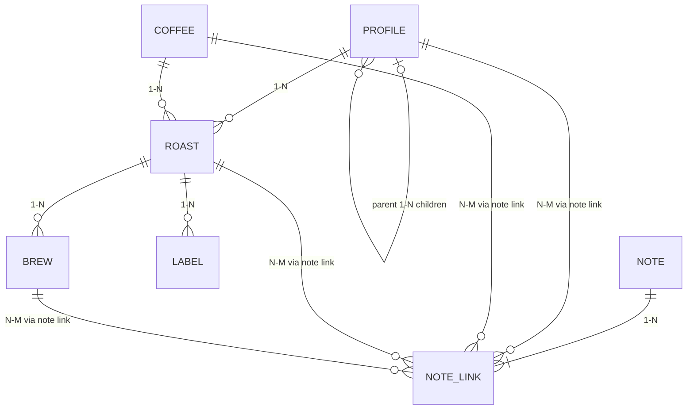

# Tan Studio — Product requirements

- Product: Tan Studio
- Status: implementation baseline
- Updated: 2026-07-19
- Product shape: local-first macOS desktop app and Raspberry Pi LAN appliance

## Product intent

Tan Studio is a calm, local-first notebook for the Kaffelogic Nano 7. Its primary product is a small, strongly typed API and durable coffee database. The React application is a focused view over that API; future LLM agents use the same API to record what the user says while roasting, brewing, and tasting.

The product deliberately avoids modeling every coffee concept as a separate table. It keeps only the entities the user routinely names:

- a profile describes how to roast;
- a coffee describes the purchased green coffee;
- a roast is one execution of a profile with a coffee;
- a brew consumes coffee from a roast;
- a note records free-form observation, tasting, or recommendation and may refer to several resources;
- a label identifies a roast;
- settings hold the user's recurring defaults.

Native KLOG/KPRO files, telemetry, and device synchronization are internal evidence. They do not expand the public product model.

## Product principles

1. **Only model what is useful.** Do not add an entity because it could theoretically be normalized.
2. **The backend owns product state.** Saved state survives a frontend reload, crash, desktop restart, or a different client.
3. **The URL owns navigation state.** Selection, filters, and the current task are shareable and recoverable from the URL.
4. **One screen, one task.** Show the data and actions needed now; link to related resources instead of embedding miniature dashboards.
5. **Short identifiers are first-class.** Profile, coffee, roast, brew, note, and label IDs are positive integers such as roast `15`.
6. **Free text before premature structure.** Tasting impressions, brew technique, and next-roast reasoning can remain notes until repeated use proves a dedicated field is needed.
7. **Imports are lossless.** Parsed data is useful, but the original native bytes remain authoritative evidence.
8. **Never fake hardware success.** Generated, submitted, and physically printed are different label states. Device writes remain disabled until captured and verified.

## Conceptual data model



A note may link to one resource or several resources at once. For example, “reduce boost next time” may link to the brew that revealed the result, its roast, the coffee, and the profile.

## Core workflows

### 1. Inspect or adjust a profile

1. Open a profile by short ID.
2. See its retained temperature/fan curves, recommended level, reference load, origin, description, parent, children, and roast count.
3. Follow a link to its parent, children, or roasts.
4. Create an adjusted child when the change should become reusable.
5. Use per-roast level or parameter adjustments when the change is experimental.

The screen explains the practical meaning of profile metrics. It does not show inventory, brew forms, printer configuration, or unrelated system status.

### 2. Prepare and complete a roast

1. Select a profile and, optionally, a coffee.
2. Enter level, green load, and a free-text intention or adjustment.
3. Create the planned roast before starting the physical Nano.
4. The backend keeps one active planned roast and offers Resume or Discard after reload.
5. Run the roast on the Nano.
6. Synchronize the device. The next legitimate KLOG reconciles into the planned roast instead of creating a disconnected record.
7. The selected coffee, profile snapshot, and planned adjustments remain attached.
8. Review the complete curve and device events, add a note, then log a brew or generate a label.

Tan Studio does not claim to start or stop the Nano. Until the verified write gate passes, physical controls remain authoritative.

### 3. Browse roast history and pantry

History is a lean table sorted by descending roast number. It supports text, status, profile, and coffee filters in the URL. It does not load telemetry arrays.

Pantry is a derived view of completed roasts. Estimated remaining roasted coffee is:

```text
roasted yield, or green input when yield is unknown
minus the coffee mass of recorded brews
```

Each pantry item includes its rest state: resting, peak, or past peak. Rest and peak defaults are user settings, not extra inventory entities.

### 4. Catalog green coffee

Create one flat coffee record for a purchased coffee. It may include provider, product/reference details, price, purchase date, masses, country, region, farm, producer, washing station, process, variety, altitude, harvest, storage location, and flexible metadata.

From the coffee, the user can edit inventory details, add notes, and open all associated roasts. Provider and origin are fields, not separate public resources.

### 5. Brew and taste

1. Identify the roast by short number or label QR.
2. Start from saved defaults for method, grinder, setting, kettle, water, dose, water mass, and temperature.
3. Add optional free-text technique, tasting note, and score.
4. Save one brew linked to the roast.
5. A tasting note entered with the brew becomes a universal note linked to that brew and visible in roast context.

Defaults support the common case—one Nano, one grinder, and mostly V60—without preventing per-brew overrides.

### 6. Generate a jar label

Open label creation from a roast. The default label contains the coffee name, `ROAST #<id>`, profile, optional note, and QR payload `tan:roast:<id>`. Geometry uses physical micrometers and deterministic SVG.

Creating a label records `generated`. It does not claim physical printing. Printer discovery and submission remain separate adapters.

### 7. Work through an LLM agent

An agent can use the public API to answer and act on requests such as:

- “What is in my pantry and which roast should I drink today?”
- “Log a V60 for roast 15: 16 g coffee, 250 g water, setting 5.4.1, 96 °C.”
- “Add this tasting note to the brew and link the recommendation to the roast and profile.”
- “Which prior roasts of this coffee were nutty rather than acidic?”
- “Prepare the next roast from this child profile with a lower level.”

Agent writes use the same validation, revision checks, and resource paths as the UI. An agent cannot bypass the device-write gate.

## Public resources

| Resource | Purpose | Required relationship |
| --- | --- | --- |
| Profile | Reusable roast definition and native profile document | optional parent profile |
| Coffee | Flat purchased-green-coffee catalog and inventory record | none |
| Roast | Execution/planned execution with snapshots and adjustments | profile at creation; optional coffee |
| Brew | One preparation and its recipe/equipment context | one roast |
| Note | Free-form observation, tasting, annotation, or recommendation | one or more links |
| Label | Deterministic label record and truthful status | one roast |
| Settings | Singleton recurring defaults | none |

No public provider, purchase, lot, inventory-ledger, tasting, annotation, plan, workspace, operation, or device-import resource is required in this iteration.

## UI information architecture

| Route | Primary task | Persisted state | URL state |
| --- | --- | --- | --- |
| `/roast` | prepare/resume one roast | planned roast, adjustments, note | selected profile/coffee |
| `/roasts` | history or pantry | none | view, search, status, profile, coffee |
| `/roasts/:id` | inspect/edit one roast | roast fields, notes | roast ID |
| `/profiles` | inspect profile/create child | profile child | selected profile |
| `/coffees` | catalog/edit green coffee | coffee fields, notes | search, selected coffee |
| `/brews` | log brew/edit defaults | brew, settings | selected roast, tab |
| `/labels` | generate roast label | label record | selected roast |
| `/devices` | inspect and synchronize Nano | sync result | none |

Every detail view has a visible way back and links to its related resources. Route failures render a recoverable error screen with Retry, Go back, and Roasts actions.

## Functional requirements

### Data and API

- All public resources use positive integer IDs.
- The Rust service exposes OpenAPI 3.1 and the React client is generated from it.
- Mutations validate unknown fields, ranges, references, and JSON object fields.
- Editable resources use revision-based `If-Match` concurrency.
- Notes support N-M relationships through replaceable link sets.
- Context endpoints return the small related graph an agent needs without requiring client-side joins.
- List responses do not contain telemetry arrays or full native profile documents.
- SQLite foreign keys, `STRICT` tables, WAL, migration backups, and `quick_check` protect persisted state.

### Native compatibility

- Read KPRO and KLOG from the Nano through the verified SASSI session.
- Keep original bytes, content hash, parser version, warnings, source identity, and parsed projection.
- Reject or quarantine malformed/unsafe input atomically.
- Interpret KPRO temperature/fan data as cubic Bézier control triples while preserving the original sequence.
- Keep all supported KLOG channels and return bounded chart series separately.
- Show unknown Nano sentinel dates as unavailable and sort history by short roast number.

### Design system

- React 19, Vite, TypeScript strict, Tailwind CSS v4, and shadcn `base-nova` components.
- Semantic Bali/coffee OKLCH tokens only; no ad-hoc feature colors or duplicate primitives.
- Use Field, accessible labels/descriptions/errors, Alert, Empty, Skeleton, Badge, Sheet, Table, and Sonner for their intended states.
- Charts use semantic tokens and do not hide sibling lines on hover.
- The visual tone is calm, warm, pale, and uncluttered: light wood/sand/coffee neutrals with restrained pastel accents.

## Explicit non-goals for this iteration

- Fully normalized supply-chain/accounting data.
- Social sharing, multi-user workspaces, or cloud dependence.
- Autonomous profile/device writes.
- Claiming label print completion without adapter evidence.
- A rigid sensory wheel or mandatory structured tasting form.
- A dashboard that repeats data from every resource.

## Acceptance criteria

1. Existing real KLOG/KPRO data migrates without changing retained bytes or telemetry row counts.
2. The real Nano profile list and curves render from native KPRO fields.
3. A planned roast survives reload and reconciles with its finished KLOG.
4. Coffee, roast, brew, note, label, and settings writes survive frontend restart.
5. A note can link simultaneously to a profile, coffee, roast, and brew.
6. All frontend requests use the generated OpenAPI client.
7. Common navigation/filter state survives reload through the URL.
8. Invalid or stale writes return actionable Problem Details and never appear as success in the UI.
9. The packaged macOS app and headless Pi service use the same Rust API and SQLite model.
10. Every revision produces a testable macOS application bundle.
