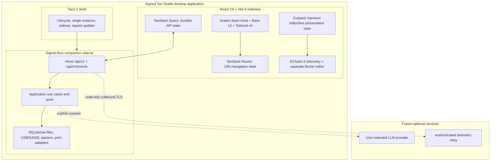
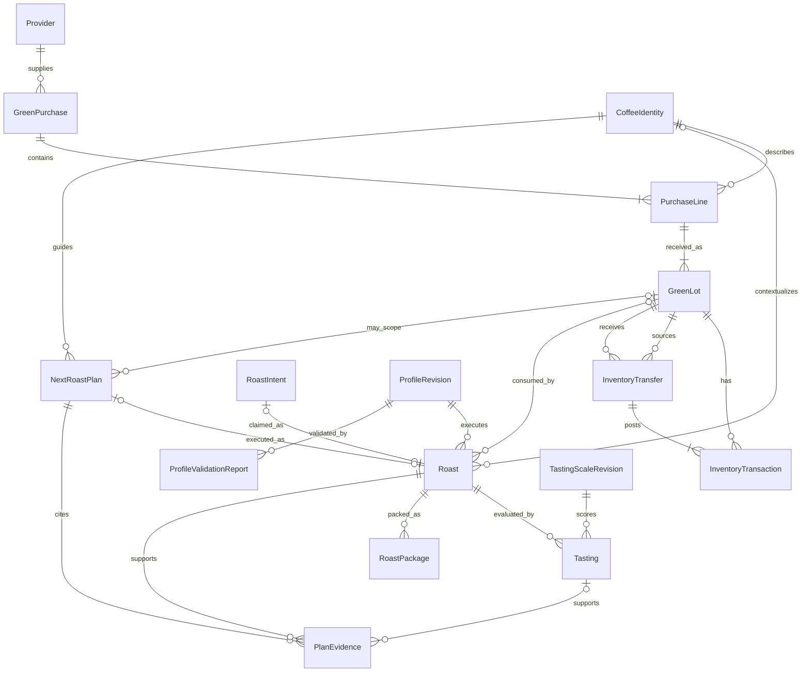

# Product Requirements Document: Tan Studio

Product name: **Tan Studio**
Status: **approved product baseline**
Date: 18 July 2026
Primary platform: macOS-first Tauri 2 desktop application with a transport-neutral React/Vite UI and signed Bun companion sidecar
Target stack: Bun, strict TypeScript, React 19, Vite 8, Tailwind CSS 4, shadcn `base-nova`/Base UI, TanStack Router/Query/Table/Virtual, Zustand 5, ECharts 6, Hono, Zod/OpenAPI, Drizzle, and `bun:sqlite`
Normative engineering design: [Tan Studio technical specification](04-technical-specification.md)

## 1. Product statement

Tan Studio is an offline-first, modern desktop application for Kaffelogic Nano 7 owners. It preserves native profile, log, live-monitoring, synchronization, and device-management compatibility while turning roast development into a coherent workflow built around suppliers, green-coffee purchases and lots, coffee identities, roasts, tastings, next-roast plans, labels, and profile revisions.

The product must feel like a calm instrument, not a desktop file editor: the current roast is obvious, critical event controls are unambiguous, detailed telemetry is available without visual noise, and every roast naturally becomes searchable knowledge.

## 2. Problem

The existing Studio is capable but difficult to learn and organize around:

- Important workflows are distributed across document tabs, menu items, and device dialogs.
- Logs and profiles are primarily managed as files rather than as related experiments.
- Supplier, purchase, coffee, lot, inventory, brewing, and tasting context is mostly free text or disconnected from roast logs.
- It is difficult to answer “what happened the previous times I roasted this coffee, how did each cup taste, and what should I change next?” while setting up the next roast.
- Large log collections lack a database-backed, configurable table with compound grouping, filtering, sorting, and reusable views.
- Event markers exist, but arbitrary chart-attached observations do not.
- Comparison, transformation, and deep settings are powerful but poorly discoverable.
- There is no integrated label-printing workflow.
- There is no profile revision graph or safe rollback.
- There is no model-assisted profile drafting or post-roast explanation.
- Same-LAN wireless access exists, but secure mobile/internet remote monitoring is not a first-class experience.

## 3. Goals

### 3.1 Product goals

1. Reach lossless compatibility with current plaintext `.kpro` and `.klog` files.
2. Reliably connect, synchronize, and monitor a current Type-C Nano 7 through USB CDC.
3. Make the roast-review-revise loop dramatically easier.
4. Make every roast searchable and groupable by supplier, purchase/lot, coffee, country, region, farm/producer, process, profile revision, level, load, date, result, tasting score, and notes.
5. Support first-class chart annotations and structured tasting records.
6. Print useful coffee labels directly from a roast.
7. Provide safe, explainable LLM-assisted analysis and profile proposals.
8. Add secure, read-only remote monitoring without undermining local safety.
9. Preserve an upgrade path to full existing Studio parity, including advanced settings, import/export, firmware, and diagnostics.
10. Turn repeated roasts of the same green coffee into an evidence trail: prior roast → tasting conclusion → explicit next-roast plan.

### 3.2 Success measures

| Measure | Target |
| --- | --- |
| Native profile/log import | 100% of the golden fixture set parses without data loss. |
| Native file round trip | Unedited files are byte-identical when possible; edited files are semantically identical outside edited fields. |
| Connection | Current Type-C Nano discovered and ready within 15 seconds in normal conditions. |
| Live data | No dropped complete device samples in a supervised 20-roast soak test. |
| UI latency | New local sample visible within 250 ms of receipt; remote viewer within 2 seconds under normal network conditions. |
| Recovery | Cable/network interruption does not lose already received samples; final log reconciles automatically. |
| Findability | A roast can be found by coffee/profile/date within 5 seconds from the library. |
| Catalog workflow | From a coffee or inventory lot, prior roasts and their latest tasting conclusions are visible within two interactions. |
| Large library | A 100,000-roast fixture shows its first table viewport within 1 second after warm start and applies indexed filters/sorts within 500 ms on the reference Mac. |
| Next iteration | During preflight, the operator can open the most recent roast, tasting conclusion, and pending next-roast plan without leaving setup. |
| Notes | Add a chart note in at most two interactions after choosing its location. |
| Label | Default label can be previewed and printed in under 30 seconds after roast completion. |
| AI safety | No AI output writes a profile or device state without deterministic validation and explicit user approval. |
| Remote safety | No remote-start command or anonymous write capability exists. |

## 4. Non-goals

The following are explicitly out of scope for the first production release:

- Remote unattended roast start.
- A browser tab as the only reliable device-service process.
- Reimplementing or bypassing firmware signatures.
- Publishing proprietary firmware, decompiled source, saved credentials, or Studio's legacy encrypted-format key.
- Writing encrypted legacy NPRO/NLOG/NEF content without an authorized interoperability path.
- A public profile marketplace or social network.
- Green-coffee ecommerce, purchase-order approval/accounting, full warehouse management, or a full roastery ERP. Recording suppliers, acquisitions, physical lots, quantities, adjustments, and roast consumption is in scope.
- Automatic AI deployment of a profile to the roaster.

## 5. Product principles

1. **Local first.** Roasting and history work without an internet connection.
2. **Roaster authoritative.** Losing the app must never change the roaster's autonomous behavior.
3. **Lossless compatibility.** Preserve unknown native fields and raw source files.
4. **Safety is structural.** Read, write, and destructive capabilities are separate in code and UI.
5. **Evidence before advice.** Analysis and AI recommendations cite the exact roast data that motivated them.
6. **Progressive depth.** Everyday controls are simple; Expert/Engineer settings remain available without dominating the interface.
7. **History over overwrite.** Profiles and annotations are versioned; changes can be explained and reversed.
8. **One roast, one story.** Coffee, profile, live data, events, tasting, label, and follow-up live together.
9. **Coffee lineage first.** Every roast can trace back to the physical green lot and supplier acquisition that produced it, while every next-roast decision can trace forward from tasting evidence.

## 6. Users

### 6.1 Home roaster

Wants repeatable coffee, clear live feedback, simple notes, and a label. Usually modifies level or starts from an official profile rather than editing PID parameters. Expects to choose “that coffee from that bag” and immediately see how earlier batches tasted.

### 6.2 Enthusiast/profile developer

Compares logs, marks events precisely, edits temperature and fan curves, tracks revisions, and iterates based on tasting.

### 6.3 Sample-roasting professional

Needs supplier, purchase, coffee/lot metadata, rapid batches, stock visibility, structured cupping, comparison, reports, labels, and import/export to production systems.

### 6.4 Remote observer

Uses a phone or another computer to watch a supervised roast, see connection and safety state, and receive alerts. Has no start, stop, format, firmware, or profile-write permission.

## 7. Information architecture

```text
Tan Studio
├── Roast
│   ├── Live command center
│   ├── Upcoming roast setup
│   └── Current session notes
├── Roasts
│   ├── Virtualized table/list library
│   ├── Saved views and faceted search
│   ├── Log review and annotations
│   ├── Compare workspace
│   └── Tasting queue
├── Profiles
│   ├── Library
│   ├── Temperature/fan editor
│   ├── Revisions and diff
│   └── AI-assisted draft
├── Coffees
│   ├── Coffee catalog and origin identities
│   ├── Suppliers and purchases
│   ├── Physical lots and green inventory
│   ├── Roast and tasting history
│   └── Next-roast plans
├── Labels
│   ├── Templates
│   ├── Print queue
│   └── Reprint history
└── Devices
    ├── Connection and sync
    ├── Profiles/logs on roaster
    ├── Preferences and diagnostics
    ├── Firmware
    └── Remote-monitor bridge
```

The app opens to **Roast** when a device is busy and **Roasts** when idle. A coffee is the stable descriptive identity; a green lot is a particular physical quantity acquired in a purchase. Roasts consume a green lot and inherit its coffee context without duplicating or flattening the lineage.

## 8. Primary journeys

### 8.1 Connect and import existing history

1. User launches the signed Tan Studio desktop application; Tauri starts and authenticates its bundled companion sidecar.
2. The companion discovers the USB CDC device. Official LAN bridge and mirror-folder import remain later adapters.
3. App verifies the device's SASSI identity before offering any device operation.
4. App reads identity and filesystem status without writing.
5. Profiles and logs are reconciled into a lossless local store.
6. User sees conflicts, capacity, firmware compatibility, and import summary.
7. Native raw files remain available and exportable.

### 8.2 Prepare and monitor a roast

1. Select a physical green lot; search results show coffee name, supplier, purchase, origin/process, and remaining quantity.
2. Review prior roasts of that coffee or lot, their latest tasting scores/conclusions, and any pending next-roast plan in the preflight side panel.
3. Apply a prior roast's settings or accept/edit the pending plan, then select profile revision, level/Dev%, and green input load.
4. Review predicted end, inventory sufficiency, compatibility, and warnings.
5. Start the roast physically on the Nano.
6. Live view automatically takes focus when busy status begins.
7. Mark Colour Change, First Crack, and optional later events.
8. Add a quick note at the current time without hiding the chart.
9. On completion, final `.klog` reconciles with the provisional stream and posts the confirmed green-load consumption transaction.
10. Post-roast sheet asks for measured roasted yield, outcome, tasting reminder, next action, and label; package net weight remains a separate label/packing value.

### 8.3 Review, annotate, and compare

1. Open a roast from the library.
2. Hover/scrub telemetry with synchronized values.
3. Click anywhere on the chart to attach a note, tag, photo, or follow-up.
4. Edit supported native event timestamps; app-only annotations stay in the database.
5. Compare up to four roasts with normalized or absolute axes.
6. Save the comparison workspace and conclusion.
7. Record one or more tastings over the coffee's rest window; each tasting retains its score, notes, descriptors, brew context, and time.
8. Turn a tasting conclusion into a next-roast plan with a target outcome and proposed profile/level/load changes.
9. Extract a new profile revision from the best roast when curve changes are required.

### 8.4 Catalog a green-coffee acquisition

1. Select or create a supplier/provider.
2. Record the purchase date, supplier reference, currency/cost if desired, and total received quantity.
3. Add one or more purchase lines and match each to an existing coffee identity or create a new identity with country, region, farm/producer, process, variety, harvest, and green measurements.
4. Create a physical green lot for each separately tracked bag/batch, recording supplier lot code, received quantity, unit, received date, storage note, and optional best-before/archive state.
5. The lot ledger begins with a receipt transaction; future roasts and manual corrections create immutable consumption/adjustment transactions.
6. Opening the coffee shows all acquired lots, remaining stock, all related roasts and tastings, current conclusions, and the next planned experiment.

### 8.5 Print a label

1. From a roast, choose `Print label`.
2. Default template fills coffee, origin/process, roast date, profile, level, roast degree, tasting/use window, and QR identifier. Green input load, measured roasted yield, and package net weight are separate optional fields.
3. User can hide fields or add a short note.
4. Preview shows the exact paper size and overflow.
5. User chooses exact PDF/system print, an installed queue, or a compatible discovered IPP/ZPL printer; unsupported options remain disabled with a reason.
6. Print job, immutable artifact, template revision, capability snapshot, adapter version, and truthful status history are recorded for one-click reprint.

### 8.6 Create a profile with LLM assistance

1. Choose an official/user profile or a source roast as the base.
2. Describe the coffee, brew method, desired flavor, and observed problem.
3. Assistant retrieves relevant local roasts and the selected profile revision.
4. It returns a structured, bounded change proposal with reasons and confidence.
5. Deterministic validators check duration, temperature, fan, schema, firmware, and curve integrity.
6. UI shows before/after curves and a field-by-field diff.
7. User can accept individual changes, edit them, or reject the proposal.
8. Accepted output becomes a new local revision; deployment to the roaster is a separate explicit action.

### 8.7 Remote monitoring

1. Local companion or future hardware bridge starts an outbound authenticated TLS session.
2. Owner opens a short-lived, read-only session on phone/web.
3. Viewer sees live chart, time, temperature, RoR, phase, events, connection quality, a persistent supervision reminder, and—only if issued locally—a short-lived operator-presence attestation that is not presented as a safety guarantee.
4. Alerts can notify First Crack marked, roast ended, fault, or connection loss.
5. Viewer cannot start, stop, alter level/profile, update firmware, delete data, or format storage.
6. If internet fails, local collection continues and catches up later.

## 9. Functional requirements

Priority definitions:

- **P0** - required for the first dependable daily-use release.
- **P1** - required for full modern product value and near parity.
- **P2** - later parity, professional, or future-hardware work.

Release boundary: P0 is delivered only after Phases 0-2 pass their exit criteria. Phase 1 is an intentionally useful offline preview, not the P0 production release. P1 spans Phases 3-4; Phase 5 and explicitly deferred parity work are P2.

### 9.1 Companion, connection, and sync

| ID | Pri | Requirement |
| --- | --- | --- |
| CON-01 | P0 | Discover candidate RP2040 CDC devices by `0x2e8a:0x000a`; never trust VID/PID alone. A valid type-2 frame may establish a read-only candidate identity, but no status, transfer, or write capability is enabled until the corresponding host handshake/operation is captured, fixture-tested, and accepted. |
| CON-02 | P0 | Implement SASSI framing, negotiated CRC seed, ACK timeout, Base64 file chunks, and safe reconnect. |
| CON-03 | P0 | Read identity, filesystem, technical, and operational status before any write is offered. |
| CON-04 | P0 | Synchronize `roast-profiles` and `roast-logs` with a safe three-way ledger. |
| CON-05 | P0 | Pause non-live sync while the device reports busy. |
| CON-06 | P0 | Reconcile provisional live data with the final complete log. |
| CON-07 | P0 | Detect serial-port ownership and explain when Studio or another process holds the port. |
| CON-08 | P0 | Preserve conflicts as two versions; never silently overwrite. |
| CON-09 | P1 | Connect to official bridge endpoints on LAN using bridge-specific SASSI packets. |
| CON-10 | P2 | Optionally evaluate a separate Web Serial demonstration build; it is not part of the production desktop frontend or the reliability foundation. |
| CON-11 | P1 | Import an existing Studio mirror folder without trusting `.sync_base` pickle content. |
| CON-12 | P2 | Legacy removable-memory workflow for A/B-era units. |

### 9.2 Live roast command center

| ID | Pri | Requirement |
| --- | --- | --- |
| LIVE-01 | P0 | Auto-open live view on busy transition. |
| LIVE-02 | P0 | Show target, temperature, mean temperature, actual/profile/desired RoR, power, fan, and event overlays. |
| LIVE-03 | P0 | Show elapsed time, current values, connection state, selected profile/level/load, expected events, and recommended end. |
| LIVE-04 | P0 | Toggle series, grid, legend, phases, zones, axes, and smoothing without changing raw data. |
| LIVE-05 | P0 | Record standard roast events with a large, keyboard-accessible control and immediate confirmation. |
| LIVE-06 | P0 | Backdate or delete an event through an explicit editor. |
| LIVE-07 | P0 | Append quick app-only notes at the current timestamp. |
| LIVE-08 | P0 | Persist samples during cable/network loss and visibly mark uncertainty/gaps. |
| LIVE-09 | P0 | Never show a remote-start control. |
| LIVE-10 | P1 | Show live DTR, development duration/increase, phase timing, and predicted end updates. |
| LIVE-11 | P1 | User-configurable alert sounds/notifications for marked events, end, fault, and disconnect. |
| LIVE-12 | P2 | Local-only early-end/stop control after safety review and explicit armed state. |

### 9.3 Roast library and log review

| ID | Pri | Requirement |
| --- | --- | --- |
| LOG-01 | P0 | Import and losslessly retain the immutable raw `.klog` alongside its parsed database record, content hash, source, and parse warnings. |
| LOG-02 | P0 | Maintain a durable local log database so the full library is usable even when source folders or the roaster are unavailable. Rebuilding parsed records from retained raw files must be supported. |
| LOG-03 | P0 | Provide a row-virtualized table/list that remains responsive for large libraries and never loads every log's sample arrays merely to render the index. |
| LOG-04 | P0 | Offer configurable, reorderable, resizable, pinnable columns including roast date/time, coffee name, provider/supplier, purchase/lot, country, region, farm/producer, process, variety, profile/revision, level, green load, roasted yield, rating/tasting score, tasting descriptors/notes, tags, result, and roast ID. |
| LOG-05 | P0 | Support compound filters and stable multi-column sorting over all indexed fields, including numeric/range, date-range, enum/facet, text, null/not-null, and tag membership operators. The UI must show sort precedence and allow its reordering. |
| LOG-06 | P0 | Group by one or more attributes—such as provider → coffee → lot or country → process—with collapsible groups and counts; numeric groups may show aggregate count, average score, total green load, and average roasted yield. |
| LOG-07 | P0 | Provide faceted filters with result counts and type-ahead for provider, coffee, lot, country, region, farm/producer, process, profile/revision, tags, and score bands; facets update against the other active filters. |
| LOG-08 | P0 | Save, name, duplicate, update, share by portable definition, and restore personal views containing columns, column order/width, grouping, filters, sort precedence, density, and visible aggregates. Include `All roasts`, `By coffee`, `Needs tasting`, and `Recent purchases` defaults. |
| LOG-09 | P0 | Preserve selection and scroll position when opening a roast in the detail pane; allow keyboard navigation and bulk selection without losing active view state. |
| LOG-10 | P0 | Review all native telemetry with synchronized hover and unit conversion. |
| LOG-11 | P0 | Attach time/temperature-anchored note, tag, photo reference, or follow-up. |
| LOG-12 | P0 | Edit native `tasting_notes`, roast date, and standard event overrides by creating a new linked native-file revision without disturbing unknown content or the immutable imported bytes. |
| LOG-13 | P0 | Show roast/environment/device metadata in progressive sections and surface its coffee, lot, purchase, supplier, tastings, and next-plan lineage. |
| LOG-14 | P1 | Compare up to four logs with absolute, aligned-event, or normalized-time modes. |
| LOG-15 | P1 | Save comparison selection, visual settings, and conclusion. |
| LOG-16 | P1 | Compute phase durations, DTR, end delta, curve deviation, RoR statistics, AUC, energy estimates, green-to-roasted loss percentage, and tasting-score trend. |
| LOG-17 | P1 | Export the current table selection/view to CSV or NDJSON and export an individual chart image, PDF report, parsed samples, and original file. |
| LOG-18 | P1 | Extract a new profile revision from a source log with selectable carried-forward fields. |

### 9.4 Coffee and tasting records

| ID | Pri | Requirement |
| --- | --- | --- |
| COF-01 | P0 | Maintain supplier/provider records with display name, aliases, contact/URL/reference notes, default currency, and active/archive state. Duplicate suggestions must not silently merge records. |
| COF-02 | P0 | Maintain reusable coffee identities with coffee name, country, region, farm/producer, washing station/cooperative, process, variety/cultivar, altitude, harvest/crop year, certifications, and free tags. Origin details belong to the coffee identity rather than being copied into every roast. |
| COF-03 | P0 | Record a green-coffee purchase/acquisition with provider, purchase/received dates, supplier reference, optional price/currency/shipping note, and one or more purchase lines. A purchase line links a coffee identity to quantity acquired. |
| COF-04 | P0 | Represent each separately tracked physical bag/batch as a green lot linked to its purchase line and coffee identity, with supplier lot code, internal lot code, received quantity/unit, received date, storage location/note, density, moisture, water activity, screen size, and active/depleted/archive state. |
| COF-05 | P0 | Link every roast to zero or one physical green lot and therefore its coffee identity/provider/purchase; permit later assignment or correction with an audit entry. Unassigned imports remain visible in an `Uncataloged` queue. |
| COF-06 | P0 | Maintain an immutable green-inventory ledger with receipt, roast consumption, manual adjustment, transfer, and write-off transaction types. Remaining quantity is computed, not edited in place, and negative stock requires explicit confirmation/reason. |
| COF-07 | P0 | Keep green input load, measured roasted yield, calculated roast loss, and package net weight as four distinct concepts. A roast consumes green input load; roasted yield is optional measured output; package net weight belongs to a packing/label record and never changes green inventory. |
| COF-08 | P0 | A coffee and lot detail view must show all purchases/lots, chronological roasts, profiles/revisions, labels, every tasting record, comparison conclusions, stock movements, and pending/completed next-roast plans. |
| COF-09 | P0 | Allow many tasting records per roast so evaluations at different rest ages or brew methods never overwrite one another. Each stores tasted-at/rest age, configurable score scale and overall score, descriptors, acidity/body/sweetness/finish, defects, brew/cupping context, free notes, and author. |
| COF-10 | P0 | Each roast exposes a concise tasting conclusion separate from raw notes: outcome, what worked, what did not, and recommended next action. The latest conclusion is visible in coffee history and preflight. |
| COF-11 | P0 | Create a versioned next-roast plan linked to a coffee or lot and its evidence roasts/tastings. Store objective, proposed base profile/revision, level, green load, parameter changes, rationale, author, status (`draft`, `ready`, `used`, `superseded`, `cancelled`), and the roast that executed it. |
| COF-12 | P0 | During roast setup, show a compact prior-roast panel sorted newest first with date, profile/revision, level, green load, roasted yield/loss, key events, score, conclusion, and a one-click `Use as starting point`; show the ready next-roast plan at the top. |
| COF-13 | P0 | Search coffee/lot selectors by coffee name, provider, supplier/internal lot code, country, region, farm/producer, process, and tag; depleted lots are hidden by default but remain accessible. |
| COF-14 | P1 | Provide tasting reminders and a `Needs tasting` queue based on roast time and intended rest window. |
| COF-15 | P1 | Support unit-safe inventory views and purchase summaries without expanding into invoicing, accounting, or ecommerce. |

### 9.5 Profile library and editor

| ID | Pri | Requirement |
| --- | --- | --- |
| PRO-01 | P0 | Parse, display, export, and round-trip current Nano `.kpro` schemas 1.4-1.8. |
| PRO-02 | P0 | Display temperature and fan Bezier curves, points/handles, and exact numeric values. |
| PRO-03 | P0 | Create immutable revisions instead of overwriting the prior state. |
| PRO-04 | P0 | Show profile metadata, compatible firmware/schema, expected events, levels, end/development preview, and reference load. |
| PRO-05 | P0 | Deterministically validate 3-15 points, duration, temperature, fan RPM, load, naming, and schema constraints. |
| PRO-06 | P0 | Deploy a selected revision to the roaster as an explicit sync action. |
| PRO-07 | P1 | Edit points/handles by drag or exact numeric input; insert/delete/smooth/link points; undo/redo; keyboard nudging. |
| PRO-08 | P1 | Whole-curve transform, merge, comparison, AUC, and time calculator. |
| PRO-09 | P1 | Progressive Basic/Advanced/Expert/Engineer settings for preheat, roasting, zones, fan steps, control system, corners, and cooling. |
| PRO-10 | P1 | Diff two revisions at curves, levels, metadata, and settings; explain schema impact. |
| PRO-11 | P1 | Roll back by creating a new revision from any ancestor. |
| PRO-12 | P2 | Import/export Artisan, Cropster, Sonofresco, and Ikawa as supported by current Studio. |
| PRO-13 | P2 | Production-roaster conversion envelope and reusable mapping presets. |

### 9.6 Labels and print

| ID | Pri | Requirement |
| --- | --- | --- |
| LAB-01 | P0 | Print a label from a completed roast with sensible defaults. |
| LAB-02 | P0 | Include selectable coffee, roast, profile, use-window, note, green-load, roasted-yield, package-net-weight, human-readable roast ID, and QR fields; never conflate the three weight concepts. |
| LAB-03 | P0 | Support configurable physical size, margins, typography, and copies. |
| LAB-04 | P0 | Warn on overflow and show exact print preview. |
| LAB-05 | P0 | Produce exact PDF/SVG and, through a narrow native shell bridge, support save, open-in-system-viewer, and native PDF print-dialog paths as universal fallbacks. |
| LAB-06 | P0 | Record template revision, immutable artifact hash, physical media/DPI, printer capability snapshot, adapter/encoder version, copies, status fidelity, receipt, and time. |
| LAB-07 | P1 | Reprint and batch print from library selection. |
| LAB-08 | P1 | Template designer with reusable field visibility and layout presets. |
| LAB-09 | P0 | Discover installed OS queues and direct IPP/IPPS printers, query capabilities, and submit only an advertised compatible PDF/PWG-raster path. |
| LAB-10 | P0 | Default QR contains only an opaque roast identifier. A resolvable read-only URL is an explicit publish option through the relay, never a local path, device serial, viewer token, or secret. |
| LAB-11 | P0 | Provide ZPL as the first direct printer-language adapter, separated from transport and tested on Zebra ZD421-class 203/300 DPI hardware. |
| LAB-12 | P1 | Add TSPL2, Brother QL raster, and selected ESC/POS adapters only through the same renderer/encoder/transport ports and model-specific HIL evidence. |
| LAB-13 | P0 | Distinguish submitted, spooled, device-accepted, physically-confirmed, failed, cancelled, and unknown outcomes; never describe a job as physically printed without explicit confirmation. |

Default compact label content:

```text
Coffee name
Origin · Process · Variety
Roasted YYYY-MM-DD · Net 90 g
Natural Light · Level 1.1 · Green load 100 g
Best from day 5 · Roast ID / QR
```

QR data must use an opaque local/public identifier, never a raw filesystem path, device serial, or secret token.
`Net` is printed only when package weight is explicitly entered or measured; it is never inferred from green input load or roasted yield.

### 9.7 LLM assistance

| ID | Pri | Requirement |
| --- | --- | --- |
| AI-01 | P1 | Provider-neutral assistant accepts the selected coffee/green lot, explicitly chosen prior roasts and tastings, ready next-roast plan, profile revision, desired result, and user instruction. |
| AI-02 | P1 | Retrieve only explicitly selected or locally relevant context; default relevance is prior roasts/tastings of the same coffee or physical lot, never the entire database. |
| AI-03 | P1 | Return a versioned JSON proposal, not arbitrary executable code or device commands. |
| AI-04 | P1 | Every proposed change includes reason, evidence references, expected effect, uncertainty, and risk. |
| AI-05 | P1 | Start from a known profile/revision by default; from-scratch drafting is Expert-only. |
| AI-06 | P1 | Validate all profile constraints and schema/firmware compatibility deterministically. |
| AI-07 | P1 | Show before/after curves and granular accept/reject controls. |
| AI-08 | P1 | Save accepted output only as a new local revision. |
| AI-09 | P1 | Require a separate explicit deploy action; assistant cannot invoke it. |
| AI-10 | P1 | Offer post-roast diagnosis grounded in annotated telemetry, comparisons, tasting evidence, and the prior plan; proposed follow-up can become a draft next-roast plan but never a device action. |
| AI-11 | P1 | Make cloud transmission opt-in and show exactly which data leaves the machine. |
| AI-12 | P2 | Local-model provider option for fully offline assistance. |

Initial proposal schema:

```ts
type ProfileProposal = {
  schemaVersion: 1
  proposalId: string
  baseRevisionId: string
  sourceRoastIds: string[]
  objective: string
  summary: string
  changes: Array<{
    operation: "replace" | "move_node" | "add_node" | "remove_node"
    path: AllowedProfilePath
    before: unknown
    after: unknown
    reason: string
    evidence: Array<{
      roastId: string
      tastingId?: string
      annotationId?: string
      metric?: string
      timeMs?: number
    }>
    expectedEffect: string
    confidence: "low" | "medium" | "high"
    risk: "low" | "medium" | "high"
  }>
  cautions: string[]
  validation: {
    status: "pass" | "fail"
    issues: Array<{ ruleId: string; path?: AllowedProfilePath; message: string }>
  }
  providerMetadata: { provider: string; model: string; generatedAt: string }
}
```

`AllowedProfilePath` is generated from an allow-listed, schema-aware set of editable fields; arbitrary object paths and operations are rejected before proposal rendering.

### 9.8 Devices, firmware, and diagnostics

| ID | Pri | Requirement |
| --- | --- | --- |
| DEV-01 | P0 | Show connection transport, identity redaction, busy state, storage, firmware, sync, and last seen. |
| DEV-02 | P0 | Browse profiles/logs on device and compare with local versions. |
| DEV-03 | P0 | Pull files and copy/add a validated profile with explicit conflict handling. Remote rename/delete remain disabled until their write behavior and recovery path are captured and accepted. |
| DEV-04 | P1 | Core profile-pack management and safe restore. |
| DEV-05 | P1 | Read and edit documented roaster preferences with validation and audit entry. |
| DEV-06 | P1 | Fan Preview and calibration guidance; writes require explicit local presence. |
| DEV-07 | P2 | Official firmware download/version check and unmodified transfer. |
| DEV-08 | P2 | Firmware/restart/recovery operations in a separately gated maintenance mode. |
| DEV-09 | P2 | Storage format and log-counter tools with high-friction confirmation and backup check. |
| DEV-10 | P1 | Delete supported device files into a recoverable trash/undo flow with target resolution, audit, and conflict checks. |
| DEV-11 | P1 | Provide connection logging, LAN scan, reconnect, resynchronize, redacted diagnostic export, and clear port-ownership guidance. |
| DEV-12 | P1 | Surface storage pressure, open/export safe mirror folders, and create verified backups without exposing Studio pickle data. |
| DEV-13 | P2 | Manage language resources and authorized feature activation in a separately reviewed compatibility flow. |

### 9.9 Remote monitoring

| ID | Pri | Requirement |
| --- | --- | --- |
| REM-01 | P1 | Owner can enable a short-lived read-only remote session from a local device. |
| REM-02 | P1 | Relay connection is outbound-only, authenticated, encrypted, and scoped to telemetry. |
| REM-03 | P1 | Mobile view shows chart, live values, phase/events, connection quality, and faults. |
| REM-04 | P1 | Local collection and roast behavior continue when relay/internet is unavailable. |
| REM-05 | P1 | Viewer tokens expire, can be revoked, and reveal no device serial or local path. |
| REM-06 | P1 | Audit session creation, viewers, disconnection, and revocation. |
| REM-07 | P1 | No remote start, stop, profile/level write, firmware, delete, format, or calibration action. |
| REM-08 | P2 | Buffered catch-up and push notifications for First Crack, end, fault, and disconnect. |
| REM-09 | P2 | Future dedicated bridge implements USB host CDC + SASSI proxy + durable telemetry buffer + outbound TLS. |
| REM-10 | P1 | Remote view always shows a supervision reminder. An optional “operator present” state can only be issued locally, expires quickly, and is explicitly not a safety interlock or proof of continued supervision. |

### 9.10 Local knowledge store and data portability

| ID | Pri | Requirement |
| --- | --- | --- |
| DATA-01 | P0 | Store catalog, roast index, parsed telemetry, annotations, tastings, plans, inventory ledger, saved views, and audit records in a transactional local SQLite database with foreign keys enabled and explicit schema migrations. |
| DATA-02 | P0 | Retain each imported native file as immutable content-addressed bytes outside the database. Store artifact hash/length once and record every device, manual, or sync import as a separate provenance occurrence with observed time, parser version, warnings, and job/source reference. Parsed data is a rebuildable index, never the only copy of a log. |
| DATA-03 | P0 | Durably write referenced native/derived artifacts first, then atomically commit a completed roast's artifact references, parsed metadata, green-consumption transaction, and relationship links; recover every interrupted boundary idempotently. |
| DATA-04 | P0 | Create a user-initiated full backup/dump as a versioned archive containing a consistent SQLite snapshot, raw native files, attachments, a JSON manifest with hashes/schema/app versions, and human-readable CSV/NDJSON exports of core records. Never include credentials or relay tokens. |
| DATA-05 | P0 | Validate dump hashes and manifest before reporting success; restore into a newly staged store generation and atomically activate it only after integrity and relationship checks pass. |
| DATA-06 | P0 | Offer scoped exports for the current roast view, coffee, green lot, purchase, or date range, including relationship IDs so roasts, tastings, inventory movements, and plans can be rejoined. |
| DATA-07 | P0 | Run automatic local backups on a user-visible schedule with configurable retention; a failed backup is reported without blocking roasting or deleting the last verified backup. |
| DATA-08 | P1 | Document the dump schema and migration policy so users can leave the product with raw logs and non-proprietary tabular/JSON data. |
| DATA-09 | P1 | Import/merge a backup into an existing store with stable IDs, duplicate detection, conflicts preserved, and a dry-run report. |

## 10. UI specification

The editable Excalidraw board contains these primary frames:

1. **Live roast command center** - large chart, live metrics rail, event controls, quick note, connection/safety state.
2. **Roast library** - large virtualized table/list with saved views, faceted filters, configurable columns, nested grouping, multi-sort precedence, bulk selection, and a persistent right-side detail preview. The `By coffee` view defaults to provider → coffee → lot groups and shows latest tasting score/conclusion beside every roast.
3. **Log review and annotations** - chart, event timeline, anchored notes, structured tasting, and comparison entry point.
4. **Profile editor + AI proposal** - curve canvas, temperature/fan modes, revision history, progressive settings, and before/after proposal diff.
5. **Label composer** - exact-size preview, field controls, template choice, print/PDF actions.
6. **Device and sync center** - transport, storage, firmware, sync conflicts, local/on-roaster inventories.
7. **Remote mobile monitor** - responsive read-only view with explicit supervision wording and a clearly unverified/expiring operator-presence state.
8. **Green coffee catalog** - provider and purchase hierarchy, reusable coffee origin identity, physical lots, received/on-hand quantities, inventory status, roast counts, latest scores, and a purchase detail pane.
9. **Coffee lot and structured tasting** - complete lot lineage, chronological roast/score history, multiple tasting records, promoted conclusion, remaining stock, and next-roast planning in one experiment timeline.
10. **Compare workspace** - up to four logs, absolute/event-aligned/normalized modes, synchronized telemetry, calculated metrics, and a saved conclusion.
11. **Roast setup and preflight** - searchable physical-lot selection, remaining green quantity, profile/level/load selection, compatibility and storage checks, predicted outcome, supervision warning, and physical-Nano start handoff. A `Previous roasts of this coffee` panel displays recent settings, event summaries, tasting scores/conclusions, and the ready next-roast plan with `Use as starting point`.

### 10.1 Visual direction: calm Bali house

The light theme should feel like an airy Bali house in daylight: limewashed walls, pale timber, woven natural material, quiet plants, sea glass, and sun-warmed clay. It is calm and tactile, never rustic-themed or covered in coffee-brown decoration.

| Token | Value | Use |
| --- | --- | --- |
| `--canvas` / Limewash | `#EEE8DC` | Board and app surround. |
| `--paper` / Warm rice | `#F8F5ED` | Main page background. |
| `--surface` / Coconut linen | `#FFFCF7` | Charts, sheets, table surface, dialogs. |
| `--surface-subtle` / Pale sand | `#F0E8DB` | Group headers, secondary bands, empty states. |
| `--wood` / Pale oak | `#D8C09E` | Navigation selection, warm separators, print-preview surround. |
| `--wood-wash` / Rattan wash | `#EEE2D1` | Navigation rail, purchase rows, and quiet material bands. |
| `--sage` / Garden sage | `#7E9678` | Coffee/catalog context, success, and best-result emphasis. |
| `--ocean` / Muted lagoon | `#4E8982` | Connected/read-only state, links, and comparison series. |
| `--clay` / Sun-washed terracotta | `#B86F55` | Primary actions, roast/heat emphasis, and current experiment. |
| `--sun` / Washed ochre | `#967746` | Caution, prediction, and attention without alarm. |
| `--ink` / Dark espresso | `#3E3027` | Primary text and icons. |
| `--ink-muted` / Driftwood | `#796D62` | Secondary text. |
| `--border` / Soft sand line | `#DED2C1` | Dividers, inputs, and table rules. |
| `--danger` / Safety red | `#A4483F` | Faults, destructive confirmation, and safety-critical states only. |

- Pastels are background and categorical fields, not low-contrast text colors. Normal text must meet WCAG 2.2 AA against its rendered surface; use dark cacao text on pale fills.
- Red must not represent ordinary heat, roast progression, score, or negative tasting sentiment. Terracotta represents roast energy; safety red remains semantically exclusive.
- Data series use darker derivatives of sage, lagoon, clay, ochre, plum, and blue that remain distinguishable by line style, label, or marker as well as color.
- Large areas remain warm off-white. Pale-wood tones appear as restrained framing and separators rather than faux textures or skeuomorphic timber.
- Shadows are diffuse and low contrast; corners are gently rounded; spacing is generous around primary workflows while data tables can switch to a compact density.
- Open chart canvases and continuous data tables are preferred to grids of nested cards.
- UI chrome uses a calm humanist sans-serif; telemetry values and table numerics use tabular figures.
- One left navigation rail on desktop; compact bottom navigation on mobile.
- Controls remain code-native in the implementation and map to shadcn primitives.
- The hex values above are design-source colors. Production maps them to semantic OKLCH variables in Tailwind CSS v4; feature code never uses raw palette utilities.
- Initialize shadcn with `base-nova` and Base UI. Composition uses Base UI's `render` prop, not Radix-only `asChild`; primitives are CLI-managed shared source.
- Use built-in component variants before adding a reviewed system-wide variant. `className` is primarily for layout; one-off component re-skins, arbitrary colors, and duplicate primitives are prohibited.
- Forms use `Field`/`FieldGroup` with visible labels, descriptions, and errors. `Alert`, `Empty`, `Skeleton`, `Badge`, `Spinner`, and `sonner` retain their documented semantic roles.

### 10.2 Catalog, library, and preflight interaction details

- The roast library keeps the filter/group/sort query visible as removable chips and a plain-language summary; clearing one facet must not reset the others.
- Column configuration and saved views live beside the table title, not in global settings. Horizontal overflow uses pinned identity and score columns rather than shrinking everything.
- Group rows are calm pale-sand bands with count and optional aggregates. Expanding a coffee group reveals roasts; expanding a roast in the detail pane reveals all tasting records without multiplying table rows.
- Coffee catalog lineage is always legible: `Provider / purchase → physical green lot → coffee identity → roasts → tastings → next plan`. Breadcrumbs and linked identifiers permit travel in either direction.
- The preflight history panel is a decision aid, not a miniature analytics dashboard: show the last three relevant roasts first, with `View all` and comparison actions available on demand.
- Inventory warnings use washed ochre until a user explicitly attempts an impossible/negative transaction; faults and unsafe device states alone use safety red.

Suggested shadcn component map:

| Need | Components |
| --- | --- |
| Shell | `Sidebar`, `Breadcrumb`, `Separator`, `ScrollArea` |
| Views | `Tabs`, `Resizable`, `Sheet`, `Drawer` |
| Tables | `Table`, `DropdownMenu`, `Checkbox`, `Popover`, `Command`, `Collapsible`, `ScrollArea`; virtualization is supplied by the table engine rather than DOM pagination alone. |
| Forms | `Field`, `FieldGroup`, `Input`, `Select`, `Combobox`, `Slider`, `Switch`, `Textarea` |
| State | `Badge`, `Alert`, `Progress`, `Skeleton`, `Spinner`, `sonner` |
| Commands | `Command` in `Dialog` |
| Destructive operations | `AlertDialog` with resolved target summary |

## 11. Architecture

The [technical specification](04-technical-specification.md) is normative for engineering architecture, interfaces, schema, packaging, and tests. This PRD records the product-level boundaries.

### 11.1 Runtime system



The frontend is transport-neutral and communicates only through the generated local API client. It does not import Tauri, Bun/Node, SQLite, filesystem, parser, SerialPort, SASSI, or printer libraries.

### 11.2 Clean Architecture and modules

```text
Domain
  ↑
Application use cases and ports
  ↑
Infrastructure adapters
  ↑
Companion, desktop, and web composition roots
```

Domain code has no framework or infrastructure dependency. Application services define ports; adapters depend inward; explicit composition roots wire implementations without a reflective container. CI enforces dependency boundaries.

Independently testable bounded modules are catalog/inventory; roasts/telemetry; profiles/revisions; tastings/plans; device/protocol/sync; native formats; labels/printing; search/reporting; backup/diagnostics; settings/capabilities; future AI; and future remote relay.

### 11.3 Frontend state and behavior

- React and TypeScript component composition.
- Vite build and development server.
- shadcn `base-nova` source components and semantic OKLCH theme tokens.
- TanStack Router for route/search state; Query for local API data; Table/Virtual for large grids.
- Zustand only for bounded live buffers, chart/editor interaction, unsaved deltas, panels, and viewport.
- Direct Apache ECharts 6 integration for telemetry and a separate encapsulated Bezier profile editor; React components never parse native files or SASSI frames.

### 11.4 Companion and API responsibilities

- Exclusive serial and LAN bridge ownership.
- Packet framing, CRC, acknowledgements, retries, time sync, and capability negotiation.
- Incremental and final log parsing.
- Lossless profile/log document model.
- Safe file synchronization and conflict resolution.
- Transactional SQLite migrations, catalog/roast indexing, saved-view queries, verified backup/dump/restore, and immutable raw-source retention.
- Local WebSocket event stream.
- Label rendering/print integration.
- Capability enforcement and audit trail.
- Optional outbound remote relay and LLM proxy only after user opt-in.
- Versioned REST under `/api/v1` and one authenticated ordered WebSocket at `/api/v1/events`.
- OpenAPI-generated client, RFC 9457 Problem Details, revision/ETag concurrency, idempotency keys, and durable jobs.

### 11.5 Deployment and local security

Tauri serves the built frontend through its custom protocol, generates a per-launch 256-bit in-memory token, and launches the compatible signed Bun sidecar with that token over a private inherited control channel. The sidecar binds a random loopback-only port and rejects unexpected Host/Origin values, wildcard CORS, and DNS rebinding. It is never exposed to the LAN.

The SerialPort native module is externalized into signed resources and tested on every target architecture. If that packaging gate fails, only the `SerialTransport` adapter moves to a small Rust helper; SASSI, use cases, and the API remain TypeScript. A separate Web Serial demo may be researched later but is not part of the production frontend.

## 12. Data model

The catalog separates descriptive identity from physical stock. A coffee identity describes what the coffee is; a green lot describes a specific bag/batch acquired through a purchase and available to consume. This permits another purchase of the “same coffee” without corrupting the history or inventory of the earlier bag.

V1 is single-user with one SQLite database per OS account. IDs are UUIDv7; timestamps store UTC plus source IANA timezone; mass uses integer milligrams, temperature integer milli-Celsius, elapsed time integer milliseconds, percentages basis points, and roast level thousandths. SQLite uses WAL, foreign keys, busy timeout, one transactional writer, forward-only migrations, and a verified pre-migration backup. Imported bytes are immutable and content addressed; parsed rows and derived Apache Arrow sample streams are rebuildable.



| Entity | Purpose |
| --- | --- |
| `Device` | Stable local identity, model family, redacted display name, firmware, capabilities, last seen. |
| `TransportEndpoint` | USB serial, official LAN bridge, legacy folder, or future hardware bridge. |
| `NativeFile` | Immutable raw bytes plus content hash, length, format/schema hint, and verification state. Imported originals are never replaced; a native-field edit creates a derived revision. |
| `NativeImportOccurrence` | One observation/import of a native artifact, preserving safe source hint, time, device/sync/job provenance, parser version, status, and warnings even when identical bytes were seen before. |
| `SyncEntry` | Local/remote/base hashes, conflict state, remote metadata. |
| `SyncPlan` | Immutable reviewed target/capability/inventory snapshot and ordered operations with preconditions, expiry, execution outcome, and audit lineage. |
| `Profile` | Logical profile identity. |
| `ProfileRevision` | Immutable parsed snapshot, parent(s), source log/proposal, and schema. |
| `ProfileValidationReport` | Immutable validator result for one profile revision and exact target capability/firmware/schema tuple; deployment cites the passing report. |
| `Provider` | Supplier identity, aliases, optional contact/reference metadata, and archive state. |
| `GreenPurchase` | One acquisition from a provider with purchase/received dates, supplier reference, optional monetary metadata, and notes. |
| `PurchaseLine` | Quantity acquired of one coffee identity within a purchase; parent for one or more physical lots. |
| `CoffeeIdentity` | Stable descriptive identity: display name, country, region, farm/producer, station/cooperative, process, variety, altitude, harvest, certifications, and tags. |
| `GreenLot` | Physical stock unit tied to a purchase line/coffee identity, supplier/internal codes, received quantity/unit, storage, green measurements, and lifecycle state. |
| `InventoryTransaction` | Immutable receipt, roast consumption, adjustment, transfer, or write-off amount with unit, reason, source roast, author, and time. |
| `InventoryTransfer` | One atomic source-to-destination movement owning equal and opposite lot-ledger entries under one permanent idempotency key. |
| `RoastIntent` | Expiring validated preflight selection of lot/coffee, profile, level, load, ready plan, and target that can be claimed by a physical busy transition. |
| `Roast` | Stable logical roast identity linking native-log revisions, green lot/coffee identity, profile revision, level, green input load, optional measured roasted yield, calculated loss, result, and status. Green lot may be null for uncataloged imports. |
| `RoastSampleStream` | Rebuildable columnar telemetry stream and channel schema linked to immutable native evidence; preserves unknown channels and remains outside library rows. |
| `RoastEvent` | Native or app-only event with timestamp, temperature, source, and edit history. |
| `Annotation` | Chart/time anchor, type, text, tags, attachment reference, author/time. |
| `Attachment` | Immutable content-addressed photo/document evidence with media type, size, and relationship metadata. |
| `TastingScaleRevision` | Immutable dimensions, bounds, units, and scoring rules selected by a tasting. |
| `Tasting` | One immutable/revision-linked sensory evaluation among many per roast, including tasted time/rest age, scale revision, score, descriptors, component observations, defects, brew context, notes, author, and structured conclusion fields. |
| `NextRoastPlan` | Versioned objective and intended settings for the next iteration, scoped to coffee and optionally lot, with status and eventual executed-roast link. |
| `PlanEvidence` | Join record citing a roast and optionally a tasting/metric/annotation as evidence for a next-roast plan. |
| `SavedRoastView` | Versioned column, grouping, filter, multi-sort, density, and aggregate definition; contains no duplicated roast data. |
| `RoastLibraryRow` | Rebuildable denormalized read model for the virtualized table and facets, containing indexed display/search values and latest-tasting summary. The normalized entities remain authoritative. |
| `LabelTemplate` | Versioned physical layout and field rules. |
| `RoastPackage` | One package net-mass record optionally linked to the exact label/print job; independent of green input and roasted yield. |
| `Printer` | Configured/discovered queue or endpoint with adapter identity and calibrated media. |
| `PrinterCapabilitySnapshot` | Immutable discovered formats, languages, media, DPI, features, provenance, and status fidelity used by a job. |
| `PrintJob` | Immutable artifact hash and label-data snapshot, optional package net weight, template/capability/adapter revisions, copies, status events, receipt, and reprint link. |
| `Job` | Durable state/progress/error record for import, export, sync, backup, restore, rendering, and printing. |
| `AuditEntry` | Redacted correlation, action, target, revision, and safe before/after summary for consequential mutations. |
| `AIProposal` | Prompt scope, provider/model metadata, structured proposal, validation, decisions. |
| `RemoteSession` | Owner, scope, expiry, viewer audit, revocation, telemetry-only flag. |

Use a raw native-file store alongside parsed tables. Database migration must never require rewriting original files. Native bytes, attachments, and database backups live under separate versioned directories so a database restore cannot accidentally overwrite source evidence.

### 12.1 Required relationships and invariants

- A provider has many purchases; a purchase has one or more lines; each line references one coffee identity and produces one or more physical green lots.
- A green lot has one coffee identity through its purchase line. Moving a roast to another lot changes its lineage and creates an audit entry; it does not rewrite the original native file.
- A roast can have many tastings and at most one latest promoted conclusion. Promotion is a pointer/version decision, not destructive replacement of earlier tasting notes.
- A next-roast plan can cite many evidence roasts/tastings, but can be executed by at most one roast. Creating a successor supersedes rather than mutates a used plan.
- Inventory balance equals the sum of immutable transactions in a canonical mass unit. Display-unit conversion cannot alter the stored balance.
- `greenInputMass`, `roastedYieldMass`, and `packageNetMass` use different fields and provenance; none is inferred into another. Roast loss is computed only when both green input and roasted yield exist.

### 12.2 Query and index requirements

- Index every foreign key plus `Roast(roastedAt DESC)`, `Roast(greenLotId, roastedAt DESC)`, `Tasting(roastId, tastedAt DESC)`, `Tasting(overallScore)`, `InventoryTransaction(greenLotId, occurredAt)`, and `NextRoastPlan(coffeeIdentityId, status, createdAt DESC)`.
- Store normalized lookup keys for provider, coffee, country, region, producer/farm, process, lot codes, and profile names. Keep the original user-facing text unchanged.
- Use SQLite FTS5 (or an equivalently testable local index) for coffee name, supplier aliases, farm/producer, tags, tasting descriptors/notes/conclusions, roast notes, and plan rationale.
- Persist the domain/outbox event and update every affected `RoastLibraryRow` and FTS row in the same single-writer transaction as a P0 mutation, so its response is read-your-writes consistent. Post-commit consumers handle WebSocket presentation and explicitly noncritical derived views. Provide a deterministic shadow-table rebuild and compare counts/hashes before swap.
- Seek/cursor pagination must back the virtualized grid. Offset-only queries that become slower with library size are not acceptable for ordinary scrolling.
- Query plans for default saved views and every documented facet/sort combination are covered by fixtures and may not read `RoastSampleStream`/Arrow telemetry.

### 12.3 Dump and restore contract

The full dump is a portable directory/archive, not a proprietary database file alone:

```text
tan-studio-backup/
├── manifest.json            # format version, app/schema versions, counts, hashes
├── database.sqlite          # transactionally consistent snapshot
├── raw/                     # immutable .klog/.kpro and unknown native files by hash
├── artifacts/               # durable print/report payloads referenced by user records
├── attachments/             # optional user attachments by hash
└── exports/
    ├── providers.ndjson
    ├── purchases.ndjson
    ├── coffee-identities.ndjson
    ├── green-lots.ndjson
    ├── roasts.ndjson
    ├── roast-events.ndjson
    ├── annotations.ndjson
    ├── profiles.ndjson
    ├── profile-revisions.ndjson
    ├── tastings.ndjson
    ├── next-roast-plans.ndjson
    ├── inventory-transactions.ndjson
    ├── saved-roast-views.ndjson
    ├── label-templates.ndjson
    └── print-jobs.ndjson
```

`manifest.json` records a hash for every payload, relationship counts, canonical units, timezone behavior, and excluded secret classes. Restore verifies hashes and referential integrity before activation; a failed restore leaves the current store untouched.

## 13. Security, privacy, and safety

### 13.1 Capability boundaries

```text
READ
  status, files, telemetry, metadata

WRITE
  event, profile copy, preference, supported native note

MAINTENANCE
  firmware, restart, calibration, recovery

DESTRUCTIVE
  delete, format, reset counters
```

Each boundary has an independent service interface. Remote sessions receive READ telemetry only, not raw device READ access.

### 13.2 Required controls

- Bind the companion only to an OS-assigned `127.0.0.1` port; never expose it to the LAN.
- Authenticate every API request with a per-launch 256-bit in-memory token delivered by the Tauri parent. The token never enters URLs, logs, SQLite, backups, or diagnostics.
- Enforce exact Host and Origin allowlists, restrictive CSP, no wildcard CORS, JSON mutation bodies except enumerated bounded upload streams, DNS-rebinding protection, and one-use WebSocket tickets.
- Validate all local API inputs and native paths.
- Prevent path traversal and writes outside explicit mirror roots.
- Never unpickle Studio sync metadata.
- Encrypt remote and LLM traffic with TLS.
- Store the v1 device-identity HMAC key and all future persistent secrets through OS-keychain-backed adapters, not app configuration, SQLite, `.klog`, `.kpro`, backups, or diagnostics.
- Redact serial numbers and local paths from labels, remote sessions, exports, and screenshots by default.
- Log device writes and destructive confirmations.
- Require current target resolution before delete/format/firmware actions.
- Do not expose official-module TCP 9056 to the internet.

### 13.3 AI controls

- Treat profile/log descriptions and imported notes as untrusted data, not instructions.
- Send the minimum selected data to a provider.
- Show a transmission preview and retain a local audit record.
- Validate output against a strict schema and deterministic safety limits.
- Never allow model output to call device actions.

## 14. Non-functional requirements

| ID | Area | Requirement |
| --- | --- | --- |
| NFR-01 | Offline | All non-AI local workflows function without internet. |
| NFR-02 | Durability | Raw files are immutable; database writes are transactional with WAL/checkpoint policy, foreign-key enforcement, integrity checks, and verified backups. A parsed database can be rebuilt from raw files plus catalog exports. |
| NFR-03 | Recovery | Companion can restart and resume sync without corrupting state. |
| NFR-04 | Performance | On the reference Mac with 100,000 indexed roasts and 1,000,000 tastings, warm navigation shows the first library viewport in ≤1.0 s and indexed filter/group/multi-sort changes complete in ≤500 ms p95; scrolling does not hydrate sample arrays or render more than a bounded viewport buffer. Live append does not rerender the full app. |
| NFR-05 | Accessibility | WCAG 2.2 AA, keyboard operability, visible focus, non-color status cues, reduced motion. |
| NFR-06 | Responsive | Live remote monitor works at 360 px; full editor works at 1024 px and above. |
| NFR-07 | Units | Celsius is canonical internally; Fahrenheit presentation is reversible and clearly labeled. |
| NFR-08 | Time | Store timestamps in UTC plus original/local timezone context. |
| NFR-09 | Observability | Structured local logs with redaction; exportable diagnostics bundle requires preview. |
| NFR-10 | Testing | Golden file, protocol fixture, round-trip, chart, sync-conflict, and hardware-in-loop suites. |
| NFR-11 | Compatibility | macOS first; architecture supports Windows/Linux transports and paths. |
| NFR-12 | Updates | Ship shell, frontend, companion, native helpers, and migrations as one signed compatible Tauri release. Device firmware remains separately gated and is never auto-flashed. |
| NFR-13 | Portability | A full verified dump and restore of a 10,000-roast fixture preserves entity counts, stable IDs, relationships, raw-file hashes, inventory balances, saved views, and tasting/plan history exactly. |
| NFR-14 | Search | Exact identifiers, affected library rows, facets, and full-text catalog/note search are read-your-writes consistent when a P0 mutation returns. Results and facet counts are deterministic for the same saved-view definition. |
| NFR-15 | Table scale | The virtualized table remains keyboard accessible, preserves selection through scroll/detail navigation, and exports the complete filtered result—not only rendered rows. Cancellation prevents stale long-running queries from replacing newer results. |
| NFR-16 | Inventory integrity | Receipt/consumption/adjustment transactions use canonical signed integer milligrams; display conversion occurs only at validated boundaries. Concurrent or retried roast-finalization cannot double-decrement a green lot. |

For performance gates, the reference machine is a 2020 Apple M1 MacBook Air with 8 GB RAM, local SSD, no network dependency, and a production build after one warm-up run. Faster development hardware may not replace this baseline in release evidence.

## 15. Error and recovery behavior

| Failure | Required behavior |
| --- | --- |
| Port held by Studio | Name the conflict, provide retry, never force-close the other app. |
| Cable unplugged live | Keep chart and buffer; show stale state and reconnect countdown; do not infer roast stopped. |
| Partial `.klog` line | Buffer until complete; retain raw fragment for diagnostics. |
| Final log differs from provisional | Reconcile by native time/event identity and flag material conflict. |
| Sync conflict | Keep both versions and show semantic diff where parsable. |
| Unknown profile key/channel | Preserve and display in raw/advanced inspector. |
| Unsupported encrypted file | Preserve/export unchanged; explain unsupported editing. |
| AI output invalid | Show validator errors; never create deployable revision. |
| Printer unavailable | Keep print job draft and offer PDF. |
| Remote relay lost | Local capture continues; viewer shows disconnected; optional catch-up after reconnect. |
| Firmware interrupted | Do not improvise recovery; enter documented maintenance flow. |
| Database unavailable/corrupt | Stop catalog mutations, retain incoming native log bytes in a recoverable inbox, offer verified-backup restore or raw-index rebuild, and never initialize an empty store over the existing path. |
| Roast finalizes twice after reconnect | Resolve by stable roast/finalization identity; return the existing green-consumption transaction rather than posting another. |
| Selected lot lacks green quantity | Warn before preflight confirmation; require an explicit reason for an allowed negative adjustment, never substitute roasted yield or package net weight. |
| Backup/dump validation fails | Keep the incomplete artifact clearly marked, retain the prior verified backup, and do not report success or prune retention history. |

## 16. Delivery plan

### Phase 0 - compatibility harness

- Safe `.kpro`/`.klog` parsers and round-trip writers.
- Versioned lossless native-format plugin contract and hostile-input harness.
- Golden fixtures and semantic diff tool.
- SASSI codec and recorded-frame test harness.
- Documented read-only type-2 observation, followed by controlled type-3/type-4, status, filesystem, and live captures before their corresponding features are enabled.
- Domain models and SQLite schema.
- Deterministic label display list, PDF/SVG/raster renderers, fake printers, and golden print fixtures.

Exit: native fixtures round-trip, packet codec passes verified/synthetic fixtures, exact label renderers pass golden tests, and an idle device can complete the captured read-only negotiation/status path without Studio.

### Phase 1 - offline knowledge base

- Roast/profile import.
- Provider, purchase, coffee-identity, physical-lot, and inventory-ledger catalog.
- Virtualized roast/profile/coffee libraries with configurable columns, compound grouping/filter/sort, facets, and saved views.
- Log chart, event editing, annotations, and tasting notes.
- Multiple tastings, promoted conclusions, and next-roast plans surfaced in preflight.
- Profile viewer and revisions.
- Label print/PDF MVP.
- Verified local backup/dump/restore and raw-file index rebuild.

Exit: useful daily post-roast workflow without controlling a device.

### Phase 2 - connected signed desktop

- Signed/notarized Tauri 2 application with authenticated Bun sidecar and compatible frontend/native resources.
- Cross-platform externalized-`serialport` packaging gate; use the specified Rust `SerialTransport` helper fallback if a target fails.
- USB connection, status, safe sync, conflicts, and device browser.
- Live incremental log and event marking.
- Final reconciliation and soak testing.
- Basic profile deploy.
- Installed CUPS queue and IPP/IPPS capability/submission adapters.
- ZPL encoder/transport with Zebra ZD421-class 203/300 DPI HIL validation.

Exit: 20 supervised roasts with no sample/file loss and repeatable reconnect behavior.

### Phase 3 - profile development and assistance

- Full curve editor and progressive settings.
- Comparison workspaces, transform/merge/AUC.
- LLM proposal and diagnosis workflow.
- Advanced label templates, tasting templates/analytics, score trends, and reminders.

Exit: profile iteration can be completed without opening legacy Studio for supported schemas.

### Phase 4 - broader parity and remote

- Official LAN bridge support.
- Read-only encrypted remote sessions and mobile UI.
- Import/export formats.
- Roaster preferences, firmware, calibration, and maintenance mode.
- Windows/Linux transport and print-helper validation.

### Phase 5 - dedicated hardware bridge

- USB host electrical/protocol capture of official topology.
- Prototype USB CDC/SASSI host on Wi-Fi MCU/SoC.
- Durable local buffering and secure provisioning.
- Outbound TLS telemetry; signed firmware for the bridge itself.
- Power, thermal, EMC, enclosure, recovery, and hardware-in-loop testing.

The bridge is not a USB 3 project; it is a reliable USB 1.1 CDC host plus secure networking project.

## 17. Acceptance test matrix

### P0 release must pass

| Coverage | Requirement IDs | Release gate |
| --- | --- | --- |
| Identity and read-only negotiation | CON-01-03, DEV-01 | Reject a VID/PID-matching non-Kaffelogic fixture; validate a synthetic privacy-safe fixture matching the live-observed type-2 structure/seeded CRC; enable the captured host negotiation; then read status without sending a device mutation. |
| Sync and recovery | CON-04-08, DEV-02-03 | Reconcile profiles/logs, defer normal sync while busy, detect another port owner, recover an idle unplug, retain two versions in a simulated conflict, and complete an explicitly selected test-profile deployment without unrelated changes. |
| Live command center | LIVE-01-09 | Stream a supervised roast, render all required channels/state, toggle presentation without touching raw data, mark/backdate/delete standard events, append a quick note, survive a connection gap without inventing samples, and reconcile the final log. Verify no remote-start control exists. |
| Log library and annotations | LOG-01-13 | Import fixtures while retaining byte-identical raw files; open the virtualized index without parsing sample arrays; configure/pin/reorder columns; combine date, process, country, farm, score, coffee, and provider filters; apply three-level grouping and multi-sort; save/restore the view; preserve selection/scroll through detail navigation; inspect telemetry; add annotations; create a derived native revision; and traverse complete lineage. |
| Library scale | LOG-03-09, NFR-04, NFR-14-15 | Against 100,000 roasts/1,000,000 tastings on the reference Mac, show the warm first viewport in ≤1.0 s and complete indexed filter/facet/group/multi-sort requests in ≤500 ms p95 over 100 repetitions. Verify bounded rendered rows, no telemetry-stream hydration, deterministic facet counts, query cancellation, keyboard selection preservation, and complete filtered export beyond visible rows. |
| Green acquisition and lineage | COF-01-08 | Create one provider, a purchase with two coffee lines, and three physical lots; record receipts and a correction; assign and later auditably reassign a roast; then navigate provider → purchase → lot → coffee → roast and back with matching totals/history. Confirm `Uncataloged` imports remain visible. |
| Tasting-to-next-roast loop | COF-09-13 | Add three tastings at different rest ages to one roast without overwrite, promote a conclusion, create a cited next-roast plan, and find it from coffee, lot, library, and preflight. Start from the plan, record the executing roast, and verify the plan becomes used while its evidence remains immutable. |
| Inventory and weight integrity | COF-06-07, NFR-16 | Receipt 1,000 g, finalize a 100 g green-load roast twice through a reconnect/retry fixture, record 84 g roasted yield, and print a 75 g package label. Assert remaining green inventory is exactly 900 g, one consumption transaction exists, roast loss is 16%, and neither yield nor package net changed inventory. |
| Profile compatibility | PRO-01-06 | Import and semantically round-trip schemas 1.4-1.8, display exact curve/metadata values, create an immutable revision, reject every deterministic constraint with a field-level message, and deploy only after explicit target review. |
| Labels and printer adapters | LAB-01-06, LAB-09-11, LAB-13 | Render the default label at exact configured size with no clipping; keep green/yield/net weights distinct; inspect QR bytes for privacy; exercise PDF/system queue and direct IPP capability negotiation; print the ZPL artifact on Zebra ZD421-class 203/300 DPI hardware; record artifact/capability/adapter/receipt history; and verify no submitted/spooled/device-accepted result is presented as physically printed without proof. |
| Local store and dump | DATA-01-07, NFR-02-03, NFR-13 | Inject interruption during roast finalization and prove atomic/idempotent recovery. Dump a 10,000-roast store, verify every manifest hash, restore into an empty store, and compare stable IDs, counts, relationships, raw bytes, balances, saved views, and plans. Corrupt a copied parsed index and rebuild it without modifying originals. Confirm no credential/token appears in archive or exports. |
| Cross-cutting quality | NFR-01-16 | Run offline, transactional-recovery, scale/search/table, live-append, WCAG/keyboard, 360/1024 px responsive, unit/timezone round-trip, redaction, portability, inventory-idempotency, golden/protocol/conflict/hardware-in-loop, platform-abstraction, and no-auto-flash tests. |

### P1 release must additionally pass

- Validate full curve editing, comparison, profile diff/revision, advanced tasting analytics/reminders, LLM proposal/validation/approval, and broader device-parity workflows against their P1 requirement IDs.
- Exercise an official LAN bridge on an isolated network, then a short-lived remote relay session. Confirm the mobile UI contains no device-write action, an expired/revoked viewer cannot reconnect, local collection survives relay loss, and operator presence can only be issued locally and expires.
- Verify import/export and every supported advanced setting against golden fixtures or documented hardware tests before claiming parity.

## 18. Deferred product and external decisions

Tan Studio, its Bali-house visual direction, macOS-first Tauri/Bun packaging, canonical integer-milligram persistence, optional monetary reference fields, provider-neutral AI port, outbound-only read-only relay boundary, and Zebra ZD421-class ZPL HIL target are settled. The remaining decisions do not block P0:

1. Windows versus Linux release order after macOS.
2. Default label-size presets beyond arbitrary exact custom dimensions.
3. Which display mass units are enabled by default for each locale.
4. Production LLM provider, retention/commercial policy, and whether a local model becomes a P2 adapter.
5. Remote relay hosting, retention, account, and abuse-operations model.
6. Support depth for legacy removable-memory roasters.
7. Whether local early-end/stop control belongs in the product at all.
8. Whether Kaffelogic will provide an authorized protocol/schema or encrypted-format interoperability agreement.

## 19. Research references

- [Current product discovery](01-current-product-discovery.md)
- [USB protocol and file formats](02-usb-protocol-and-file-formats.md)
- [Tan Studio technical specification](04-technical-specification.md) — normative engineering design
- [Official Studio page](https://www.kaffelogic.com/pages/studio)
- [Official Nano 7 User Manual v3.12](https://cdn.shopify.com/s/files/1/0278/9169/5713/files/KL_User_Manual_V3.12_web.pdf?v=1750663013)
- [Official Wireless Connect module](https://www.kaffelogic.com/products/wireless-connect-module)
- [Official profile guide](https://www.kaffelogic.com/pages/profiles)
