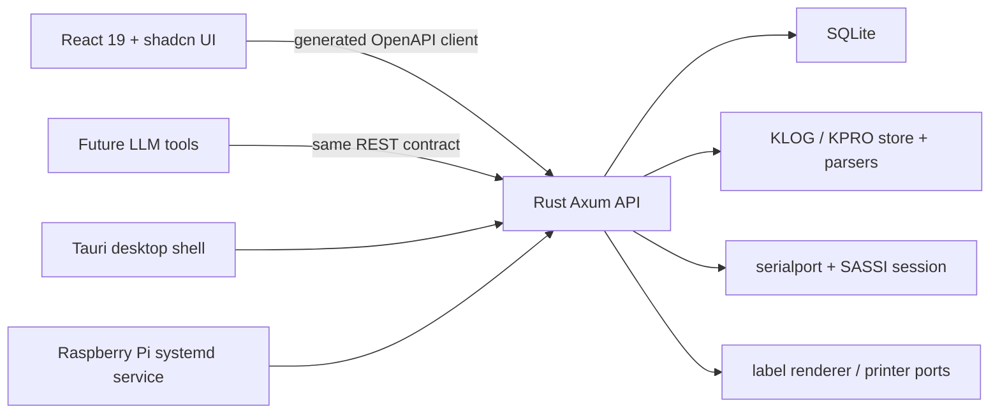
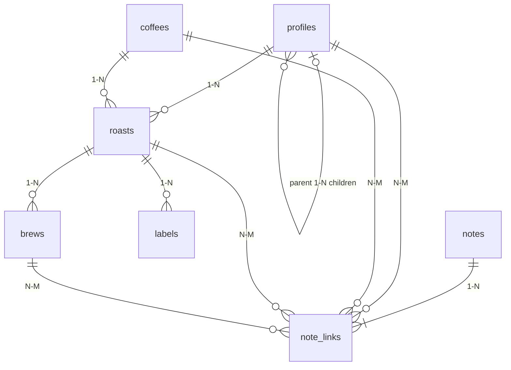

# Tan Studio — Technical specification

- Status: implementation baseline
- Updated: 2026-07-19
- Runtime: React/Vite UI over one Rust/Axum/SQLite service
- Desktop: Tauri 2 sidecar on macOS
- Appliance: the same service plus static UI on Raspberry Pi

## 1. System boundary

Tan Studio has one backend. The Rust service owns every durable or privileged concern:

- SQLite and migrations;
- public resource validation and relationships;
- KLOG/KPRO parsing and immutable native bytes;
- USB serial enumeration and SASSI sessions;
- synchronization and planned-roast reconciliation;
- label records and future printer adapters;
- OpenAPI generation;
- local authentication and host/origin enforcement.

The React application owns presentation only. It receives and mutates resources through the generated HTTP client. It never opens SQLite, serial ports, files, printers, or Tauri commands directly.



## 2. Deployment topology

### 2.1 macOS desktop

1. Tauri resolves the per-user application-data path.
2. It generates a 256-bit per-launch token.
3. It starts the signed Rust sidecar with an authenticated launch record over stdin.
4. The sidecar binds a random loopback port.
5. The webview receives the port/token in memory and calls only `127.0.0.1`.

The desktop service accepts exact Tauri origins/clients, verifies Host, and never binds the LAN.

### 2.2 Raspberry Pi

The same Rust binary runs under systemd, binds the configured LAN address, serves the built frontend, and exposes the API at `tan-studio.local`. Configuration is an immutable release plus root-owned environment file. LAN access uses an explicit token and Host/Origin allowlists.

The Nano USB device can be attached to either the Mac or Pi. The frontend does not change; it talks to the service that owns that USB connection.

## 3. Code boundaries

The current Rust crate is deliberately small:

| Module | Responsibility |
| --- | --- |
| `core_contract` | public DTOs and generated OpenAPI 3.1 document |
| `core_api` | public resource validation/use cases and SQLite queries |
| `db` | connection policy, forward migrations, backup, schema checks |
| `kpro` | bounded lossless KPRO parser/importer and curve validation |
| `klog` | bounded KLOG parser/importer, telemetry projection, reconciliation |
| `sassi` | pure framing, escaping, CRC, message encoding/decoding |
| `device` | USB discovery and stateful SASSI synchronization actor |
| `api` | Axum composition, authentication, host/origin policy, device routes |
| `static_ui` | headless-appliance static frontend delivery |

The dependency rule is practical rather than ceremonial:

- parsing and SASSI code do not depend on HTTP or React;
- React depends only on generated wire types;
- USB transport does not define product resources;
- native evidence does not become frontend state;
- no second production backend is allowed.

The old TypeScript companion is not part of either production topology. Its migration directory remains an input to Rust until it is mechanically relocated.

## 4. Public relational model

Only seven public tables exist.



### 4.1 `profiles`

Purpose: reusable roasting definition and lineage.

Fields: integer ID, nullable parent ID, name, description, designer, origin, recommended level, reference load, native/user profile JSON, source file/hash, timestamps, revision.

Invariants:

- a profile cannot parent itself;
- level is `0..10000` thousandths;
- profile JSON is an object;
- imported profile bytes remain in `native_files`;
- a roast snapshots the selected profile document.

### 4.2 `coffees`

Purpose: one intentionally flat purchased-green-coffee record.

Fields: integer ID, name, provider fields, purchase reference/date/price/currency, purchased and remaining mass, country, region, farm, producer, washing station, process, variety, altitude, harvest, storage, metadata JSON, archive time, timestamps, revision.

This table is denormalized by design. New dedicated tables require evidence that flat fields are no longer usable.

### 4.3 `roasts`

Purpose: one planned or completed execution.

Fields: integer ID, profile/coffee IDs, roast time and provenance, timezone, status/result, level, input/yield/development/duration/end metadata, native log number, profile snapshot, adjustments, roaster parameters, native metadata, warnings, source file, timestamps, revision.

Invariants:

- a newly prepared roast requires a profile;
- only one roast may be `planned` for the single-roaster v1 workflow;
- a finished KLOG reconciles to the most recent active planned roast within 24 hours;
- reconciliation preserves chosen coffee, chosen profile snapshot, and arbitrary adjustments;
- native facts update result, timing, actual level/load, telemetry, and provenance;
- status is `planned`, `completed`, or `interrupted`;
- result is `success`, `aborted`, `fault`, or `unknown`.

### 4.4 `brews`

Purpose: one preparation from one roast.

Fields: integer ID, roast ID, time/timezone, method, grinder and setting, kettle, water, coffee/water mass, water temperature, flexible recipe JSON, timestamps, revision.

Equipment names remain strings. A separate grinder/kettle/water table is not justified for a single-user setup with stable defaults.

### 4.5 `notes` and `note_links`

Purpose: free-form evidence and reasoning.

`notes` fields: integer ID, kind, body, optional rating, attributes JSON, source, timestamps, revision.

`note_links` contains a note ID and exactly one of profile ID, coffee ID, roast ID, or brew ID. Multiple rows make the public relationship N-M.

Kinds are observation, tasting, annotation, recommendation, or general. Sources are user, import, device, or agent. A note must have at least one valid link.

### 4.6 `labels`

Purpose: label generation/submission history for a roast.

Fields: integer ID, roast ID, copies, physical dimensions, canonical label content JSON, artifact hash, printer, truthful status, timestamps.

Status may be generated, submitted, spooled, deviceAccepted, physicallyConfirmed, failed, or unknown. The implemented UI creates `generated` records only.

### 4.7 `settings`

Purpose: singleton user defaults.

Values: roaster, grinder, setting, kettle, water, brew method, dose, water mass, temperature, rest days, peak days, and label dimensions. The row has a revision for safe concurrent edits.

## 5. Internal evidence tables

Internal tables are not public product resources:

| Table | Purpose |
| --- | --- |
| `native_files` | immutable original bytes, SHA-256, parser version, source identity, warnings |
| `native_file_quarantine` | rejected KLOG evidence and diagnostics |
| `profile_file_quarantine` | rejected KPRO evidence and diagnostics |
| `roast_sample_streams` | versioned stream descriptor, counts, time range |
| `roast_series_points` | integer-unit telemetry rows |
| `roast_events` | native/device/user/derived roast events |
| `studio_fts` | rebuildable search projection for coffees and notes |
| `schema_migrations` / `app_metadata` | migration integrity and schema versions |

These tables may evolve without exposing new agent-facing resources.

## 6. SQLite policy and migration 7

- `bun:sqlite` is no longer used by production.
- Rust uses bundled `rusqlite` with foreign keys, WAL, `synchronous=NORMAL`, and a five-second busy timeout.
- One in-process mutex serializes writes and connection use.
- Tables use `STRICT`, foreign keys, range checks, and JSON validity checks.
- Migrations are forward-only and SHA-256 pinned.
- The database file is backed up before an unapplied migration.
- Migration 7 converts legacy UUID/normalized data to short integer public resources while preserving native files and all telemetry/event rows.
- Migration tests validate both a fresh database and the former TypeScript migration ledger.
- A real-data copy audit must compare counts, raw byte totals, telemetry totals, ID ordering, and `PRAGMA quick_check` before release.

Canonical units are integer milliseconds, milligrams, milli-degrees Celsius, basis points, and roast-level thousandths. API timestamps are RFC 3339 UTC with source timezone retained where applicable.

## 7. HTTP API

Base path: `/api/v1`.

### 7.1 Contract generation

Rust Serde/Utoipa DTOs generate `apps/web/src/generated/openapi.json`. `openapi-typescript` generates `api.ts`. Frontend helpers call `openapi-fetch`; they do not duplicate response shapes.

CI/release checks regenerate the files and fail on an uncommitted contract diff.

### 7.2 Resource paths

| Method and path | Behavior |
| --- | --- |
| `GET/POST /profiles` | list summaries / create profile |
| `GET/PATCH /profiles/{id}` | detail / revision-guarded edit |
| `POST /profiles/{id}/children` | create adjusted child |
| `GET /profiles/{id}/roasts` | linked roast summaries |
| `GET /profiles/{id}/context` | profile plus notes |
| `GET/POST /coffees` | search / create flat coffee |
| `GET/PATCH /coffees/{id}` | detail / revision-guarded edit |
| `GET /coffees/{id}/roasts` | linked roast summaries |
| `GET /coffees/{id}/context` | coffee plus notes |
| `GET/POST /roasts` | filter summaries / prepare roast |
| `GET/PATCH /roasts/{id}` | detail / revision-guarded edit |
| `GET /roasts/{id}/series` | bounded, version-checked telemetry |
| `GET /roasts/{id}/context` | roast, profile, coffee, brews, notes, rest window |
| `GET /pantry` | derived remaining mass and peak state |
| `GET/POST /brews` | filter / log brew |
| `GET/PATCH /brews/{id}` | detail / revision-guarded edit |
| `GET/POST /notes` | filter / create multi-linked note |
| `GET/PATCH/DELETE /notes/{id}` | detail / edit / delete |
| `PUT /notes/{id}/links` | atomically replace relationship set |
| `GET/POST /labels` | filter / create generated label record |
| `GET /labels/{id}` | label detail |
| `GET/PATCH /settings` | defaults / revision-guarded update |
| `GET /device` | current device/capability/sync snapshot |
| `POST /device/refresh` | request rediscovery |
| `POST /device/synchronize` | read and import current device files |
| `GET /openapi.json` | machine-readable API contract |

### 7.3 Query behavior

Roast summaries are sorted by integer ID descending. They include small profile/coffee references and activity counts, but no telemetry, events, raw metadata, or profile JSON. Filters are server-side. Current limits are bounded to 1,000 summaries; cursor pagination is required before the corpus exceeds that operational limit.

### 7.4 Concurrency and errors

Editable resources return a positive revision. Mutations send:

```http
If-Match: "revision:3"
```

A stale or absent revision returns RFC 9457-style Problem Details with a stable code and correlation ID. Validation fails before mutation. Unknown JSON request fields are rejected.

Relevant stable codes include `validation_failed`, `resource_not_found`, `revision_mismatch`, `active_roast_exists`, `stream_version_changed`, `device_not_connected`, and security codes.

## 8. Agent/tool contract

The OpenAPI document is the agent tool source. Useful patterns:

- call `/pantry` before recommending a coffee;
- call `/roasts/{id}/context` before interpreting a tasting;
- call `/coffees/{id}/roasts` or `/profiles/{id}/roasts` for upstream history;
- create a Brew and its initial note in one request;
- create one Note with several links when a conclusion applies across the chain;
- send `If-Match` for all editable resources;
- never write directly to SQLite or native files.

Future AI profile proposals are structured drafts. They may create notes or child-profile proposals after validation and user approval. They cannot issue device commands.

The concrete Codex surface is a generated `tan` CLI plus a curated MCP adapter over the same API client. The CLI is the reproducible diagnostics and automation surface; MCP is the preferred interactive surface. The always-on USB/Wi-Fi appliance is a device gateway and does not expose agent tools or own domain data. See [Tan Bridge and agent interface](06-wireless-bridge-and-agent-interface.md).

## 9. Native formats

### 9.1 KPRO

The parser:

- accepts Studio line endings, whitespace, duplicate/unknown keys, and native schema variants observed in the corpus;
- retains original bytes and the full ordered source evidence;
- validates name, schema, numeric limits, native curves, and roast levels;
- parses `roast_profile` and `fan_profile` as coordinate pairs grouped into cubic Bézier control triples;
- permits legitimate crossed handle X coordinates while requiring monotonically ordered anchor nodes;
- samples only for display; it never rewrites controls during import.

The React profile view can sample the native comma-separated values directly from retained profile JSON, matching the Rust cubic formula.

### 9.2 KLOG

The parser retains all metadata and numeric channels, validates finite/ranged values and ordering, and maps known channels to integer columns. Unknown/incidental channel values remain in per-row JSON. Import is atomic and idempotent by content hash/device identity.

Dates using the Nano's 2001 clock sentinel remain provenance only; the public date is unavailable.

### 9.3 Safety boundary

Zero warnings on the observed corpus is evidence, not universal proof. Unknown unsafe variants are quarantined with original bytes and diagnostics. They never produce partial public rows.

## 10. USB and SASSI

The implementation uses the maintained Rust `serialport` crate; no custom CDC driver is needed.

Layers:

1. serial transport: open/read/write/timeouts/disconnect;
2. pure SASSI codec: framing, escaping, CRC-16/CCITT-XMODEM, limits;
3. device actor: discovery, negotiation, commands, acknowledgements, retry/deadline, sync state;
4. import reconciliation: files to native evidence and public resources.

Verified Nano identity/capabilities include model `KN1007B`, platform `1`, capability `128`, SASSI version `1`, packet limit `4064`, and filename limit `192`. Device serials are excluded from fixtures/docs.

Read-only discovery, negotiation, directories, file download, and transactional import are enabled. Unverified device writes are absent, not hidden behind a UI switch.

## 11. Label subsystem

`LabelDocument` uses physical dimensions, semantic text, vector elements, images, barcodes, and QR codes. Deterministic SVG generation is browser/runtime neutral and hashes artifacts with Web Crypto.

The QR payload is `tan:roast:<integer>`. Label creation stores canonical content and physical dimensions in the backend.

Adapters remain separated:

- renderer: LabelDocument to SVG/PDF/raster;
- discovery/capabilities: installed queue, IPP, or explicit direct-printer data;
- language encoder: ZPL first, later TSPL/Brother/ESC-POS;
- submission/status: truthful spooler/device receipt.

The UI does not show a Print action until a submission adapter is wired. Generated label records are already usable for exact preview/export and future submission.

## 12. Frontend architecture

- React 19 and Vite 8.
- TanStack Router owns route and search state.
- TanStack Query owns API cache, invalidation, pending, and errors.
- Zustand is restricted to transient chart/editor interaction; it cannot be the source of product truth.
- ECharts 6 uses a small imperative adapter and bounded series data.
- shadcn `base-nova` components use Base UI composition and Tailwind CSS v4 semantic tokens.

UI save rules:

- no optimistic success toast for durable edits;
- retain form text when a request fails;
- clear or close only after a successful response;
- invalidate the affected query family after success;
- route-level failures render Retry, Go back, and Roasts recovery actions;
- no demo/fallback data in production screens.

The route-to-resource mapping is defined in the product requirements. Details use links rather than embedding unrelated workflows.

## 13. Security

Desktop:

- random loopback port;
- per-launch 256-bit bearer token held in memory;
- exact Host, Origin, and client-ID checks;
- no wildcard CORS or token in URL/log/database;
- mutation content type restricted to JSON;
- restrictive Tauri CSP and no generic shell/filesystem command surface.

Pi:

- explicit Host/Origin allowlists;
- root-owned token configuration;
- static UI and API from one service;
- no automatic cloud relay or inbound router exposure.

Diagnostics redact launch credentials and device serials. Product telemetry is off by default.

## 14. Verification gates

Every revision must pass:

1. Rust formatting and all service tests.
2. TypeScript strict checks.
3. React/Vitest behavior tests.
4. generated OpenAPI diff check.
5. architecture-boundary checks.
6. web production build.
7. Tauri sidecar build and packaged-app launch verification.
8. migration audit on a disposable copy of the real database.
9. browser QA across every route and mutation.
10. read-only real-device discovery/synchronization when the Nano is attached.

Critical automated cases include lossless KPRO/KLOG import, malformed-file quarantine, SASSI fragment/CRC behavior, full Profile → Coffee → Roast → Brew → Note → Label workflow, multi-resource note links, stale revisions, duplicate active roast rejection, planned-roast KLOG reconciliation, native profile curve sampling, and hover-stable charts.

## 15. Near-term implementation order

1. Complete simplified public API and migration 7.
2. Complete task-focused UI and durable edit flows.
3. Verify the real 15-roast/16-profile corpus and Nano synchronization.
4. Ship the macOS executable for user testing.
5. Deploy the same revision to the Pi once its power is stable.
6. Add printer discovery/submission without changing LabelDocument or public roast IDs.
7. Expose the OpenAPI contract as agent tools.
8. Add remote monitoring later through an outbound relay; never expose the local desktop API directly.
