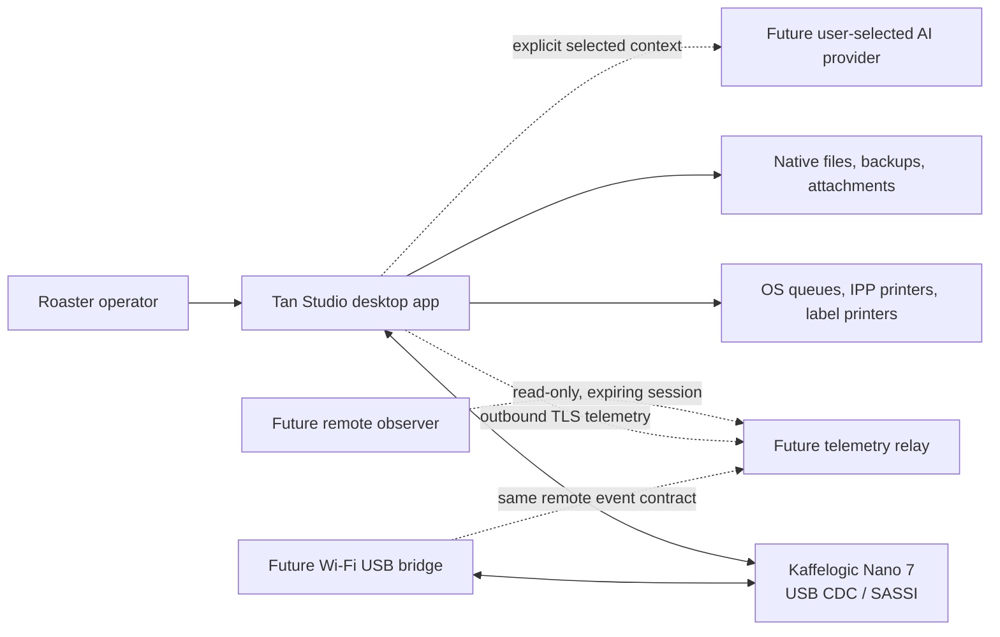
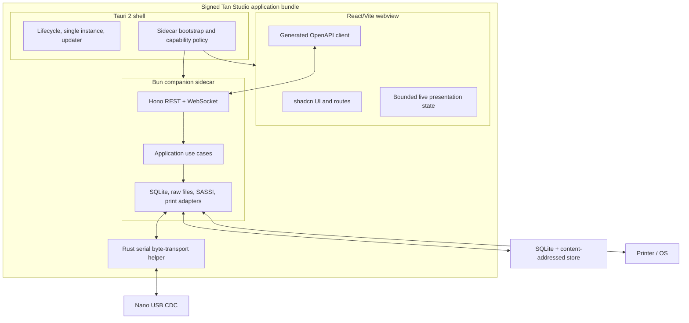
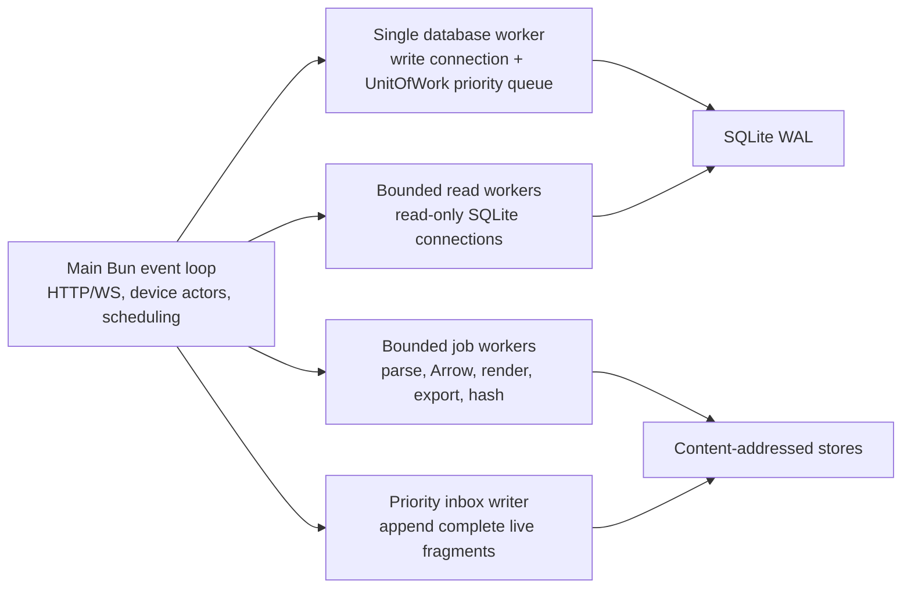
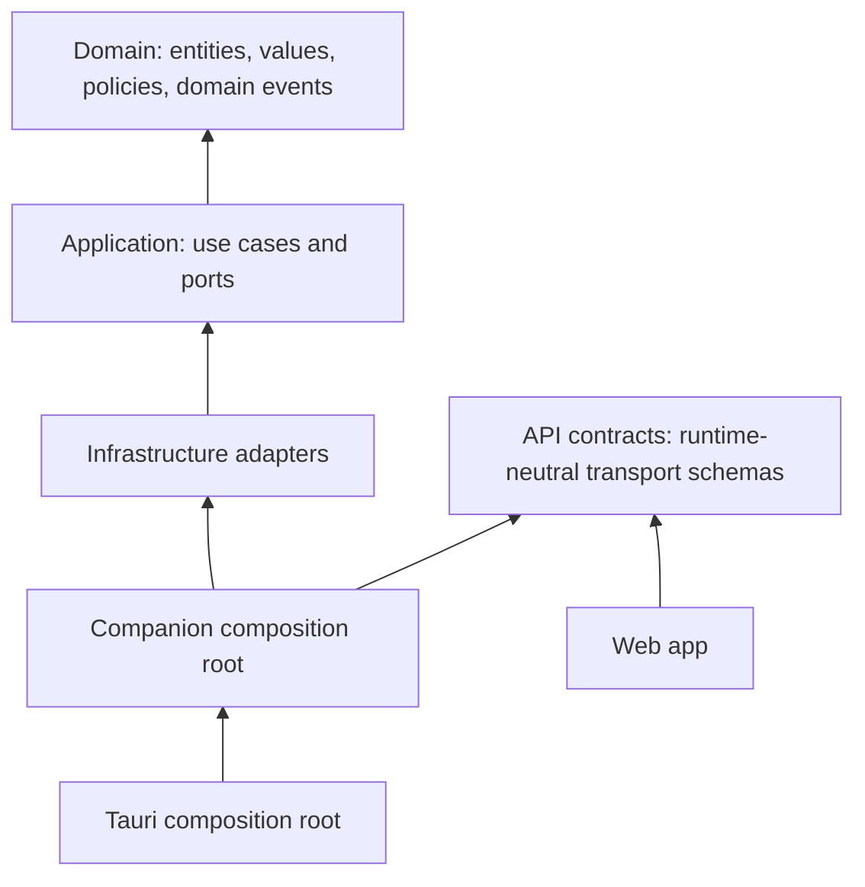
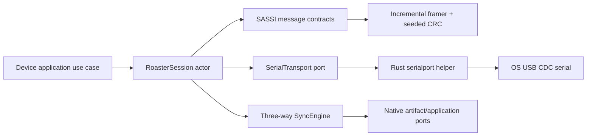
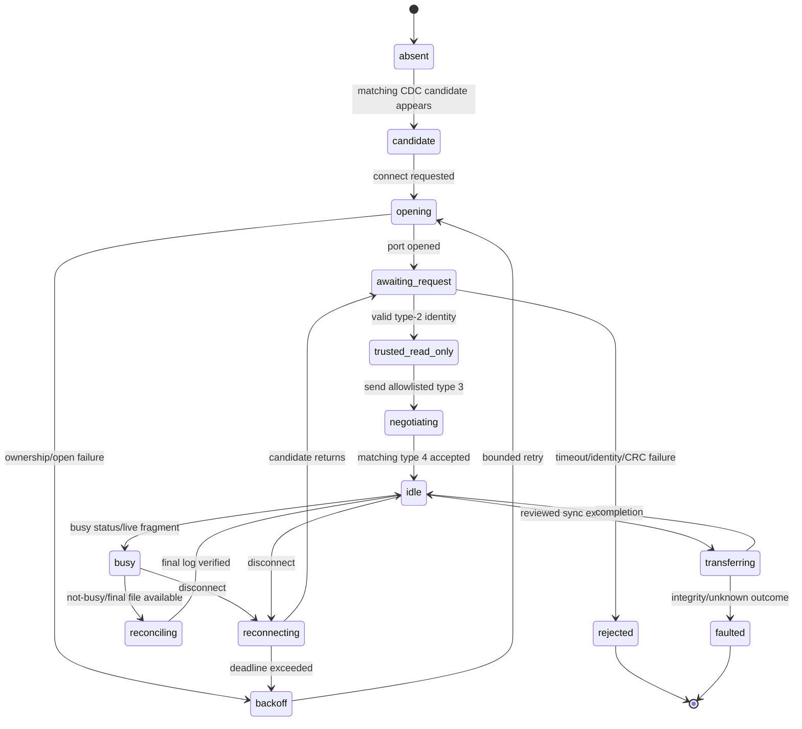
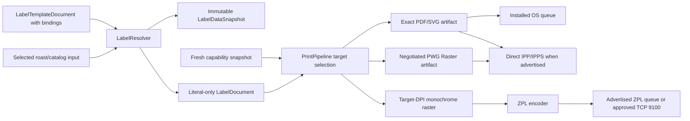
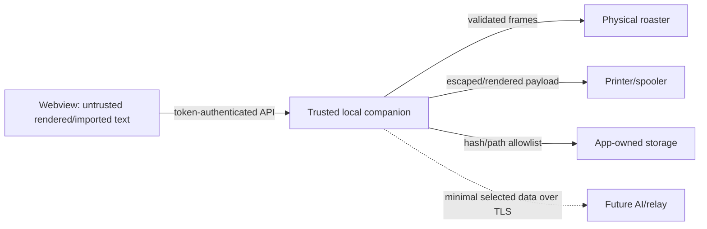

# Tan Studio technical specification

Status: **normative engineering specification**
Version: 1.0
Date: 18 July 2026
Product: **Tan Studio**
Primary release target: macOS, local-first, single user
Product baseline: [PRD](03-product-requirements-document.md)
Protocol baseline: [USB protocol and native formats](02-usb-protocol-and-file-formats.md)
Visual baseline: [editable Excalidraw board](../mockups/kaffelogic-modern-studio.excalidraw)

## 1. Purpose and authority

This document defines how Tan Studio is to be implemented. It turns the product requirements into process boundaries, modules, ports, persistence contracts, APIs, state machines, packaging rules, security controls, and release gates. An engineer should be able to create the repository structure and implement a vertical slice without making an architectural choice that is not settled here.

The words **must**, **must not**, **should**, and **may** are normative. When documents appear to disagree, use this order of authority:

1. Safety and observed wire/file facts in the protocol specification.
2. Architecture, interfaces, storage, deployment, and testing decisions in this specification.
3. User behavior, priority, and acceptance requirements in the PRD.
4. Layout and visual intent in the Excalidraw board.
5. Historical behavior in the current-product discovery.

An implementation discovery that contradicts an observed protocol fact must stop the affected write path, preserve the evidence, and update the protocol specification before code is changed to match the new behavior.

### 1.1 Release boundary

The first dependable release comprises PRD Phases 0 through 2:

- Lossless `.kpro`/`.klog` import and export foundations.
- Catalog, inventory, roast history, tasting, planning, label, backup, and restore workflows.
- Signed Tauri desktop packaging, USB discovery, read-only status, safe synchronization, live monitoring, final-log reconciliation, and explicitly validated profile deployment.

AI proposals, internet remote monitoring, the official LAN bridge, broad printer-language support, firmware maintenance, and the future Wi-Fi USB bridge use ports defined here but are not production-v1 dependencies.

### 1.2 Settled decisions

| Area | Decision |
| --- | --- |
| Product name | Tan Studio |
| Application shape | Tauri 2 shell + React/Vite frontend + Bun companion sidecar |
| First platform | Signed and notarized macOS app; Windows/Linux follow through the same ports |
| Local ownership | One user and one database per OS account; one companion process owns a database and roaster port |
| API | Hono REST `/api/v1` + one ordered WebSocket `/api/v1/events`; OpenAPI 3.1 is the contract source |
| Persistence | SQLite through `bun:sqlite` and Drizzle; immutable content-addressed raw store |
| Frontend | React 19, Vite 8, strict TypeScript, TanStack Router/Query/Table/Virtual, Zustand 5, ECharts 6 |
| Design system | shadcn `base-nova`, Base UI, Tailwind CSS v4, semantic OKLCH tokens |
| USB | Small Rust `serialport` byte-transport helper; pure TypeScript SASSI codec and session actor |
| Printing | Exact PDF/SVG, installed OS queues, direct IPP/IPPS, then ZPL; Zebra ZD421-class 203/300 DPI is the first HIL target |
| Inventory | Canonical signed integer milligrams; display conversion happens at boundaries |
| Money | Optional reference metadata in integer minor currency units; no costing/accounting engine in v1 |
| AI and remote | Provider-neutral ports now; user-approved AI proposals and outbound read-only relay later |

## 2. System context and runtime topology

### 2.1 Context



The roaster remains authoritative for autonomous roast control. Tan Studio observes, records, synchronizes, and performs only capability-gated writes. The application never offers remote roast start.

### 2.2 Containers and processes



#### Tauri shell

The shell must:

- Enforce one application instance for the active OS user.
- Resolve versioned application-data and signed-resource paths.
- Generate the 256-bit launch token, start the companion, deliver the token over a private inherited control channel, read exactly one non-secret bootstrap record from protected stdout, and stop it on application exit.
- Inject the companion origin and launch token into a read-only in-memory webview bootstrap object before React starts.
- Apply Tauri capabilities and a restrictive content security policy.
- Provide a narrow private shell bridge for save/open/print panels and allowlisted keychain operations requested by companion ports; it is not exposed directly to React.
- Own signed updater behavior and the v1 OS-keychain-backed device-identity key. Future provider credentials use the same abstract secret-store boundary.

The shell must not contain product use cases, parse native files, interpret SASSI, query domain tables, or render labels. Shell-bridge requests reference an already validated app-owned artifact and an allowlisted operation; there is no generic shell command, arbitrary path, or arbitrary Tauri invoke surface.

#### Bun companion

The companion must be the sole logical owner of:

- The active SQLite connection pool and write transaction queue.
- Raw, derived, attachment, backup, inbox, and diagnostic files.
- The serial-helper lifecycle/session and all printer transports. The helper alone holds the OS serial handle but has no independent lifecycle, protocol policy, or API.
- Domain/application services and durable jobs.
- The authenticated loopback HTTP and WebSocket server.

There is no separately installed daemon. Closing the desktop app gracefully stops the companion after active writes are flushed. During an active roast, closing requires an explicit warning; if termination still occurs, the durable live inbox allows reconciliation after restart.

#### React frontend

The frontend may know API contracts, view models, routes, and presentation state. It must not import Tauri APIs, Node/Bun modules, SQLite libraries, file parsers, printer encoders, SerialPort, or SASSI code. Production and development use the same HTTP/WebSocket interface.

### 2.3 Startup and shutdown

```mermaid
sequenceDiagram
    participant T as Tauri shell
    participant C as Bun companion
    participant W as React webview
    participant D as SQLite/device services

    T->>T: generate 256-bit launch token; load/create device identity key
    T->>C: spawn; send secrets on private inherited control channel
    C->>C: bind 127.0.0.1:0
    C->>D: lock database; migrate; recover jobs/inbox
    C-->>T: one JSON bootstrap line on protected stdout
    T->>W: inject immutable {origin, token, buildVersion}
    W->>C: GET /api/v1/system/bootstrap with Bearer token
    C-->>W: capabilities, schema/API versions, session id
    W->>C: POST /api/v1/event-tickets
    W->>C: WebSocket with one-time ticket subprotocol
    C-->>W: snapshot then ordered deltas
    T->>C: graceful shutdown signal
    C->>D: stop discovery, checkpoint, flush logs, release locks
    C-->>T: exit status
```

Startup fails closed if migrations, database locking, application-data permissions, or launch-token initialization fail. A failure UI may show diagnostics and restore options, but must not silently create a new database over an unreadable existing path.

The companion bootstrap record is:

```ts
type CompanionBootstrap = {
  protocolVersion: 1
  origin: `http://127.0.0.1:${number}`
  companionPid: number
  buildVersion: string
}
```

The record must be consumed by the Tauri parent and must never contain the launch token or device-identity key. Any additional stdout before or after the record is a packaging-test failure; structured companion logs go to a dedicated rotating file sink. The launch token is 32 random bytes, represented as base64url without padding only inside the shell/webview bootstrap and companion memory.

Tauri creates a private inherited pipe pair, or a user-only Unix-domain socket/Windows named pipe where inherited descriptors are unavailable, for the versioned shell bridge. Before HTTP starts, the channel carries the launch token and an application-scoped device-identity HMAC key loaded from the OS keychain; those values are never sent back or requested by React. The companion implements `ArtifactExportPort`, `SystemDocumentPort`, and `DeviceIdentityKeyStore` over this bridge. Later provider credentials extend a separate `SecretStore` interface. Requests are length-prefixed MessagePack, carry a correlation ID, and are limited to `saveArtifact`, `openArtifact`, `showPdfPrintDialog`, and separately permissioned keychain operations. Tauri independently verifies that an artifact path resolves beneath the active generation's immutable artifact root before opening a native panel. The bridge carries no domain queries and never exposes a selected destination path to React. If the device key cannot be loaded, Tan Studio may inspect a candidate transiently but remains read-only and does not persist or trust its identity.

### 2.4 Companion execution topology

Synchronous SQLite and CPU/native work must never run on the event loop that owns USB ingestion, WebSocket heartbeats, or Hono connection handling.



- The main loop performs framing/session state and queues persistence; it does not run synchronous SQL, parse a complete log, generate Arrow, render PDF/SVG/raster, invoke sharp/resvg, build a backup, or rebuild a projection.
- One dedicated database worker owns the read/write connection and all migrations/transactions. Its priority queue services live-roast metadata/finalization before ordinary UI mutations and background jobs. It is never terminated mid-transaction.
- A bounded pool of request-owned workers, each with a read-only SQLite connection, serves library/facet/report reads. HTTP cancellation stops streaming immediately and marks the task cancelled; a worker running an uninterruptible synchronous query is allowed to finish off the main loop and is recycled or terminated only where the read-only connection can be safely discarded.
- A separate bounded CPU/job pool performs native parsing, hashing, Arrow conversion, label rendering, compression, and exports. Each task has byte/time/memory limits and checkpoints. Cancellation terminates only the request-owned job worker, never the writer.
- Complete live native fragments use a priority append path before presentation events. Backpressure coalesces UI sample events and pauses background reads/jobs before it drops device evidence.
- Worker messages are versioned structured data or transferable byte buffers. SQLite connections, serial handles, native renderer objects, and mutable domain aggregates are never shared between workers.

Default production limits are one writer, two read workers, and `max(1,min(2,logicalCpuCount-2))` CPU workers on the reference Mac. These limits are configurable by platform profile, not user-facing arbitrary tuning. Worker crashes fail only their task, preserve durable inputs, and trigger bounded replacement.

## 3. Clean Architecture and repository structure

### 3.1 Dependency rule



- `domain` depends only on the TypeScript standard library and small, runtime-neutral value helpers.
- `application` depends on `domain` and defines every outbound port.
- Transport contracts are runtime-neutral Zod/TypeScript DTOs and do not import application or domain. The companion HTTP adapter maps DTOs to application commands/results; web imports cannot transitively pull domain/use-case code into the frontend.
- Infrastructure adapters depend inward and translate external failures into application error categories.
- Composition roots construct concrete adapters explicitly. A reflective dependency-injection container is prohibited.
- Cross-module communication uses application interfaces or typed domain events, never another module's database implementation.
- CI must reject forbidden imports with dependency-cruiser or an equivalent static boundary test.

### 3.2 Bun workspace

The repository will use Bun workspaces with this target structure:

```text
apps/
├── web/                    # React/Vite routes and feature composition
├── companion/              # Hono server, adapters, jobs, composition root
└── desktop/                # Tauri 2 Rust shell, native print/serial helpers, packaging
packages/
├── domain/                 # Pure domain model and policies
├── application/            # Use cases, ports, commands, results
├── api-contract/           # Runtime-neutral Zod/OpenAPI DTOs and event envelopes
├── api-client/             # Generated client; never hand-edited
├── api-client-runtime/     # Handwritten query keys, retry/cache policy, event integration
├── device-sassi/           # Pure incremental framing/CRC/session messages
├── native-format-adapters/ # Lossless kpro/klog parser/writer implementations
├── printing-adapters/      # Renderer/encoder implementations; depends inward
├── ui/                     # shadcn source components and semantic tokens
└── testkit/                # Fixtures, fake clocks, ports, builders, matchers
```

Infrastructure implementations live under `apps/companion/src/adapters`; they are not published as general-purpose packages until a second composition root needs them. This avoids a package-per-class structure while keeping boundaries testable.

Domain label/profile/roast value types live in `domain`. Every repository, parser, renderer, printer, transport, clock, identity, and filesystem port lives in `application`. `device-sassi`, `native-format-adapters`, and `printing-adapters` are outward implementations and may depend on domain/application; application code must never import them. The dependency test treats these adapter packages exactly like `apps/companion/src/adapters`.

### 3.3 Code and contract rules

- TypeScript uses `strict`, `noUncheckedIndexedAccess`, `exactOptionalPropertyTypes`, and `useUnknownInCatchVariables`.
- `any`, unchecked type assertions, and unvalidated JSON are prohibited at external boundaries.
- Zod validates HTTP, WebSocket, persisted JSON, printer capability responses, file-plugin results, and future provider output.
- Domain functions accept a `Clock`, `IdGenerator`, and other nondeterministic behavior through ports.
- Public commands are immutable data; use cases return discriminated results or throw only documented application errors.
- Every mutation carries a correlation ID; retriable externally initiated mutations additionally carry an idempotency key.
- Long-running or cancellable work is a durable `Job`, not an HTTP request held open.

## 4. Cross-module domain conventions

### 4.1 Identifiers, time, units, and revisions

```ts
type UuidV7<T extends string> = string & { readonly __entity: T }
type InstantMs = number & { readonly __unit: "unix-ms" }
type DurationMs = number & { readonly __unit: "ms" }
type MassMg = number & { readonly __unit: "mg" }
type TemperatureMilliC = number & { readonly __unit: "milli-celsius" }
type BasisPoints = number & { readonly __unit: "basis-points" }
type Revision = number & { readonly __kind: "revision" }
```

- Internal entity IDs are lowercase canonical UUIDv7 strings generated by the application. Coffee, roast, brew, and label records additionally receive immutable, per-table positive integer `serial_number` values starting at 1. These short numbers are the only IDs shown in routine UI, labels, QR payloads, and user-entered references; internal IDs remain implementation details.
- Instants are signed 64-bit Unix epoch milliseconds in persistence and ISO 8601 strings in JSON.
- User-entered civil times also store an IANA timezone such as `America/Los_Angeles`; ambiguous DST input requires explicit offset selection.
- Mass persists as signed 64-bit integer milligrams. UI accepts grams, kilograms, ounces, and pounds and converts with an explicit rounding preview.
- Temperatures persist as integer milli-degrees Celsius. Fahrenheit is presentation only.
- Percentages persist as integer basis points; roast level persists as thousandths of one level.
- Monetary reference values persist as integer minor units with an ISO 4217 currency code. They are never combined into inventory valuation in v1.
- Every editable aggregate has an integer `revision`, incremented by one in the same transaction as its mutation. Immutable revisions never update in place.

JavaScript numbers are safe for the expected domain ranges, but database adapters must reject values outside `Number.MAX_SAFE_INTEGER` and bind integer columns without floating-point conversion.

### 4.2 Domain events and durable dispatch

Domain events use registered, past-tense names such as `catalog.greenLotReceived.v1`. Each event is persisted to `domain_events` in the same SQLite transaction as the aggregate change. An aggregate's authoritative internal event schemas live with its owning domain module; cross-module application-event contracts live in `packages/application`. Their fully qualified types are never reused with new semantics. `packages/api-contract` contains only HTTP/WebSocket transport DTOs and may define a presentation event derived from an internal event, never the internal event itself. No external message broker is required.

```ts
type DomainEvent<TType extends string, TPayload> = {
  eventId: UuidV7<"DomainEvent">
  type: TType
  schemaVersion: 1
  aggregateId: string
  aggregateRevision: number
  eventOrdinal: number
  occurredAt: string
  correlationId: string
  causationId?: string
  payload: TPayload
}
```

Consumers must be idempotent by `(eventId, consumerName)`. P0 read-your-writes projections, including affected `roast_library_rows` and FTS rows, update inside the originating `UnitOfWork`; post-commit consumers handle WebSocket presentation, expensive rebuilds, and explicitly noncritical projections. Durable consumers catch up after restart before the companion reports the relevant capability `ready`.

### 4.3 Application errors

Application errors are limited to these stable categories:

- `validation`: input or deterministic domain rule failure.
- `not_found`: resolved target no longer exists.
- `conflict`: revision, idempotency, ownership, or sync conflict.
- `capability_denied`: operation is unsupported or outside the granted capability.
- `resource_busy`: database, serial port, printer, or device is temporarily owned/busy.
- `external_unavailable`: device, printer, filesystem, relay, or provider unavailable.
- `integrity_failure`: checksum, parse, database, backup, or protocol validation failed.
- `unsafe_target`: target identity changed or a path/command failed safety resolution.
- `internal`: unexpected defect; safe user message plus correlation ID.

Adapters must retain the original error as a redacted cause for diagnostics without exposing paths, secrets, serials, or imported untrusted content to the UI.

## 5. Bounded modules

### 5.1 Catalog and green inventory

**Responsibilities:** providers, reusable coffee identities, purchases, purchase lines, physical green lots, immutable stock transactions, archive state, and lineage navigation.

**Use cases:** create/update/archive provider and coffee; record acquisition; split purchase line into lots; receive, adjust, transfer, or write off stock; link/relink a roast with an audit reason; query stock and history.

**Invariants:** a lot belongs to exactly one purchase line and coffee identity; balance is the sum of signed transactions; a finalized roast can create at most one consumption transaction; green input, roasted yield, and package net mass are distinct; an imported roast may remain uncataloged.

**Ports:** `CatalogRepository`, `InventoryLedgerRepository`, `RoastLineageReader`, `UnitConversionPolicy`, `AuditPort`.

**Events:** `catalog.providerCreated.v1`, `catalog.coffeeIdentityCreated.v1`, `catalog.greenLotReceived.v1`, `inventory.inventoryAdjusted.v1`, `roasts.roastLineageChanged.v1`.

**Failure behavior:** insufficient stock is a warning until confirmation; a permitted negative adjustment requires a reason. Retried finalization returns the existing consumption. This module must not parse `.klog`, read samples, or talk to a roaster.

### 5.2 Roast sessions and telemetry

**Responsibilities:** logical roast identity, provisional sessions, final logs, telemetry stream descriptors, native/app events, result metadata, annotations, and reconciliation.

**Use cases:** observe busy transition; open provisional session; append validated sample batches; add/edit app annotations; record native event intent; reconcile final log; finalize inventory consumption; retrieve chart data.

**Invariants:** raw samples are append-only; an elapsed timestamp never silently overwrites another sample; gaps are explicit; imported bytes remain immutable; finalization is idempotent; final native evidence wins only after differences are recorded.

**Ports:** `RoastRepository`, `SampleStreamStore`, `NativeFileStore`, `InventoryConsumptionPort`, `DeviceEventPort`, `AttachmentStore`, `Clock`.

**Events:** `roasts.roastObserved.v1`, `roasts.sampleBatchReceived.v1`, `roasts.roastEventRecorded.v1`, `roasts.annotationAdded.v1`, `roasts.finalLogReconciled.v1`, `roasts.roastFinalized.v1`.

**Failure behavior:** a cable loss marks the stream stale without inferring roast completion. If the database is unavailable, complete incoming native fragments go to the recoverable inbox. This module must not open serial ports or issue raw protocol messages.

### 5.3 Profiles and revisions

**Responsibilities:** logical profile families, immutable revisions, parent graph, curves, metadata, compatibility, deterministic validation, semantic diff, and deployment intent.

**Use cases:** import profile; branch revision; edit curve/settings; validate for target; compare revisions; extract from roast; deploy validated revision; revert by creating a successor revision.

**Invariants:** published revisions are immutable; every revision retains its source and parent links; deployment always resolves a current device identity and compatibility report; AI output is never a deployed profile directly.

**Ports:** `ProfileRepository`, `NativeProfileCodec`, `ProfileValidator`, `DeviceProfileDeploymentPort`, `AuditPort`.

**Events:** `profiles.profileImported.v1`, `profiles.profileRevisionCreated.v1`, `profiles.profileValidated.v1`, `profiles.profileDeploymentRequested.v1`, `profiles.profileDeployed.v1`.

**Failure behavior:** validation returns field/curve locations and blocks deployment; unknown native fields survive a supported edit. This module must not know SerialPort, SASSI frames, or UI curve-library types.

### 5.4 Tastings, conclusions, and next-roast plans

**Responsibilities:** multiple tastings over rest time, score scales, descriptors, brew context, promoted conclusion, evidence links, and versioned next-roast plans.

**Use cases:** record/revise tasting; promote a conclusion; compare rest ages; create/supersede/cancel plan; cite roast/tasting evidence; mark a plan used by one roast.

**Invariants:** earlier tastings are never overwritten; promotion is a pointer; used plans are immutable and have at most one executed roast; a successor supersedes rather than edits a used plan.

**Ports:** `TastingRepository`, `PlanRepository`, `RoastEvidenceReader`, `Clock`.

**Events:** `tastings.tastingRecorded.v1`, `tastings.conclusionPromoted.v1`, `plans.nextRoastPlanCreated.v1`, `plans.nextRoastPlanSuperseded.v1`, `plans.nextRoastPlanUsed.v1`.

**Failure behavior:** missing evidence remains a visible broken reference only if its source was explicitly removed; ordinary catalog archival never removes it. This module has no AI-provider or device dependency.

### 5.5 Device discovery, protocol, and synchronization

**Responsibilities:** candidate enumeration, trusted identity negotiation, connection lifecycle, capability boundaries, status, remote filesystem inventory, sync planning, transfers, conflicts, and live fragment delivery.

**Use cases:** discover; connect read-only; read status; plan sync; execute approved sync; pull/push a named file; record a validated event; reconnect; reconcile device/local/base versions.

**Invariants:** one owner and one response-bearing request at a time; VID/PID is candidate discovery, not identity; target identity is rechecked before writes; normal sync pauses while busy; conflicts preserve both versions; destructive actions are separate services.

**Ports:** `SerialTransport`, `RoasterProtocol`, `DeviceRegistry`, `SyncLedger`, `NativeFileStore`, `DeviceClock`, `DeviceAuditPort`.

**Events:** `devices.deviceCandidateFound.v1`, `devices.deviceTrusted.v1`, `devices.deviceSessionChanged.v1`, `devices.deviceBusyChanged.v1`, `devices.syncPlanned.v1`, `devices.syncConflictDetected.v1`, `devices.syncCompleted.v1`, `devices.liveFragmentReceived.v1`.

**Failure behavior:** malformed/invalid frames terminate trust and retain redacted diagnostics; timeouts close the current request and enter backoff; the application never guesses an ACK or repeats a non-idempotent write. This module never updates catalog or profile tables directly.

### 5.6 Native file parsing and export

**Responsibilities:** sniffing, lossless syntax trees, validation, semantic mapping, supported edits, serialization, provenance, and format diagnostics.

**Use cases:** import bytes; inspect raw/semantic views; create a derived native revision; export; compare semantic versions; rebuild parsed records from originals.

**Invariants:** original bytes are immutable and content addressed; unedited serialization is byte-identical; unknown keys/channels and duplicate/order information survive; unsupported encrypted content is pass-through only.

**Ports:** `NativeFormatPlugin`, `RawArtifactStore`, `NativeFileRepository`, `ParserRegistry`.

**Events:** `native.nativeFileImported.v1`, `native.nativeFileRejected.v1`, `native.nativeRevisionCreated.v1`, `native.nativeFileExported.v1`.

**Failure behavior:** parse errors are structured with spans and do not discard the raw artifact. This module must not trust paths contained in imported data or deserialize pickle.

### 5.7 Labels, printers, and print jobs

**Responsibilities:** physical label documents/templates, deterministic rendering, capability discovery, queueing, encoding, submission, status fidelity, cancellation, receipts, and reprints.

**Use cases:** compose preview; render exact artifact; discover/configure printer; submit/cancel/watch job; export PDF; reprint immutable payload; calibrate media offsets.

**Invariants:** canonical layout uses physical units; rendering is separate from language encoding and transport; status never overclaims physical printing; user content cannot escape into commands; every job retains its artifact and capability snapshot.

**Ports:** `LabelRenderer`, `PrinterDiscoveryPort`, `PrintSubmissionPort`, `PrinterLanguageEncoder`, `RawPrinterTransport`, `PrintArtifactStore`.

**Events:** `printing.labelRendered.v1`, `printing.printJobSubmitted.v1`, `printing.printJobStatusChanged.v1`, `printing.printJobCancelled.v1`.

**Failure behavior:** a missing printer keeps a retryable draft and exact PDF fallback. This module must not query roast/catalog tables; application composition provides a resolved label data snapshot.

### 5.8 Search, library views, and reporting

**Responsibilities:** denormalized roast-library projection, compound filters, facets, grouping, stable multi-sort, saved views, cursor pagination, and asynchronous complete-result exports.

**Use cases:** query library; compute facets/aggregates; save/duplicate/share view definition; export current result; rebuild/verify projection.

**Invariants:** list queries never hydrate telemetry arrays; identical definitions produce deterministic results; all sorts end with a stable `id` tiebreaker; cursor encodes the complete sort tuple.

**Ports:** `RoastLibraryReadModel`, `SavedViewRepository`, `ExportJobPort`, `ProjectionCheckpointStore`.

**Events:** `search.savedViewChanged.v1`, `search.roastLibraryProjectionUpdated.v1`, `reports.reportExported.v1`.

**Failure behavior:** cancellation prevents an older query from replacing a newer one; a stale projection is reported and rebuilt without changing authoritative entities.

### 5.9 Backup, restore, import inbox, and diagnostics

**Responsibilities:** consistent backups, manifests/checksums, retention, staged restore, raw index rebuild, crash inbox recovery, and redacted diagnostic bundles.

**Use cases:** create/verify backup; schedule retention; preview and activate restore; rebuild derived state; recover incomplete live fragments; export diagnostics after preview.

**Invariants:** backup success requires full hash verification; last verified backup is never pruned after failure; restore never mutates the active store until staging passes integrity checks; secrets are excluded.

**Ports:** `DatabaseSnapshotPort`, `ArchivePort`, `IntegrityCheckPort`, `SecretClassifier`, `DiagnosticLogPort`.

**Events:** `system.backupCompleted.v1`, `system.backupFailed.v1`, `system.restoreActivated.v1`, `system.inboxRecovered.v1`, `system.diagnosticBundleCreated.v1`.

**Failure behavior:** failed artifacts remain marked incomplete and the previous verified state remains active. This module cannot invent missing raw evidence.

### 5.10 Settings and capability discovery

**Responsibilities:** user preferences, units, accessibility, notification policy, feature availability, adapter status, and device/printer capability summaries.

**Use cases:** read/patch settings; reset a section; inspect effective capabilities; subscribe to availability changes.

**Invariants:** settings have typed defaults and schema versions; capability is derived from compiled feature, configured adapter, permission, and live target support; secrets are references, not values.

**Ports:** `SettingsRepository`, `CapabilityProvider`, `SecretReferenceStore`.

**Events:** `settings.settingsChanged.v1`, `system.capabilitiesChanged.v1`.

**Failure behavior:** invalid settings fall back only to the documented field default and emit a diagnostic; an unavailable adapter disables its actions rather than hiding data.

### 5.11 Future AI proposal service

**Responsibilities:** selected-context assembly, transmission preview, provider-neutral structured generation, validation, evidence citation, and user decisions.

**Ports:** `AiProvider`, `ProposalRepository`, `ProfileValidator`, `EvidenceReader`, `SecretStore`.

**Invariants:** provider output is untrusted; only schema-valid bounded proposals are stored; acceptance creates a local profile revision; no AI port can receive a device command capability.

**Failure behavior:** provider/network failure leaves local workflows unchanged. Prompt injection inside notes is treated as data. The module ships disabled until a provider adapter and privacy review pass.

### 5.12 Future remote-monitoring relay

**Responsibilities:** explicit session creation, outbound telemetry publication, scoped viewer authentication, expiry/revocation, catch-up, and viewer audit.

**Ports:** `TelemetryRelayPort`, `RemoteSessionRepository`, `RemoteTokenIssuer`, `SecretStore`.

**Invariants:** telemetry only; outbound TLS only; no local API or TCP 9056 exposure; no device-write command type exists in the remote schema; local capture continues offline.

**Failure behavior:** relay loss marks viewers disconnected and queues only bounded catch-up summaries. The module ships disabled until hosting, account, and retention decisions are approved.

## 6. Persistence and filesystem specification

### 6.1 Application-data layout

Tauri resolves the platform application-data directory. The companion receives the resolved absolute path; it must not derive it from the current working directory.

```text
Tan Studio/
├── current-store.json      # atomically replaced {generationId, schemaVersion}
├── stores/
│   └── <generation-id>/
│       ├── database/tan-studio.sqlite
│       ├── raw/sha256/ab/<64-char-hash>.bin
│       ├── artifacts/sha256/ab/<64-char-hash>.bin
│       ├── derived/series/ab/<source-hash>.arrow
│       ├── attachments/sha256/ab/<64-char-hash>.bin
│       └── inbox/live/<session-id>.part
├── backups/
│   └── <utc-timestamp>-<backup-id>/
├── diagnostics/
│   └── logs/
└── locks/
    └── companion.lock
```

- `raw`, `artifacts`, and `attachments` are immutable and content addressed. `artifacts` contains durable generated print/export payloads, never native-source evidence.
- `derived` is disposable and rebuildable.
- `inbox` may contain incomplete but recoverable evidence and is never included as a successful native import until parsed.
- `backups` are user-visible, verified artifacts.
- `diagnostics` is bounded and excluded from backups by default.
- `current-store.json` is the only active-generation pointer. A restore creates a new complete generation and switches the pointer atomically; it never replaces several live directories independently.
- No credential, launch token, remote token, or AI key may be stored anywhere in this tree.

Artifact writes use a sibling random temporary file, restrictive permissions, a complete write loop, file flush, atomic rename, and parent-directory flush where supported. Existing hashes are verified before reuse. Paths from native files, printers, API requests, or backups are never concatenated directly into filesystem targets.

### 6.2 SQLite configuration and ownership

The companion owns one read/write `bun:sqlite` database and a small bounded set of read-only connections. At open it must execute and verify:

```sql
PRAGMA journal_mode = WAL;
PRAGMA foreign_keys = ON;
PRAGMA busy_timeout = 5000;
PRAGMA synchronous = NORMAL;
PRAGMA temp_store = MEMORY;
PRAGMA trusted_schema = OFF;
```

`foreign_keys`, `journal_mode`, and `trusted_schema` are release assertions, not best-effort hints. Migrations and restore verification use `synchronous = FULL`. A single application `UnitOfWork` queue serializes write transactions; HTTP handlers and event consumers may not call `BEGIN` independently.

All tables use `snake_case`. IDs are `TEXT`; instants and domain quantities are `INTEGER`; booleans are constrained `INTEGER` values `0` or `1`; enumerations are constrained text; validated JSON uses canonical UTF-8 JSON text. SQLite `REAL` is allowed only for raw telemetry samples and derived statistical values, never inventory, money, timestamps, revisions, or percentages.

### 6.3 Schema catalog

Every mutable entity has `created_at_ms`, `updated_at_ms`, and `revision`. Optional archival uses `archived_at_ms`; rows are not hard-deleted while referenced. The following field lists omit those common columns unless their behavior differs.

#### Infrastructure and audit

| Table | Required contents and constraints |
| --- | --- |
| `app_metadata` | Singleton `id=1`, application schema version, projection version, created version, last clean shutdown. |
| `schema_migrations` | Integer version primary key, name, SHA-256 of migration SQL, applied time, application version. Applied hashes never change. |
| `settings` | Key primary key, schema version, validated JSON value, revision. Secret values are prohibited. |
| `idempotency_keys` | Scope, key, request hash, result status/body reference, created/expiry time; unique `(scope,key)`. A reused key with a different request hash is a conflict. |
| `jobs` | ID, type, state, progress basis points, input/result JSON, correlation ID, cancellation flag, attempt, next-run time, error code, timestamps. |
| `job_events` | Job ID, monotonic sequence, state/progress/message code and safe parameters; unique `(job_id,sequence)`. |
| `domain_events` | Event envelope, fully qualified versioned type, canonical payload JSON, aggregate revision, event ordinal, and dispatch state; unique event ID and `(aggregate_id,aggregate_revision,event_ordinal)`. Ordinals start at zero and preserve the order of multiple events emitted by one aggregate revision. |
| `domain_event_deliveries` | Event ID, consumer name/version, state, attempts, last error code; unique `(event_id,consumer_name)`. |
| `audit_entries` | Actor kind, action, target kind/ID/revision, correlation ID, safe before/after summary, occurred time. No secret or full imported text. |

#### Devices, source artifacts, and synchronization

| Table | Required contents and constraints |
| --- | --- |
| `devices` | Stable local ID, model, product family, redacted display suffix, firmware, SASSI version, capability JSON/hash, first/last seen. Persist `HMAC-SHA-256(deviceIdentityKey, concat(UTF8("tan-studio/device/v1\0"), serialBytes))` as the fingerprint, never the raw serial; the fingerprint is not exported by default. |
| `transport_endpoints` | Device ID nullable until trusted, kind (`usb`,`official_lan`,`mirror`,`future_bridge`), stable adapter key, safe display label, last seen, availability. OS path/URI is adapter-private metadata excluded from ordinary exports. |
| `device_sync_entries` | Device ID, normalized remote path, common-base/local/remote artifact hashes and mtimes, state, last verified time; unique `(device_id,remote_path)`. |
| `device_sync_plans` | Immutable plan ID, device/fingerprint, connection session, capability hash, remote inventory hash, capacity/busy snapshot, base/local/remote root hashes, created/expiry time, review state, plan hash, execution job nullable, and terminal outcome. |
| `device_sync_operations` | Plan ID, ordinal, operation kind, canonical remote path, base/local/remote artifact hashes and sizes, expected precondition, destructive flag, and execution outcome; unique `(plan_id,ordinal)`. Operations cannot change after review. |
| `native_files` | Immutable artifact hash primary key, byte length, media/format kind, schema hint, first-seen time, and storage verification state. It represents bytes only and carries no occurrence-specific provenance. |
| `native_import_occurrences` | ID, native-file hash, source kind, redacted source hint, observed/imported time, device/sync/job IDs nullable, parser ID/version, parse state, warnings JSON, and correlation ID. Identical bytes imported twice create one artifact and two occurrences. |
| `native_file_revisions` | Revision ID, native-file hash, parent revision nullable, edit-set JSON, semantic hash, created reason. The artifact remains immutable. |
| `native_document_links` | Native revision ID, owner kind/ID, role (`original`,`current`,`provisional`,`export`); unique current role per owner enforced transactionally. |
| `generated_artifacts` | Hash primary key, byte length, media type, kind (`print`,`export`,`report`), producer/version, retention class, created/expiry time. Durable print artifacts have no automatic expiry. |

#### Catalog and inventory

| Table | Required contents and constraints |
| --- | --- |
| `providers` | ID, display name, normalized name, reference/contact metadata JSON, notes, archive state. |
| `provider_aliases` | Provider ID, alias, normalized alias; unique normalized alias per provider. |
| `coffee_identities` | Internal ID, immutable positive serial number, display/normalized name, ISO country code nullable, region, producer/farm, station/cooperative, process, varieties JSON, altitude min/max metres, harvest label, certifications JSON, notes. |
| `tags` | ID, namespace, display/normalized name, optional semantic color token, archive state; unique `(namespace,normalized_name)`. |
| `coffee_tags` | Coffee ID, tag ID; unique pair. |
| `roast_tags` | Roast ID, tag ID; unique pair. |
| `green_purchases` | ID, provider ID, purchased/received instants and source timezone, supplier reference, optional ISO currency/total minor units, notes. |
| `purchase_lines` | ID, purchase ID, coffee ID, ordered/received mass mg, optional cost minor units, notes. Quantities are nonnegative. |
| `green_lots` | ID, purchase-line ID, supplier/internal codes, received mass mg, received time/timezone, storage note/location, green measurements JSON, state (`active`,`depleted`,`archived`). |
| `inventory_transfers` | ID, source lot, destination lot, positive mass mg, occurred time, reason, permanent idempotency key; source and destination differ. |
| `inventory_transactions` | ID, lot ID, kind (`receipt`,`roast_consumption`,`adjustment`,`transfer_in`,`transfer_out`,`write_off`), signed delta mg, occurred time, reason, source roast nullable, transfer ID nullable, idempotency key. A partial unique index permits one `roast_consumption` per roast. Each transfer has exactly one equal negative source row and one equal positive destination row created in the same transaction. |

Lot balance is calculated from the ledger, with an optional transactionally maintained balance projection. The received mass on a lot is descriptive evidence; it does not replace the receipt transaction.

`TransferInventory` creates the transfer record and both ledger rows in one `UnitOfWork`. It rejects a self-transfer, a nonpositive mass, insufficient stock unless an explicitly authorized negative-balance policy applies, and reuse of its permanent idempotency key with different inputs. No endpoint may create a standalone `transfer_in` or `transfer_out` row.

#### Profiles, roasts, and telemetry

| Table | Required contents and constraints |
| --- | --- |
| `profiles` | ID, display/normalized name, family, origin (`official`,`imported`,`user`,`extracted`), archive state. |
| `profile_revisions` | ID, profile ID, revision number, schema version, short name, immutable semantic document JSON, source native revision/proposal/roast nullable, immutable created time; unique `(profile_id,revision_number)`. |
| `profile_revision_parents` | Revision ID, parent revision ID, position; unique pair. Supports merge history without overwriting. |
| `profile_validation_reports` | Immutable ID, profile revision, target device/capability hash, target firmware/schema, validator ID/version, report JSON/hash, result, warnings/errors, created time. A device deployment references the exact passing report. |
| `roast_intents` | ID, selected lot/coffee, profile revision, optional ready plan, level thousandths, expected green load mg, target device nullable, intent state (`draft`,`armed`,`claimed`,`expired`,`cancelled`), created/expiry time, claimed roast nullable, and revision. At most one armed intent exists per local operator. |
| `roasts` | Internal ID, immutable positive serial number, native log number nullable, intent ID nullable unique, green lot nullable, contextual coffee ID nullable, profile revision nullable, current native revision nullable, device nullable, roasted instant/timezone, level thousandths, development basis points nullable, green input/roasted yield mg nullable, end reason, result/status, promoted tasting nullable, finalization key. |
| `roast_sample_streams` | Roast ID primary key, monotonic stream version, reconciled source native-file hash nullable, provisional inbox reference nullable, channel schema JSON, row count, first/last elapsed ms, cache encoding/version/path/hash nullable, reconciliation state. A reconciled replacement increments stream version; a reconciled stream requires a verified native-file hash and no provisional-only state. |
| `roast_events` | ID, roast ID, event kind, elapsed ms, temperature milli-C nullable, source (`native`,`device`,`user`,`derived`), source native revision nullable, supersedes nullable, deleted flag. |
| `annotations` | ID, roast ID, anchor kind (`elapsed`,`temperature`,`sample`,`roast`), anchor values, type, text, tags JSON, created/updated provenance. |
| `attachments` | Hash primary key, byte length, media type, original-name hint, created time. |
| `annotation_attachments` | Annotation ID, attachment hash, caption/order; unique pair. |
| `roast_packages` | ID, roast ID, package ordinal, net mass mg, packaging time/timezone, label/print job nullable, notes; unique `(roast_id,package_ordinal)`. Package mass is never substituted for roasted yield. |
| `user_preferences` | Singleton revisioned personal defaults for roaster name, grinder/name setting, kettle, water, brew method, coffee/water masses, and water temperature. |
| `brews` | Internal ID, immutable positive serial number, roast ID, brewed instant/timezone, method, grinder/name setting, kettle, water, coffee/water masses, temperature, optional bloom/brew timings, score, descriptors, tasting notes, notes, and revision. Equipment values are historical snapshots, not foreign keys in v1. |
| `label_records` | Internal ID, immutable positive serial number, roast ID and roast serial snapshot, QR payload, copies, rendered artifact hash nullable, truthful status, and created time. |

Telemetry values are not expanded into the roast-library tables. On import, the parser writes one standard Apache Arrow IPC file per reconciled sample stream using typed columns in native channel order. `roast_sample_streams` records its schema and hash. The Arrow cache is a derived optimization: a missing, outdated, or corrupt cache is rebuilt from the immutable `.klog`; it is excluded from portable backups. During a live roast, parsed rows remain in a bounded memory buffer while complete source fragments are appended to the durable inbox. The provisional Arrow cache is replaced only after final reconciliation.

#### Tasting and planning

| Table | Required contents and constraints |
| --- | --- |
| `tasting_scales` | Logical scale ID, display name, archive state. |
| `tasting_scale_revisions` | Scale/revision ID, scoring bounds/unit, immutable ordered dimension definitions and validation rules JSON, created time; unique `(scale_id,revision_number)`. Existing tastings retain their exact revision. |
| `tastings` | ID, roast ID, immutable revision lineage/supersedes nullable, tasted time/timezone, rest age ms, tasting-scale revision, score basis points nullable, brew context JSON, validated component scores JSON, notes, outcome, worked, did-not-work, next action, and author label. |
| `tasting_descriptors` | Tasting ID, normalized descriptor, display descriptor, polarity/intensity nullable; unique `(tasting_id,normalized_descriptor)`. |
| `next_roast_plans` | ID, coffee ID, optional lot ID, objective, proposed settings JSON, status (`draft`,`ready`,`used`,`superseded`,`cancelled`), supersedes nullable, executed roast nullable unique. Separate partial unique indexes permit at most one `ready` coffee-wide plan where lot is null and one `ready` plan per lot. |
| `plan_evidence` | Plan ID, roast ID, optional tasting/event/annotation ID, evidence note; unique logical citation. |

Plan transitions are `draft -> ready|cancelled`, `ready -> used|superseded|cancelled`, and no transition out of a terminal state. Starting from a ready plan claims it through a `roast_intent`; finalizing the claimed roast sets the plan to `used` and its canonical `executed_roast_id` in the same transaction. The inverse roast-to-plan relationship is derived. A successor may supersede a ready plan, but a used plan remains immutable.

Application transactions enforce cross-row invariants that SQLite cannot express with a simple foreign key: a promoted tasting belongs to that roast and is the current non-tombstoned revision; plan evidence belongs to the cited roast; a profile parent graph is acyclic; an armed roast intent references a compatible, available lot/profile/target snapshot; and an attachment relationship points to an accepted media type and bounded artifact.

#### Search and saved views

| Table | Required contents and constraints |
| --- | --- |
| `saved_roast_views` | ID, name, portable schema-versioned view definition JSON, built-in flag, revision. |
| `roast_library_rows` | Roast ID primary key plus denormalized provider, purchase, lot, coffee, origin, process, profile, roast, latest promoted tasting, inventory, plan, tag, and display fields. It contains no sample arrays. |
| `projection_checkpoints` | Projection name/version, last event ID/time, row count, verification hash. |
| `roast_library_fts` | FTS5 external-content table over normalized coffee/provider/farm/process/tags/roast notes/tasting descriptors/conclusion/plan rationale. |

#### Labels and printing

| Table | Required contents and constraints |
| --- | --- |
| `label_templates` | Logical template ID, name, archive state. |
| `label_template_revisions` | Template ID/revision, physical width/height micrometres, schema-versioned `LabelTemplateDocument` JSON, immutable created time. |
| `printers` | Local ID, stable adapter key, display name, adapter kind, URI/queue reference, configured media/calibration JSON, last seen. Sensitive credentials remain secret references. |
| `printer_capability_snapshots` | ID, printer ID, discovered time, source/provenance, normalized capability JSON/hash, raw safe summary, expiry. |
| `print_jobs` | ID, label-template revision, resolved label-data snapshot/document hash, target artifact hash/media type, width/height/DPI, printer/capability snapshot nullable, adapter/encoder versions, copies, lifecycle, strongest evidence, opaque submission handle nullable, submitted/completed times, reprint-of nullable, idempotency key. |
| `print_job_events` | Job ID, sequence, lifecycle, evidence observations JSON, fidelity, adapter code, safe message, occurred time; unique `(job_id,sequence)`. |

Future `ai_proposals`, `remote_sessions`, and `remote_viewer_audit` tables are introduced only with their features; migrations must not create tables that imply enabled cloud behavior in v1.

### 6.4 Index and projection requirements

At minimum, migrations create:

- An index for every foreign key.
- `roasts(roasted_at_ms DESC,id DESC)` and `(green_lot_id,roasted_at_ms DESC,id DESC)`.
- `tastings(roast_id,tasted_at_ms DESC,id DESC)` and `(score_basis_points,id)`.
- `inventory_transactions(green_lot_id,occurred_at_ms,id)`.
- `inventory_transfers(source_lot_id,destination_lot_id,occurred_at_ms,id)`.
- `next_roast_plans(coffee_id,status,created_at_ms DESC,id)`.
- `profile_revisions(profile_id,revision_number DESC)`.
- `profile_validation_reports(profile_revision_id,target_capability_hash,created_at_ms DESC,id)`.
- `jobs(state,next_run_at_ms,created_at_ms)`.
- `device_sync_entries(device_id,state,remote_path)`.
- `device_sync_plans(device_id,created_at_ms DESC,id)` and `device_sync_operations(plan_id,ordinal)`.
- Query-specific composite indexes for every built-in roast view and documented facet/sort path, verified with `EXPLAIN QUERY PLAN` fixtures.

`RoastLibraryRow` is rebuilt deterministically from normalized tables. Every P0 mutation updates its affected row and FTS entry in the same `UnitOfWork`, before the response is returned. The durable outbox remains the rebuild source and drives noncritical projections after commit. If a projection checkpoint is behind during startup, the companion catches up before reporting that capability ready. A full rebuild writes shadow content/FTS tables, verifies row counts and deterministic hashes, then swaps them transactionally.

### 6.5 Migrations

Migrations are forward-only, numbered SQL files committed with immutable SHA-256 hashes. Startup behavior is:

1. Acquire the companion lock and open the existing database without creating a replacement over an unreadable path.
2. Run `quick_check`, confirm migration hashes, and detect pending versions.
3. When pending, create and verify a pre-migration backup.
4. Set `synchronous=FULL`, begin an immediate transaction, apply one migration, update migration metadata, and run foreign-key checks.
5. Commit each version; on failure roll it back and enter recovery mode.
6. After all versions, rebuild only projections whose version changed, run `integrity_check`, restore normal synchronous mode, and report ready.

Downgrade-in-place is unsupported. An older application presented with a newer schema stops with a clear compatibility message and offers export/backup access only through a separately tested read-only recovery tool.

### 6.6 Backup, restore, and retention

A backup is a directory or ZIP with this canonical content:

```text
tan-studio-backup/
├── manifest.json
├── database.sqlite
├── raw/sha256/...
├── artifacts/sha256/...    # only durable artifacts referenced by user records
├── attachments/sha256/...
└── exports/
    ├── catalog.json
    └── authoritative/*.ndjson
```

The backup job pauses new domain mutations through the writer queue, persists pending inbox metadata, creates a consistent SQLite snapshot using `VACUUM INTO` in staging, resumes normal writes, copies immutable artifacts, writes NDJSON portability exports, then hashes and verifies every item. `manifest.json` records format/application/schema versions, canonical units, source timezone rules, entity counts, relationship counts, artifact hashes, excluded classes, and completion status.

Portability output is complete for authoritative user state, not a hand-picked summary. `exports/catalog.json` registers one versioned NDJSON file and field schema for every non-secret, non-derived authoritative table: providers/aliases, coffees/tags/joins, purchases/lines/lots, inventory transactions/transfers, profiles/revisions/parents/validation reports, roast intents/roasts/packages/events/annotations/attachment links, native artifacts/import occurrences/revisions/document links, tasting scales/revisions/tastings/descriptors, plans/evidence, saved views, label templates/revisions, printers/non-secret capability snapshots, print jobs/events, non-secret settings, and audit entries. Referenced raw files, attachments, and durable generated artifacts remain hash-addressed payloads. Operational locks, launch identity, HMAC fingerprints/keys, idempotency records, transient jobs, derived caches/projections/FTS, event-dispatch state, and diagnostics are explicitly excluded. A release cannot add an authoritative table without classifying it in the export registry and round-trip fixture.

Restore always targets a new `stores/<generation-id>` staging generation. It verifies archive traversal safety, size/count limits, hashes, SQLite integrity, migration compatibility, foreign keys, entity counts, referenced artifact presence, and secret exclusion. It then stops writers, closes the old database, atomically replaces `current-store.json`, opens and health-checks the new generation, and rolls the pointer back if that first open fails. The prior generation is retained until the new generation has passed a clean restart and a verified backup. Failure leaves the active generation untouched.

Default automatic retention is seven daily and four weekly verified backups. Users can change or disable the schedule. A failed run never deletes a prior verified backup. Manual exports are not pruned automatically.

## 7. Local API specification

### 7.1 Contract source and versioning

Hono route definitions and Zod schemas generate one OpenAPI 3.1 document. The checked-in generated document is diffed in CI; `packages/api-client` is regenerated with `openapi-typescript`, `openapi-fetch`, and `openapi-react-query` and must have no manual edits.

All product routes are under `/api/v1`. Backward-compatible fields may be added within v1; removals or semantic changes require `/api/v2`. Event `type` values carry their own schema suffix. API and database versions are independent.

Requests and responses use JSON except artifact/series streaming and the explicitly enumerated native-file, attachment, and backup upload endpoints. JSON names are `camelCase`; enums are lowercase `snake_case`; absent optional values are omitted rather than serialized as `undefined`. `null` is used only when clearing a nullable field is semantically distinct from omission.

### 7.2 Authentication and origin enforcement

- The companion binds only `127.0.0.1` on an OS-assigned port. It does not bind `0.0.0.0`, `::`, a LAN address, or a stable port.
- HTTP requires `Authorization: Bearer <launchToken>` and `X-Tan-Studio-Client: desktop-v1`.
- The server checks the exact `Host` value against its assigned loopback authority and checks `Origin` against the platform Tauri origin. Development origins are enabled only by an explicit development build flag.
- CORS reflects only the exact accepted origin and never returns `*`.
- State-changing requests require `application/json`, except `POST /native-file-imports`, `POST /attachment-uploads`, and `POST /backup-uploads`, which accept only their documented `multipart/form-data` or `application/octet-stream` bodies. Uploads still require bearer authentication, exact Host/Origin, the custom client header, declared-size limits, streamed byte limits, and content hashing. All routes reject `application/x-www-form-urlencoded` and `text/plain` mutation bodies.
- Responses set `Cache-Control: no-store`; sensitive response data is never placed in a URL.
- The launch token remains only in the shell, webview memory, and companion memory. It is redacted from errors and logs.

Browser WebSocket constructors cannot set `Authorization`. The client therefore requests a random, one-use, 30-second event ticket through authenticated `POST /api/v1/event-tickets`, then supplies `tan-studio.v1` and `ticket.<base64url>` as WebSocket subprotocols. The server consumes the ticket atomically and echoes only `tan-studio.v1`; it never logs the ticket. A reconnect obtains a new ticket.

```ts
type EventTicketRequest = { resume?: { sessionId: string; seq: number } }
type EventTicketResponse = {
  ticket: string
  expiresAt: string
  protocol: "tan-studio.v1"
  delivery: "replay" | "snapshot"
}
```

### 7.3 Headers, concurrency, and idempotency

- Every response includes `X-Correlation-Id`; callers may supply a valid UUID through the same header.
- Editable single-resource responses include `ETag: "<revision>"`.
- `PATCH`, `PUT`, and destructive `DELETE` of revisioned resources require `If-Match`; a stale revision returns `412` with the current ETag and safe conflict summary. Transient connection cancellation is modeled as an idempotent command and does not pretend to be a revisioned resource.
- Mutation requests that can be retried across reconnects require an `Idempotency-Key` UUID. The server stores the request hash and result for 24 hours, or permanently when it protects an inventory/device/print invariant.
- Reusing a key with a different request body returns `409 idempotency_key_reused`.
- `DELETE` archives ordinary catalog entities. Permanent artifact removal is a separately scoped maintenance job and is absent from v1 UI.

### 7.4 Problem Details

Errors use `application/problem+json`:

```ts
type ApiProblem = {
  type: `https://tan.studio/problems/${string}`
  title: string
  status: number
  detail: string
  instance: string
  code: string
  correlationId: string
  retryable: boolean
  retryAfterMs?: number
  fieldErrors?: Array<{
    path: string
    code: string
    message: string
  }>
  currentRevision?: number
}
```

Messages are safe for display and contain no stack, SQL, path, raw imported line, printer payload, serial, token, or provider response. HTTP mapping is stable: malformed JSON, invalid headers, and unsupported content types use `400`; syntactically valid schema/domain validation uses `422`; unauthenticated uses `401`; capability denial `403`; not found `404`; revision `412`; ownership/idempotency/conflict `409`; busy `423`; rate/backoff `429`; unavailable `503`; and unexpected `500`. `fieldErrors.path` is an RFC 6901 JSON Pointer rooted at the request body. Empty pointer `""` represents a whole-body error.

### 7.5 Resource endpoints

The following surface is normative. A combined `GET/POST` or `GET/PATCH/DELETE` row is editorial shorthand only; the generated OpenAPI contains one operation per method with a unique operation ID. Unless a row overrides it: collection `GET` returns `200 CursorPage<ConcreteResourceDto>`; collection `POST` accepts the strict create schema and returns `201 MutationReceipt<ConcreteResourceDto>` plus `Location`; item `GET` returns its concrete `200` DTO plus ETag; `PATCH` returns `200 MutationReceipt<ConcreteResourceDto>` plus the new ETag; archival `DELETE` returns the same receipt shape. Each operation substitutes a named strict Zod DTO based on `MutableResourceDto` or `ImmutableResourceDto`; `ConcreteResourceDto` is explanatory notation, not a loose runtime type. Commands that can outlive a request return `202 JobResource` plus `Location`; deterministic commands return their named immutable result. Nested collection creation uses the parent path.

#### System and jobs

| Method and path | Behavior |
| --- | --- |
| `GET /system/bootstrap` | Build/API/schema versions, current session, feature flags, adapter health, user units, recovery state. |
| `GET /system/health` | Shallow liveness; no private device identity. |
| `GET /system/capabilities` | Effective compiled/configured/live capabilities and reasons unavailable. |
| `GET/PATCH /settings` | Read or revision-guarded patch of non-secret settings. |
| `POST /event-tickets` | Create one-use WebSocket ticket. |
| `GET /jobs/{id}` | Durable job snapshot. |
| `POST /jobs/{id}/cancellations` | Request cancellation when supported. |
| `GET /artifacts/{hash}/content` | Download a generated artifact referenced by an accessible completed job/print record with safe content disposition. |
| `POST /artifacts/{hash}/exports` | Start an OS save-panel job through `ArtifactExportPort`. |
| `POST /artifacts/{hash}/system-opens` | Open an exact PDF in the default system viewer through `SystemDocumentPort`. |
| `POST /artifacts/{hash}/system-print-dialogs` | Present the native PDF print dialog through `SystemDocumentPort`. |

#### Catalog and inventory

| Method and path | Behavior |
| --- | --- |
| `GET/POST /providers` | Cursor-list/create providers. |
| `GET/PATCH/DELETE /providers/{id}` | Read/update/archive provider. |
| `GET/POST /coffees` | Search/create coffee identities. |
| `GET/PATCH/DELETE /coffees/{id}` | Read/update/archive coffee and summary links. |
| `GET/POST /tags` | List/create normalized catalog tags. |
| `PATCH/DELETE /tags/{id}` | Revision-guarded rename/archive; joins remain stable. |
| `PUT/DELETE /coffees/{id}/tags/{tagId}` | Idempotently attach/detach a tag. |
| `GET/POST /purchases` | Query/record acquisition. Creation may include lines/lots atomically. |
| `GET/PATCH /purchases/{id}` | Detail/update reference metadata. Received ledger history is immutable. |
| `GET/POST /lots` | Query/create physical lots from a purchase line. |
| `GET/PATCH /lots/{id}` | Detail/update descriptive/storage state. |
| `GET /lots/{id}/inventory` | Balance and ordered ledger. |
| `POST /lots/{id}/inventory-transactions` | Append a receipt correction, adjustment, or write-off; transfers are prohibited here. |
| `POST /inventory-transfers` | Atomically append the transfer plus equal/opposite lot ledger rows under one permanent idempotency key. |

#### Roast library, roasts, tastings, and plans

| Method and path | Behavior |
| --- | --- |
| `POST /roast-library/query` | Structured filters/group/sort/columns/aggregates plus cursor; returns rows/groups only. |
| `POST /roast-library/facets` | Facet counts under all other active filters. |
| `POST /roast-library/exports` | Starts complete-result CSV/NDJSON export job. |
| `GET/POST /saved-roast-views` | List/create portable view definitions. |
| `GET/PATCH/DELETE /saved-roast-views/{id}` | Read/update/archive a view. |
| `POST /roast-preflights` | Validate lot/profile/level/load/plan/target and create a revisioned draft roast intent with expiry. |
| `GET/PUT /active-roast-intent` | Read or arm exactly one validated intent; `PUT` requires the intent ETag and target capability hash. |
| `GET /active-roast` | Return the authoritative claimed/active/reconciling roast, intent, device session, freshness, and latest sequence after reload. |
| `GET /roasts/{id}` | Full metadata and lineage plus sample-stream descriptor/version, without sample arrays. |
| `PATCH /roasts/{id}` | Revision-guarded catalog lineage and app-only descriptive metadata. Result, yield, inventory, plan execution, and native reconciliation fields are prohibited. |
| `GET /roasts/{id}/series` | Arrow IPC by default or bounded JSON downsample; requires stream version and supports channel/range plus an inclusive `throughSampleSeq` watermark. |
| `GET/POST /roasts/{id}/events` | List/add app-only or native-revision events; this route never writes to a physical device. |
| `POST /roasts/{id}/events/{eventId}/revisions` | Backdate, replace, or tombstone as a new event revision. |
| `POST /active-roasts/{id}/device-events` | Explicit target-bound write using session, fingerprint, capability hash, reviewed payload hash, expiry, and permanent idempotency key; absent until the write capability gate passes. |
| `POST /roasts/{id}/finalizations` | Idempotently record result/yield/end reason, reconcile native evidence, consume inventory, and mark a claimed plan used in one transaction. |
| `GET/POST /roasts/{id}/annotations` | List/add anchored annotations. |
| `PATCH/DELETE /annotations/{id}` | Revision-guarded edit/archive. |
| `POST /attachment-uploads` | Bounded content-addressed multipart upload with media verification; returns immutable attachment metadata. |
| `GET /attachments/{hash}/content` | Download as attachment; inline rendering requires a separate sanitized/rasterized artifact. |
| `PUT/DELETE /annotations/{id}/attachments/{hash}` | Idempotently link/unlink accepted evidence with caption/order metadata. |
| `GET/POST /roasts/{id}/tastings` | List/add immutable tasting revision. |
| `POST /tastings/{id}/revisions` | Correct a tasting by successor revision. |
| `PUT /roasts/{id}/promoted-tasting` | Promote or clear conclusion pointer. |
| `GET /tasting-scales` | List active immutable scale revisions available for new tastings. |
| `GET/POST /roasts/{id}/packages` | List/record package net masses independently of roast yield. |
| `GET/POST /coffees/{id}/next-roast-plans` | List/create plans. |
| `GET/PATCH /next-roast-plans/{id}` | Read; edit fields only while `draft`; or revision-guard an allowed `draft -> ready`, `draft -> cancelled`, or `ready -> cancelled` transition. |
| `POST /next-roast-plans/{id}/supersessions` | Create successor and mark old plan superseded. |

#### Profiles and native files

| Method and path | Behavior |
| --- | --- |
| `GET/POST /profiles` | Query/create logical profile. |
| `GET/PATCH /profiles/{id}` | Detail/update descriptive identity. |
| `GET/POST /profiles/{id}/revisions` | Revision history/create successor. |
| `GET /profile-revisions/{id}` | Immutable revision and source lineage. |
| `POST /profile-revisions/{id}/validations` | Create an immutable deterministic report for one target capability/firmware/validator tuple. |
| `POST /profile-revisions/{id}/deployments` | Start explicit, idempotent, target-bound deployment using the exact passing validation-report ID. |
| `POST /native-file-imports` | Bounded multipart upload; starts an import job without exposing an arbitrary local path. |
| `GET /native-files/{hash}` | Safe metadata/diagnostics, not arbitrary path access. |
| `GET /native-files/{hash}/content` | Download retained bytes after explicit user action. |
| `POST /native-file-revisions/{id}/exports` | Start serialization/export job and return a bounded artifact download when complete. |

#### Devices and synchronization

| Method and path | Behavior |
| --- | --- |
| `GET /device-candidates` | Current candidates with trust state and safe labels. |
| `GET /devices` | Trusted local devices and availability. |
| `POST /device-candidates/{candidateId}/connections` | Open a session-local opaque candidate read-only; a valid type-2 observation HMAC-identifies and creates/upserts a device while all mutation capabilities remain disabled. |
| `POST /devices/{id}/connections` | Start read-only connection job. |
| `POST /device-connections/{sessionId}/cancellations` | Idempotently request graceful transient disconnect. |
| `GET /devices/{id}/status` | Last status snapshot with freshness. |
| `POST /devices/{id}/sync-plans` | Compute no-write three-way plan. |
| `GET /sync-plans/{id}` | Return the immutable reviewed plan, operations, preconditions, capability/target snapshot, expiry, and execution state. |
| `POST /sync-plans/{id}/executions` | Execute the exact reviewed plan; target fingerprint + idempotency required. |
| `GET /devices/{id}/files` | Safe remote inventory after trust. |

Maintenance and destructive device endpoints do not exist until their independent services and acceptance suites are approved. Hiding a UI control is not considered a security boundary.

#### Labels and printing

| Method and path | Behavior |
| --- | --- |
| `GET/POST /label-templates` | List/create template family. |
| `GET/POST /label-templates/{id}/revisions` | Read/create immutable layout revision. |
| `POST /label-renders` | Resolve a label snapshot and render preview/PDF artifact. |
| `GET /printers` | Configured/discovered printers with freshness and status fidelity. |
| `POST /printer-discoveries` | Start discovery job across enabled adapters. |
| `GET /printers/{id}/capabilities` | Normalized capability snapshot and provenance. |
| `POST /print-jobs` | Idempotently resolve template/data, refresh and lock a capability snapshot, render the target-specific artifact, then submit it through the selected adapter. |
| `GET /print-jobs/{id}` | Job, artifact, adapter receipt, and status history. |
| `POST /print-jobs/{id}/cancellations` | Best-effort cancel with truthful outcome. |
| `POST /print-jobs/{id}/reprints` | New job referencing the immutable prior payload. |

#### Backup and diagnostics

| Method and path | Behavior |
| --- | --- |
| `POST /backups` | Start verified backup job. |
| `GET /backups` | Verified/incomplete backup inventory. |
| `POST /backup-uploads` | Stream a bounded archive to content-addressed staging; never activates it. |
| `POST /restore-validations` | Validate a staged backup hash and requested `replace` or feature-gated `merge` mode; return checksum/schema/conflict/dry-run report. |
| `POST /restores` | Idempotently apply an unexpired accepted validation ID and exact report hash after confirmation. |
| `POST /projection-rebuilds` | Rebuild a named derived projection/cache. |
| `POST /diagnostic-previews` | Generate redaction manifest and preview. |
| `POST /diagnostic-bundles` | Export only an accepted preview. |

### 7.6 Resource state, upload, and restore semantics

#### Live-roast lifecycle

`POST /roast-preflights` validates current inventory, profile compatibility, selected ready plan, device freshness, storage health, and the requested load. It creates a `draft` intent with a default 30-minute expiry; no physical-device write occurs. `PUT /active-roast-intent` revalidates and arms it. A newer arm cancels the prior unclaimed intent transactionally.

The `RoasterSession` actor, not a browser page, observes the first verified idle-to-busy transition. Under one writer transaction it claims the matching unexpired armed intent, creates the provisional roast and live inbox, records the session/capability snapshot, and emits `roasts.roastStarted.v1`. If there is no valid intent, recording still begins as an uncataloged provisional roast and a high-priority `live.unmatchedRoastStarted.v1` alert is emitted; Tan Studio never discards a physical roast because setup was incomplete. Reload and reconnect resolve `GET /active-roast` from this durable state.

The active state machine is `starting -> roasting -> cooling -> reconciling -> awaiting_finalization -> completed`, with `interrupted` and `recovery_required` failure states. A transport disconnect makes freshness unknown but does not end the roast; reconnect to the same keyed fingerprint/session lineage resumes and fills gaps when the protocol permits. A verified terminal device state closes the inbox and starts reconciliation. `POST /roasts/{id}/finalizations` is the only path that applies inventory consumption, measured yield, result, and claimed-plan transition; its permanent idempotency key guarantees those effects exactly once.

On reload, the client first receives the active snapshot's `(streamVersion,lastSampleSeq)`, subscribes, buffers later live batches, then requests series history with that exact version and `throughSampleSeq=lastSampleSeq`. The response repeats `X-Stream-Version` and `X-Through-Sample-Seq`; Arrow metadata carries the same values. It contains each provisional sample sequence at most once through the inclusive watermark. The client appends only buffered batches beginning at the next sample sequence. A reconciled replacement increments `streamVersion`; a mismatched request returns `409 series_version_changed` and requires a fresh snapshot rather than merging two stream generations.

#### Candidate trust and synchronization

Opening a candidate grants transport read only. The first CRC-valid type-2 capability observation is HMAC-fingerprinted with the keychain device key, upserts the stable `Device`, attaches the endpoint, and records the observed capability hash. “Trusted” means locally identified and approved for read/sync inspection; it does not grant write, maintenance, or destructive capabilities. If the key is unavailable, the observation remains transient and read-only.

Each computed sync plan and its ordered operations are persisted before review. The plan hash covers target fingerprint, connection session, capability hash, filesystem inventory/capacity/busy snapshot, common-base hashes, operation order, preconditions, and expiry. Execution accepts only that exact unexpired hash. Any target, session, capability, remote inventory, busy-state, capacity, or source-artifact change invalidates the plan and requires recomputation. A restart can display and audit a plan but cannot silently resume an indeterminate write.

#### Uploads and artifact responses

Upload handlers stream into a randomly named inbox file with an endpoint-specific byte ceiling, update SHA-256 incrementally, reject excess bytes immediately, flush, and atomically promote verified content. Client filenames are hints only and never become paths. Multipart accepts exactly one named file part plus a bounded JSON metadata part; unknown parts, nested multipart, mixed content types, and compression bombs are rejected. Parser/render workers receive only a content hash and bounded metadata.

Raw native files, attachments, user SVG, and other untrusted bytes are returned as `application/octet-stream` with `Content-Disposition: attachment`, `X-Content-Type-Options: nosniff`, `Cache-Control: no-store`, and `Content-Security-Policy: sandbox`. Nothing from an import is served inline under the trusted app origin. Images shown in the UI are separately decoded under limits, metadata-stripped, and re-encoded to a generated raster artifact.

#### Restore modes

`backup-uploads` creates a staged content-addressed archive resource. Validation expands it under byte/file-count/path/depth limits, verifies every manifest checksum and schema compatibility, and produces an immutable report hash. `replace` is P0: it builds a new store generation, migrates/verifies it, then flips the active-generation pointer. Failure before the first successful reopen leaves the previous generation active.

`merge` is P1 and remains capability-disabled until its fixture suite passes. Its dry run matches immutable artifacts by SHA-256 and entities by stable UUID; equal IDs with equal canonical content deduplicate, while equal IDs with divergent content are explicit conflicts. References are remapped only through a complete proposed ID map; inventory ledgers, revisions, native evidence, print receipts, and audit entries are never coalesced heuristically. Application is one staged transaction/generation, and no conflict policy is inferred from display names.

### 7.7 Query, pagination, and export contracts

The transport contract uses these shared primitives. Endpoint-specific Zod schemas compose them; successful responses have no generic `{data: ...}` envelope. `201` returns the created resource plus `Location`; `202` returns a job plus `Location`; errors always use `ApiProblem`.

```ts
type IsoInstant = string // RFC 3339 UTC ending in Z
type Sha256 = string // lowercase, exactly 64 hex characters
type ResourceKind =
  | "provider" | "coffee" | "tag" | "purchase" | "lot"
  | "inventory_transaction" | "inventory_transfer"
  | "roast_intent" | "roast" | "roast_package" | "annotation" | "attachment"
  | "tasting" | "tasting_scale_revision" | "next_roast_plan" | "saved_roast_view"
  | "profile" | "profile_revision" | "profile_validation_report"
  | "native_file" | "native_file_revision"
  | "device" | "sync_plan" | "label_template" | "label_template_revision"
  | "printer" | "printer_capability_snapshot" | "print_job"
  | "backup" | "artifact" | "job" | "alert"

type MutableResourceDto<K extends ResourceKind, F extends object> = Readonly<{
  kind: K
  id: string
  revision: number
  createdAt: IsoInstant
  updatedAt: IsoInstant
} & F>

type ImmutableResourceDto<K extends ResourceKind, F extends object> = Readonly<{
  kind: K
  id: string
  createdAt: IsoInstant
} & F>

type ResourceRef = {
  kind: ResourceKind
  id: string
  revision?: number
}

type ArtifactRef = {
  hash: Sha256
  mediaType: string
  byteLength: number
  filenameHint: string
}

type PageInfo = { endCursor?: string; hasNextPage: boolean }
type CursorPage<T> = { items: T[]; pageInfo: PageInfo }
type MutationReceipt<T> = { resource: T; affected: ResourceRef[] }

type RoastFieldId =
  | "roastId" | "roastedAt"
  | "coffeeId" | "coffeeName"
  | "providerId" | "providerName"
  | "purchaseId" | "purchaseReference"
  | "greenLotId" | "lotCode"
  | "countryCode" | "region" | "farmProducer" | "process" | "varieties"
  | "profileRevisionId" | "profileName" | "profileRevisionNumber"
  | "roastLevelThousandths" | "greenInputMassMg" | "roastedYieldMassMg"
  | "roastLossBasisPoints" | "developmentBasisPoints"
  | "tastingScoreBasisPoints" | "tastingDescriptors"
  | "tastingNotes" | "tastingConclusion"
  | "tags" | "result" | "status" | "needsTasting" | "readyPlanStatus"

type FilterExpression =
  | { op: "and" | "or"; clauses: FilterExpression[] }
  | { op: "not"; clause: FilterExpression }
  | { op: "search"; query: string }
  | {
      op: "field"
      field: RoastFieldId
      operator: FieldOperator
      value?: string | number | boolean | Array<string | number | boolean>
    }

type GroupSpec =
  | { field: GroupValueField; direction: "asc" | "desc" }
  | { field: "roastedAt"; direction: "asc" | "desc"; bucket: "day" | "week" | "month" | "year"; timezone: string }
  | { field: GroupNumericField; direction: "asc" | "desc"; bucket: { size: number; origin: number } }

type GroupKey =
  | { kind: "value"; value: string | number | boolean | null }
  | { kind: "range"; startInclusive: number | IsoInstant; endExclusive: number | IsoInstant }

type GroupPathEntry = { field: RoastFieldId; key: GroupKey }
type SortSpec = { field: SortableField; direction: "asc" | "desc"; nulls: "first" | "last" }
type AggregateSpec =
  | { key: string; op: "count" }
  | { key: string; field: AggregatableField; op: "count_distinct" | "sum" | "avg" | "min" | "max" }

type RoastLibraryQuery = {
  viewVersion: 1
  filters: FilterExpression
  groups: GroupSpec[] // max 3
  groupPath?: GroupPathEntry[]
  sorts: SortSpec[] // max 5; server appends roastId
  columns: RoastFieldId[]
  aggregates: AggregateSpec[]
  page: { first: number; after?: string } // first 1..200
}

type RoastLibraryRowDto = {
  roastId: string
  revision: number
  values: Partial<Record<RoastFieldId, string | number | boolean | null | string[]>>
}

type RoastLibraryGroupDto = {
  path: GroupPathEntry[]
  key: GroupKey
  label: string
  count: number
  aggregates: Record<string, number | string | null>
}

type RoastLibraryResult =
  | { kind: "groups"; scope: GroupPathEntry[]; groups: RoastLibraryGroupDto[]; pageInfo: PageInfo }
  | { kind: "rows"; scope: GroupPathEntry[]; rows: RoastLibraryRowDto[]; aggregates: Record<string, number | string | null>; pageInfo: PageInfo }

type FacetResult = {
  field: RoastFieldId
  buckets: Array<{ value: string | number | boolean | null; label: string; count: number }>
  truncated: boolean
}
```

Every resource operation has a named schema such as `ProviderResourceDto`, `RoastIntentResourceDto`, or `ProfileValidationReportResourceDto`. Its public camelCase fields are the corresponding required contents in §6.3 minus adapter-private paths, secrets, raw frames, and internal dispatch columns; nested JSON columns are replaced by their versioned strict schemas. A catch-all `attributes: Record<string, unknown>`, generic `Resource`, or passthrough Zod object is prohibited. CI asserts that every `ResourceKind` is bound to at least one named DTO schema and every endpoint's declared kind matches its response discriminator.

The version-1 field registry is normative:

| Field(s) | Kind/null | Filter | Facet/group | Sort | Aggregates |
| --- | --- | --- | --- | ---: | --- |
| `roastId` | ID, required | ID | no/no | yes | — |
| `roastedAt` | instant, required | ordered | histogram/time bucket | yes | min, max |
| `coffeeId`, `providerId`, `purchaseId`, `greenLotId`, `profileRevisionId` | ID, nullable | ID/null | entity/entity | yes | count distinct |
| `coffeeName`, `providerName`, `purchaseReference`, `lotCode`, `profileName` | text, nullable | text/null | no/no | yes | count distinct |
| `countryCode`, `result`, `status`, `readyPlanStatus` | enum, nullable as declared | enum/null | value/value | yes | count distinct |
| `region`, `farmProducer`, `process` | text, nullable | text/null | value/value | yes | count distinct |
| `varieties`, `tastingDescriptors` | text set, nullable | set/null | values/no | no | — |
| `tags` | text set, required | set | values/no | no | — |
| `profileRevisionNumber` | integer, nullable | ordered/null | range/numeric bucket | yes | min, max |
| `roastLevelThousandths`, `roastLossBasisPoints`, `developmentBasisPoints`, `tastingScoreBasisPoints` | integer, nullable | ordered/null | range/numeric bucket | yes | avg, min, max |
| `greenInputMassMg`, `roastedYieldMassMg` | integer, nullable | ordered/null | range/numeric bucket | yes | sum, avg, min, max |
| `tastingNotes`, `tastingConclusion` | text, nullable | text/null | no/no | yes | — |
| `needsTasting` | boolean, required | boolean | value/value | yes | count |

Entity facets/groups key by ID and use the corresponding name only as a label, so equal display names never merge. Operator sets are fixed: ID/enum/boolean use `eq`, `neq`, `in`, `not_in`; text additionally uses `contains`, `not_contains`, and `starts_with`; instant/integer use `eq`, `neq`, `lt`, `lte`, `gt`, `gte`, `between`, `in`, `not_in`; text sets use `contains_any`, `contains_all`, `contains_none`, `is_empty`, `is_not_empty`; nullable fields also support `is_null` and `is_not_null`. The generated type aliases `FieldOperator`, `GroupValueField`, `GroupNumericField`, `SortableField`, and `AggregatableField` are literal unions derived from this registry, never free-form strings.

Filter trees have depth at most five and 100 leaves; `in` lists have at most 200 values; text operands have at most 256 Unicode code points and full-text queries 512. Stored NFKC/case-folded lookup text drives comparison while original display text remains unchanged. A scalar predicate against `NULL` is false, including under `neq`/`not_in`; callers use explicit null operators. For set fields, null means no source record and `[]` means a present record with no values.

Grouped queries return one level at a time. Expansion repeats the canonical query with its exact `groupPath`. The server compiles only parameterized SQL and appends `roastId` as the final sort tiebreaker. A cursor carries the canonical query/path hash, full last sort tuple, issue time, session ID, and MAC. Its MAC key is derived from the launch token with HKDF label `tan-studio/cursor/v1`; it expires after 15 minutes and cannot survive a companion session. Invalid or expired cursors return `409 cursor_expired`, causing a first-page refresh. Exports persist the validated definition and run against a consistent snapshot, not rendered rows.

### 7.8 Durable jobs

Job states are `queued`, `running`, `waiting_external`, `cancelling`, `succeeded`, `failed`, and `cancelled`. Progress is monotonic within one attempt. On restart:

- Read-only jobs may resume from their checkpoint.
- Idempotent artifact/import/export jobs verify completed steps and resume.
- Device and print jobs move to `waiting_external` until target/status reconciliation proves whether retry is safe.
- Unknown non-idempotent outcomes become `failed` with `manual_reconciliation_required`; they are never automatically repeated.

The result discriminant is normative; a successful job contains exactly the result for its `jobType`, while a failed job contains only a safe failure:

```ts
type JobResultByType = {
  native_import: { artifacts: ArtifactRef[]; roasts: ResourceRef[]; profileRevisions: ResourceRef[]; warningCount: number }
  native_export: { artifact: ArtifactRef }
  roast_library_export: { artifact: ArtifactRef; rowCount: number }
  device_connection: { device: ResourceRef; sessionId: string; capabilitySnapshotId: string }
  sync_plan: { syncPlan: ResourceRef; operationCount: number }
  sync_execution: { syncPlan: ResourceRef; pulled: number; pushed: number; conflicts: number }
  profile_deployment: { profileRevision: ResourceRef; device: ResourceRef; receiptId: string }
  label_render: { artifact: ArtifactRef }
  printer_discovery: { printers: ResourceRef[] }
  print_submission: { printJob: ResourceRef; lifecycle: PrintLifecycle; evidence: PrintEvidence[] }
  backup: { backup: ResourceRef; artifact: ArtifactRef }
  restore_validation: { validationId: string; reportHash: Sha256; mode: "replace" | "merge"; valid: boolean; warningCount: number; conflictCount: number }
  restore_activation: { storeGenerationId: string; activatedAt: IsoInstant }
  projection_rebuild: { projection: string; rowCount: number; verificationHash: Sha256 }
  diagnostic_preview: { previewId: string; categoryCount: number; redactionCount: number }
  diagnostic_bundle: { artifact: ArtifactRef }
  artifact_export: { artifact: ArtifactRef; outcome: "saved" | "cancelled" }
  system_document_open: { artifact: ArtifactRef; outcome: "opened" | "cancelled" }
  system_print_dialog: { artifact: ArtifactRef; outcome: "presented" | "cancelled" | "submitted"; osJobId?: string }
}

type JobType = keyof JobResultByType
type JobFailure = { code: string; detail: string; retryable: boolean; manualReconciliationRequired: boolean }
type JobResource<K extends JobType = JobType> = {
  [T in K]: {
    kind: "job"
    id: string
    revision: number
    jobType: T
    state: "queued" | "running" | "waiting_external" | "cancelling" | "succeeded" | "failed" | "cancelled"
    progress: { basisPoints: number; phase: string; messageCode: string; messageParams?: Record<string, string | number | boolean> }
    attempt: number
    correlationId: string
    cancellationSupported: boolean
    result?: JobResultByType[T]
    failure?: JobFailure
    createdAt: IsoInstant
    updatedAt: IsoInstant
  }
}[K]
```

Schema refinement requires `result` only for `succeeded`, `failure` only for `failed`, and neither for all other states. Progress basis points are integers `0..10000`; phase and message values are registered machine codes.

HTTP creation returns `202 Accepted`, job representation, and `Location`. Fast deterministic validations may return `200/201` directly.

### 7.9 WebSocket event stream

```ts
type EventEnvelope<TType extends string, TPayload> = {
  schemaVersion: 1
  sessionId: string
  seq: number
  monotonicMs: number
  emittedAt: string
  type: TType
  payload: TPayload
}

type DeviceCandidateSnapshot = {
  candidateId: string // session-local opaque ID mapped server-side to an adapter key; never an OS path
  transport: "usb"
  safeLabel: string
  trust: "unopened" | "identity_pending" | "trusted" | "rejected"
  firstSeenAt: IsoInstant
  lastSeenAt: IsoInstant
}

type AlertSnapshot = {
  alertId: string
  severity: "info" | "warning" | "fault"
  code: string
  messageCode: string
  messageParams?: Record<string, string | number | boolean>
  raisedAt: IsoInstant
  resource?: ResourceRef
}

type LiveSessionSnapshot = {
  liveSessionId: string
  roastId: string
  streamId: string
  streamVersion: number
  state: "starting" | "roasting" | "cooling" | "reconciling" | "awaiting_finalization" | "completed" | "interrupted" | "recovery_required"
  freshness: "current" | "stale" | "unknown"
  startedAt: IsoInstant
  lastSampleSeq: number
  lastElapsedMs: number
  channelSchemaHash: Sha256
  latestValues: Record<string, number | null>
  gaps: Array<{ afterSampleSeq: number; beforeSampleSeq: number }>
}

type LiveSampleBatch = {
  liveSessionId: string
  roastId: string
  streamId: string
  sampleSeqStart: number
  sampleSeqEnd: number
  elapsedMs: number[]
  channels: Array<{ channelId: string; values: Array<number | null> }>
}

type CollectionKey =
  | "providers" | "coffees" | "tags" | "purchases" | "lots" | "inventory"
  | "roast_intents" | "roasts" | "roast_library" | "roast_packages" | "annotations" | "attachments"
  | "tastings" | "tasting_scales" | "next_roast_plans" | "saved_roast_views"
  | "profiles" | "profile_validations" | "native_files"
  | "devices" | "sync_plans" | "label_templates" | "printers" | "print_jobs"
  | "backups" | "settings" | "capabilities"

interface EventPayloadByType {
  "session.snapshot.v1": {
    buildVersion: string
    apiVersion: "v1"
    databaseSchemaVersion: number
    recoveryState: "ready" | "degraded" | "recovery"
    systemCapabilityHash: Sha256
    candidates: DeviceCandidateSnapshot[]
    devices: DeviceSnapshot[]
    activeLiveSession?: LiveSessionSnapshot
    activeJobs: JobResource[]
    alerts: AlertSnapshot[]
  }
  "system.heartbeat.v1": { serverMonotonicMs: number }
  "system.capabilities_changed.v1": { capabilityHash: Sha256 }
  "resource.changed.v1": { change: "created" | "updated" | "archived" | "deleted"; resources: ResourceRef[]; invalidate: CollectionKey[] }
  "job.changed.v1": { job: JobResource }
  "device.candidate_changed.v1": { change: "appeared" | "updated" | "disappeared"; candidate: DeviceCandidateSnapshot }
  "device.snapshot_changed.v1": { device: DeviceSnapshot }
  "live.session_changed.v1": { change: "started" | "updated" | "ended"; session: LiveSessionSnapshot }
  "live.samples.v1": LiveSampleBatch
  "live.gap.v1": { liveSessionId: string; roastId: string; afterSampleSeq: number; beforeSampleSeq: number; reason: "device" | "transport" | "server_backpressure" | "unknown" }
  "alert.changed.v1": { change: "raised" | "updated" | "resolved"; alert: AlertSnapshot }
  "server.shutdown.v1": { reason: "application_exit" | "update" | "restart" | "recovery"; retryAfterMs?: number }
}

type ApiEvent = {
  [K in keyof EventPayloadByType]: EventEnvelope<K, EventPayloadByType[K]>
}[keyof EventPayloadByType]
```

The registry above is closed for v1: undocumented event types or payload fields are rejected in contract tests. Durable API resources remain authoritative; the stream tells clients what to refetch. Delivery policy is:

| Event | Replay and coalescing |
| --- | --- |
| `session.snapshot.v1` | Never replayed; first event whenever replay is unavailable. |
| `system.heartbeat.v1` | Not replayed; only newest matters. |
| `system.capabilities_changed.v1` | Replayable; may coalesce to newest hash. |
| `resource.changed.v1` | Replayable; references/collections may merge without losing terminal change. |
| `job.changed.v1` | Replayable; intermediate progress may coalesce, terminal state may not drop. |
| `device.candidate_changed.v1`, `device.snapshot_changed.v1` | Replayable; may coalesce, but disconnect/fault may not drop. |
| `live.session_changed.v1`, `live.gap.v1`, `alert.changed.v1` | Replayable and never dropped. |
| `live.samples.v1` | Replayable; adjacent batches coalesce only when sample sequences are contiguous. |
| `server.shutdown.v1` | Not replayed; final event on graceful shutdown. |

- `seq` is strictly increasing per companion session.
- The server sends a heartbeat every 10 seconds; the client declares stale after 25 seconds.
- A client includes its last `(sessionId,seq)` when requesting the next ticket. The shared replay ring retains at most 60 seconds, 10,000 events, and 32 MiB of encoded envelopes, whichever bound is reached first; otherwise the new socket begins with a complete snapshot.
- Each client queue is bounded to 4 MiB and 2,000 envelopes. Live sample batches may be coalesced; state changes, faults, and job terminal events may not be silently dropped. Overflow closes the socket with `4001 resync_required` and releases queued bytes.
- One `live.samples.v1` batch contains 1–256 contiguous samples, is at most 256 KiB encoded, has equal elapsed/channel lengths, and contains only finite numbers or null. Raw serial frames never reach the webview.

Snapshot state and its sequence high-water mark are captured under one event-dispatch barrier. Events committed after the barrier are buffered until the snapshot envelope is queued, so no state change can fall between snapshot and delta. The live snapshot's `lastSampleSeq` is the provisional-history watermark; a subsequent sample batch starts at the next sequence.

WebSocket upgrade rejects a missing/expired/replayed ticket with `401`, bad Host/Origin with `403`, wrong subprotocol with `426`, and rate/connection overflow with `429`. After upgrade, supported close codes are `1000` normal, `1001` application shutdown, `1002` protocol error, `1008` policy/authorization, `1009` frame too large, `1011` server fault, `1012` restart/update, and application code `4001` `resync_required`. Close reasons are stable safe codes of at most 123 UTF-8 bytes. The stream is server-to-client only; unexpected client application frames close with `1008`.

The UI applies a delta only if it follows the current sequence. A gap immediately marks live state uncertain and obtains a new ticket/snapshot; it does not guess missing samples.

## 8. USB, SASSI, and device synchronization

The [protocol specification](02-usb-protocol-and-file-formats.md) is normative for wire fields and known/unknown evidence. Code must preserve that distinction: a message inferred from Studio analysis is not promoted to a verified writable operation merely because a type exists for it.

### 8.1 Adapter layering



```ts
type SerialCandidate = {
  candidateId: string
  vendorId: number | null
  productId: number | null
  kind: "usb" | "pci" | "bluetooth" | "unknown"
}

type SerialCandidateList = {
  generation: number
  candidates: readonly SerialCandidate[]
}

interface SerialTransport {
  start(): Promise<void>
  list(): Promise<SerialCandidateList>
  open(candidateId: string, generation: number): Promise<string>
  write(sessionId: string, payload: Uint8Array): Promise<void>
  close(sessionId: string): Promise<void>
  stop(): Promise<void>
  onData(listener: (event: SerialDataEvent) => void): () => void
  onDisconnect(listener: (event: SerialDisconnectEvent) => void): () => void
}

interface RoasterProtocol {
  decode(chunk: Uint8Array): DecodeResult
  encode(message: OutboundSassiMessage, seed: number, elapsedMs: number): Uint8Array
  reset(): void
}
```

`SerialTransport` owns enumeration, OS open flags, line settings, exclusive ownership, byte delivery, bounded writes, disconnect mapping, and cleanup. It has no knowledge of Kaffelogic identity, SASSI fields, files, or commands.

The adapter is a small Tauri-packaged Rust process using the maintained `serialport` crate. It opens 115200/8N1 with software/hardware flow control disabled, exclusive ownership, and DTR asserted, matching Studio. The reference Nano completed the type-3/type-4 handshake with these settings. The helper communicates with Bun through bounded JSON Lines messages and Base64 byte payloads over inherited pipes. It exposes generation-bound opaque candidate IDs and session IDs; raw OS paths, USB serials, and descriptor strings never cross into Bun or the API. The macOS callout node is preferred over the paired TTY node, and numeric node suffixes are treated as ephemeral.

The Rust helper remains a byte transport, not a custom driver or a second protocol implementation. `packages/device-sassi` and `RoasterSession` alone decide which exact frames may be sent. In the current read-only capability, the session allowlist contains type 3 and type 13 codes 9 and 3 only.

### 8.2 Codec requirements

`packages/device-sassi` is pure TypeScript with no OS, timing, logging, or application dependency. It must:

- Accept arbitrary chunk boundaries and emit zero, one, or many complete frames.
- Bound the pre-handshake buffer to 512 bytes and the post-handshake buffer to the advertised maximum plus 64 bytes.
- Require ASCII-compatible framing, `KL*`, decimal type, pipe fields, four hexadecimal CRC digits, and `\r` termination.
- Preserve raw bytes for a bounded, redacted diagnostic representation.
- Validate type 2 using the seed carried in that same frame.
- Use CRC-16/CCITT-XMODEM, polynomial `0x1021`, MSB first, no reflection/final XOR.
- Distinguish malformed syntax, too large, unsupported type, invalid field, and invalid CRC.
- Decode Base64 strictly and enforce decoded/chunk/sequence limits before allocation.
- Never log a type-2 serial or full frame.

The codec returns typed messages plus an evidence marker:

```ts
type ContractEvidence = "live_verified" | "static_inferred" | "unknown_passthrough"

type DecodedSassiMessage = {
  type: number
  elapsedMs: number
  fields: readonly string[]
  evidence: ContractEvidence
  parsed: KnownInboundMessage | UnknownInboundMessage
}
```

Unknown types are diagnosable but cannot trigger a use case. Invalid CRC frames are discarded from the trusted stream and counted; three consecutive integrity failures close the session.

### 8.3 Verified read-only connection

The attached Nano 7 emitted repeated 74-byte requests without an application-level host write:

```text
KL*2|<elapsed-hex>|1|128|<serial-redacted>|1|KN1007B|kaffelogic.com||4064|192|<crc-seed>|<crc>\r
```

Platform `1`, capability value `128`, 10-byte serial position, SASSI version `1`, model `KN1007B`, empty description, limits `4064`/`192`, changing seed, and seeded CRC are verified. A bounded HIL session then sent Studio-compatible type 3, received the matching type 4, sent type-13 information requests for codes 9 and 3 one at a time, and received matching type-14 responses. System information produced firmware `7.20.6`; the UI reported the session connected and read-only. The meaning of capability `128`, filesystem transfers, live notifications, and all writes remain capture-dependent. A redacted captured body must never be paired with the original CRC; fixtures use a synthetic serial and recomputed CRC.

### 8.4 Session actor and state machine

One `RoasterSession` actor owns all mutable connection state. Callers send commands through a mailbox; they never invoke the transport concurrently.



- `trusted_read_only` proves device identity but does not imply a completed host handshake.
- Type 3/4 negotiation and type-13/type-14 information codes 9 and 3 are live-verified and enabled. The session reports connected immediately after the matching type 4, then reads codes 9 and 3 serially; a missing information response does not retroactively invent device data.
- Directory, file, action, maintenance, and destructive messages remain behind their separate capture, fixture, and HIL gates.
- One response-bearing request may be active. The scheduler records expected response type, deadline, sequence, idempotency class, and cancellation behavior.
- Default response/ACK deadline is 10 seconds as observed in Studio. A timeout never invents success.
- Automatic retries are limited to read-only idempotent requests. File pushes and actions require outcome reconciliation or a new reviewed command.
- Reconnect uses capped exponential backoff with jitter: 250 ms, 500 ms, 1 s, 2 s, then 5 s; it stops after 60 seconds unless a live roast is believed active, in which case low-frequency discovery continues until the user disconnects.
- All state changes produce safe presentation events. The actor serial number is represented outside the adapter only by a local keyed fingerprint and redacted suffix.

### 8.5 Capability services

Application interfaces are deliberately separate:

```ts
type SafeRemotePath = string & { readonly __kind: "SafeRemotePath" }

type DeviceOperationId =
  | "identity.read" | "status.read" | "filesystem.list" | "file.read"
  | "sync.pull" | "sync.push" | "profile.deploy" | "roast_event.record"
  | "file.rename" | "file.delete" | "preferences.write"
  | "firmware.write" | "storage.format" | "counters.reset"

type DeviceOperationCapability = {
  operation: DeviceOperationId
  risk: "read" | "write" | "maintenance" | "destructive"
  support: "supported" | "capture_required" | "unsupported" | "not_compiled"
  availability: "available" | "disconnected" | "busy" | "permission_denied" | "stale_target" | "not_applicable"
  evidence: "live_verified" | "accepted_capture" | "static_inferred" | "unknown"
  reasonCode?: string
}

type DeviceCapabilitySnapshot = {
  snapshotId: string
  deviceId: string
  observedAt: IsoInstant
  capabilityHash: Sha256
  protocol: { name: "sassi"; version: number; rawCapabilityBitsHex: string; maxPacketBytes: number; maxFilenameBytes: number }
  target: { model: string; firmware?: string; schemaVersions: string[] }
  operations: Record<DeviceOperationId, DeviceOperationCapability>
}

type DeviceOperationalStatus = {
  state: "idle" | "roasting" | "cooling" | "fault" | "unknown"
  busy: boolean
  elapsedMs?: number
  storage?: { freeBytes: number; totalBytes: number }
  faults: Array<{ code: string; severity: "info" | "warning" | "fault"; messageCode: string }>
}

type DeviceSnapshot = {
  deviceId: string
  targetFingerprint: string
  displayName: string
  model: string
  firmware?: string
  connection: {
    sessionId?: string
    state: "absent" | "candidate" | "opening" | "awaiting_request" | "trusted_read_only" | "negotiating" | "idle" | "busy" | "transferring" | "reconciling" | "reconnecting" | "backoff" | "rejected" | "faulted"
    transport: "usb" | "official_lan" | "mirror" | "future_bridge"
    safeLabel: string
    connectedAt?: IsoInstant
  }
  capabilities: DeviceCapabilitySnapshot
  status:
    | { quality: "unknown" }
    | { quality: "current" | "stale"; observedAt: IsoInstant; value: DeviceOperationalStatus }
}

interface DeviceReadPort {
  status(deviceId: DeviceId, signal: AbortSignal): Promise<DeviceStatus>
  listFiles(deviceId: DeviceId, path: SafeRemotePath, signal: AbortSignal): Promise<RemoteEntry[]>
  readFile(deviceId: DeviceId, path: SafeRemotePath, signal: AbortSignal): Promise<AsyncIterable<Uint8Array>>
}

interface DeviceWritePort {
  deployProfile(command: TargetBoundProfileDeployment, signal: AbortSignal): Promise<DeviceWriteReceipt>
  recordRoastEvent(command: TargetBoundRoastEvent, signal: AbortSignal): Promise<DeviceWriteReceipt>
}

interface DeviceMaintenancePort { /* disabled until independently specified */ }
interface DeviceDestructivePort { /* disabled until independently specified */ }
```

Read, write, maintenance, and destructive interfaces cannot be cast or combined into a generic `executeAction`. A target-bound write includes device fingerprint, expected session ID, expected capability hash, reviewed payload hash, idempotency key, and expiry. Any mismatch returns `unsafe_target` before bytes are encoded.

`capabilityHash` is SHA-256 over canonical JSON containing protocol, target, and operation support/evidence; it excludes observation time and transient availability. Raw serials, device paths, capability frames, and credentials never appear in these DTOs. `DeviceOperationalStatus` contains the normalized idle/roasting/cooling/fault state, busy flag, optional elapsed time/storage, and bounded stable fault codes. Its exact Zod schema is generated with this registry.

`SafeRemotePath` is constructed only by the device-filesystem adapter, never by a type cast or raw API string. Its grammar is a nonempty relative path of `/`-separated strictly decoded UTF-8 segments. A path has no leading/trailing separator, empty segment, `.`, `..`, backslash, NUL, C0/C1 control, bidi override, or unpaired surrogate. Each encoded device filename field must fit the negotiated filename-byte limit, and its enclosing frame must fit the packet limit. The adapter retains exact source bytes for read-back and requires `decode(encode(path))` to be byte-identical.

The device is treated as bytewise case-sensitive, while a portable collision key applies Unicode NFC plus full case folding. Two distinct remote entries with one collision key are displayed but block any write/sync operation. Allowed roots are a protocol-versioned allowlist learned from verified inventory/capture fixtures; unknown roots are read-only. Until the filename/root semantics are captured, the production adapter can list/import root entries but cannot encode a write, rename, or delete path.

### 8.6 Three-way synchronization

The synchronization engine compares normalized remote path, common-base artifact hash, local artifact hash, and freshly read remote artifact hash. Mtime and size are hints only.

| Local vs base | Remote vs base | Plan |
| --- | --- | --- |
| same | same | no-op |
| changed | same | propose push |
| same | changed | pull/import |
| changed | changed, hashes equal | advance base |
| changed | changed, hashes differ | preserve conflict; no automatic write |
| deleted | same | propose reviewed remote delete only when that capability is enabled |
| same | deleted | retain local and mark remote missing; never infer local deletion |

A sync plan is immutable and records source inventory hashes, capacity, busy state, operation ordering, expected final hashes, and expiry. Execution re-reads identity/status/inventory and rejects a stale plan. Pulls happen before pushes; writes go to a harmless temporary name when firmware behavior supports atomic rename, otherwise the limitation is surfaced. Remote deletes are absent from the first production sync executor.

While busy, ordinary directory sync pauses. Type-32 live fragments and type-30 state continue. A final log is pulled only after not-busy and is reconciled by native log identity, elapsed samples, events, and artifact hash.

### 8.7 Live ingestion and reconciliation

The incremental parser states are `metadata`, `header`, `rows`, `provisional_complete`, and `reconciled_final`. It buffers only the partial trailing line between fragments. Each complete fragment is appended to `inbox/live/<session>.part` before parsed presentation events are emitted.

Reconciliation produces:

- Exact matches: provisional stream links to final artifact and inbox is retired.
- Additive completion: missing trailing rows/metadata are appended from the final file.
- Material mismatch: both provisional and final evidence remain linked; the final native file becomes current, and a diagnostic describes sample/event ranges without overwriting annotations.
- No final file: provisional evidence remains recoverable and the roast is marked incomplete.

UI charts distinguish received, gap, provisional, and reconciled ranges without fabricating interpolation into stored data.

### 8.8 Serial-helper packaging gate

Local validation established that the Node `serialport` package can enumerate under Bun 1.2.22 but crashes when opening this CDC device because the native binding reaches an unsupported `uv_default_loop` path; bundling adds a second native-module failure mode. Tan Studio therefore uses the simpler production boundary now: only `SerialTransport` lives in a small Rust executable built against exact `serialport` crate version 4.9.0. The TypeScript SASSI codec, session actor, use cases, API, and tests remain unchanged.

`apps/desktop/scripts/build-serial-bridge.ts` builds the helper with Cargo `--release --locked --target <Tauri target triple>` and copies it to Tauri's target-suffixed external-binary directory. Tauri installs both the Bun companion and serial helper, normally removing that build suffix inside the app bundle. The companion resolves only an explicit absolute development override, an exact or target-suffixed sibling executable, or the known workspace Cargo output in development.

The release gate runs on every supported OS/architecture and proves enumeration, mock open/read/write/close, real candidate listing, partial/combined reads, bounded IPC, sequence-gap failure, child-process failure, missing-helper failure, signature integrity, and operation from a path containing spaces/non-ASCII characters. Tan Studio does not implement a USB CDC driver, move protocol/domain logic into Rust, switch to Electron, or expose serial access to React.

## 9. Native file plugin specification

### 9.1 Plugin contract

```ts
interface NativeFormatPlugin<TDocument extends LosslessDocument = LosslessDocument> {
  readonly id: string
  readonly version: string
  sniff(input: ByteSource, signal: AbortSignal): Promise<SniffResult>
  parse(input: ByteSource, signal: AbortSignal): Promise<ParseResult<TDocument>>
  validate(document: TDocument, context: ValidationContext): ValidationResult
  toDomain(document: TDocument, context: MappingContext): ImportResult
  serialize(document: TDocument, edits: EditSet, context: SerializeContext): Promise<SerializeResult>
  capabilities(): FormatCapabilities
}
```

`ByteSource` exposes length and bounded slices/streaming; it does not expose an arbitrary path. `sniff` reads at most 64 KiB and returns confidence plus reasons. The registry refuses ambiguous automatic selection and lets the user choose among tied plugins.

### 9.2 Lossless document model

```ts
type SourceSpan = { byteStart: number; byteEnd: number; line: number; column: number }

type LosslessNode =
  | { kind: "property"; rawKey: Uint8Array; separator: Uint8Array; rawValue: Uint8Array; ending: Uint8Array; span: SourceSpan }
  | { kind: "blank"; raw: Uint8Array; span: SourceSpan }
  | { kind: "tableHeader"; cells: RawCell[]; raw: Uint8Array; span: SourceSpan }
  | { kind: "tableRow"; cells: RawCell[]; raw: Uint8Array; span: SourceSpan }
  | { kind: "incidental"; rawKey: Uint8Array; rawValue: Uint8Array; raw: Uint8Array; span: SourceSpan }
  | { kind: "unknown"; raw: Uint8Array; span: SourceSpan }

interface LosslessDocument {
  sourceHash: string
  originalBytes: Uint8Array
  encoding: "utf-8" | "utf-8-bom" | "unknown"
  lineEnding: "lf" | "crlf" | "cr" | "mixed"
  nodes: readonly LosslessNode[]
  semanticView: unknown
  diagnostics: readonly FormatDiagnostic[]
}
```

The production parser may reference immutable byte slices instead of copying every node, but observable behavior must match this contract. Semantic maps are derived and may apply documented last-wins rules; they never replace the ordered nodes.

### 9.3 Parser pipeline

1. Stream bytes into the content-addressed raw store while calculating SHA-256 and enforcing configurable file-size limits.
2. Sniff encoding/format without executing content.
3. Tokenize line endings and first-colon property boundaries into source spans.
4. Locate the `.klog` table boundary, optional offsets, header, rows, and `!` incidentals.
5. Preserve the observed native delimiter for provenance, then apply Studio's established compatibility normalization (tabs become commas) to table semantics. Tables remain unquoted; generic CSV quote/escape inference is prohibited. A mixed-generation row may be inspected, but any structural recovery receives a diagnostic.
6. Parse finite numeric values with explicit diagnostics. The compatibility view may expose Studio's recovered zero, but any such recovery is error-level and cannot enter typed roast tables.
7. Build the semantic view and deterministic validation report.
8. Map only import-eligible evidence into domain commands in one transaction. Rejected evidence is content-hashed and quarantined with its raw bytes and stable reason; it creates no partial roast/profile/sample/event rows.
9. Build the derived Arrow sample cache after the domain commit.

The `.kpro` and `.klog` plugins implement the exact grammar and schema boundaries in the protocol specification. Generic INI libraries are prohibited because their trimming, duplicate, comment, quoting, and serialization rules are incompatible.

### 9.4 Editing and serialization

An `EditSet` addresses semantic field identity plus the source revision. The serializer changes only supported nodes, preserves untouched byte slices exactly, and reports:

- Fields changed and their original/new semantic values.
- Inserted or superseding nodes and placement.
- Required line-ending or numeric-format normalization.
- Unknown data preserved.
- Data that cannot be represented in the target format.
- Target schema/firmware validation.

With an empty edit set, output must be byte-for-byte identical. A supported native event or tasting-note edit creates a new raw artifact and `native_file_revision`; it never overwrites the imported artifact. Export to a user-selected destination is a download of that immutable result, not arbitrary server-side path writing.

### 9.5 Limits and hostile inputs

Default import limits are 64 MiB per file, 1,000 metadata properties, 256 channels, 250,000 sample rows, 1 MiB per line, 256 diagnostics, and a maximum nesting depth of 20 for JSON-based app formats. Limits are configurable only in an advanced local setting and are enforced before allocation. ZIP imports reject absolute paths, `..`, links, duplicate normalized paths, compression bombs, and more than 10,000 entries.

For the current SQLite vertical slice, migration 3 adds a content-addressed `native_file_quarantine` and defensive triggers around native byte length, JSON type/size, stream time bounds, and standardized telemetry ranges. Parser failure, projection failure, or trigger failure must roll back all typed rows. The target content-addressed external artifact store remains the production storage topology; moving retained bytes from the vertical-slice BLOBs to that store may not change hashes, provenance, quarantine semantics, or rebuild behavior.

Studio `.sync_base` pickle content and legacy encrypted files are retained as opaque unsupported artifacts. They are never deserialized, decrypted with extracted secrets, or treated as trusted metadata.

## 10. Printing and labels

### 10.1 Separation of concerns



The resolver, layout model, renderer, printer-language encoder, and transport are independently testable. `PrintPipeline` orchestrates them and binds every submitted artifact to a printer capability snapshot. An adapter named after a printer model that combines all layers is prohibited.

### 10.2 Canonical label document

All layout values are integer micrometres; rotation is integer millidegrees. Array order is paint order. Text content is plain Unicode and never contains printer commands.

```ts
type PhysicalPoint = { xUm: number; yUm: number }
type PhysicalRect = PhysicalPoint & { widthUm: number; heightUm: number }
type SemanticInk = "foreground" | "muted" | "primary" | "accent" | "success" | "warning" | "info" | "paper" | "black" | "white"
type SemanticStroke = { ink: SemanticInk; widthUm: number; dashUm?: number[] }
type FontRef = { family: "geist_sans" | "noto_sans"; style: "normal" | "italic" }

type LabelFieldValueMap = {
  "coffee.name": string
  "coffee.countryCode": string | null
  "coffee.region": string | null
  "coffee.farmProducer": string | null
  "coffee.process": string | null
  "coffee.varieties": string[]
  "provider.name": string | null
  "lot.code": string | null
  "roast.id": string
  "roast.roastedAt": string
  "roast.levelThousandths": number | null
  "roast.greenInputMassMg": number | null
  "roast.roastedYieldMassMg": number | null
  "roast.lossBasisPoints": number | null
  "package.netMassMg": number | null
  "profile.name": string | null
  "profile.revisionNumber": number | null
  "tasting.scoreBasisPoints": number | null
  "tasting.outcome": string | null
  "tasting.nextAction": string | null
  "label.useWindow": string | null
  "label.note": string | null
  "label.imageArtifactHash": Sha256 | null
  "label.opaqueRoastCode": string
}

type AllowedLabelField = keyof LabelFieldValueMap
type AllowedLabelFormatter =
  | { kind: "text"; join?: string; uppercase?: boolean }
  | { kind: "date"; style: "short" | "medium" | "iso"; timezone: "roast" | "local" }
  | { kind: "mass"; unit: "g" | "kg" | "oz" | "lb"; maximumFractionDigits: 0 | 1 | 2 }
  | { kind: "percent"; maximumFractionDigits: 0 | 1 | 2 }
  | { kind: "number"; maximumFractionDigits: 0 | 1 | 2 | 3 }

type LabelDataInput = {
  locale: string
  localTimezone: string
  roastTimezone: string
  sources: { roastId: string; coffeeId?: string; lotId?: string; packageId?: string; promotedTastingId?: string; profileRevisionId?: string }
  values: { [K in AllowedLabelField]?: LabelFieldValueMap[K] }
}

type LabelDataSnapshot = LabelDataInput & {
  schemaVersion: 1
  resolvedAt: IsoInstant
  snapshotHash: Sha256
}

type LabelElementBase = {
  id: string
  rotationMdeg: number
  opacityBasisPoints: number
}

type LabelBoxElementBase = LabelElementBase & { frame: PhysicalRect }

type LabelBinding =
  | { kind: "literal"; value: string }
  | { kind: "field"; path: AllowedLabelField; format?: AllowedLabelFormatter; fallback?: string }

type LabelImageBinding =
  | { kind: "artifact"; hash: Sha256 }
  | { kind: "field"; path: "label.imageArtifactHash" }

type LabelTemplateDocument = {
  schemaVersion: 1
  widthUm: number
  heightUm: number
  bleedUm: number
  safeInsetUm: number
  background: SemanticInk
  elements: LabelTemplateElement[]
}

type LabelTemplateElement =
  | (LabelBoxElementBase & { kind: "text"; content: LabelBinding; font: FontRef; sizeUm: number; weight: number; lineHeightBasisPoints: number; horizontalAlign: "start" | "center" | "end"; verticalAlign: "start" | "center" | "end"; maxLines: number; overflow: "error" | "ellipsis" })
  | (LabelElementBase & { kind: "line"; from: PhysicalPoint; to: PhysicalPoint; strokeUm: number; ink: SemanticInk })
  | (LabelBoxElementBase & { kind: "rect"; radiusUm: number; fill?: SemanticInk; stroke?: SemanticStroke })
  | (LabelBoxElementBase & { kind: "image"; artifact: LabelImageBinding; fit: "contain" | "cover" })
  | (LabelBoxElementBase & { kind: "qr"; data: LabelBinding; correction: "M" | "Q"; quietModules: number })
  | (LabelBoxElementBase & { kind: "barcode"; data: LabelBinding; symbology: "code128"; humanReadable: boolean })

type LabelDocument = Omit<LabelTemplateDocument, "elements"> & {
  elements: ResolvedLabelElement[]
}

type ResolvedLabelElement =
  | (LabelBoxElementBase & { kind: "text"; content: string; font: FontRef; sizeUm: number; weight: number; lineHeightBasisPoints: number; horizontalAlign: "start" | "center" | "end"; verticalAlign: "start" | "center" | "end"; maxLines: number; overflow: "error" | "ellipsis" })
  | (LabelElementBase & { kind: "line"; from: PhysicalPoint; to: PhysicalPoint; strokeUm: number; ink: SemanticInk })
  | (LabelBoxElementBase & { kind: "rect"; radiusUm: number; fill?: SemanticInk; stroke?: SemanticStroke })
  | (LabelBoxElementBase & { kind: "image"; artifactHash: Sha256; fit: "contain" | "cover" })
  | (LabelBoxElementBase & { kind: "qr"; data: string; correction: "M" | "Q"; quietModules: number })
  | (LabelBoxElementBase & { kind: "barcode"; data: string; symbology: "code128"; humanReadable: boolean })

interface LabelResolver {
  resolve(template: LabelTemplateDocument, input: LabelDataInput): Promise<{
    snapshot: LabelDataSnapshot
    document: LabelDocument
  }>
}
```

The resolver validates formatter compatibility with its field kind: date only accepts the roast instant, mass only accepts mass, percent only accepts basis points, and text is the only formatter for strings/lists. Missing values require an explicit fallback or fail when the element is required. There is no JavaScript, HTML, CSS, network fetch, arbitrary object path, or template execution. At render time, bindings resolve to an immutable `LabelDataSnapshot`; later catalog edits do not change a historical print job. `label_template_revisions` stores `LabelTemplateDocument`, while a print job stores the snapshot, resolved document hash, and target-specific artifact.

The default QR payload is `tan:roast:<serial_number>`, for example `tan:roast:19`. It is deliberately short, human-readable, and resolves locally to the same roast used by brews and label history. An explicit public URL may be added later. QR payloads never contain internal UUIDs, filesystem paths, device serials, launch/remote tokens, or credentials.

### 10.3 Rendering implementation

`packages/printing-adapters` implements the application `LabelRenderer` port with a deterministic display-list layout engine. It uses bundled, license-reviewed font files and `fontkit` metrics; no system-font substitution is allowed in release rendering. The initial font set is Geist Sans plus a Noto Sans fallback subset for required glyphs.

- SVG renderer emits exact physical dimensions and embedded/subset font data where permitted.
- PDF renderer uses `pdf-lib`, embeds the same fonts, sets the media box from micrometres, and does not add print scaling.
- Raster renderer uses `@resvg/resvg-js`/resvg for the exact SVG and `sharp` for target-DPI grayscale, threshold/dither, rotation, padding, and raw pixel extraction.
- Every image decode sets `failOn: "warning"`, enforces source bytes, dimensions, total pixels, channels, decoded bytes, frame count, and worker deadline before allocation, and strips metadata on re-encode. QR/barcode payload bytes, symbol density, and copies are bounded before rendering.
- PWG Raster output is written by the native print helper through the maintained libcups raster API from the renderer's validated target-DPI pixels; Tan Studio does not implement the PWG container protocol from scratch.
- QR generation uses a maintained QR library with fixed error correction/quiet-zone rules; barcodes use `bwip-js`. Rendered symbols are decoded in tests.
- Native rendering dependencies are subject to the same signed-resource and architecture packaging gate as the serial helper.

Text overflow, missing glyphs, content outside the media/safe box, insufficient QR module size, and unsupported images are validation errors before submission. Preview uses the exact rendered SVG or raster artifact, not a separately styled HTML approximation.

### 10.4 Printer ports and capability model

```ts
type PrinterId = string
type PrinterDescriptor = {
  printerId: PrinterId
  adapterId: string
  endpointRef: string // adapter-scoped opaque reference
  displayName: string
  transport: "system_queue" | "ipp" | "ipps" | "tcp_9100"
  security: "system_trust" | "pinned_certificate" | "plaintext_approved" | "local_spooler"
}

type KnownOrUnknown<T> = { known: true; value: T } | { known: false; reasonCode: string }
type MediaCapability = {
  mediaId: string
  widthUm: number
  heightUm: number
  marginsUm: { top: number; right: number; bottom: number; left: number }
  tracking: "gap" | "black_mark" | "continuous" | "sheet" | "unknown"
  source: "advertised" | "driver" | "user_calibrated"
}

type PrinterCapabilities = {
  schemaVersion: 1
  snapshotId: string
  capabilityHash: Sha256
  printer: PrinterDescriptor
  discoveredAt: IsoInstant
  expiresAt: IsoInstant
  provenance: "cups" | "ipp" | "user_calibration" | "test_adapter"
  documentFormats: string[] // validated lowercase MIME types
  rawLanguages: Array<"zpl" | "tspl2" | "brother_ql" | "escpos">
  media: { presets: MediaCapability[]; customRangeUm: KnownOrUnknown<{ minWidth: number; maxWidth: number; minHeight: number; maxHeight: number }> }
  resolutionsDpi: Array<{ x: number; y: number }>
  color: KnownOrUnknown<{ depths: Array<1 | 8 | 24 | 32>; bitOrder?: "msb" | "lsb" }>
  orientations: Array<"portrait" | "landscape" | "reverse_portrait" | "reverse_landscape">
  scaling: Array<"none" | "fit" | "fill">
  copies: KnownOrUnknown<{ min: number; max: number }>
  darkness: KnownOrUnknown<{ min: number; max: number; step: number }>
  speed: KnownOrUnknown<{ values: number[]; unit: "mm_per_second" }>
  finishing: { cut: KnownOrUnknown<boolean>; peel: KnownOrUnknown<boolean> }
  symbols: { qr: KnownOrUnknown<boolean>; barcodes: Array<"code128"> }
  statusOperations: Array<"query_job" | "cancel_job" | "query_printer">
  statusFidelity: Array<"adapter_accepted" | "spooler_accepted" | "printer_accepted" | "printer_reported_completed" | "physical_output_confirmed">
}

type RenderTarget =
  | { kind: "svg"; widthUm: number; heightUm: number }
  | { kind: "pdf"; widthUm: number; heightUm: number }
  | { kind: "monochrome_raster"; widthUm: number; heightUm: number; dpiX: number; dpiY: number; dither: "threshold" | "floyd_steinberg" }
  | { kind: "pwg_raster"; media: MediaCapability; dpiX: number; dpiY: number }

type ArtifactBase = { hash: Sha256; byteLength: number; widthUm: number; heightUm: number }
type SvgArtifact = ArtifactBase & { kind: "svg"; mediaType: "image/svg+xml" }
type PdfArtifact = ArtifactBase & { kind: "pdf"; mediaType: "application/pdf" }
type MonochromeRasterArtifact = ArtifactBase & { kind: "monochrome_raster"; mediaType: "application/x-tan-studio-mono-raster"; dpiX: number; dpiY: number; rowBytes: number; bitOrder: "msb" }
type PwgRasterArtifact = ArtifactBase & { kind: "pwg_raster"; mediaType: "image/pwg-raster"; dpiX: number; dpiY: number }
type EncodedPrintPayload = ArtifactBase & { kind: "printer_language"; language: "zpl" | "tspl2" | "brother_ql" | "escpos"; mediaType: string }
type PrintArtifact = SvgArtifact | PdfArtifact | MonochromeRasterArtifact | PwgRasterArtifact
type PrinterReadyArtifact = PdfArtifact | PwgRasterArtifact | EncodedPrintPayload

type NegotiatedMedia = MediaCapability & { orientation: PrinterCapabilities["orientations"][number]; scaling: "none" }
type AdvertisedJobAttributes = {
  resolution: { xDpi: number; yDpi: number }
  darkness?: number
  speedMmPerSecond?: number
  cut?: boolean
  peel?: boolean
}

type CancelResult = { accepted: boolean; terminal: boolean; reasonCode?: string }
type PrintStatusEvent = { observedAt: IsoInstant; lifecycle: PrintLifecycle; evidence: PrintEvidence[]; adapterCode?: string }
type TransportReceipt = { acceptedAt: IsoInstant; byteLength: number; transportCode?: string }
type ExportReceipt = { outcome: "saved" | "cancelled"; artifactHash: Sha256 }
type SystemPrintReceipt = { outcome: "presented" | "cancelled" | "submitted"; osJobId?: string }
type PrintCommand = {
  templateRevisionId: string
  input: LabelDataInput
  printerId: PrinterId
  mediaId: string
  copies: number
  options: AdvertisedJobAttributes
  idempotencyKey: string
}
type PrintJobPreparation = { printJobId: string; lifecycle: "ready"; documentHash: Sha256; artifactHash: Sha256 }

interface LabelRenderer {
  render(document: LabelDocument, target: RenderTarget, signal: AbortSignal): Promise<PrintArtifact>
}

interface PrinterDiscoveryPort {
  discover(signal: AbortSignal): Promise<PrinterDescriptor[]>
  capabilities(printerId: PrinterId, signal: AbortSignal): Promise<PrinterCapabilities>
}

interface PrintSubmissionPort {
  submit(request: PrintSubmissionRequest, signal: AbortSignal): Promise<SubmissionHandle>
  cancel(handle: SubmissionHandle, signal: AbortSignal): Promise<CancelResult>
  watch(handle: SubmissionHandle, signal: AbortSignal): AsyncIterable<PrintStatusEvent>
}

interface PrinterLanguageEncoder {
  readonly language: "zpl" | "tspl2" | "brother_ql" | "escpos"
  encode(artifact: MonochromeRasterArtifact, capabilities: PrinterCapabilities, signal: AbortSignal): Promise<EncodedPrintPayload>
}

interface RawPrinterTransport {
  write(printer: PrinterDescriptor, payload: EncodedPrintPayload, signal: AbortSignal): Promise<TransportReceipt>
}

interface ArtifactExportPort {
  saveArtifact(artifact: PrintArtifact, suggestedName: string, signal: AbortSignal): Promise<ExportReceipt>
}

interface SystemDocumentPort {
  openPdf(artifact: PdfArtifact, signal: AbortSignal): Promise<void>
  showPdfPrintDialog(artifact: PdfArtifact, signal: AbortSignal): Promise<SystemPrintReceipt>
}

interface PrintPipeline {
  prepare(command: PrintCommand, signal: AbortSignal): Promise<{
    job: PrintJobPreparation
    artifact: PrinterReadyArtifact
    capabilitySnapshot: PrinterCapabilities
  }>
}

type PrintSubmissionRequest = {
  endpointRef: string // adapter-scoped opaque reference, never a domain entity
  artifact: PrinterReadyArtifact
  documentFormat: string
  media: NegotiatedMedia
  copies: number
  jobAttributes: AdvertisedJobAttributes
}

type SubmissionHandle = {
  adapterId: string
  opaqueJobRef: string
  acceptedAt: string
}
```

The field sets above are closed at a schema version. Protocol adapters may retain unknown raw attributes in redacted diagnostics, but they cannot silently grant a normalized feature. Manufacturer/model text alone never grants a language or feature.

`PrintPipeline` is an application-layer orchestrator, never an infrastructure adapter. `prepare` refreshes capabilities, resolves the template snapshot, validates media/margins/DPI/options, chooses an advertised document/language path, renders the exact target artifact, and persists its capability hash before submission. The application service owns `PrintJob`, idempotency, and the mapping from that local job to `SubmissionHandle`; adapters never receive a domain aggregate or Tan Studio job ID. A preview or generic PDF artifact cannot be reused blindly for a different DPI/media/language target.

### 10.5 Adapter strategy

1. **Exact artifact fallback:** every valid label can be saved as PDF/SVG, opened in the system PDF viewer, or passed to a native PDF print dialog through the narrow shell bridge without a configured Tan Studio printer.
2. **CUPS installed queues on macOS/Linux:** a small Tauri-packaged Rust print helper wraps the supported OpenPrinting/libcups destination, capability, submit, query, and cancel APIs. This avoids localized CLI parsing and delegates broad driver/filter compatibility to the OS. If the helper is unavailable, the UI retains PDF fallback.
3. **Direct IPP/IPPS:** the same libcups adapter performs DNS-SD discovery where available and `Get-Printer-Attributes`. It selects only advertised `document-format-supported`, resolution, `media-col`, and `job-creation-attributes-supported` values. The helper uses `Print-Job` when supported and otherwise `Create-Job`/`Send-Document`; PDF is sent only when advertised. For PWG Raster it initializes the negotiated page header with libcups (`cupsRasterInitPWGHeader`/equivalent) and writes `CUPS_RASTER_WRITE_PWG`. IPPS is preferred; the adapter never downgrades TLS or guesses media/options.
4. **ZPL:** the renderer first creates a target-DPI monochrome artifact. A pure TypeScript encoder converts those validated pixels to bounded `^GFA` ZPL using only allowlisted commands. Delivery uses TCP 9100 on an explicitly approved local address or an installed queue only when its discovered formats explicitly advertise/pass through `application/vnd.zebra-zpl`. Generic/deprecated CUPS raw queues are not a normal route. Direct USB raw access is deferred.
5. **Broader compatibility before custom growth:** evaluate OpenPrinting Printer Applications such as LPrint/PAPPL for supported Zebra, DYMO, and similar devices behind `PrintSubmissionPort`. Prefer that maintained compatibility path when it meets capability/status tests.
6. **Later direct encoders:** TSPL2, Brother QL raster, and selected ESC/POS implement the same monochrome-artifact encoder/transport contracts. Vendor SDKs are optional adapters, never domain dependencies.

The print helper has a versioned MessagePack-over-inherited-pipes contract and no arbitrary command-execution operation. CUPS process fallback, if ever needed for recovery, uses `Bun.spawn` argument arrays and `--`; shell strings and interpolated commands are prohibited.

Immediately before automated submission, the pipeline refreshes expired capabilities and records the actual document format, `media`/`media-col`, resolution, orientation, margins, scaling, and copies sent. It requires an exact media representation and explicit no-fit/no-scale behavior. If a queue cannot express or verify the selected physical media, automated submission is blocked and Tan Studio offers exact PDF/system printing with a calibration warning.

### 10.6 Status fidelity and job lifecycle

Durable lifecycle and external evidence are separate because adapters do not traverse one universal linear chain.

```ts
type PrintLifecycle = "draft" | "rendering" | "ready" | "submitting" | "active" | "succeeded" | "failed" | "cancelled" | "indeterminate"

type PrintEvidence =
  | "adapter_accepted"
  | "spooler_accepted"
  | "printer_accepted"
  | "printer_reported_completed"
  | "physical_output_confirmed"
```

Events record lifecycle, zero or more evidence observations, adapter job ID, protocol state/reasons, and confidence. TCP 9100 normally proves only `adapter_accepted`; an OS queue may prove `spooler_accepted`; direct IPP may prove `printer_accepted` without a spooler. IPP `completed` maps to `printer_reported_completed`, not physical output, whenever job-state reasons such as `queued-in-device` leave output uncertain. Only explicit output/completion evidence that the adapter contract defines as physical can set `physical_output_confirmed`.

The UI says “Sent”, “Queued”, “Accepted by printer”, or “Printer reported complete” according to evidence and never collapses these into “Printed.” Cancellation is best effort and cannot erase a job already output. An unknown post-submit result becomes `indeterminate`, not `failed` or `succeeded`. A retry creates a new job linked through `reprintOf`; it never mutates the original receipt.

### 10.7 ZPL and printer security

- User values are never concatenated into ZPL. Text is rasterized by default; allowlisted barcode data is validated and encoded by the encoder.
- Maximum dimensions, DPI, decompressed raster bytes, copies, darkness, speed, and socket duration are bounded.
- Raw TCP is disabled until the user selects a discovered/configured local endpoint and confirms the lack of transport security.
- IPPS uses the operating-system trust store by default. A self-signed endpoint requires an explicit certificate/fingerprint review and pin; certificate validation is never disabled and a failed IPPS connection never downgrades to IPP. Plain IPP requires a per-printer warning/approval and is labeled unencrypted.
- IPP credentials are future keychain references and never stored in printer JSON.
- Discovery is local-link only by default and does not scan arbitrary subnets.
- Artifacts and safe receipts may be retained; raw capability payloads are redacted before diagnostics.

The first HIL matrix is exact PDF, a CUPS virtual/installed queue, `ippeveprinter`, and Zebra ZD421-class printers at 203 and 300 DPI. No “supports most label printers” claim may be made until the compatibility table identifies the tested path—OS queue, IPP, or direct language—for each model.

## 11. Frontend specification

### 11.1 Stack and ownership

The initial compatibility baseline is Bun 1.2.22, React 19.2, Vite 8.1, Tailwind CSS 4.3, shadcn 4.13 `base-nova`, Base UI 1.6, TanStack Router 1.170, Query 5.101, Table 8.21, Virtual 3.14, Zustand 5.0, and ECharts 6.1. Exact versions and transitive integrity are committed in `bun.lock`; upgrades require tests and regenerated API/UI artifacts.

State has exactly one owner:

| State kind | Owner | Examples |
| --- | --- | --- |
| Durable entities and jobs | TanStack Query over local API | coffee, roasts, profiles, printer capabilities, job status |
| Navigation and shareable table definition | TanStack Router search params | selected saved view, filter/group/sort, detail ID, chart alignment mode |
| Short-lived presentation/editor state | Zustand feature stores | live ring buffer, chart hover, unsaved curve edit, label selection, pane dimensions |
| Form input and validation | React Hook Form + Zod schema adapter | provider, lot, tasting, preflight, settings forms |
| Component-local interaction | React state | open popover, focused tab, temporary disclosure |

Durable API objects must not be copied into Zustand. A Zustand draft records base entity ID/revision and only the edit delta. URL state must not be duplicated in a store. Global context is limited to stable framework providers.

### 11.2 Route map

TanStack Router uses file-based, typed routes. Loaders prefetch only data required above the fold and never telemetry unless the chart route is active.

| Route | Primary screen | API/query ownership | Transient state |
| --- | --- | --- | --- |
| `/` | Redirect by current device state | system bootstrap | none |
| `/roast` | Live command center or idle state | device status, active roast, event jobs | `liveRoastStore`, chart store |
| `/roast/preflight` | Lot/profile/level/load and prior evidence | lot, profile revision, recent roasts, ready plan | validated form draft |
| `/roasts` | Virtualized roast library and detail pane | library query/facets, saved views, selected detail | selection anchor, pane size only |
| `/roasts/$roastId` | Log review, annotations, tastings | roast detail, Arrow series, events, annotations, tastings | chart viewport/hover |
| `/roasts/compare` | Up to four roast overlays | details/series for URL-selected IDs | chart alignment/display store |
| `/profiles` | Profile library | profile list/facets | selection only |
| `/profiles/$profileId/revisions/$revisionId` | Curve editor and revision history | profile/revision/validation | `profileEditorStore` delta/undo |
| `/coffees` | Coffee/provider/purchase/lot catalog | catalog search/facets | table selection |
| `/coffees/$coffeeId` | Coffee experiment timeline | identity, lots, roasts, tastings, plans | timeline disclosure |
| `/purchases/$purchaseId` | Acquisition and lot allocation | purchase detail, inventory | form draft |
| `/labels` | Templates, queue, history | templates and print jobs | selection only |
| `/labels/templates/$templateId` | Label composer | template revision, render jobs, printers | `labelEditorStore` draft |
| `/devices` | Discovery, status, sync, conflicts | candidates, devices, plans, jobs | reviewed plan selection |
| `/settings` | Units, appearance, backup, diagnostics | settings/capabilities/backups | section-local forms |

Future `/assistant` and remote viewer routes are absent from production builds until their feature packages are enabled.

### 11.3 Query keys and mutation behavior

One handwritten policy layer in `packages/api-client-runtime` defines keys over the generated, never-hand-edited `packages/api-client` functions:

```ts
queryKeys.system.bootstrap()
queryKeys.roastLibrary.query(canonicalQueryHash)
queryKeys.roastLibrary.facets(canonicalQueryHash)
queryKeys.roast.detail(roastId)
queryKeys.roast.series(roastId, channelRangeHash)
queryKeys.coffee.detail(coffeeId)
queryKeys.profile.revision(revisionId)
queryKeys.device.status(deviceId)
queryKeys.job(jobId)
queryKeys.printer.capabilities(printerId, snapshotId)
```

- The root `QueryClient` sets `networkMode: "always"` for queries and mutations and disables `refetchOnReconnect`, because `navigator.onLine` does not describe the loopback companion. Companion bootstrap health, WebSocket freshness, and request results are authoritative. Generated functions forward TanStack's `AbortSignal`; cancellation immediately closes fetch/streaming, removes queued read work, and discards late results. A synchronous `bun:sqlite` call already running may finish off the main loop before its read-only worker is recycled; cancellation never claims to interrupt synchronous SQLite or a writer transaction mid-commit.
- Resource data defaults to a 30-second stale time. Immutable revisions and content hashes use infinite stale time. Device/job data is updated by events and uses a 5-second safety refetch while visible.
- Read retries use capped 250/500 ms delays for two attempts only on unavailable/reset errors. Mutations do not automatically retry unless their generated operation is marked idempotent and already has an idempotency key.
- WebSocket resource events invalidate the narrowest key; high-frequency live samples update the live store directly and do not invalidate roast detail per sample.
- Optimistic updates are limited to reversible, non-device metadata edits. Inventory, profile deployment, sync execution, printing, and event writes render the server-confirmed result.
- Library queries retain the prior viewport while the next request is pending, visibly mark it stale, and discard responses whose canonical query hash is no longer active.

### 11.4 Zustand stores

Stores are feature-scoped vanilla stores consumed through selectors:

- `liveRoastStore`: current session ID, last sequence, bounded per-channel typed-array ring, gap ranges, latest values, freshness, event acknowledgement state. Maximum retained full-resolution live points is 20,000 per channel; older display data is downsampled while durable evidence stays in the companion.
- `chartInteractionStore`: visible series, axis/legend/grid options, viewport, cursor, comparison alignment, annotation placement. It stores IDs/coordinates, not series data.
- `profileEditorStore`: base revision/validation hash, semantic edit delta, selection, undo/redo commands capped at 200, and dirty state. Saving creates a server revision then resets the store.
- `labelEditorStore`: base template revision, element selection, layout delta, preview request version, and printer choice. Rendered artifacts remain Query data.
- `workspaceStore`: resizable pane dimensions and density. Only these safe layout preferences may use versioned local persistence.

High-frequency subscriptions use store-level transient listeners and `requestAnimationFrame` batching. Typed-array rings mutate only behind store actions; each committed batch increments an immutable `frameVersion`. React selectors observe metadata and `frameVersion`, never a mutable buffer reference, and the imperative chart adapter reads a bounded snapshot through an explicit method. Components select the smallest stable slice; the live chart is the only consumer of full sample arrays.

### 11.5 ECharts adapter

Charts use `echarts/core` directly with CanvasRenderer and only required series/components. No React wrapper library owns the chart lifecycle.

`TelemetryChart`:

- Initializes one chart instance per mounted canvas and disposes it on unmount.
- Uses `ResizeObserver`, not window-size polling.
- Converts the API Arrow stream to typed column arrays in a Web Worker.
- Applies presentation-only smoothing/downsampling without changing raw arrays.
- Batches live updates to at most 10 visual commits per second using stable series IDs and `chart.setOption(nextOption, { lazyUpdate: true, notMerge: false })`; `replaceMerge: ["series"]` is used only when the series set structurally changes, and option flags are never passed as chart data.
- Uses Largest-Triangle-Three-Buckets for zoomed-out display and full points for the visible narrow window; events/gaps are never downsampled away.
- Registers ECharts' `AriaComponent`, supplies an app-authored chart description, and implements synchronized tooltip, data zoom, brush/selection, and event/annotation marks.
- Reads colors from computed semantic CSS variables and adds line style/marker distinctions so meaning is not color-only.
- Disables animation during live append and honors `prefers-reduced-motion` everywhere.

Tooltip content is created as escaped rich text or an app-owned DOM overlay, never an untrusted HTML formatter. Persisted chart preferences are a versioned allowlist of IDs, booleans, and numeric ranges; arbitrary ECharts option objects, formatter functions, regular expressions, and executable strings are prohibited. Beside every chart, a keyboard-navigable event/value summary exposes visible extrema, gaps, roast events, annotations, and cursor values without requiring canvas interaction. Exported chart images include visible units, legend, event labels, and data-range disclosure.

The Bezier profile editor is a separate SVG/canvas feature with pure geometry functions and keyboard-operable nodes/handles. It does not reuse the telemetry chart as an editing engine.

### 11.6 shadcn and Tailwind rules

The project initializes shadcn with Vite, Tailwind v4, `base-nova`, Base UI primitives, CSS variables, and the shared `@tan-studio/ui` package. `apps/web/components.json` and `packages/ui/components.json` both set `style: "base-nova"`, `rsc: false`, `tsx: true`, `iconLibrary: "lucide"`, `baseColor: "neutral"`, `cssVariables: true`, and the Tailwind v4 config path to empty; their CSS and aliases target the shared package. `packages/ui` exports `globals.css`, `components/*`, `lib/*`, and `hooks/*`; app aliases resolve to those exports. Tailwind v4 is CSS-first (`@import "tailwindcss"` plus `@theme inline`) and has no legacy JavaScript config unless a documented plugin requires one. Run `bunx --bun shadcn@latest add <component> -c apps/web`; component updates use CLI dry-run/diff and are reviewed as owned source.

- Base UI composition uses its `render` prop. Radix-only `asChild` examples must not be copied into Base UI components.
- Existing component variants and sizes are used before a new variant is added. Product-wide variants live in the shared component; one-screen color overrides are prohibited.
- `className` composes layout, grid/flex, width, spacing, responsive behavior, and documented state hooks. Raw color utilities, arbitrary color values, repeated shadow/radius recipes, and ad hoc component re-skins are prohibited.
- Forms use `Field`, `FieldGroup`, visible `FieldLabel`, `FieldDescription`, `FieldError`, and React Hook Form integration. Placeholder text is never a label.
- Use `Alert` for durable contextual warnings, `sonner` for transient confirmations, `Skeleton` for initial content shape, `Spinner` for bounded inline work, `Empty` for no-data/no-results, `Badge` for compact status, and `AlertDialog` for resolved destructive targets.
- Grouped controls use shadcn input/button/toggle groups. Icons come from the configured Lucide set, carry text or accessible names, and are not hand-authored SVG duplicates.
- App features import shared components; they do not import `@base-ui/react` directly unless implementing a missing shared primitive with an accompanying accessibility test.
- Use `gap-*`, not `space-*`, for flex/grid spacing; `size-*` for equal width/height; `truncate` for single-line overflow; and `cn()` for conditional classes. Features do not invent overlay z-index values.
- `TabsTrigger` is always inside `TabsList`; grouped items live inside the matching shadcn `*Group`; every `Dialog`, `Sheet`, and `Drawer` has a programmatic title and description even when visually hidden.
- Invalid fields place `data-invalid` on `Field` and `aria-invalid` on the control. Checkbox/radio groups use `FieldSet` and `FieldLegend`; a two-to-seven choice mode selector uses `ToggleGroup` when semantics fit.
- A pending `Button` is disabled and uses `Spinner data-icon`; button icons use the component's `data-icon` contract and are not resized with one-off classes. ESLint/static checks and component tests enforce these composition rules.

### 11.7 Semantic theme

The Excalidraw hex palette is the design source. Implementation uses semantic OKLCH tokens; raw palette names do not appear in feature markup.

| Semantic/source token | Light value | Role |
| --- | --- | --- |
| `--background` / warm paper | `oklch(97.03% 0.0111 89.72)` | App background |
| `--foreground` / espresso | `oklch(32.21% 0.0257 54.32)` | Primary text |
| `--card`, `--popover` / linen | `oklch(99.20% 0.0073 80.72)` | Raised surfaces; paired foreground is `--foreground` |
| `--muted`, `--secondary` / pale sand/rattan | `oklch(93.37% 0.0194 80.12)` | Quiet bands and controls |
| `--muted-foreground` | `oklch(52.00% 0.0225 64.86)` | Secondary text with measured AA contrast |
| `--secondary-foreground`, `--accent-foreground` | `oklch(32.21% 0.0257 54.32)` | Text on quiet/selected surfaces |
| `--accent` / pale oak | `oklch(81.95% 0.0532 76.44)` | Selection wash, never body text |
| `--primary` / accessible clay | `oklch(56.39% 0.1020 38.90)` | Primary interactive control |
| `--primary-foreground` | `oklch(99.20% 0.0073 80.72)` | Text on primary |
| `--border`, `--input` / sand line | `oklch(86.89% 0.0266 76.77)` | Dividers and fields |
| `--ring` / dark lagoon | `oklch(52.58% 0.0597 184.98)` | Focus indication |
| `--destructive` / safety red | `oklch(51.94% 0.1238 27.77)` | Fault/destructive only |
| `--destructive-foreground` | `oklch(99.20% 0.0073 80.72)` | Text/icons on destructive |
| `--success`, `--success-foreground` | `oklch(92.79% 0.0170 137.03)` / `var(--foreground)` | Confirmed success pair |
| `--warning`, `--warning-foreground` | `oklch(92.89% 0.0412 90.25)` / `var(--foreground)` | Caution pair |
| `--info`, `--info-foreground` | `oklch(92.68% 0.0108 204.12)` / `var(--foreground)` | Connected/information pair |
| `--chart-1` / source clay | `oklch(61.55% 0.1007 40.28)` | Roast heat series |
| `--chart-2` / lagoon | `oklch(58.77% 0.0630 185.89)` | Profile/connection series |
| `--chart-3` / sage | `oklch(64.59% 0.0516 139.43)` | Coffee/best-result series |
| `--chart-4` / ochre | `oklch(58.81% 0.0768 77.85)` | Prediction/caution series |
| `--chart-5` / blue-grey | `oklch(60.77% 0.0425 219.15)` | Fifth comparison series |

The remaining required variables are fixed aliases/values, not left for feature code:

```css
:root {
  --card-foreground: var(--foreground);
  --popover-foreground: var(--foreground);
  --input: var(--border);
  --radius: 0.625rem;
  --sidebar: oklch(91.78% 0.0262 76.79);
  --sidebar-foreground: var(--foreground);
  --sidebar-primary: var(--primary);
  --sidebar-primary-foreground: var(--primary-foreground);
  --sidebar-accent: var(--accent);
  --sidebar-accent-foreground: var(--accent-foreground);
  --sidebar-border: var(--border);
  --sidebar-ring: var(--ring);
}
```

Paired foreground values are explicit variables, not runtime opacity. `@theme inline` maps every semantic variable—including success, warning, and info pairs—to Tailwind names. A token test renders every foreground/background pair and fails below WCAG AA for its intended text size.

Muted text uses the driftwood source only when measured contrast reaches WCAG AA on the rendered surface; otherwise it falls back to foreground with opacity implemented by a semantic token. The original lighter clay remains a chart/material color; the darker semantic primary is intentionally used for accessible button text contrast.

No dark theme ships until a separately reviewed semantic token set and chart contrast matrix exist. System dark preference continues to show the supported light theme rather than generating inverted colors ad hoc.

### 11.8 Responsive and accessible behavior

- Full editors target 1024 px and wider; 768–1023 px uses collapsible inspectors; live/remote monitoring supports 360 px.
- Desktop has one shadcn Sidebar; narrow view uses a compact bottom navigation and Sheets for secondary inspectors.
- Every operation is keyboard reachable with visible focus. Global shortcuts avoid browser/assistive-technology collisions and are shown in the command menu.
- Telemetry/event controls expose live state through text and ARIA live regions without announcing every sample.
- The high-density grid exposes row/column position and count and keeps focused rows mounted. The same query also offers a paginated, non-virtualized semantic `<table>` mode with captions, real header associations, keyboard-operable sorting, and identical actions; a file export alone is not an accessibility alternative.
- Dragging curve points, annotations, columns, or label elements always has keyboard controls and numeric form alternatives.
- Status never relies on color alone. Motion and sounds are optional; fault/first-crack notifications follow explicit user preferences.
- Automated axe checks and manual VoiceOver keyboard passes are required for every primary route.

## 12. Security, privacy, and safety architecture

### 12.1 Trust boundaries



The design protects against hostile imported files/notes, web content, DNS rebinding/CSRF, stale device targets, printer-language injection, path traversal, accidental secret export, and unreliable external outcomes. It does not claim to protect secrets from malware or an administrator controlling the same OS account.

### 12.2 Required controls

- Loopback random port, per-launch 256-bit token, exact Host/Origin, no wildcard CORS, strict content types, and one-use WebSocket tickets.
- The packaged CSP is static and verified against the real Tauri/WebKit build: `default-src 'self'; script-src 'self'; style-src-elem 'self'; style-src-attr 'unsafe-inline'; img-src 'self' blob: data:; font-src 'self'; worker-src 'self'; connect-src http://127.0.0.1:* ws://127.0.0.1:*; object-src 'none'; base-uri 'none'; frame-ancestors 'none'; form-action 'none'`. The variable loopback port requires the port wildcard, while the companion independently enforces its exact assigned Host, exact platform Tauri Origin, client header, and bearer token. There is no `unsafe-inline` script, `eval`, remote script, or arbitrary navigation. Packaged CSP/network tests are a Stage 0 release gate.
- Tauri capabilities grant the main webview no generic filesystem, shell, process, updater, or keychain commands. React uses the companion API only.
- Native paths are app-generated or come from bounded upload/download streams. Future mirror-folder access uses an OS-selected scoped token, not a string supplied by the webview.
- Imported text renders as text. Markdown, if later enabled, uses a strict sanitizer with raw HTML/URLs disabled by default.
- SQL is parameterized through Drizzle/adapter builders and allowlisted query fields. No user-defined SQL.
- Device writes require trusted identity, current capability hash, reviewed payload hash, expiry, and independent service capability. Maintenance/destructive operations are absent until implemented.
- Printer commands are generated from typed documents and allowlisted encoders; user text is escaped or rasterized.
- The v1 `DeviceIdentityKeyStore` uses the OS keychain and is mandatory for persistent device trust. Future IPP/AI/relay credentials use a separate OS-keychain/Stronghold-backed `SecretStore`; SQLite stores only opaque references. Neither key material nor credentials enter the webview, database, logs, backups, or diagnostics.
- Logs redact authorization, cookies/tickets, serials, paths, printer URIs/credentials, imported text, AI prompts/responses, and network payloads.
- Backup, label QR, export, screenshot, and diagnostics policies explicitly classify and exclude secrets/private device identifiers.

### 12.3 Capability matrix

| Actor/interface | Read local data | Device read | Device write | Maintenance/destructive | Cloud publish |
| --- | ---: | ---: | ---: | ---: | ---: |
| Local desktop UI | Yes | Through companion | Explicit supported use case | No in v1 | Explicit opt-in later |
| Companion read service | Scoped | Yes | No | No | No |
| Companion write service | Scoped | Resolve target | Supported profile/event only | No | No |
| Remote viewer | Session telemetry only | No raw access | Never | Never | Receive only |
| AI provider | Selected redacted snapshot | No | Never | Never | Response only |

Feature flags cannot grant a capability for which the relevant service/adapter is not compiled and accepted. UI visibility is derived from the server capability result.

### 12.4 Dependency and supply-chain policy

- Prefer standards/platform implementations: the Rust `serialport` crate for CDC, SQLite/Drizzle for persistence, OpenAPI/Zod for API contracts, Apache Arrow for derived series, OpenPrinting/libcups for queues/IPP, resvg/sharp/pdf-lib for rendering, and official printer-language specifications.
- Exact direct/transitive versions and integrity are locked. Install scripts are disabled by default; only reviewed native packages are listed in Bun `trustedDependencies`.
- CI runs license allowlisting, vulnerability audit, secret scan, generated-file diff, and SBOM generation.
- Native binaries are built or obtained from authenticated upstream releases, included before signing, and verified on every architecture.
- A dependency that becomes abandoned or cannot meet packaging/security tests remains behind its port and can be replaced without domain/API changes.

## 13. Packaging, deployment, and updates

### 13.1 macOS application bundle

The first release is a universal or paired arm64/x86_64 Tauri 2 application containing:

- Vite frontend assets served by Tauri's custom protocol.
- One Bun companion executable per target architecture.
- One target-specific Rust serial-helper executable.
- Rust print helper linked against the supported system/OpenPrinting CUPS interface.
- Bundled fonts and rendering native modules.
- Migration files, OpenAPI schema, licenses, and build manifest.

All executable code and native modules are inside signed, read-only bundle resources. Mutable data is under OS application data. The app is hardened-runtime signed, notarized, stapled, and tested after moving into `/Applications` and launching from a non-developer account.

### 13.2 Version compatibility

One signed Tan Studio release contains a mutually compatible shell, frontend, companion, helpers, API contract, and migrations. These parts do not update independently in production. Bootstrap compares build IDs and refuses a mismatch.

Device firmware is a separate artifact and is never bundled as an automatic app update, automatically flashed, or required merely to open local history. Firmware operations remain a later maintenance capability.

### 13.3 Updater and rollback

- Tauri updater consumes signed HTTPS metadata and signed artifacts.
- Download is user-initiated or background-only according to preference; installation requires explicit confirmation when a roast/device job is active.
- Before an update with schema migrations, Tan Studio creates a verified backup.
- Application rollback may reopen the old binary only if its declared maximum schema is compatible. Otherwise the user restores the pre-update backup into a separate data root or installs a forward-compatible fix.
- Update failure leaves the installed version and database untouched.

### 13.4 Development mode

Development normally runs through the Tauri shell so origin/bootstrap behavior is exercised. An explicit `dev-browser` launcher may start Vite and companion, generate an ephemeral token, inject it into the opened browser session, and allow only the exact Vite origin. It must print neither token nor credential. Production builds reject all dev origins/flags.

## 14. Future AI and remote modules

### 14.1 AI proposal contract

```ts
interface AiProvider {
  proposeProfile(input: RedactedProposalContext, signal: AbortSignal): Promise<UnknownProviderPayload>
  explainRoast(input: RedactedExplanationContext, signal: AbortSignal): Promise<UnknownProviderPayload>
}

type ValidatedProfileProposal = {
  schemaVersion: 1
  proposalId: string
  baseRevisionId: string
  sourceRoastIds: string[]
  objective: string
  summary: string
  changes: Array<{
    operation: "replace" | "move_node" | "add_node" | "remove_node"
    path: AllowedProfilePath
    before: unknown
    after: unknown
    reason: string
    evidence: Array<{
      roastId: string
      tastingId?: string
      annotationId?: string
      metric?: string
      timeMs?: number
    }>
    expectedEffect: string
    confidence: "low" | "medium" | "high"
    risk: "low" | "medium" | "high"
  }>
  cautions: string[]
  validation: {
    status: "pass" | "fail"
    issues: Array<{ ruleId: string; path?: AllowedProfilePath; message: string }>
  }
  providerMetadata: { provider: string; model: string; generatedAt: string }
}
```

The application builds context from explicitly selected local records, shows the exact transmission preview, strips secrets/paths/serials, and sends it only after consent. Provider output is first `unknown`, then schema parsed and deterministic profile validated. A user accepts individual changes into a normal editor draft; saving creates a local revision. Deployment remains a separate device workflow. Provider choice, local-model support, retention, and billing are deferred decisions.

### 14.2 Remote relay contract

The companion or future bridge opens outbound authenticated TLS/WebSocket to a relay. Published messages are a reduced, versioned telemetry schema with session-scoped opaque roast identity, time, selected values, events, fault/connection state, and bounded catch-up summaries. Raw files, catalog details, notes, device serial, local IP/path, and any command channel are absent.

Owner sessions are explicit, read-only, expiring, revocable, rate limited, and audited. Viewer tokens are hashed at rest. A local operator-presence attestation, if later implemented, is short lived and labeled as an observation rather than a safety guarantee. The relay schema contains no start, stop, profile, level, event-write, firmware, file, or maintenance command.

### 14.3 Future Wi-Fi USB bridge

The hardware bridge is a USB full-speed CDC host plus secure network appliance, not a USB 3 bandwidth project. It implements the same trusted identity/session/event contracts, buffers telemetry locally, uses outbound TLS, has signed firmware and recoverable provisioning, and never exposes SASSI or a management port directly to the internet. Electrical, power, thermal, EMC, enclosure, watchdog, secure boot, and HIL specifications are separate hardware work.

## 15. Observability and diagnostics

The companion uses Pino-compatible structured JSON logs with timestamp, level, component, event code, correlation ID, job/session ID, safe target fingerprint, duration, and result. Messages are stable codes plus safe parameters, not interpolated raw payloads.

- Default retention is seven 10 MiB files; users may shorten it.
- Debug protocol logging records message type, direction, byte/field counts, sequence, CRC result, and redacted target—not frame bodies.
- Metrics are local in-memory counters/histograms exposed in the diagnostic preview: API latency, query latency, event queue depth, dropped/coalesced presentation samples, parser diagnostics, reconnects, job durations, and print outcomes.
- There is no product analytics or automatic crash/telemetry upload by default.
- Diagnostic export first produces a manifest listing every included file/category and redaction count. The user must confirm that preview.

Critical local alerts are database recovery mode, device identity change, live connection loss, sync conflict, invalid native integrity, failed backup, and indeterminate print/device write outcome. Alerts remain actionable after a toast disappears.

## 16. Verification strategy

### 16.1 Test layers

| Layer | Tools | Required coverage |
| --- | --- | --- |
| Domain/application unit | `bun:test`, fake clock/IDs/ports | Invariants, use-case outcomes, idempotency, capability separation |
| Property/fuzz | `fast-check` under Bun | SASSI chunking/CRC, parser round trips, numeric/unit boundaries, query ASTs, label bounds |
| Adapter contract | `bun:test`, Rust tests, testkit fakes | Repositories, artifact store, serial-helper IPC/transports, printers/transports, secret redaction |
| Database integration | Real temporary SQLite | Migrations, constraints, WAL/restart, projections, FTS, backup/restore, query plans |
| API contract | Hono in-process + generated client | OpenAPI parity, Problem Details, ETags, idempotency, jobs, origin/auth, event recovery |
| Frontend component | Vitest, Testing Library, axe | Forms, routes, loading/empty/error states, keyboard/accessibility |
| End to end | Playwright against packaged-like runtime | Primary journeys, reconnects, visual baselines, 360/1024+ layouts |
| Hardware/system | Opt-in signed HIL runner | Nano read/live/sync, CUPS/IPP, physical label geometry/status |

Tests use temporary directories created by the test framework and explicit fake targets. Production user data, serials, local paths, printer credentials, and captured unredacted frames may not enter fixtures, screenshots, CI artifacts, or version control.

### 16.2 Architecture and contract gates

- Dependency-boundary graph passes with no inward violations or circular package dependencies.
- OpenAPI, generated client, Drizzle schema snapshot, migration hashes, shadcn registry state, and Excalidraw review manifest have no unexplained diff.
- Every application port has a reusable contract suite run against fake and production adapters.
- Every job handler has restart-at-each-checkpoint and duplicate-delivery tests.
- Every domain event consumer proves idempotency and projection rebuild equivalence.
- Every P0 mutation test queries its affected library row/FTS entry before the response boundary and proves read-your-writes behavior. Inventory-transfer tests prove the equal/opposite ledger invariant under retries and injected commit failure.
- API fixtures cover every registered field/operator/group/aggregate, null semantics, cursor tamper/expiry/session changes, DTO/resource-kind coverage, event payload version, snapshot sequence barrier, replay event/count/byte limits, live-series version/watermark merge, and every documented WebSocket close code.

### 16.3 USB and file gates

- Codec golden tests cover fragmented, combined, oversized, invalid CRC, seed change, unknown type, invalid Base64, sequence gaps, and carriage-return framing.
- Fixtures include the live-verified type-2 structure only with a synthetic serial and recomputed CRC.
- Rust unit/contract tests and a fake JSONL helper cover enumeration mapping, opaque generations/sessions, ownership, partial reads, write bounds/backpressure, sequence gaps, disconnect, close, child exit, and timeout.
- Candidate-to-device tests prove keychain HMAC stability without exposing the serial; missing/changed key material leaves identity transient and every mutation capability unavailable.
- Sync tests prove immutable persisted plan review, expiry, target/capability/inventory preconditions, Unicode/case path collisions, and restart behavior before any write adapter is enabled.
- The live-verified type-3/type-4 negotiation and type-13/type-14 information codes 9 and 3 remain covered by redacted contract tests and an opt-in HIL test. Filesystem/status-notification captures precede those features; harmless push/profile deployment requires a separately approved HIL scenario.
- Native fixtures cover schemas 1.4–1.8, duplicates, unknown keys/channels, mixed endings, Unicode, malformed curves/cells, incidentals, partial live lines, unsupported encrypted content, and hostile sizes/paths.
- Empty-edit output is byte-identical; supported edits preserve every untouched slice and produce a semantic diff.

### 16.4 Printing gates

- Golden snapshots cover SVG, PDF object semantics/media box, 203/300/600 DPI raster bytes, ZPL bytes, escaping, threshold/dither, rotation, gap/black-mark offsets, and overflow.
- Contract tests enumerate every allowed label field/formatter pairing, resolved element variant, render target, capability unknown, media constraint, and target-artifact combination; unknown fields/options fail closed.
- Rendered QR/barcodes are decoded from raster output at minimum supported physical size.
- Fake CUPS/IPP/raw transports cover discovery, stale capabilities, accepted/rejected jobs, cancellation, timeout, duplicate submit, and indeterminate outcomes.
- OpenPrinting `ippeveprinter` verifies capability and job negotiation.
- IPPS tests cover valid system trust, explicit self-signed fingerprint pin, changed certificate rejection, hostname failure, and proof that TLS failure never downgrades to IPP. Image tests reject oversized, multiframe, excess-channel, metadata-heavy, timed-out, and SVG/markup input before sharp allocation.
- HIL prints calibrated rulers/corners/QR/text on Zebra ZD421-class 203 and 300 DPI devices; measured error must be at most 0.5 mm or one device dot, whichever is larger.
- A compatibility claim identifies exact OS, queue/IPP/language path, media, DPI, status fidelity, and test date.

### 16.5 Security and recovery gates

- Invalid/missing/replayed tokens and tickets; hostile Host/Origin; DNS rebinding; disallowed content types; WebSocket gap/overflow; and CSP navigation are tested.
- A packaged CSP smoke suite opens Base UI overlays, renders ECharts, starts the Arrow Web Worker, previews blob/data images, and proves scripts/eval/remote resources remain blocked. Local queries continue when the harness forces `navigator.onLine === false`.
- Path traversal, symlink/archive escape, SQL/filter injection, stored XSS, Markdown/URL abuse, ZPL/IPP injection, malicious native files, and decompression bombs are tested.
- Secret scanning asserts that logs, errors, labels/QRs, backups, exports, screenshots, and diagnostic bundles contain no seeded canary secrets.
- Failure injection covers each database commit boundary, artifact rename, migration, backup, restore activation, projection swap, live inbox append, device request, and print submission.
- Read-worker cancellation proves queued work disappears and running results are discarded/recycled without interrupting the database writer or USB/event-loop heartbeat.
- A corrupt database is never replaced silently; restore and raw-index rebuild preserve prior evidence.
- Portable-export round trips seed every authoritative table/join, verify `catalog.json` coverage, reconstruct into a new generation, and compare canonical row/relationship/artifact hashes; a newly added unclassified table fails CI.
- The non-virtualized semantic roast table and adjacent chart summaries pass keyboard and VoiceOver flows with the same actions as their visual counterparts.

### 16.6 Performance gates

On the PRD reference M1 MacBook Air, production build, local SSD, after one warm-up:

- 100,000 roasts and 1,000,000 tastings show the first warm library viewport within 1.0 second.
- Documented filter/facet/group/multi-sort queries complete within 500 ms p95 across 100 representative runs.
- Query plans never scan `roast_sample_streams` or Arrow artifacts for list/facet work.
- Virtualized DOM stays bounded and keyboard selection/scroll are stable.
- A new local sample is presented within 250 ms of receipt under normal load.
- A two-hour synthetic live session keeps heap and chart point counts bounded, with no full-app rerender per sample.
- Import, projection rebuild, backup, and export jobs report progress and remain cancellable without corrupt partial success.

### 16.7 Release evidence

Each release candidate stores a signed test manifest with application/build IDs, dependency lock hash, migration range, supported macOS/architectures, protocol fixture versions, printer compatibility rows, HIL device firmware (redacted identity), performance results, accessibility audit, backup/restore hash comparison, and known limitations.

## 17. Implementation sequence and exit criteria

### Stage 0 — compatibility foundation

Implement workspace boundaries, domain primitives, SQLite/migrations, content-addressed store, worker execution topology, native plugin harness, `.kpro`/`.klog` parsers, SASSI codec, label display list/renderers, normative API/query/event contracts, and testkit. Spike the packaged Tauri bootstrap/control channel, OS-keychain device identity, static CSP, Web Worker, Bun sidecar/native-module loading, and native print bridge before feature construction depends on them.

Exit: architecture tests pass; migrations/backup work; fixtures round-trip; synthetic type-2/CRC tests pass; exact SVG/PDF/raster goldens pass; the packaged security/native spikes pass on arm64 and x86_64 macOS; no hardware write exists.

### Stage 1 — offline knowledge base

Implement catalog/inventory, imports, profile/roast/tasting/planning domains, Arrow series cache, roast library/search/saved views, chart review/annotations, profile viewer/revisions, label composer, PDF/system queue, and backup/restore UI.

Exit: all offline P0 PRD journeys pass; 10,000-roast dump/restore is identical; 100,000/1,000,000 scale gate passes; exact labels print through a test queue; no device is required.

### Stage 2 — connected desktop

Implement Tauri shell/bootstrap/security, signed Bun and Rust-helper packaging, the remaining captured status/filesystem behavior, safe sync planning/execution, live ingestion/reconciliation, profile deployment after its capture gate, CUPS/IPPS and ZPL adapters, and macOS signing/notarization. The read-only USB discovery, negotiation, and bounded system/operational information path are already executable.

Exit: 20 supervised roasts with no complete-sample/native-file loss; idle/live reconnect passes; conflicts preserve both versions; all device writes have capture/HIL evidence; Zebra geometry passes; packaged app works offline from `/Applications`.

### Stage 3 — advanced profile development and AI

Implement full curve editor, compare/transform analytics, provider-neutral AI proposal adapter, transmission preview, validation/diff/approval, advanced labels, and tasting analytics.

Exit: supported profile iteration no longer needs legacy Studio; AI cannot produce a deployable revision without deterministic validation and user save/deploy steps.

### Stage 4 — broader adapters and remote

Implement official LAN bridge, Windows/Linux transport/print helpers, import/export extensions, maintenance features only with evidence, and outbound read-only remote relay/mobile viewer.

Exit: each platform and adapter has its own release/HIL evidence; expired/revoked remote viewers cannot reconnect; local capture survives relay loss; no remote write schema exists.

### Stage 5 — hardware bridge

Create a separate electrical/firmware/security specification and prototype the CDC-host Wi-Fi bridge against the same session/remote contracts.

## 18. Definition of done

A feature is done only when:

1. Its owning module, use case, port, errors, events, and capability are explicit.
2. Domain/application tests and every affected adapter contract pass.
3. API schema/client and migrations are generated, reviewed, and backward compatible.
4. Loading, empty, stale, error, retry, cancellation, and recovery UI states exist.
5. Keyboard, screen-reader, responsive, reduced-motion, and contrast checks pass.
6. Logs/diagnostics are redacted and no new secret class enters backup/export.
7. Failure injection proves no silent overwrite, duplicate inventory/device/print action, or false success.
8. Performance remains within the relevant gate.
9. Documentation and compatibility evidence state what is verified, inferred, unsupported, and deferred.

## 19. Deferred decisions

These choices do not block Stages 0–2 and must not be guessed by an implementer:

- Windows versus Linux release order after macOS.
- Default label-size presets beyond arbitrary exact custom sizes.
- Which display mass units are enabled by default in each locale.
- AI provider, local-model support, retention, and commercial policy.
- Remote relay host, account model, retention, and abuse operations.
- Depth of legacy removable-memory roaster support.
- Whether any local software stop/early-end control belongs in the product.
- Whether Kaffelogic supplies an authorized protocol/schema or encrypted-format interoperability agreement.

## 20. Engineering references

- [Tan Studio product requirements](03-product-requirements-document.md)
- [Nano 7 USB protocol and native formats](02-usb-protocol-and-file-formats.md)
- [Current product discovery](01-current-product-discovery.md)
- [Tauri sidecars](https://v2.tauri.app/develop/sidecar/)
- [Tauri capabilities](https://v2.tauri.app/reference/acl/capability/)
- [Bun standalone executables](https://bun.sh/docs/bundler/executables)
- [Rust serialport crate](https://docs.rs/serialport/4.9.0/serialport/)
- [shadcn Vite setup](https://ui.shadcn.com/docs/installation/vite)
- [shadcn theming](https://ui.shadcn.com/docs/theming)
- [OpenPrinting CUPS](https://openprinting.github.io/cups/)
- [OpenPrinting libcups](https://openprinting.github.io/cups/libcups/libcups.html)
- [IPP Everywhere](https://www.pwg.org/ipp/everywhere.html)
- [Zebra ZPL commands](https://docs.zebra.com/us/en/printers/software/zpl-pg/c-zpl-zpl-commands.html)
