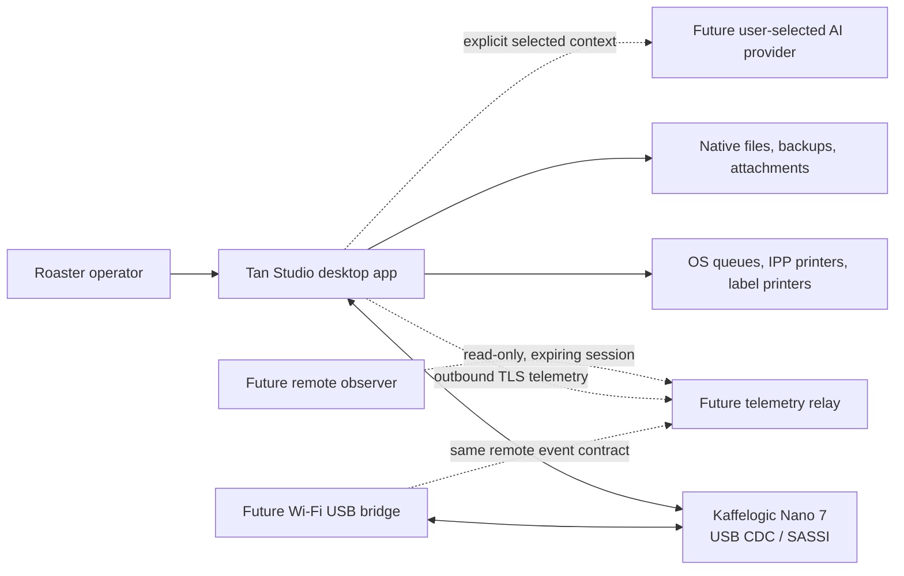
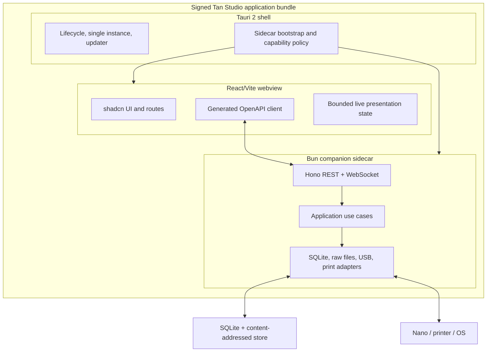
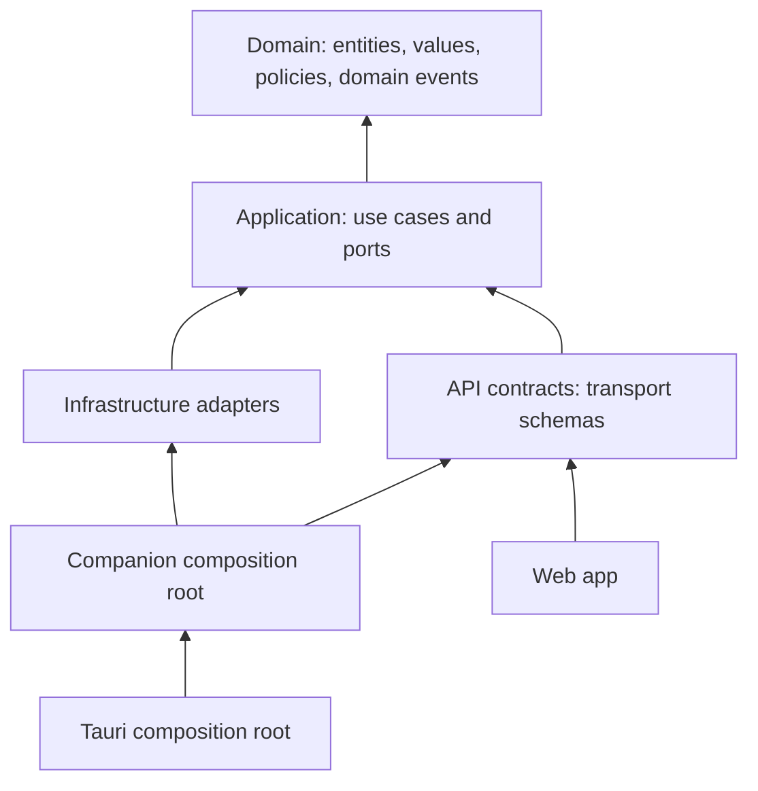
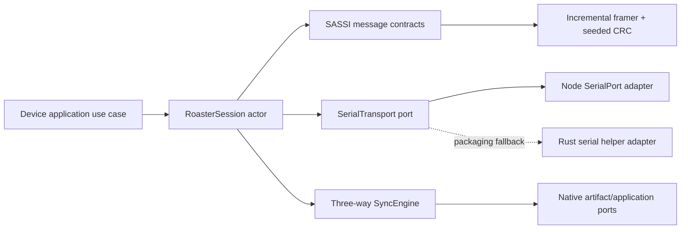
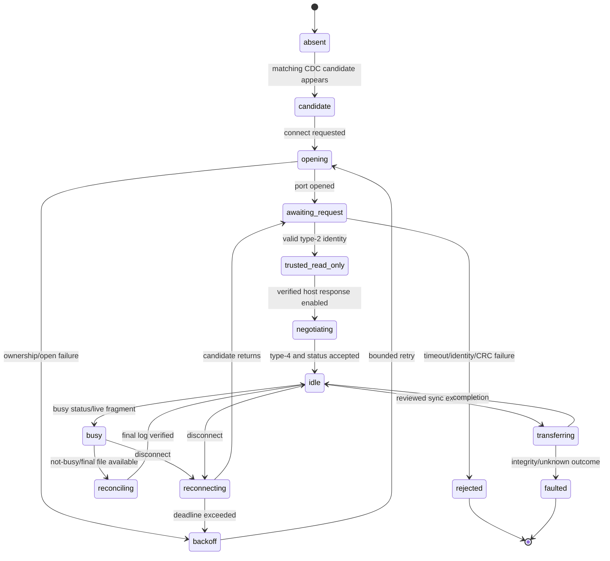
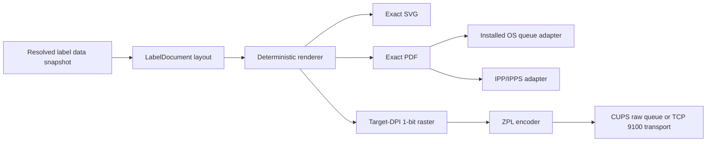
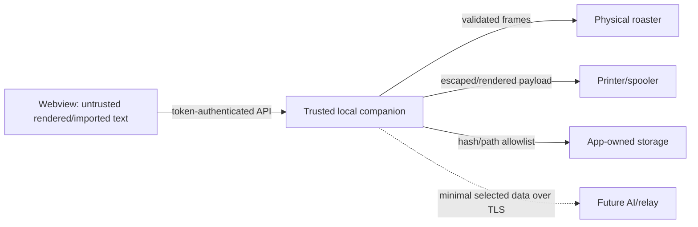

# Tan Studio technical specification

Status: **normative engineering specification**
Version: 1.0
Date: 18 July 2026
Product: **Tan Studio**
Primary release target: macOS, local-first, single user
Product baseline: [PRD](03-product-requirements-document.md)
Protocol baseline: [USB protocol and native formats](02-usb-protocol-and-file-formats.md)
Visual baseline: [editable Excalidraw board](../mockups/kaffelogic-modern-studio.excalidraw)

## 1. Purpose and authority

This document defines how Tan Studio is to be implemented. It turns the product requirements into process boundaries, modules, ports, persistence contracts, APIs, state machines, packaging rules, security controls, and release gates. An engineer should be able to create the repository structure and implement a vertical slice without making an architectural choice that is not settled here.

The words **must**, **must not**, **should**, and **may** are normative. When documents appear to disagree, use this order of authority:

1. Safety and observed wire/file facts in the protocol specification.
2. Architecture, interfaces, storage, deployment, and testing decisions in this specification.
3. User behavior, priority, and acceptance requirements in the PRD.
4. Layout and visual intent in the Excalidraw board.
5. Historical behavior in the current-product discovery.

An implementation discovery that contradicts an observed protocol fact must stop the affected write path, preserve the evidence, and update the protocol specification before code is changed to match the new behavior.

### 1.1 Release boundary

The first dependable release comprises PRD Phases 0 through 2:

- Lossless `.kpro`/`.klog` import and export foundations.
- Catalog, inventory, roast history, tasting, planning, label, backup, and restore workflows.
- Signed Tauri desktop packaging, USB discovery, read-only status, safe synchronization, live monitoring, final-log reconciliation, and explicitly validated profile deployment.

AI proposals, internet remote monitoring, the official LAN bridge, broad printer-language support, firmware maintenance, and the future Wi-Fi USB bridge use ports defined here but are not production-v1 dependencies.

### 1.2 Settled decisions

| Area | Decision |
| --- | --- |
| Product name | Tan Studio |
| Application shape | Tauri 2 shell + React/Vite frontend + Bun companion sidecar |
| First platform | Signed and notarized macOS app; Windows/Linux follow through the same ports |
| Local ownership | One user and one database per OS account; one companion process owns a database and roaster port |
| API | Hono REST `/api/v1` + one ordered WebSocket `/api/v1/events`; OpenAPI 3.1 is the contract source |
| Persistence | SQLite through `bun:sqlite` and Drizzle; immutable content-addressed raw store |
| Frontend | React 19, Vite 8, strict TypeScript, TanStack Router/Query/Table/Virtual, Zustand 5, ECharts 6 |
| Design system | shadcn `base-nova`, Base UI, Tailwind CSS v4, semantic OKLCH tokens |
| USB | Node SerialPort adapter first; pure TypeScript SASSI codec; Rust serial-helper fallback only if packaging gate fails |
| Printing | Exact PDF/SVG, installed OS queues, direct IPP/IPPS, then ZPL; Zebra ZD421-class 203/300 DPI is the first HIL target |
| Inventory | Canonical signed integer milligrams; display conversion happens at boundaries |
| Money | Optional reference metadata in integer minor currency units; no costing/accounting engine in v1 |
| AI and remote | Provider-neutral ports now; user-approved AI proposals and outbound read-only relay later |

## 2. System context and runtime topology

### 2.1 Context



The roaster remains authoritative for autonomous roast control. Tan Studio observes, records, synchronizes, and performs only capability-gated writes. The application never offers remote roast start.

### 2.2 Containers and processes



#### Tauri shell

The shell must:

- Enforce one application instance for the active OS user.
- Resolve versioned application-data and signed-resource paths.
- Start the companion, read exactly one bootstrap record from protected stdout, and stop it on application exit.
- Inject the companion origin and launch token into a read-only in-memory webview bootstrap object before React starts.
- Apply Tauri capabilities and a restrictive content security policy.
- Own signed updater behavior and, later, OS-keychain access.

The shell must not contain product use cases, parse native files, interpret SASSI, query domain tables, or render labels.

#### Bun companion

The companion must be the sole owner of:

- The active SQLite connection pool and write transaction queue.
- Raw, derived, attachment, backup, inbox, and diagnostic files.
- USB serial ports and printer transports.
- Domain/application services and durable jobs.
- The authenticated loopback HTTP and WebSocket server.

There is no separately installed daemon. Closing the desktop app gracefully stops the companion after active writes are flushed. During an active roast, closing requires an explicit warning; if termination still occurs, the durable live inbox allows reconciliation after restart.

#### React frontend

The frontend may know API contracts, view models, routes, and presentation state. It must not import Tauri APIs, Node/Bun modules, SQLite libraries, file parsers, printer encoders, SerialPort, or SASSI code. Production and development use the same HTTP/WebSocket interface.

### 2.3 Startup and shutdown

```mermaid
sequenceDiagram
    participant T as Tauri shell
    participant C as Bun companion
    participant W as React webview
    participant D as SQLite/device services

    T->>C: spawn with resource root and app-data root
    C->>C: bind 127.0.0.1:0; generate 256-bit launch token
    C->>D: lock database; migrate; recover jobs/inbox
    C-->>T: one JSON bootstrap line on protected stdout
    T->>W: inject immutable {origin, token, buildVersion}
    W->>C: GET /api/v1/system/bootstrap with Bearer token
    C-->>W: capabilities, schema/API versions, session id
    W->>C: POST /api/v1/event-tickets
    W->>C: WebSocket with one-time ticket subprotocol
    C-->>W: snapshot then ordered deltas
    T->>C: graceful shutdown signal
    C->>D: stop discovery, checkpoint, flush logs, release locks
    C-->>T: exit status
```

Startup fails closed if migrations, database locking, application-data permissions, or launch-token initialization fail. A failure UI may show diagnostics and restore options, but must not silently create a new database over an unreadable existing path.

The companion bootstrap record is:

```ts
type CompanionBootstrap = {
  protocolVersion: 1
  origin: `http://127.0.0.1:${number}`
  launchToken: string // 32 random bytes, base64url without padding
  companionPid: number
  buildVersion: string
}
```

The record must be consumed by the Tauri parent and must never be copied to normal logs. Any additional stdout before or after the record is a packaging-test failure; structured companion logs go to a dedicated rotating file sink.

## 3. Clean Architecture and repository structure

### 3.1 Dependency rule



- `domain` depends only on the TypeScript standard library and small, runtime-neutral value helpers.
- `application` depends on `domain` and defines every outbound port.
- Transport contracts may map to application commands/results but must not leak Hono, SQLite, serial, or printer types inward.
- Infrastructure adapters depend inward and translate external failures into application error categories.
- Composition roots construct concrete adapters explicitly. A reflective dependency-injection container is prohibited.
- Cross-module communication uses application interfaces or typed domain events, never another module's database implementation.
- CI must reject forbidden imports with dependency-cruiser or an equivalent static boundary test.

### 3.2 Bun workspace

The repository will use Bun workspaces with this target structure:

```text
apps/
├── web/                    # React/Vite routes and feature composition
├── companion/              # Hono server, adapters, jobs, composition root
└── desktop/                # Tauri 2 Rust shell and packaging
packages/
├── domain/                 # Pure domain model and policies
├── application/            # Use cases, ports, commands, results
├── api-contract/           # Zod/OpenAPI schemas and event envelopes
├── api-client/             # Generated client; never hand-edited
├── device-sassi/           # Pure incremental framing/CRC/session messages
├── native-formats/         # Lossless kpro/klog documents and mappers
├── printing/               # Label model, renderers, encoders, capability types
├── ui/                     # shadcn source components and semantic tokens
└── testkit/                # Fixtures, fake clocks, ports, builders, matchers
```

Infrastructure implementations live under `apps/companion/src/adapters`; they are not published as general-purpose packages until a second composition root needs them. This avoids a package-per-class structure while keeping boundaries testable.

### 3.3 Code and contract rules

- TypeScript uses `strict`, `noUncheckedIndexedAccess`, `exactOptionalPropertyTypes`, and `useUnknownInCatchVariables`.
- `any`, unchecked type assertions, and unvalidated JSON are prohibited at external boundaries.
- Zod validates HTTP, WebSocket, persisted JSON, printer capability responses, file-plugin results, and future provider output.
- Domain functions accept a `Clock`, `IdGenerator`, and other nondeterministic behavior through ports.
- Public commands are immutable data; use cases return discriminated results or throw only documented application errors.
- Every mutation carries a correlation ID; retriable externally initiated mutations additionally carry an idempotency key.
- Long-running or cancellable work is a durable `Job`, not an HTTP request held open.

## 4. Cross-module domain conventions

### 4.1 Identifiers, time, units, and revisions

```ts
type UuidV7<T extends string> = string & { readonly __entity: T }
type InstantMs = number & { readonly __unit: "unix-ms" }
type DurationMs = number & { readonly __unit: "ms" }
type MassMg = number & { readonly __unit: "mg" }
type TemperatureMilliC = number & { readonly __unit: "milli-celsius" }
type BasisPoints = number & { readonly __unit: "basis-points" }
type Revision = number & { readonly __kind: "revision" }
```

- Entity IDs are lowercase canonical UUIDv7 strings generated by the application.
- Instants are signed 64-bit Unix epoch milliseconds in persistence and ISO 8601 strings in JSON.
- User-entered civil times also store an IANA timezone such as `America/Los_Angeles`; ambiguous DST input requires explicit offset selection.
- Mass persists as signed 64-bit integer milligrams. UI accepts grams, kilograms, ounces, and pounds and converts with an explicit rounding preview.
- Temperatures persist as integer milli-degrees Celsius. Fahrenheit is presentation only.
- Percentages persist as integer basis points; roast level persists as thousandths of one level.
- Monetary reference values persist as integer minor units with an ISO 4217 currency code. They are never combined into inventory valuation in v1.
- Every editable aggregate has an integer `revision`, incremented by one in the same transaction as its mutation. Immutable revisions never update in place.

JavaScript numbers are safe for the expected domain ranges, but database adapters must reject values outside `Number.MAX_SAFE_INTEGER` and bind integer columns without floating-point conversion.

### 4.2 Domain events and durable dispatch

Domain events use past-tense names such as `catalog.greenLotReceived.v1`. Each event is persisted to `domain_events` in the same SQLite transaction as the aggregate change. An in-process dispatcher consumes committed events, updates projections, and marks delivery per consumer. No external message broker is required.

```ts
type DomainEvent<TType extends string, TPayload> = {
  eventId: UuidV7<"DomainEvent">
  type: TType
  schemaVersion: 1
  aggregateId: string
  aggregateRevision: number
  occurredAt: string
  correlationId: string
  causationId?: string
  payload: TPayload
}
```

Consumers must be idempotent by `(eventId, consumerName)`. WebSocket notifications are presentation events derived after commit, never the transaction mechanism itself. Durable jobs and projections catch up after restart before the companion reports `ready`.

### 4.3 Application errors

Application errors are limited to these stable categories:

- `validation`: input or deterministic domain rule failure.
- `not_found`: resolved target no longer exists.
- `conflict`: revision, idempotency, ownership, or sync conflict.
- `capability_denied`: operation is unsupported or outside the granted capability.
- `resource_busy`: database, serial port, printer, or device is temporarily owned/busy.
- `external_unavailable`: device, printer, filesystem, relay, or provider unavailable.
- `integrity_failure`: checksum, parse, database, backup, or protocol validation failed.
- `unsafe_target`: target identity changed or a path/command failed safety resolution.
- `internal`: unexpected defect; safe user message plus correlation ID.

Adapters must retain the original error as a redacted cause for diagnostics without exposing paths, secrets, serials, or imported untrusted content to the UI.

## 5. Bounded modules

### 5.1 Catalog and green inventory

**Responsibilities:** providers, reusable coffee identities, purchases, purchase lines, physical green lots, immutable stock transactions, archive state, and lineage navigation.

**Use cases:** create/update/archive provider and coffee; record acquisition; split purchase line into lots; receive, adjust, transfer, or write off stock; link/relink a roast with an audit reason; query stock and history.

**Invariants:** a lot belongs to exactly one purchase line and coffee identity; balance is the sum of signed transactions; a finalized roast can create at most one consumption transaction; green input, roasted yield, and package net mass are distinct; an imported roast may remain uncataloged.

**Ports:** `CatalogRepository`, `InventoryLedgerRepository`, `RoastLineageReader`, `UnitConversionPolicy`, `AuditPort`.

**Events:** `providerCreated`, `coffeeIdentityCreated`, `greenLotReceived`, `inventoryAdjusted`, `roastLineageChanged`.

**Failure behavior:** insufficient stock is a warning until confirmation; a permitted negative adjustment requires a reason. Retried finalization returns the existing consumption. This module must not parse `.klog`, read samples, or talk to a roaster.

### 5.2 Roast sessions and telemetry

**Responsibilities:** logical roast identity, provisional sessions, final logs, telemetry stream descriptors, native/app events, result metadata, annotations, and reconciliation.

**Use cases:** observe busy transition; open provisional session; append validated sample batches; add/edit app annotations; record native event intent; reconcile final log; finalize inventory consumption; retrieve chart data.

**Invariants:** raw samples are append-only; an elapsed timestamp never silently overwrites another sample; gaps are explicit; imported bytes remain immutable; finalization is idempotent; final native evidence wins only after differences are recorded.

**Ports:** `RoastRepository`, `SampleStreamStore`, `NativeFileStore`, `InventoryConsumptionPort`, `DeviceEventPort`, `AttachmentStore`, `Clock`.

**Events:** `roastObserved`, `sampleBatchReceived`, `roastEventRecorded`, `annotationAdded`, `finalLogReconciled`, `roastFinalized`.

**Failure behavior:** a cable loss marks the stream stale without inferring roast completion. If the database is unavailable, complete incoming native fragments go to the recoverable inbox. This module must not open serial ports or issue raw protocol messages.

### 5.3 Profiles and revisions

**Responsibilities:** logical profile families, immutable revisions, parent graph, curves, metadata, compatibility, deterministic validation, semantic diff, and deployment intent.

**Use cases:** import profile; branch revision; edit curve/settings; validate for target; compare revisions; extract from roast; deploy validated revision; revert by creating a successor revision.

**Invariants:** published revisions are immutable; every revision retains its source and parent links; deployment always resolves a current device identity and compatibility report; AI output is never a deployed profile directly.

**Ports:** `ProfileRepository`, `NativeProfileCodec`, `ProfileValidator`, `DeviceProfileDeploymentPort`, `AuditPort`.

**Events:** `profileImported`, `profileRevisionCreated`, `profileValidated`, `profileDeploymentRequested`, `profileDeployed`.

**Failure behavior:** validation returns field/curve locations and blocks deployment; unknown native fields survive a supported edit. This module must not know SerialPort, SASSI frames, or UI curve-library types.

### 5.4 Tastings, conclusions, and next-roast plans

**Responsibilities:** multiple tastings over rest time, score scales, descriptors, brew context, promoted conclusion, evidence links, and versioned next-roast plans.

**Use cases:** record/revise tasting; promote a conclusion; compare rest ages; create/supersede/cancel plan; cite roast/tasting evidence; mark a plan used by one roast.

**Invariants:** earlier tastings are never overwritten; promotion is a pointer; used plans are immutable and have at most one executed roast; a successor supersedes rather than edits a used plan.

**Ports:** `TastingRepository`, `PlanRepository`, `RoastEvidenceReader`, `Clock`.

**Events:** `tastingRecorded`, `conclusionPromoted`, `nextRoastPlanCreated`, `nextRoastPlanSuperseded`, `nextRoastPlanUsed`.

**Failure behavior:** missing evidence remains a visible broken reference only if its source was explicitly removed; ordinary catalog archival never removes it. This module has no AI-provider or device dependency.

### 5.5 Device discovery, protocol, and synchronization

**Responsibilities:** candidate enumeration, trusted identity negotiation, connection lifecycle, capability boundaries, status, remote filesystem inventory, sync planning, transfers, conflicts, and live fragment delivery.

**Use cases:** discover; connect read-only; read status; plan sync; execute approved sync; pull/push a named file; record a validated event; reconnect; reconcile device/local/base versions.

**Invariants:** one owner and one response-bearing request at a time; VID/PID is candidate discovery, not identity; target identity is rechecked before writes; normal sync pauses while busy; conflicts preserve both versions; destructive actions are separate services.

**Ports:** `SerialTransport`, `RoasterProtocol`, `DeviceRegistry`, `SyncLedger`, `NativeFileStore`, `DeviceClock`, `DeviceAuditPort`.

**Events:** `deviceCandidateFound`, `deviceTrusted`, `deviceSessionChanged`, `deviceBusyChanged`, `syncPlanned`, `syncConflictDetected`, `syncCompleted`, `liveFragmentReceived`.

**Failure behavior:** malformed/invalid frames terminate trust and retain redacted diagnostics; timeouts close the current request and enter backoff; the application never guesses an ACK or repeats a non-idempotent write. This module never updates catalog or profile tables directly.

### 5.6 Native file parsing and export

**Responsibilities:** sniffing, lossless syntax trees, validation, semantic mapping, supported edits, serialization, provenance, and format diagnostics.

**Use cases:** import bytes; inspect raw/semantic views; create a derived native revision; export; compare semantic versions; rebuild parsed records from originals.

**Invariants:** original bytes are immutable and content addressed; unedited serialization is byte-identical; unknown keys/channels and duplicate/order information survive; unsupported encrypted content is pass-through only.

**Ports:** `NativeFormatPlugin`, `RawArtifactStore`, `NativeFileRepository`, `ParserRegistry`.

**Events:** `nativeFileImported`, `nativeFileRejected`, `nativeRevisionCreated`, `nativeFileExported`.

**Failure behavior:** parse errors are structured with spans and do not discard the raw artifact. This module must not trust paths contained in imported data or deserialize pickle.

### 5.7 Labels, printers, and print jobs

**Responsibilities:** physical label documents/templates, deterministic rendering, capability discovery, queueing, encoding, submission, status fidelity, cancellation, receipts, and reprints.

**Use cases:** compose preview; render exact artifact; discover/configure printer; submit/cancel/watch job; export PDF; reprint immutable payload; calibrate media offsets.

**Invariants:** canonical layout uses physical units; rendering is separate from language encoding and transport; status never overclaims physical printing; user content cannot escape into commands; every job retains its artifact and capability snapshot.

**Ports:** `LabelRenderer`, `PrinterDiscoveryPort`, `PrintSubmissionPort`, `PrinterLanguageEncoder`, `RawPrinterTransport`, `PrintArtifactStore`.

**Events:** `labelRendered`, `printJobSubmitted`, `printJobStatusChanged`, `printJobCancelled`.

**Failure behavior:** a missing printer keeps a retryable draft and exact PDF fallback. This module must not query roast/catalog tables; application composition provides a resolved label data snapshot.

### 5.8 Search, library views, and reporting

**Responsibilities:** denormalized roast-library projection, compound filters, facets, grouping, stable multi-sort, saved views, cursor pagination, and asynchronous complete-result exports.

**Use cases:** query library; compute facets/aggregates; save/duplicate/share view definition; export current result; rebuild/verify projection.

**Invariants:** list queries never hydrate telemetry arrays; identical definitions produce deterministic results; all sorts end with a stable `id` tiebreaker; cursor encodes the complete sort tuple.

**Ports:** `RoastLibraryReadModel`, `SavedViewRepository`, `ExportJobPort`, `ProjectionCheckpointStore`.

**Events:** `savedViewChanged`, `roastLibraryProjectionUpdated`, `reportExported`.

**Failure behavior:** cancellation prevents an older query from replacing a newer one; a stale projection is reported and rebuilt without changing authoritative entities.

### 5.9 Backup, restore, import inbox, and diagnostics

**Responsibilities:** consistent backups, manifests/checksums, retention, staged restore, raw index rebuild, crash inbox recovery, and redacted diagnostic bundles.

**Use cases:** create/verify backup; schedule retention; preview and activate restore; rebuild derived state; recover incomplete live fragments; export diagnostics after preview.

**Invariants:** backup success requires full hash verification; last verified backup is never pruned after failure; restore never mutates the active store until staging passes integrity checks; secrets are excluded.

**Ports:** `DatabaseSnapshotPort`, `ArchivePort`, `IntegrityCheckPort`, `SecretClassifier`, `DiagnosticLogPort`.

**Events:** `backupCompleted`, `backupFailed`, `restoreActivated`, `inboxRecovered`, `diagnosticBundleCreated`.

**Failure behavior:** failed artifacts remain marked incomplete and the previous verified state remains active. This module cannot invent missing raw evidence.

### 5.10 Settings and capability discovery

**Responsibilities:** user preferences, units, accessibility, notification policy, feature availability, adapter status, and device/printer capability summaries.

**Use cases:** read/patch settings; reset a section; inspect effective capabilities; subscribe to availability changes.

**Invariants:** settings have typed defaults and schema versions; capability is derived from compiled feature, configured adapter, permission, and live target support; secrets are references, not values.

**Ports:** `SettingsRepository`, `CapabilityProvider`, `SecretReferenceStore`.

**Events:** `settingsChanged`, `capabilitiesChanged`.

**Failure behavior:** invalid settings fall back only to the documented field default and emit a diagnostic; an unavailable adapter disables its actions rather than hiding data.

### 5.11 Future AI proposal service

**Responsibilities:** selected-context assembly, transmission preview, provider-neutral structured generation, validation, evidence citation, and user decisions.

**Ports:** `AiProvider`, `ProposalRepository`, `ProfileValidator`, `EvidenceReader`, `SecretStore`.

**Invariants:** provider output is untrusted; only schema-valid bounded proposals are stored; acceptance creates a local profile revision; no AI port can receive a device command capability.

**Failure behavior:** provider/network failure leaves local workflows unchanged. Prompt injection inside notes is treated as data. The module ships disabled until a provider adapter and privacy review pass.

### 5.12 Future remote-monitoring relay

**Responsibilities:** explicit session creation, outbound telemetry publication, scoped viewer authentication, expiry/revocation, catch-up, and viewer audit.

**Ports:** `TelemetryRelayPort`, `RemoteSessionRepository`, `RemoteTokenIssuer`, `SecretStore`.

**Invariants:** telemetry only; outbound TLS only; no local API or TCP 9056 exposure; no device-write command type exists in the remote schema; local capture continues offline.

**Failure behavior:** relay loss marks viewers disconnected and queues only bounded catch-up summaries. The module ships disabled until hosting, account, and retention decisions are approved.

## 6. Persistence and filesystem specification

### 6.1 Application-data layout

Tauri resolves the platform application-data directory. The companion receives the resolved absolute path; it must not derive it from the current working directory.

```text
Tan Studio/
├── database/
│   └── tan-studio.sqlite
├── raw/
│   └── sha256/ab/<64-char-hash>.bin
├── derived/
│   └── series/ab/<source-hash>.arrow
├── attachments/
│   └── sha256/ab/<64-char-hash>.bin
├── inbox/
│   └── live/<session-id>.part
├── backups/
│   └── <utc-timestamp>-<backup-id>/
├── diagnostics/
│   └── logs/
└── locks/
    └── companion.lock
```

- `raw` and `attachments` are immutable and content addressed.
- `derived` is disposable and rebuildable.
- `inbox` may contain incomplete but recoverable evidence and is never included as a successful native import until parsed.
- `backups` are user-visible, verified artifacts.
- `diagnostics` is bounded and excluded from backups by default.
- No credential, launch token, remote token, or AI key may be stored anywhere in this tree.

Artifact writes use a sibling random temporary file, restrictive permissions, a complete write loop, file flush, atomic rename, and parent-directory flush where supported. Existing hashes are verified before reuse. Paths from native files, printers, API requests, or backups are never concatenated directly into filesystem targets.

### 6.2 SQLite configuration and ownership

The companion owns one read/write `bun:sqlite` database and a small bounded set of read-only connections. At open it must execute and verify:

```sql
PRAGMA journal_mode = WAL;
PRAGMA foreign_keys = ON;
PRAGMA busy_timeout = 5000;
PRAGMA synchronous = NORMAL;
PRAGMA temp_store = MEMORY;
PRAGMA trusted_schema = OFF;
```

`foreign_keys`, `journal_mode`, and `trusted_schema` are release assertions, not best-effort hints. Migrations and restore verification use `synchronous = FULL`. A single application `UnitOfWork` queue serializes write transactions; HTTP handlers and event consumers may not call `BEGIN` independently.

All tables use `snake_case`. IDs are `TEXT`; instants and domain quantities are `INTEGER`; booleans are constrained `INTEGER` values `0` or `1`; enumerations are constrained text; validated JSON uses canonical UTF-8 JSON text. SQLite `REAL` is allowed only for raw telemetry samples and derived statistical values, never inventory, money, timestamps, revisions, or percentages.

### 6.3 Schema catalog

Every mutable entity has `created_at_ms`, `updated_at_ms`, and `revision`. Optional archival uses `archived_at_ms`; rows are not hard-deleted while referenced. The following field lists omit those common columns unless their behavior differs.

#### Infrastructure and audit

| Table | Required contents and constraints |
| --- | --- |
| `app_metadata` | Singleton `id=1`, application schema version, projection version, created version, last clean shutdown. |
| `schema_migrations` | Integer version primary key, name, SHA-256 of migration SQL, applied time, application version. Applied hashes never change. |
| `settings` | Key primary key, schema version, validated JSON value, revision. Secret values are prohibited. |
| `idempotency_keys` | Scope, key, request hash, result status/body reference, created/expiry time; unique `(scope,key)`. A reused key with a different request hash is a conflict. |
| `jobs` | ID, type, state, progress basis points, input/result JSON, correlation ID, cancellation flag, attempt, next-run time, error code, timestamps. |
| `job_events` | Job ID, monotonic sequence, state/progress/message code and safe parameters; unique `(job_id,sequence)`. |
| `domain_events` | Event envelope, canonical payload JSON, dispatch state; unique event ID and `(aggregate_id,aggregate_revision,type)`. |
| `domain_event_deliveries` | Event ID, consumer name/version, state, attempts, last error code; unique `(event_id,consumer_name)`. |
| `audit_entries` | Actor kind, action, target kind/ID/revision, correlation ID, safe before/after summary, occurred time. No secret or full imported text. |

#### Devices, source artifacts, and synchronization

| Table | Required contents and constraints |
| --- | --- |
| `devices` | Stable local ID, model, product family, redacted display suffix, firmware, SASSI version, capability JSON/hash, first/last seen. Real serial is encrypted via a future secret/identity adapter or represented by a keyed local fingerprint; it is not logged or exported by default. |
| `transport_endpoints` | Device ID nullable until trusted, kind (`usb`,`official_lan`,`mirror`,`future_bridge`), stable adapter key, safe display label, last seen, availability. OS path/URI is adapter-private metadata excluded from ordinary exports. |
| `device_sync_entries` | Device ID, normalized remote path, common-base/local/remote artifact hashes and mtimes, state, last verified time; unique `(device_id,remote_path)`. |
| `native_files` | Artifact hash primary key, byte length, media/format kind, schema hint, parser ID/version, parse state, warnings JSON, provenance kind, imported time. |
| `native_file_revisions` | Revision ID, native-file hash, parent revision nullable, edit-set JSON, semantic hash, created reason. The artifact remains immutable. |
| `native_document_links` | Native revision ID, owner kind/ID, role (`original`,`current`,`provisional`,`export`); unique current role per owner enforced transactionally. |

#### Catalog and inventory

| Table | Required contents and constraints |
| --- | --- |
| `providers` | ID, display name, normalized name, reference/contact metadata JSON, notes, archive state. |
| `provider_aliases` | Provider ID, alias, normalized alias; unique normalized alias per provider. |
| `coffee_identities` | ID, display/normalized name, ISO country code nullable, region, producer/farm, station/cooperative, process, varieties JSON, altitude min/max metres, harvest label, certifications JSON, notes. |
| `green_purchases` | ID, provider ID, purchased/received instants and source timezone, supplier reference, optional ISO currency/total minor units, notes. |
| `purchase_lines` | ID, purchase ID, coffee ID, ordered/received mass mg, optional cost minor units, notes. Quantities are nonnegative. |
| `green_lots` | ID, purchase-line ID, supplier/internal codes, received mass mg, received time/timezone, storage note/location, green measurements JSON, state (`active`,`depleted`,`archived`). |
| `inventory_transactions` | ID, lot ID, kind (`receipt`,`roast_consumption`,`adjustment`,`transfer_in`,`transfer_out`,`write_off`), signed delta mg, occurred time, reason, source roast nullable, idempotency key. A partial unique index permits one `roast_consumption` per roast. |

Lot balance is calculated from the ledger, with an optional transactionally maintained balance projection. The received mass on a lot is descriptive evidence; it does not replace the receipt transaction.

#### Profiles, roasts, and telemetry

| Table | Required contents and constraints |
| --- | --- |
| `profiles` | ID, display/normalized name, family, origin (`official`,`imported`,`user`,`extracted`), archive state. |
| `profile_revisions` | ID, profile ID, revision number, schema version, short name, semantic document JSON, source native revision/proposal/roast nullable, validation state/report, immutable created time; unique `(profile_id,revision_number)`. |
| `profile_revision_parents` | Revision ID, parent revision ID, position; unique pair. Supports merge history without overwriting. |
| `roasts` | ID, green lot nullable, contextual coffee ID nullable, profile revision nullable, current native revision nullable, device nullable, roasted instant/timezone, level thousandths, development basis points nullable, green input/roasted yield mg nullable, end reason, result/status, promoted tasting nullable, executed plan nullable, finalization key. |
| `roast_sample_streams` | Roast ID primary key, source native-file hash, channel schema JSON, row count, first/last elapsed ms, cache encoding/version/path/hash nullable, reconciliation state. |
| `roast_events` | ID, roast ID, event kind, elapsed ms, temperature milli-C nullable, source (`native`,`device`,`user`,`derived`), source native revision nullable, supersedes nullable, deleted flag. |
| `annotations` | ID, roast ID, anchor kind (`elapsed`,`temperature`,`sample`,`roast`), anchor values, type, text, tags JSON, created/updated provenance. |
| `attachments` | Hash primary key, byte length, media type, original-name hint, created time. |
| `annotation_attachments` | Annotation ID, attachment hash, caption/order; unique pair. |

Telemetry values are not expanded into the roast-library tables. On import, the parser writes one standard Apache Arrow IPC file per reconciled sample stream using typed columns in native channel order. `roast_sample_streams` records its schema and hash. The Arrow cache is a derived optimization: a missing, outdated, or corrupt cache is rebuilt from the immutable `.klog`; it is excluded from portable backups. During a live roast, parsed rows remain in a bounded memory buffer while complete source fragments are appended to the durable inbox. The provisional Arrow cache is replaced only after final reconciliation.

#### Tasting and planning

| Table | Required contents and constraints |
| --- | --- |
| `tastings` | ID, roast ID, immutable revision lineage/supersedes nullable, tasted time/timezone, rest age ms, scale ID, score basis points nullable, brew context JSON, component scores JSON, notes, conclusion, author label. |
| `tasting_descriptors` | Tasting ID, normalized descriptor, display descriptor, polarity/intensity nullable; unique `(tasting_id,normalized_descriptor)`. |
| `next_roast_plans` | ID, coffee ID, optional lot ID, objective, proposed settings JSON, status (`draft`,`active`,`used`,`superseded`,`cancelled`), supersedes nullable, executed roast nullable. Partial unique constraints ensure at most one executed roast and one active plan per chosen scope. |
| `plan_evidence` | Plan ID, roast ID, optional tasting/event/annotation ID, evidence note; unique logical citation. |

#### Search and saved views

| Table | Required contents and constraints |
| --- | --- |
| `saved_roast_views` | ID, name, portable schema-versioned view definition JSON, built-in flag, revision. |
| `roast_library_rows` | Roast ID primary key plus denormalized provider, purchase, lot, coffee, origin, process, profile, roast, latest promoted tasting, inventory, plan, tag, and display fields. It contains no sample arrays. |
| `projection_checkpoints` | Projection name/version, last event ID/time, row count, verification hash. |
| `roast_library_fts` | FTS5 external-content table over normalized coffee/provider/farm/process/tags/roast notes/tasting descriptors/conclusion/plan rationale. |

#### Labels and printing

| Table | Required contents and constraints |
| --- | --- |
| `label_templates` | Logical template ID, name, archive state. |
| `label_template_revisions` | Template ID/revision, physical width/height micrometres, schema-versioned `LabelDocument` JSON, immutable created time. |
| `printers` | Local ID, stable adapter key, display name, adapter kind, URI/queue reference, configured media/calibration JSON, last seen. Sensitive credentials remain secret references. |
| `printer_capability_snapshots` | ID, printer ID, discovered time, source/provenance, normalized capability JSON/hash, raw safe summary, expiry. |
| `print_jobs` | ID, label-template revision, resolved label-data snapshot, artifact hash/media type, width/height/DPI, printer/capability snapshot nullable, adapter/encoder versions, copies, state, status fidelity, submitted/completed times, reprint-of nullable, idempotency key. |
| `print_job_events` | Job ID, sequence, status, fidelity, adapter code, safe message, occurred time; unique `(job_id,sequence)`. |

Future `ai_proposals`, `remote_sessions`, and `remote_viewer_audit` tables are introduced only with their features; migrations must not create tables that imply enabled cloud behavior in v1.

### 6.4 Index and projection requirements

At minimum, migrations create:

- An index for every foreign key.
- `roasts(roasted_at_ms DESC,id DESC)` and `(green_lot_id,roasted_at_ms DESC,id DESC)`.
- `tastings(roast_id,tasted_at_ms DESC,id DESC)` and `(score_basis_points,id)`.
- `inventory_transactions(green_lot_id,occurred_at_ms,id)`.
- `next_roast_plans(coffee_id,status,created_at_ms DESC,id)`.
- `profile_revisions(profile_id,revision_number DESC)`.
- `jobs(state,next_run_at_ms,created_at_ms)`.
- `device_sync_entries(device_id,state,remote_path)`.
- Query-specific composite indexes for every built-in roast view and documented facet/sort path, verified with `EXPLAIN QUERY PLAN` fixtures.

`RoastLibraryRow` is rebuilt deterministically from normalized tables. Projection consumers update it in the same writer queue after their triggering transaction commits. If the checkpoint is behind during startup, the companion catches up before reporting search ready. A full rebuild writes a shadow table, verifies row counts and a deterministic hash, then swaps it transactionally.

### 6.5 Migrations

Migrations are forward-only, numbered SQL files committed with immutable SHA-256 hashes. Startup behavior is:

1. Acquire the companion lock and open the existing database without creating a replacement over an unreadable path.
2. Run `quick_check`, confirm migration hashes, and detect pending versions.
3. When pending, create and verify a pre-migration backup.
4. Set `synchronous=FULL`, begin an immediate transaction, apply one migration, update migration metadata, and run foreign-key checks.
5. Commit each version; on failure roll it back and enter recovery mode.
6. After all versions, rebuild only projections whose version changed, run `integrity_check`, restore normal synchronous mode, and report ready.

Downgrade-in-place is unsupported. An older application presented with a newer schema stops with a clear compatibility message and offers export/backup access only through a separately tested read-only recovery tool.

### 6.6 Backup, restore, and retention

A backup is a directory or ZIP with this canonical content:

```text
tan-studio-backup/
├── manifest.json
├── database.sqlite
├── raw/sha256/...
├── attachments/sha256/...
└── exports/*.ndjson
```

The backup job pauses new domain mutations through the writer queue, persists pending inbox metadata, creates a consistent SQLite snapshot using `VACUUM INTO` in staging, resumes normal writes, copies immutable artifacts, writes NDJSON portability exports, then hashes and verifies every item. `manifest.json` records format/application/schema versions, canonical units, source timezone rules, entity counts, relationship counts, artifact hashes, excluded classes, and completion status.

Restore always targets a new staging root. It verifies archive traversal safety, size/count limits, hashes, SQLite integrity, migration compatibility, foreign keys, entity counts, raw artifact presence, and secret exclusion before acquiring the writer lock and atomically switching roots. Failure leaves the active store untouched.

Default automatic retention is seven daily and four weekly verified backups. Users can change or disable the schedule. A failed run never deletes a prior verified backup. Manual exports are not pruned automatically.

## 7. Local API specification

### 7.1 Contract source and versioning

Hono route definitions and Zod schemas generate one OpenAPI 3.1 document. The checked-in generated document is diffed in CI; `packages/api-client` is regenerated with `openapi-typescript`, `openapi-fetch`, and `openapi-react-query` and must have no manual edits.

All product routes are under `/api/v1`. Backward-compatible fields may be added within v1; removals or semantic changes require `/api/v2`. Event `type` values carry their own schema suffix. API and database versions are independent.

Requests and responses use JSON except artifact/series streaming. JSON names are `camelCase`; enums are lowercase `snake_case`; absent optional values are omitted rather than serialized as `undefined`. `null` is used only when clearing a nullable field is semantically distinct from omission.

### 7.2 Authentication and origin enforcement

- The companion binds only `127.0.0.1` on an OS-assigned port. It does not bind `0.0.0.0`, `::`, a LAN address, or a stable port.
- HTTP requires `Authorization: Bearer <launchToken>` and `X-Tan-Studio-Client: desktop-v1`.
- The server checks the exact `Host` value against its assigned loopback authority and checks `Origin` against the platform Tauri origin. Development origins are enabled only by an explicit development build flag.
- CORS reflects only the exact accepted origin and never returns `*`.
- State-changing requests require JSON content type and reject simple cross-origin form encodings.
- Responses set `Cache-Control: no-store`; sensitive response data is never placed in a URL.
- The launch token remains only in the shell, webview memory, and companion memory. It is redacted from errors and logs.

Browser WebSocket constructors cannot set `Authorization`. The client therefore requests a random, one-use, 30-second event ticket through authenticated `POST /api/v1/event-tickets`, then supplies `tan-studio.v1` and `ticket.<base64url>` as WebSocket subprotocols. The server consumes the ticket atomically and echoes only `tan-studio.v1`; it never logs the ticket. A reconnect obtains a new ticket.

### 7.3 Headers, concurrency, and idempotency

- Every response includes `X-Correlation-Id`; callers may supply a valid UUID through the same header.
- Editable single-resource responses include `ETag: "<revision>"`.
- `PATCH`, `PUT`, and destructive `DELETE` require `If-Match`; a stale revision returns `412` with the current ETag and safe conflict summary.
- Mutation requests that can be retried across reconnects require an `Idempotency-Key` UUID. The server stores the request hash and result for 24 hours, or permanently when it protects an inventory/device/print invariant.
- Reusing a key with a different request body returns `409 idempotency_key_reused`.
- `DELETE` archives ordinary catalog entities. Permanent artifact removal is a separately scoped maintenance job and is absent from v1 UI.

### 7.4 Problem Details

Errors use `application/problem+json`:

```ts
type ApiProblem = {
  type: `https://tan.studio/problems/${string}`
  title: string
  status: number
  detail: string
  instance: string
  code: string
  correlationId: string
  retryable: boolean
  retryAfterMs?: number
  fieldErrors?: Array<{
    path: string
    code: string
    message: string
  }>
  currentRevision?: number
}
```

Messages are safe for display and contain no stack, SQL, path, raw imported line, printer payload, serial, token, or provider response. HTTP mapping is stable: validation `400/422`, unauthenticated `401`, capability `403`, not found `404`, revision `412`, ownership/idempotency `409`, busy `423`, rate/backoff `429`, unavailable `503`, and unexpected `500`.

### 7.5 Resource endpoints

The following surface is normative. Nested collection creation uses the parent path; commands that are not CRUD use explicit action resources and return a job or immutable result.

#### System and jobs

| Method and path | Behavior |
| --- | --- |
| `GET /system/bootstrap` | Build/API/schema versions, current session, feature flags, adapter health, user units, recovery state. |
| `GET /system/health` | Shallow liveness; no private device identity. |
| `GET /system/capabilities` | Effective compiled/configured/live capabilities and reasons unavailable. |
| `GET/PATCH /settings` | Read or revision-guarded patch of non-secret settings. |
| `POST /event-tickets` | Create one-use WebSocket ticket. |
| `GET /jobs/{id}` | Durable job snapshot. |
| `POST /jobs/{id}/cancellations` | Request cancellation when supported. |

#### Catalog and inventory

| Method and path | Behavior |
| --- | --- |
| `GET/POST /providers` | Cursor-list/create providers. |
| `GET/PATCH/DELETE /providers/{id}` | Read/update/archive provider. |
| `GET/POST /coffees` | Search/create coffee identities. |
| `GET/PATCH/DELETE /coffees/{id}` | Read/update/archive coffee and summary links. |
| `GET/POST /purchases` | Query/record acquisition. Creation may include lines/lots atomically. |
| `GET/PATCH /purchases/{id}` | Detail/update reference metadata. Received ledger history is immutable. |
| `GET/POST /lots` | Query/create physical lots from a purchase line. |
| `GET/PATCH /lots/{id}` | Detail/update descriptive/storage state. |
| `GET /lots/{id}/inventory` | Balance and ordered ledger. |
| `POST /lots/{id}/inventory-transactions` | Append reasoned adjustment/transfer/write-off; idempotent. |

#### Roast library, roasts, tastings, and plans

| Method and path | Behavior |
| --- | --- |
| `POST /roast-library/query` | Structured filters/group/sort/columns/aggregates plus cursor; returns rows/groups only. |
| `POST /roast-library/facets` | Facet counts under all other active filters. |
| `POST /roast-library/exports` | Starts complete-result CSV/NDJSON export job. |
| `GET/POST /saved-roast-views` | List/create portable view definitions. |
| `GET/PATCH/DELETE /saved-roast-views/{id}` | Read/update/archive a view. |
| `GET /roasts/{id}` | Full metadata and lineage without sample arrays. |
| `PATCH /roasts/{id}` | Revision-guarded catalog/result/native-edit intent. |
| `GET /roasts/{id}/series` | Arrow IPC by default or bounded JSON downsample selected by `format`; supports channel/range query. |
| `GET/POST /roasts/{id}/events` | List/add native or app event according to capability. |
| `POST /roasts/{id}/events/{eventId}/revisions` | Backdate, replace, or tombstone as a new event revision. |
| `GET/POST /roasts/{id}/annotations` | List/add anchored annotations. |
| `PATCH/DELETE /annotations/{id}` | Revision-guarded edit/archive. |
| `GET/POST /roasts/{id}/tastings` | List/add immutable tasting revision. |
| `POST /tastings/{id}/revisions` | Correct a tasting by successor revision. |
| `PUT /roasts/{id}/promoted-tasting` | Promote or clear conclusion pointer. |
| `GET/POST /coffees/{id}/next-roast-plans` | List/create plans. |
| `GET/PATCH /next-roast-plans/{id}` | Read/edit only while draft/active. |
| `POST /next-roast-plans/{id}/supersessions` | Create successor and mark old plan superseded. |

#### Profiles and native files

| Method and path | Behavior |
| --- | --- |
| `GET/POST /profiles` | Query/create logical profile. |
| `GET/PATCH /profiles/{id}` | Detail/update descriptive identity. |
| `GET/POST /profiles/{id}/revisions` | Revision history/create successor. |
| `GET /profile-revisions/{id}` | Immutable revision and source/validation. |
| `POST /profile-revisions/{id}/validations` | Deterministic validation for selected target capability. |
| `POST /profile-revisions/{id}/deployments` | Start explicit, idempotent, target-bound deployment job. |
| `POST /native-file-imports` | Bounded multipart upload; starts an import job without exposing an arbitrary local path. |
| `GET /native-files/{hash}` | Safe metadata/diagnostics, not arbitrary path access. |
| `GET /native-files/{hash}/content` | Download retained bytes after explicit user action. |
| `POST /native-file-revisions/{id}/exports` | Start serialization/export job and return a bounded artifact download when complete. |

#### Devices and synchronization

| Method and path | Behavior |
| --- | --- |
| `GET /device-candidates` | Current candidates with trust state and safe labels. |
| `GET /devices` | Trusted local devices and availability. |
| `POST /devices/{id}/connections` | Start read-only connection job. |
| `DELETE /devices/{id}/connections/current` | Gracefully disconnect. |
| `GET /devices/{id}/status` | Last status snapshot with freshness. |
| `POST /devices/{id}/sync-plans` | Compute no-write three-way plan. |
| `POST /sync-plans/{id}/executions` | Execute the exact reviewed plan; target fingerprint + idempotency required. |
| `GET /devices/{id}/files` | Safe remote inventory after trust. |

Maintenance and destructive device endpoints do not exist until their independent services and acceptance suites are approved. Hiding a UI control is not considered a security boundary.

#### Labels and printing

| Method and path | Behavior |
| --- | --- |
| `GET/POST /label-templates` | List/create template family. |
| `GET/POST /label-templates/{id}/revisions` | Read/create immutable layout revision. |
| `POST /label-renders` | Resolve a label snapshot and render preview/PDF artifact. |
| `GET /printers` | Configured/discovered printers with freshness and status fidelity. |
| `POST /printer-discoveries` | Start discovery job across enabled adapters. |
| `GET /printers/{id}/capabilities` | Normalized capability snapshot and provenance. |
| `POST /print-jobs` | Idempotently submit an existing immutable artifact. |
| `GET /print-jobs/{id}` | Job, artifact, adapter receipt, and status history. |
| `POST /print-jobs/{id}/cancellations` | Best-effort cancel with truthful outcome. |
| `POST /print-jobs/{id}/reprints` | New job referencing the immutable prior payload. |

#### Backup and diagnostics

| Method and path | Behavior |
| --- | --- |
| `POST /backups` | Start verified backup job. |
| `GET /backups` | Verified/incomplete backup inventory. |
| `POST /restore-validations` | Validate selected archive into staging without activation. |
| `POST /restores` | Activate a previously validated staged restore after confirmation. |
| `POST /projection-rebuilds` | Rebuild a named derived projection/cache. |
| `POST /diagnostic-previews` | Generate redaction manifest and preview. |
| `POST /diagnostic-bundles` | Export only an accepted preview. |

### 7.6 Query, pagination, and export contracts

Complex roast queries use a POST body so saved definitions and the API share one schema:

```ts
type RoastLibraryQuery = {
  viewVersion: 1
  filters: FilterExpression // nested and/or, typed operators, max depth 5
  groups: Array<{ field: GroupableField; direction: "asc" | "desc" }> // max 3
  sorts: Array<{ field: SortableField; direction: "asc" | "desc"; nulls: "first" | "last" }> // max 5
  columns: ColumnId[]
  aggregates: AggregateSpec[]
  page: { first: number; after?: string } // first 1..200
}
```

The server validates fields against an allowlist and compiles parameterized SQL; clients never send SQL or arbitrary column names. Every sort receives `roastId` as a final tiebreaker. The opaque cursor contains the query fingerprint, full last sort tuple, ID, issue time, and HMAC; changing the query invalidates it. Exports persist the validated definition and run against a consistent snapshot, not the currently rendered rows.

### 7.7 Durable jobs

Job states are `queued`, `running`, `waiting_external`, `cancelling`, `succeeded`, `failed`, and `cancelled`. Progress is monotonic within one attempt. On restart:

- Read-only jobs may resume from their checkpoint.
- Idempotent artifact/import/export jobs verify completed steps and resume.
- Device and print jobs move to `waiting_external` until target/status reconciliation proves whether retry is safe.
- Unknown non-idempotent outcomes become `failed` with `manual_reconciliation_required`; they are never automatically repeated.

HTTP creation returns `202 Accepted`, job representation, and `Location`. Fast deterministic validations may return `200/201` directly.

### 7.8 WebSocket event stream

```ts
type EventEnvelope<TType extends string, TPayload> = {
  schemaVersion: 1
  sessionId: string
  seq: number
  monotonicMs: number
  emittedAt: string
  type: TType
  payload: TPayload
}
```

After connection the server sends `session.snapshot.v1` containing device/session/job/notification state and the current sequence. Deltas include resource invalidations, job progress, device state, bounded live samples, and user-visible alerts. Durable API resources remain authoritative; the stream tells clients what to refetch.

- `seq` is strictly increasing per companion session.
- The server sends a heartbeat every 10 seconds; the client declares stale after 25 seconds.
- A client includes its last `(sessionId,seq)` when requesting the next ticket. The server replays from a bounded 60-second/10,000-event ring when possible; otherwise the new socket begins with a complete snapshot.
- Each client queue is bounded. Live sample batches may be coalesced; state changes, faults, and job terminal events may not be silently dropped. Overflow closes the socket with a resync-required code.
- One `live.samples.v1` batch is capped by sample count and encoded byte size. Raw serial frames never reach the webview.

The UI applies a delta only if it follows the current sequence. A gap immediately marks live state uncertain and obtains a new ticket/snapshot; it does not guess missing samples.

## 8. USB, SASSI, and device synchronization

The [protocol specification](02-usb-protocol-and-file-formats.md) is normative for wire fields and known/unknown evidence. Code must preserve that distinction: a message inferred from Studio analysis is not promoted to a verified writable operation merely because a type exists for it.

### 8.1 Adapter layering



```ts
type SerialCandidate = {
  adapterKey: string
  path: string
  vendorId?: number
  productId?: number
  manufacturer?: string
  product?: string
}

interface SerialConnection {
  readonly candidate: SerialCandidate
  readonly incoming: AsyncIterable<Uint8Array>
  write(bytes: Uint8Array, signal: AbortSignal): Promise<void>
  close(): Promise<void>
}

interface SerialTransport {
  list(signal: AbortSignal): Promise<SerialCandidate[]>
  open(candidate: SerialCandidate, options: SerialOpenOptions, signal: AbortSignal): Promise<SerialConnection>
}

interface RoasterProtocol {
  decode(chunk: Uint8Array): DecodeResult
  encode(message: OutboundSassiMessage, seed: number, elapsedMs: number): Uint8Array
  reset(): void
}
```

`SerialTransport` owns enumeration, OS open flags, requested line settings, exclusive ownership, byte delivery, bounded writes, disconnect mapping, and cleanup. It has no knowledge of Kaffelogic identity, SASSI fields, files, or commands.

The Node adapter uses the maintained `serialport` package and its binding API. It enumerates candidates but does not trust USB display strings. The macOS callout node is preferred over the paired TTY node. Numeric node suffixes are ephemeral and never become a device ID.

### 8.2 Codec requirements

`packages/device-sassi` is pure TypeScript with no OS, timing, logging, or application dependency. It must:

- Accept arbitrary chunk boundaries and emit zero, one, or many complete frames.
- Bound the pre-handshake buffer to 512 bytes and the post-handshake buffer to the advertised maximum plus 64 bytes.
- Require ASCII-compatible framing, `KL*`, decimal type, pipe fields, four hexadecimal CRC digits, and `\r` termination.
- Preserve raw bytes for a bounded, redacted diagnostic representation.
- Validate type 2 using the seed carried in that same frame.
- Use CRC-16/CCITT-XMODEM, polynomial `0x1021`, MSB first, no reflection/final XOR.
- Distinguish malformed syntax, too large, unsupported type, invalid field, and invalid CRC.
- Decode Base64 strictly and enforce decoded/chunk/sequence limits before allocation.
- Never log a type-2 serial or full frame.

The codec returns typed messages plus an evidence marker:

```ts
type ContractEvidence = "live_verified" | "static_inferred" | "unknown_passthrough"

type DecodedSassiMessage = {
  type: number
  elapsedMs: number
  fields: readonly string[]
  evidence: ContractEvidence
  parsed: KnownInboundMessage | UnknownInboundMessage
}
```

Unknown types are diagnosable but cannot trigger a use case. Invalid CRC frames are discarded from the trusted stream and counted; three consecutive integrity failures close the session.

### 8.3 Verified type-2 observation

The attached Nano 7 emitted repeated 74-byte requests without an application-level host write:

```text
KL*2|<elapsed-hex>|1|128|<serial-redacted>|1|KN1007B|kaffelogic.com||4064|192|<crc-seed>|<crc>\r
```

Platform `1`, capability value `128`, 10-byte serial position, SASSI version `1`, model `KN1007B`, empty description, limits `4064`/`192`, changing seed, and seeded CRC are verified. The meaning of capability `128`, stable retry cadence, host type-3 response, device type-4 response, status reads, transfers, and writes remain capture-dependent. A redacted captured body must never be paired with the original CRC; fixtures use a synthetic serial and recomputed CRC.

### 8.4 Session actor and state machine

One `RoasterSession` actor owns all mutable connection state. Callers send commands through a mailbox; they never invoke the transport concurrently.



- `trusted_read_only` proves device identity but does not imply a completed host handshake.
- The transition to `negotiating` remains behind a compatibility feature gate until type 3/4 is captured and fixture-tested.
- One response-bearing request may be active. The scheduler records expected response type, deadline, sequence, idempotency class, and cancellation behavior.
- Default response/ACK deadline is 10 seconds as observed in Studio. A timeout never invents success.
- Automatic retries are limited to read-only idempotent requests. File pushes and actions require outcome reconciliation or a new reviewed command.
- Reconnect uses capped exponential backoff with jitter: 250 ms, 500 ms, 1 s, 2 s, then 5 s; it stops after 60 seconds unless a live roast is believed active, in which case low-frequency discovery continues until the user disconnects.
- All state changes produce safe presentation events. The actor serial number is represented outside the adapter only by a local keyed fingerprint and redacted suffix.

### 8.5 Capability services

Application interfaces are deliberately separate:

```ts
interface DeviceReadPort {
  status(deviceId: DeviceId, signal: AbortSignal): Promise<DeviceStatus>
  listFiles(deviceId: DeviceId, path: SafeRemotePath, signal: AbortSignal): Promise<RemoteEntry[]>
  readFile(deviceId: DeviceId, path: SafeRemotePath, signal: AbortSignal): Promise<AsyncIterable<Uint8Array>>
}

interface DeviceWritePort {
  deployProfile(command: TargetBoundProfileDeployment, signal: AbortSignal): Promise<DeviceWriteReceipt>
  recordRoastEvent(command: TargetBoundRoastEvent, signal: AbortSignal): Promise<DeviceWriteReceipt>
}

interface DeviceMaintenancePort { /* disabled until independently specified */ }
interface DeviceDestructivePort { /* disabled until independently specified */ }
```

Read, write, maintenance, and destructive interfaces cannot be cast or combined into a generic `executeAction`. A target-bound write includes device fingerprint, expected session ID, expected capability hash, reviewed payload hash, idempotency key, and expiry. Any mismatch returns `unsafe_target` before bytes are encoded.

### 8.6 Three-way synchronization

The synchronization engine compares normalized remote path, common-base artifact hash, local artifact hash, and freshly read remote artifact hash. Mtime and size are hints only.

| Local vs base | Remote vs base | Plan |
| --- | --- | --- |
| same | same | no-op |
| changed | same | propose push |
| same | changed | pull/import |
| changed | changed, hashes equal | advance base |
| changed | changed, hashes differ | preserve conflict; no automatic write |
| deleted | same | propose reviewed remote delete only when that capability is enabled |
| same | deleted | retain local and mark remote missing; never infer local deletion |

A sync plan is immutable and records source inventory hashes, capacity, busy state, operation ordering, expected final hashes, and expiry. Execution re-reads identity/status/inventory and rejects a stale plan. Pulls happen before pushes; writes go to a harmless temporary name when firmware behavior supports atomic rename, otherwise the limitation is surfaced. Remote deletes are absent from the first production sync executor.

While busy, ordinary directory sync pauses. Type-32 live fragments and type-30 state continue. A final log is pulled only after not-busy and is reconciled by native log identity, elapsed samples, events, and artifact hash.

### 8.7 Live ingestion and reconciliation

The incremental parser states are `metadata`, `header`, `rows`, `provisional_complete`, and `reconciled_final`. It buffers only the partial trailing line between fragments. Each complete fragment is appended to `inbox/live/<session>.part` before parsed presentation events are emitted.

Reconciliation produces:

- Exact matches: provisional stream links to final artifact and inbox is retired.
- Additive completion: missing trailing rows/metadata are appended from the final file.
- Material mismatch: both provisional and final evidence remain linked; the final native file becomes current, and a diagnostic describes sample/event ranges without overwriting annotations.
- No final file: provisional evidence remains recoverable and the roast is marked incomplete.

UI charts distinguish received, gap, provisional, and reconciled ranges without fabricating interpolation into stored data.

### 8.8 Native-module packaging gate and fallback

Local validation established that `serialport` works under Bun 1.2.22 and its `MockBinding`, but a fully bundled executable fails because of the generated native-module wrapper. The primary package therefore compiles the companion with `serialport` externalized and places the exact locked package/native binding tree in a signed, read-only resource directory. Tauri starts the companion with that directory as its fixed module-resolution working directory.

The release gate runs on every supported OS/architecture and proves enumeration, mock open/read/write/close, real candidate listing, missing-module failure, signature integrity, and operation from a path containing spaces/non-ASCII characters.

If this gate fails on a release platform, only the `SerialTransport` adapter moves to a small Tauri-packaged Rust helper using the maintained Rust `serialport`/`tokio-serial` ecosystem. The Bun adapter exchanges length-prefixed MessagePack requests and byte events over inherited pipes. The TypeScript SASSI codec, session actor, use cases, API, and tests remain unchanged. The project must not implement a USB CDC driver, move domain logic into Rust, switch to Electron, or expose serial access to React.

## 9. Native file plugin specification

### 9.1 Plugin contract

```ts
interface NativeFormatPlugin<TDocument extends LosslessDocument = LosslessDocument> {
  readonly id: string
  readonly version: string
  sniff(input: ByteSource, signal: AbortSignal): Promise<SniffResult>
  parse(input: ByteSource, signal: AbortSignal): Promise<ParseResult<TDocument>>
  validate(document: TDocument, context: ValidationContext): ValidationResult
  toDomain(document: TDocument, context: MappingContext): ImportResult
  serialize(document: TDocument, edits: EditSet, context: SerializeContext): Promise<SerializeResult>
  capabilities(): FormatCapabilities
}
```

`ByteSource` exposes length and bounded slices/streaming; it does not expose an arbitrary path. `sniff` reads at most 64 KiB and returns confidence plus reasons. The registry refuses ambiguous automatic selection and lets the user choose among tied plugins.

### 9.2 Lossless document model

```ts
type SourceSpan = { byteStart: number; byteEnd: number; line: number; column: number }

type LosslessNode =
  | { kind: "property"; rawKey: Uint8Array; separator: Uint8Array; rawValue: Uint8Array; ending: Uint8Array; span: SourceSpan }
  | { kind: "blank"; raw: Uint8Array; span: SourceSpan }
  | { kind: "tableHeader"; cells: RawCell[]; raw: Uint8Array; span: SourceSpan }
  | { kind: "tableRow"; cells: RawCell[]; raw: Uint8Array; span: SourceSpan }
  | { kind: "incidental"; rawKey: Uint8Array; rawValue: Uint8Array; raw: Uint8Array; span: SourceSpan }
  | { kind: "unknown"; raw: Uint8Array; span: SourceSpan }

interface LosslessDocument {
  sourceHash: string
  originalBytes: Uint8Array
  encoding: "utf-8" | "utf-8-bom" | "unknown"
  lineEnding: "lf" | "crlf" | "cr" | "mixed"
  nodes: readonly LosslessNode[]
  semanticView: unknown
  diagnostics: readonly FormatDiagnostic[]
}
```

The production parser may reference immutable byte slices instead of copying every node, but observable behavior must match this contract. Semantic maps are derived and may apply documented last-wins rules; they never replace the ordered nodes.

### 9.3 Parser pipeline

1. Stream bytes into the content-addressed raw store while calculating SHA-256 and enforcing configurable file-size limits.
2. Sniff encoding/format without executing content.
3. Tokenize line endings and first-colon property boundaries into source spans.
4. Locate the `.klog` table boundary, optional offsets, header, rows, and `!` incidentals.
5. Use `csv-parse` only for validated tab/comma table-cell interpretation; the lossless scanner remains authoritative for raw bytes, duplicate cells, and spans.
6. Parse finite numeric values with explicit diagnostics. Never silently convert blank/invalid values to a real zero in the domain model.
7. Build the semantic view and deterministic validation report.
8. Map valid/partially valid evidence into domain commands in one transaction; preserve warnings and raw artifact even when mapping is rejected.
9. Build the derived Arrow sample cache after the domain commit.

The `.kpro` and `.klog` plugins implement the exact grammar and schema boundaries in the protocol specification. Generic INI libraries are prohibited because their trimming, duplicate, comment, quoting, and serialization rules are incompatible.

### 9.4 Editing and serialization

An `EditSet` addresses semantic field identity plus the source revision. The serializer changes only supported nodes, preserves untouched byte slices exactly, and reports:

- Fields changed and their original/new semantic values.
- Inserted or superseding nodes and placement.
- Required line-ending or numeric-format normalization.
- Unknown data preserved.
- Data that cannot be represented in the target format.
- Target schema/firmware validation.

With an empty edit set, output must be byte-for-byte identical. A supported native event or tasting-note edit creates a new raw artifact and `native_file_revision`; it never overwrites the imported artifact. Export to a user-selected destination is a download of that immutable result, not arbitrary server-side path writing.

### 9.5 Limits and hostile inputs

Default import limits are 64 MiB per file, 1,000 metadata properties, 256 channels, 250,000 sample rows, 1 MiB per line, 10,000 diagnostics, and a maximum nesting depth of 20 for JSON-based app formats. Limits are configurable only in an advanced local setting and are enforced before allocation. ZIP imports reject absolute paths, `..`, links, duplicate normalized paths, compression bombs, and more than 10,000 entries.

Studio `.sync_base` pickle content and legacy encrypted files are retained as opaque unsupported artifacts. They are never deserialized, decrypted with extracted secrets, or treated as trusted metadata.

## 10. Printing and labels

### 10.1 Separation of concerns



The layout model, renderer, printer-language encoder, and transport are independently testable. An adapter named after a printer model that combines all four is prohibited.

### 10.2 Canonical label document

All layout values are integer micrometres; rotation is integer millidegrees. Text content is plain Unicode and never contains printer commands.

```ts
type LabelDocument = {
  schemaVersion: 1
  widthUm: number
  heightUm: number
  bleedUm: number
  safeInsetUm: number
  background: SemanticInk
  elements: LabelElement[]
}

type LabelElement =
  | { kind: "text"; id: string; frame: PhysicalRect; text: string; font: FontRef; sizeUm: number; weight: number; align: "start" | "center" | "end"; maxLines: number; overflow: "error" | "ellipsis" }
  | { kind: "line"; id: string; from: PhysicalPoint; to: PhysicalPoint; strokeUm: number; ink: SemanticInk }
  | { kind: "rect"; id: string; frame: PhysicalRect; radiusUm: number; fill?: SemanticInk; stroke?: SemanticStroke }
  | { kind: "image"; id: string; frame: PhysicalRect; artifactHash: string; fit: "contain" | "cover" }
  | { kind: "qr"; id: string; frame: PhysicalRect; data: string; correction: "M" | "Q"; quietModules: number }
  | { kind: "barcode"; id: string; frame: PhysicalRect; symbology: "code128"; data: string; humanReadable: boolean }
```

Templates bind fields through a small declarative expression allowlist (`coffee.name`, `roast.date`, `profile.name`, and documented formatters). There is no JavaScript, HTML, CSS, network fetch, or arbitrary template execution. At render time, bindings resolve to an immutable `LabelDataSnapshot`; later catalog edits do not change a historical print job.

The QR default contains an opaque Tan Studio roast UUID or an explicit export URL chosen later. It never embeds filesystem paths, device serials, launch/remote tokens, credentials, or private notes by default.

### 10.3 Rendering implementation

`packages/printing` owns a deterministic display-list layout engine. It uses bundled, license-reviewed font files and `fontkit` metrics; no system-font substitution is allowed in release rendering. The initial font set is Geist Sans plus a Noto Sans fallback subset for required glyphs.

- SVG renderer emits exact physical dimensions and embedded/subset font data where permitted.
- PDF renderer uses `pdf-lib`, embeds the same fonts, sets the media box from micrometres, and does not add print scaling.
- Raster renderer uses `@resvg/resvg-js`/resvg for the exact SVG and `sharp` for target-DPI grayscale, threshold/dither, rotation, padding, and raw pixel extraction.
- QR generation uses a maintained QR library with fixed error correction/quiet-zone rules; barcodes use `bwip-js`. Rendered symbols are decoded in tests.
- Native rendering dependencies are subject to the same signed-resource and architecture packaging gate as SerialPort.

Text overflow, missing glyphs, content outside the media/safe box, insufficient QR module size, and unsupported images are validation errors before submission. Preview uses the exact rendered SVG or raster artifact, not a separately styled HTML approximation.

### 10.4 Printer ports and capability model

```ts
interface LabelRenderer {
  render(document: LabelDocument, target: RenderTarget, signal: AbortSignal): Promise<PrintArtifact>
}

interface PrinterDiscoveryPort {
  discover(signal: AbortSignal): Promise<PrinterDescriptor[]>
  capabilities(printerId: PrinterId, signal: AbortSignal): Promise<PrinterCapabilities>
}

interface PrintSubmissionPort {
  submit(job: PrintJob, artifact: PrintArtifact, signal: AbortSignal): Promise<PrintReceipt>
  cancel(jobId: PrintJobId, signal: AbortSignal): Promise<CancelResult>
  watch(jobId: PrintJobId, signal: AbortSignal): AsyncIterable<PrintStatusEvent>
}

interface PrinterLanguageEncoder {
  readonly language: "zpl" | "tspl2" | "brother_ql" | "escpos"
  encode(document: LabelDocument, capabilities: PrinterCapabilities): Promise<EncodedPrintPayload>
}

interface RawPrinterTransport {
  write(printer: PrinterDescriptor, payload: EncodedPrintPayload, signal: AbortSignal): Promise<TransportReceipt>
}
```

`PrinterCapabilities` records identity, adapter/URI/queue, discovery provenance/time, document formats, raw languages, media ranges/presets, gap/black-mark/continuous modes, unprintable margins, supported DPI, color depth/bit order, orientation/scaling, copies, darkness/speed, cut/peel, status operations, QR/barcodes, security mode, and status fidelity. Unknown is a first-class value. Manufacturer/model text alone never grants a language or feature.

### 10.5 Adapter strategy

1. **Exact artifact fallback:** every valid label can be downloaded as PDF/SVG without a configured printer.
2. **CUPS installed queues on macOS/Linux:** a small Tauri-packaged Rust print helper wraps the supported OpenPrinting/libcups destination, capability, submit, query, and cancel APIs. This avoids localized CLI parsing and delegates broad driver/filter compatibility to the OS. If the helper is unavailable, the UI retains PDF fallback.
3. **Direct IPP/IPPS:** the same libcups adapter performs DNS-SD discovery where available, `Get-Printer-Attributes`, and `Print-Job`. IPPS is preferred. It sends PDF only when advertised; otherwise it renders a supported PWG Raster/JPEG path. It never downgrades TLS or guesses media.
4. **ZPL:** a pure TypeScript encoder converts the canonical document to bounded ZPL, normally rasterizing user text/art to `^GFA` and using only allowlisted commands. Delivery is a configured CUPS raw queue or TCP 9100 on a user-approved local address. USB raw access is deferred to the OS queue.
5. **Later adapters:** TSPL2, Brother QL raster, and selected ESC/POS implement the same encoder/transport contracts. Vendor SDKs are optional adapters, never domain dependencies.

The print helper has a versioned MessagePack-over-inherited-pipes contract and no arbitrary command-execution operation. CUPS process fallback, if ever needed for recovery, uses `Bun.spawn` argument arrays and `--`; shell strings and interpolated commands are prohibited.

### 10.6 Status fidelity and job lifecycle

```text
draft -> rendered -> submitted -> spooled -> deviceAccepted -> physicallyConfirmed
                  \-> failed
                  \-> cancelled
```

Not every adapter can observe every state. Each event includes fidelity:

- `submitted`: Tan Studio handed bytes to an adapter.
- `spooled`: an OS/server queue accepted the job.
- `deviceAccepted`: the printer protocol accepted the job.
- `physicallyConfirmed`: the adapter received explicit completed/output evidence for that job.
- `unknown`: outcome cannot be determined after submission.

The UI says “Sent to queue” or “Accepted by printer” unless physical completion is proven. Cancellation is best effort and cannot erase a job already printed. A retry creates a new job linked through `reprintOf`; it never mutates the original receipt.

### 10.7 ZPL and printer security

- User values are never concatenated into ZPL. Text is rasterized by default; allowlisted barcode data is validated and encoded by the encoder.
- Maximum dimensions, DPI, decompressed raster bytes, copies, darkness, speed, and socket duration are bounded.
- Raw TCP is disabled until the user selects a discovered/configured local endpoint and confirms the lack of transport security.
- IPP credentials are future keychain references and never stored in printer JSON.
- Discovery is local-link only by default and does not scan arbitrary subnets.
- Artifacts and safe receipts may be retained; raw capability payloads are redacted before diagnostics.

The first HIL matrix is exact PDF, a CUPS virtual/installed queue, `ippeveprinter`, and Zebra ZD421-class printers at 203 and 300 DPI. No “supports most label printers” claim may be made until the compatibility table identifies the tested path—OS queue, IPP, or direct language—for each model.

## 11. Frontend specification

### 11.1 Stack and ownership

The initial compatibility baseline is Bun 1.2.22, React 19.2, Vite 8.1, Tailwind CSS 4.3, shadcn 4.13 `base-nova`, Base UI 1.6, TanStack Router 1.170, Query 5.101, Table 8.21, Virtual 3.14, Zustand 5.0, and ECharts 6.1. Exact versions and transitive integrity are committed in `bun.lock`; upgrades require tests and regenerated API/UI artifacts.

State has exactly one owner:

| State kind | Owner | Examples |
| --- | --- | --- |
| Durable entities and jobs | TanStack Query over local API | coffee, roasts, profiles, printer capabilities, job status |
| Navigation and shareable table definition | TanStack Router search params | selected saved view, filter/group/sort, detail ID, chart alignment mode |
| Short-lived presentation/editor state | Zustand feature stores | live ring buffer, chart hover, unsaved curve edit, label selection, pane dimensions |
| Form input and validation | React Hook Form + Zod schema adapter | provider, lot, tasting, preflight, settings forms |
| Component-local interaction | React state | open popover, focused tab, temporary disclosure |

Durable API objects must not be copied into Zustand. A Zustand draft records base entity ID/revision and only the edit delta. URL state must not be duplicated in a store. Global context is limited to stable framework providers.

### 11.2 Route map

TanStack Router uses file-based, typed routes. Loaders prefetch only data required above the fold and never telemetry unless the chart route is active.

| Route | Primary screen | API/query ownership | Transient state |
| --- | --- | --- | --- |
| `/` | Redirect by current device state | system bootstrap | none |
| `/roast` | Live command center or idle state | device status, active roast, event jobs | `liveRoastStore`, chart store |
| `/roast/preflight` | Lot/profile/level/load and prior evidence | lot, profile revision, recent roasts, active plan | validated form draft |
| `/roasts` | Virtualized roast library and detail pane | library query/facets, saved views, selected detail | selection anchor, pane size only |
| `/roasts/$roastId` | Log review, annotations, tastings | roast detail, Arrow series, events, annotations, tastings | chart viewport/hover |
| `/roasts/compare` | Up to four roast overlays | details/series for URL-selected IDs | chart alignment/display store |
| `/profiles` | Profile library | profile list/facets | selection only |
| `/profiles/$profileId/revisions/$revisionId` | Curve editor and revision history | profile/revision/validation | `profileEditorStore` delta/undo |
| `/coffees` | Coffee/provider/purchase/lot catalog | catalog search/facets | table selection |
| `/coffees/$coffeeId` | Coffee experiment timeline | identity, lots, roasts, tastings, plans | timeline disclosure |
| `/purchases/$purchaseId` | Acquisition and lot allocation | purchase detail, inventory | form draft |
| `/labels` | Templates, queue, history | templates and print jobs | selection only |
| `/labels/templates/$templateId` | Label composer | template revision, render jobs, printers | `labelEditorStore` draft |
| `/devices` | Discovery, status, sync, conflicts | candidates, devices, plans, jobs | reviewed plan selection |
| `/settings` | Units, appearance, backup, diagnostics | settings/capabilities/backups | section-local forms |

Future `/assistant` and remote viewer routes are absent from production builds until their feature packages are enabled.

### 11.3 Query keys and mutation behavior

One key factory in `packages/api-client` defines keys such as:

```ts
queryKeys.system.bootstrap()
queryKeys.roastLibrary.query(canonicalQueryHash)
queryKeys.roastLibrary.facets(canonicalQueryHash)
queryKeys.roast.detail(roastId)
queryKeys.roast.series(roastId, channelRangeHash)
queryKeys.coffee.detail(coffeeId)
queryKeys.profile.revision(revisionId)
queryKeys.device.status(deviceId)
queryKeys.job(jobId)
queryKeys.printer.capabilities(printerId, snapshotId)
```

- Generated API functions accept TanStack's `AbortSignal`; cancelled list/facet/series requests must abort SQLite work or streaming promptly.
- Resource data defaults to a 30-second stale time. Immutable revisions and content hashes use infinite stale time. Device/job data is updated by events and uses a 5-second safety refetch while visible.
- Read retries use capped 250/500 ms delays for two attempts only on unavailable/reset errors. Mutations do not automatically retry unless their generated operation is marked idempotent and already has an idempotency key.
- WebSocket resource events invalidate the narrowest key; high-frequency live samples update the live store directly and do not invalidate roast detail per sample.
- Optimistic updates are limited to reversible, non-device metadata edits. Inventory, profile deployment, sync execution, printing, and event writes render the server-confirmed result.
- Library queries retain the prior viewport while the next request is pending, visibly mark it stale, and discard responses whose canonical query hash is no longer active.

### 11.4 Zustand stores

Stores are feature-scoped vanilla stores consumed through selectors:

- `liveRoastStore`: current session ID, last sequence, bounded per-channel typed-array ring, gap ranges, latest values, freshness, event acknowledgement state. Maximum retained full-resolution live points is 20,000 per channel; older display data is downsampled while durable evidence stays in the companion.
- `chartInteractionStore`: visible series, axis/legend/grid options, viewport, cursor, comparison alignment, annotation placement. It stores IDs/coordinates, not series data.
- `profileEditorStore`: base revision/validation hash, semantic edit delta, selection, undo/redo commands capped at 200, and dirty state. Saving creates a server revision then resets the store.
- `labelEditorStore`: base template revision, element selection, layout delta, preview request version, and printer choice. Rendered artifacts remain Query data.
- `workspaceStore`: resizable pane dimensions and density. Only these safe layout preferences may use versioned local persistence.

High-frequency subscriptions use store-level transient listeners and `requestAnimationFrame` batching. Components select the smallest stable slice; the live chart is the only consumer of sample arrays.

### 11.5 ECharts adapter

Charts use `echarts/core` directly with CanvasRenderer and only required series/components. No React wrapper library owns the chart lifecycle.

`TelemetryChart`:

- Initializes one chart instance per mounted canvas and disposes it on unmount.
- Uses `ResizeObserver`, not window-size polling.
- Converts the API Arrow stream to typed column arrays in a Web Worker.
- Applies presentation-only smoothing/downsampling without changing raw arrays.
- Batches live updates to at most 10 visual commits per second with `setOption({lazyUpdate:true})` and stable series IDs.
- Uses Largest-Triangle-Three-Buckets for zoomed-out display and full points for the visible narrow window; events/gaps are never downsampled away.
- Implements synchronized tooltip, data zoom, brush/selection, event/annotation marks, and accessible tabular fallback.
- Reads colors from computed semantic CSS variables and adds line style/marker distinctions so meaning is not color-only.
- Disables animation during live append and honors `prefers-reduced-motion` everywhere.

Tooltip content is created as escaped text/DOM, not untrusted HTML formatters. Exported chart images include visible units, legend, event labels, and data-range disclosure.

The Bezier profile editor is a separate SVG/canvas feature with pure geometry functions and keyboard-operable nodes/handles. It does not reuse the telemetry chart as an editing engine.

### 11.6 shadcn and Tailwind rules

The project initializes shadcn once with Vite, Tailwind v4, `base-nova`, Base UI primitives, CSS variables, and the shared `@tan-studio/ui` alias. Components are added or updated through the shadcn CLI and reviewed as owned source.

- Base UI composition uses its `render` prop. Radix-only `asChild` examples must not be copied into Base UI components.
- Existing component variants and sizes are used before a new variant is added. Product-wide variants live in the shared component; one-screen color overrides are prohibited.
- `className` composes layout, grid/flex, width, spacing, responsive behavior, and documented state hooks. Raw color utilities, arbitrary color values, repeated shadow/radius recipes, and ad hoc component re-skins are prohibited.
- Forms use `Field`, `FieldGroup`, visible `FieldLabel`, `FieldDescription`, `FieldError`, and React Hook Form integration. Placeholder text is never a label.
- Use `Alert` for durable contextual warnings, `sonner` for transient confirmations, `Skeleton` for initial content shape, `Spinner` for bounded inline work, `Empty` for no-data/no-results, `Badge` for compact status, and `AlertDialog` for resolved destructive targets.
- Grouped controls use shadcn input/button/toggle groups. Icons come from the configured Lucide set, carry text or accessible names, and are not hand-authored SVG duplicates.
- App features import shared components; they do not import `@base-ui/react` directly unless implementing a missing shared primitive with an accompanying accessibility test.

### 11.7 Semantic theme

The Excalidraw hex palette is the design source. Implementation uses semantic OKLCH tokens; raw palette names do not appear in feature markup.

| Semantic/source token | Light value | Role |
| --- | --- | --- |
| `--background` / warm paper | `oklch(97.03% 0.0111 89.72)` | App background |
| `--foreground` / espresso | `oklch(32.21% 0.0257 54.32)` | Primary text |
| `--card`, `--popover` / linen | `oklch(99.20% 0.0073 80.72)` | Raised surfaces |
| `--muted`, `--secondary` / pale sand/rattan | `oklch(93.37% 0.0194 80.12)` | Quiet bands and controls |
| `--accent` / pale oak | `oklch(81.95% 0.0532 76.44)` | Selection wash, never body text |
| `--primary` / accessible clay | `oklch(56.39% 0.1020 38.90)` | Primary interactive control |
| `--primary-foreground` | `oklch(99.20% 0.0073 80.72)` | Text on primary |
| `--border`, `--input` / sand line | `oklch(86.89% 0.0266 76.77)` | Dividers and fields |
| `--ring`, `--info` / dark lagoon | `oklch(52.58% 0.0597 184.98)` | Focus and connected information |
| `--destructive` / safety red | `oklch(51.94% 0.1238 27.77)` | Fault/destructive only |
| `--chart-1` / source clay | `oklch(61.55% 0.1007 40.28)` | Roast heat series |
| `--chart-2` / lagoon | `oklch(58.77% 0.0630 185.89)` | Profile/connection series |
| `--chart-3` / sage | `oklch(64.59% 0.0516 139.43)` | Coffee/best-result series |
| `--chart-4` / ochre | `oklch(58.81% 0.0768 77.85)` | Prediction/caution series |

Muted text uses the driftwood source only when measured contrast reaches WCAG AA on the rendered surface; otherwise it falls back to foreground with opacity implemented by a semantic token. The original lighter clay remains a chart/material color; the darker semantic primary is intentionally used for accessible button text contrast.

No dark theme ships until a separately reviewed semantic token set and chart contrast matrix exist. System dark preference continues to show the supported light theme rather than generating inverted colors ad hoc.

### 11.8 Responsive and accessible behavior

- Full editors target 1024 px and wider; 768–1023 px uses collapsible inspectors; live/remote monitoring supports 360 px.
- Desktop has one shadcn Sidebar; narrow view uses a compact bottom navigation and Sheets for secondary inspectors.
- Every operation is keyboard reachable with visible focus. Global shortcuts avoid browser/assistive-technology collisions and are shown in the command menu.
- Telemetry/event controls expose live state through text and ARIA live regions without announcing every sample.
- Tables preserve header semantics despite virtualization, provide row position/count, keep focused rows mounted, and offer a non-virtualized accessible export.
- Dragging curve points, annotations, columns, or label elements always has keyboard controls and numeric form alternatives.
- Status never relies on color alone. Motion and sounds are optional; fault/first-crack notifications follow explicit user preferences.
- Automated axe checks and manual VoiceOver keyboard passes are required for every primary route.

## 12. Security, privacy, and safety architecture

### 12.1 Trust boundaries



The design protects against hostile imported files/notes, web content, DNS rebinding/CSRF, stale device targets, printer-language injection, path traversal, accidental secret export, and unreliable external outcomes. It does not claim to protect secrets from malware or an administrator controlling the same OS account.

### 12.2 Required controls

- Loopback random port, per-launch 256-bit token, exact Host/Origin, no wildcard CORS, strict content types, and one-use WebSocket tickets.
- Production CSP defaults to `default-src 'self'`; scripts/styles are bundled; no remote scripts, `eval`, inline event handlers, or arbitrary navigation. Loopback `connect-src` is injected narrowly for the assigned origin.
- Tauri capabilities grant the main webview no generic filesystem, shell, process, updater, or keychain commands. React uses the companion API only.
- Native paths are app-generated or come from bounded upload/download streams. Future mirror-folder access uses an OS-selected scoped token, not a string supplied by the webview.
- Imported text renders as text. Markdown, if later enabled, uses a strict sanitizer with raw HTML/URLs disabled by default.
- SQL is parameterized through Drizzle/adapter builders and allowlisted query fields. No user-defined SQL.
- Device writes require trusted identity, current capability hash, reviewed payload hash, expiry, and independent service capability. Maintenance/destructive operations are absent until implemented.
- Printer commands are generated from typed documents and allowlisted encoders; user text is escaped or rasterized.
- Persistent secrets use an OS keychain/Stronghold-backed `SecretStore` adapter when cloud features arrive. SQLite stores only opaque secret references.
- Logs redact authorization, cookies/tickets, serials, paths, printer URIs/credentials, imported text, AI prompts/responses, and network payloads.
- Backup, label QR, export, screenshot, and diagnostics policies explicitly classify and exclude secrets/private device identifiers.

### 12.3 Capability matrix

| Actor/interface | Read local data | Device read | Device write | Maintenance/destructive | Cloud publish |
| --- | ---: | ---: | ---: | ---: | ---: |
| Local desktop UI | Yes | Through companion | Explicit supported use case | No in v1 | Explicit opt-in later |
| Companion read service | Scoped | Yes | No | No | No |
| Companion write service | Scoped | Resolve target | Supported profile/event only | No | No |
| Remote viewer | Session telemetry only | No raw access | Never | Never | Receive only |
| AI provider | Selected redacted snapshot | No | Never | Never | Response only |

Feature flags cannot grant a capability for which the relevant service/adapter is not compiled and accepted. UI visibility is derived from the server capability result.

### 12.4 Dependency and supply-chain policy

- Prefer standards/platform implementations: SerialPort bindings for CDC, SQLite/Drizzle for persistence, OpenAPI/Zod for API contracts, Apache Arrow for derived series, OpenPrinting/libcups for queues/IPP, resvg/sharp/pdf-lib for rendering, and official printer-language specifications.
- Exact direct/transitive versions and integrity are locked. Install scripts are disabled by default; only reviewed native packages are listed in Bun `trustedDependencies`.
- CI runs license allowlisting, vulnerability audit, secret scan, generated-file diff, and SBOM generation.
- Native binaries are built or obtained from authenticated upstream releases, included before signing, and verified on every architecture.
- A dependency that becomes abandoned or cannot meet packaging/security tests remains behind its port and can be replaced without domain/API changes.

## 13. Packaging, deployment, and updates

### 13.1 macOS application bundle

The first release is a universal or paired arm64/x86_64 Tauri 2 application containing:

- Vite frontend assets served by Tauri's custom protocol.
- One Bun companion executable per target architecture.
- Externalized SerialPort/native binding resource tree.
- Rust print helper linked against the supported system/OpenPrinting CUPS interface.
- Bundled fonts and rendering native modules.
- Migration files, OpenAPI schema, licenses, and build manifest.

All executable code and native modules are inside signed, read-only bundle resources. Mutable data is under OS application data. The app is hardened-runtime signed, notarized, stapled, and tested after moving into `/Applications` and launching from a non-developer account.

### 13.2 Version compatibility

One signed Tan Studio release contains a mutually compatible shell, frontend, companion, helpers, API contract, and migrations. These parts do not update independently in production. Bootstrap compares build IDs and refuses a mismatch.

Device firmware is a separate artifact and is never bundled as an automatic app update, automatically flashed, or required merely to open local history. Firmware operations remain a later maintenance capability.

### 13.3 Updater and rollback

- Tauri updater consumes signed HTTPS metadata and signed artifacts.
- Download is user-initiated or background-only according to preference; installation requires explicit confirmation when a roast/device job is active.
- Before an update with schema migrations, Tan Studio creates a verified backup.
- Application rollback may reopen the old binary only if its declared maximum schema is compatible. Otherwise the user restores the pre-update backup into a separate data root or installs a forward-compatible fix.
- Update failure leaves the installed version and database untouched.

### 13.4 Development mode

Development normally runs through the Tauri shell so origin/bootstrap behavior is exercised. An explicit `dev-browser` launcher may start Vite and companion, generate an ephemeral token, inject it into the opened browser session, and allow only the exact Vite origin. It must print neither token nor credential. Production builds reject all dev origins/flags.

## 14. Future AI and remote modules

### 14.1 AI proposal contract

```ts
interface AiProvider {
  proposeProfile(input: RedactedProposalContext, signal: AbortSignal): Promise<UnknownProviderPayload>
  explainRoast(input: RedactedExplanationContext, signal: AbortSignal): Promise<UnknownProviderPayload>
}

type ValidatedProfileProposal = {
  proposalId: string
  baseRevisionId: string
  objective: string
  changes: Array<{ field: string; operation: "set" | "move_node" | "add_node" | "remove_node"; value: unknown; rationale: string; evidenceIds: string[] }>
  uncertainty: string[]
  providerMetadata: { provider: string; model: string; generatedAt: string }
  deterministicValidation: ValidationReport
}
```

The application builds context from explicitly selected local records, shows the exact transmission preview, strips secrets/paths/serials, and sends it only after consent. Provider output is first `unknown`, then schema parsed and deterministic profile validated. A user accepts individual changes into a normal editor draft; saving creates a local revision. Deployment remains a separate device workflow. Provider choice, local-model support, retention, and billing are deferred decisions.

### 14.2 Remote relay contract

The companion or future bridge opens outbound authenticated TLS/WebSocket to a relay. Published messages are a reduced, versioned telemetry schema with session-scoped opaque roast identity, time, selected values, events, fault/connection state, and bounded catch-up summaries. Raw files, catalog details, notes, device serial, local IP/path, and any command channel are absent.

Owner sessions are explicit, read-only, expiring, revocable, rate limited, and audited. Viewer tokens are hashed at rest. A local operator-presence attestation, if later implemented, is short lived and labeled as an observation rather than a safety guarantee. The relay schema contains no start, stop, profile, level, event-write, firmware, file, or maintenance command.

### 14.3 Future Wi-Fi USB bridge

The hardware bridge is a USB full-speed CDC host plus secure network appliance, not a USB 3 bandwidth project. It implements the same trusted identity/session/event contracts, buffers telemetry locally, uses outbound TLS, has signed firmware and recoverable provisioning, and never exposes SASSI or a management port directly to the internet. Electrical, power, thermal, EMC, enclosure, watchdog, secure boot, and HIL specifications are separate hardware work.

## 15. Observability and diagnostics

The companion uses Pino-compatible structured JSON logs with timestamp, level, component, event code, correlation ID, job/session ID, safe target fingerprint, duration, and result. Messages are stable codes plus safe parameters, not interpolated raw payloads.

- Default retention is seven 10 MiB files; users may shorten it.
- Debug protocol logging records message type, direction, byte/field counts, sequence, CRC result, and redacted target—not frame bodies.
- Metrics are local in-memory counters/histograms exposed in the diagnostic preview: API latency, query latency, event queue depth, dropped/coalesced presentation samples, parser diagnostics, reconnects, job durations, and print outcomes.
- There is no product analytics or automatic crash/telemetry upload by default.
- Diagnostic export first produces a manifest listing every included file/category and redaction count. The user must confirm that preview.

Critical local alerts are database recovery mode, device identity change, live connection loss, sync conflict, invalid native integrity, failed backup, and indeterminate print/device write outcome. Alerts remain actionable after a toast disappears.

## 16. Verification strategy

### 16.1 Test layers

| Layer | Tools | Required coverage |
| --- | --- | --- |
| Domain/application unit | `bun:test`, fake clock/IDs/ports | Invariants, use-case outcomes, idempotency, capability separation |
| Property/fuzz | `fast-check` under Bun | SASSI chunking/CRC, parser round trips, numeric/unit boundaries, query ASTs, label bounds |
| Adapter contract | `bun:test`, testkit fakes | Repositories, artifact store, SerialPort MockBinding, printers/transports, secret redaction |
| Database integration | Real temporary SQLite | Migrations, constraints, WAL/restart, projections, FTS, backup/restore, query plans |
| API contract | Hono in-process + generated client | OpenAPI parity, Problem Details, ETags, idempotency, jobs, origin/auth, event recovery |
| Frontend component | Vitest, Testing Library, axe | Forms, routes, loading/empty/error states, keyboard/accessibility |
| End to end | Playwright against packaged-like runtime | Primary journeys, reconnects, visual baselines, 360/1024+ layouts |
| Hardware/system | Opt-in signed HIL runner | Nano read/live/sync, CUPS/IPP, physical label geometry/status |

Tests use temporary directories created by the test framework and explicit fake targets. Production user data, serials, local paths, printer credentials, and captured unredacted frames may not enter fixtures, screenshots, CI artifacts, or version control.

### 16.2 Architecture and contract gates

- Dependency-boundary graph passes with no inward violations or circular package dependencies.
- OpenAPI, generated client, Drizzle schema snapshot, migration hashes, shadcn registry state, and Excalidraw review manifest have no unexplained diff.
- Every application port has a reusable contract suite run against fake and production adapters.
- Every job handler has restart-at-each-checkpoint and duplicate-delivery tests.
- Every domain event consumer proves idempotency and projection rebuild equivalence.

### 16.3 USB and file gates

- Codec golden tests cover fragmented, combined, oversized, invalid CRC, seed change, unknown type, invalid Base64, sequence gaps, and carriage-return framing.
- Fixtures include the live-verified type-2 structure only with a synthetic serial and recomputed CRC.
- `serialport` MockBinding covers enumeration, ownership, partial reads, write backpressure, disconnect, close, and timeout.
- A complete host type-3/device type-4 capture is required before enabling negotiation; status/file captures precede their features; harmless push/profile deployment requires a separately approved HIL scenario.
- Native fixtures cover schemas 1.4–1.8, duplicates, unknown keys/channels, mixed endings, Unicode, malformed curves/cells, incidentals, partial live lines, unsupported encrypted content, and hostile sizes/paths.
- Empty-edit output is byte-identical; supported edits preserve every untouched slice and produce a semantic diff.

### 16.4 Printing gates

- Golden snapshots cover SVG, PDF object semantics/media box, 203/300/600 DPI raster bytes, ZPL bytes, escaping, threshold/dither, rotation, gap/black-mark offsets, and overflow.
- Rendered QR/barcodes are decoded from raster output at minimum supported physical size.
- Fake CUPS/IPP/raw transports cover discovery, stale capabilities, accepted/rejected jobs, cancellation, timeout, duplicate submit, and indeterminate outcomes.
- OpenPrinting `ippeveprinter` verifies capability and job negotiation.
- HIL prints calibrated rulers/corners/QR/text on Zebra ZD421-class 203 and 300 DPI devices; measured error must be at most 0.5 mm or one device dot, whichever is larger.
- A compatibility claim identifies exact OS, queue/IPP/language path, media, DPI, status fidelity, and test date.

### 16.5 Security and recovery gates

- Invalid/missing/replayed tokens and tickets; hostile Host/Origin; DNS rebinding; disallowed content types; WebSocket gap/overflow; and CSP navigation are tested.
- Path traversal, symlink/archive escape, SQL/filter injection, stored XSS, Markdown/URL abuse, ZPL/IPP injection, malicious native files, and decompression bombs are tested.
- Secret scanning asserts that logs, errors, labels/QRs, backups, exports, screenshots, and diagnostic bundles contain no seeded canary secrets.
- Failure injection covers each database commit boundary, artifact rename, migration, backup, restore activation, projection swap, live inbox append, device request, and print submission.
- A corrupt database is never replaced silently; restore and raw-index rebuild preserve prior evidence.

### 16.6 Performance gates

On the PRD reference M1 MacBook Air, production build, local SSD, after one warm-up:

- 100,000 roasts and 1,000,000 tastings show the first warm library viewport within 1.0 second.
- Documented filter/facet/group/multi-sort queries complete within 500 ms p95 across 100 representative runs.
- Query plans never scan `roast_sample_streams` or Arrow artifacts for list/facet work.
- Virtualized DOM stays bounded and keyboard selection/scroll are stable.
- A new local sample is presented within 250 ms of receipt under normal load.
- A two-hour synthetic live session keeps heap and chart point counts bounded, with no full-app rerender per sample.
- Import, projection rebuild, backup, and export jobs report progress and remain cancellable without corrupt partial success.

### 16.7 Release evidence

Each release candidate stores a signed test manifest with application/build IDs, dependency lock hash, migration range, supported macOS/architectures, protocol fixture versions, printer compatibility rows, HIL device firmware (redacted identity), performance results, accessibility audit, backup/restore hash comparison, and known limitations.

## 17. Implementation sequence and exit criteria

### Stage 0 — compatibility foundation

Implement workspace boundaries, domain primitives, SQLite/migrations, content-addressed store, native plugin harness, `.kpro`/`.klog` parsers, SASSI codec, label display list/renderers, API conventions, and testkit.

Exit: architecture tests pass; migrations/backup work; fixtures round-trip; synthetic type-2/CRC tests pass; exact SVG/PDF/raster goldens pass; no hardware write exists.

### Stage 1 — offline knowledge base

Implement catalog/inventory, imports, profile/roast/tasting/planning domains, Arrow series cache, roast library/search/saved views, chart review/annotations, profile viewer/revisions, label composer, PDF/system queue, and backup/restore UI.

Exit: all offline P0 PRD journeys pass; 10,000-roast dump/restore is identical; 100,000/1,000,000 scale gate passes; exact labels print through a test queue; no device is required.

### Stage 2 — connected desktop

Implement Tauri shell/bootstrap/security, signed Bun packaging, SerialPort resource gate, read-only session, captured negotiation/status/filesystem behavior, safe sync planning/execution, live ingestion/reconciliation, profile deployment after its capture gate, CUPS/IPPS and ZPL adapters, and macOS signing/notarization.

Exit: 20 supervised roasts with no complete-sample/native-file loss; idle/live reconnect passes; conflicts preserve both versions; all device writes have capture/HIL evidence; Zebra geometry passes; packaged app works offline from `/Applications`.

### Stage 3 — advanced profile development and AI

Implement full curve editor, compare/transform analytics, provider-neutral AI proposal adapter, transmission preview, validation/diff/approval, advanced labels, and tasting analytics.

Exit: supported profile iteration no longer needs legacy Studio; AI cannot produce a deployable revision without deterministic validation and user save/deploy steps.

### Stage 4 — broader adapters and remote

Implement official LAN bridge, Windows/Linux transport/print helpers, import/export extensions, maintenance features only with evidence, and outbound read-only remote relay/mobile viewer.

Exit: each platform and adapter has its own release/HIL evidence; expired/revoked remote viewers cannot reconnect; local capture survives relay loss; no remote write schema exists.

### Stage 5 — hardware bridge

Create a separate electrical/firmware/security specification and prototype the CDC-host Wi-Fi bridge against the same session/remote contracts.

## 18. Definition of done

A feature is done only when:

1. Its owning module, use case, port, errors, events, and capability are explicit.
2. Domain/application tests and every affected adapter contract pass.
3. API schema/client and migrations are generated, reviewed, and backward compatible.
4. Loading, empty, stale, error, retry, cancellation, and recovery UI states exist.
5. Keyboard, screen-reader, responsive, reduced-motion, and contrast checks pass.
6. Logs/diagnostics are redacted and no new secret class enters backup/export.
7. Failure injection proves no silent overwrite, duplicate inventory/device/print action, or false success.
8. Performance remains within the relevant gate.
9. Documentation and compatibility evidence state what is verified, inferred, unsupported, and deferred.

## 19. Deferred decisions

These choices do not block Stages 0–2 and must not be guessed by an implementer:

- Windows versus Linux release order after macOS.
- Default label-size presets beyond arbitrary exact custom sizes.
- Which display mass units are enabled by default in each locale.
- AI provider, local-model support, retention, and commercial policy.
- Remote relay host, account model, retention, and abuse operations.
- Depth of legacy removable-memory roaster support.
- Whether any local software stop/early-end control belongs in the product.
- Whether Kaffelogic supplies an authorized protocol/schema or encrypted-format interoperability agreement.

## 20. Engineering references

- [Tan Studio product requirements](03-product-requirements-document.md)
- [Nano 7 USB protocol and native formats](02-usb-protocol-and-file-formats.md)
- [Current product discovery](01-current-product-discovery.md)
- [Tauri sidecars](https://v2.tauri.app/develop/sidecar/)
- [Tauri capabilities](https://v2.tauri.app/reference/acl/capability/)
- [Bun standalone executables](https://bun.sh/docs/bundler/executables)
- [Node SerialPort API](https://serialport.io/docs/api-serialport/)
- [shadcn Vite setup](https://ui.shadcn.com/docs/installation/vite)
- [shadcn theming](https://ui.shadcn.com/docs/theming)
- [OpenPrinting CUPS](https://openprinting.github.io/cups/)
- [OpenPrinting libcups](https://openprinting.github.io/cups/libcups/libcups.html)
- [IPP Everywhere](https://www.pwg.org/ipp/everywhere.html)
- [Zebra ZPL commands](https://docs.zebra.com/us/en/printers/software/zpl-pg/c-zpl-zpl-commands.html)
