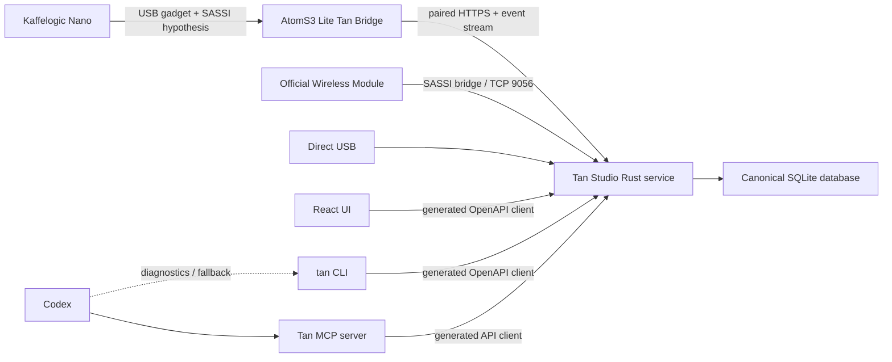
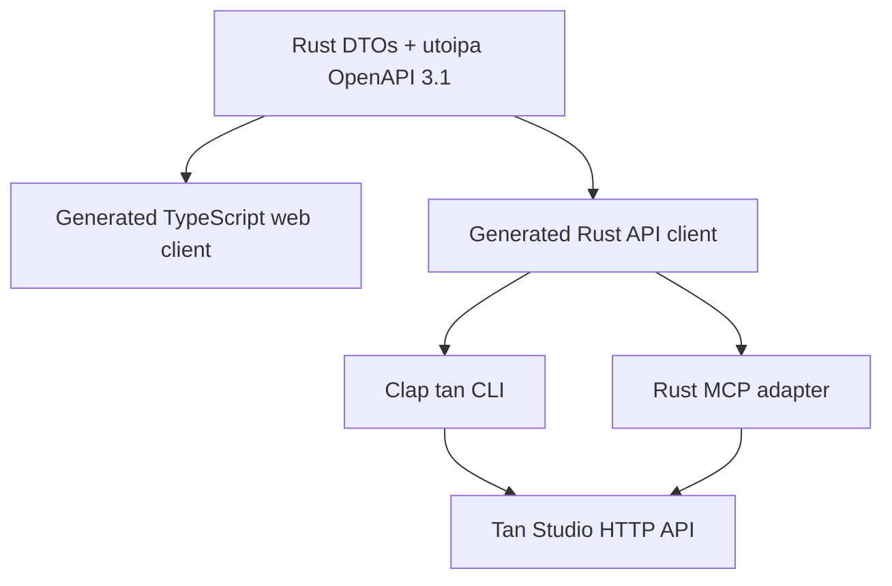

# Tan Bridge and agent interface

Status: architecture decision and implementation investigation, 2026-07-19.

This document defines two related boundaries:

1. a small, always-on network bridge attached to the Kaffelogic Nano USB port;
2. the CLI and MCP interfaces through which Codex and other agents use Tan Studio.

It deliberately separates verified facts from inference. No official Wireless Connect Module was opened, electrically probed, or captured during this investigation, so its exact processor, power topology, firmware, and PCB design remain unknown.

## 1. Decision summary

- Build a **Tan Bridge**, not a second Tan Studio server. It owns the Nano USB connection, the SASSI session, and a bounded durable recovery buffer. It does not own the coffee/roast/brew/note database.
- Keep the existing Rust Tan Studio service as the canonical backend, wherever it runs. Add a transport-neutral `RoasterLink` port with direct USB, official Kaffelogic LAN, and Tan Bridge adapters.
- Use an **M5Stack AtomS3 Lite (SKU C124)** as the selected bridge prototype. It is an enclosed 24 × 24 × 9.5 mm ESP32-S3 appliance with one USB-C receptacle, 8 MB flash, 2.4 GHz Wi-Fi, a button, and an RGB status LED.
- Connect it to the Nano with one short USB-C data cable. In normal operation it has no second cable, power supply, FeatherWing, SD card, or external computer.
- Implement it first as a native USB device/sink. This is the topology most consistent with the unpowered official accessory and the Nano's RP2040 host capability, but remains an inference until the Atom/Nano enumeration probe succeeds.
- Do not power a prototype from the Nano until VBUS direction, USB-C CC roles, voltage under load, available current, inrush, and backfeed behavior have been measured.
- Keep OpenAPI 3.1 as the one public data contract. Generate the web client, CLI client, and MCP adapter from it.
- Give Codex both interfaces: `tan` CLI for scripts, diagnostics, and exact reproduction; MCP for discoverable, typed, workflow-level tools. MCP is the preferred interactive interface.
- The bridge itself does not expose MCP. Agents use the canonical backend, never the roaster or the bridge directly.

## 2. What the official module is known to do

### 2.1 Product evidence

Kaffelogic describes the [Wireless Connect Module](https://www.kaffelogic.com/products/wireless-connect-module) as a 49 × 25 × 11 mm module with a 150 mm cable. It lets Studio on macOS, Windows, or Linux monitor and manage a Nano over the local Wi-Fi network, including profiles, logs, and firmware. Early A/B serial families are excluded and some C35 units require a compatibility check.

The [official setup manual](https://cdn.shopify.com/s/files/1/0278/9169/5713/files/KL_-_Wireless_Manual_V2.03_WEB.pdf?v=1771384146) shows this flow:

1. connect the module and Nano by USB;
2. join the module's temporary `KaffeWifiModule_XXXXXX` access point;
3. give Studio the target network credentials;
4. reconnect the computer to that network;
5. Studio automatically discovers and connects to the module when both are on the same LAN.

Product photographs show a sealed plastic enclosure, one USB-C receptacle, an indicator, a magnetic base, and a short cable. They do not expose the PCB or identify the processor.

### 2.2 Software evidence

Static inspection of Studio 7.4.3 establishes:

- the official bridge listens on plain TCP port `9056`;
- its fallback AP address is `192.168.4.1`;
- Studio refers to it as `KaffelogicWM`;
- Studio opens the TCP connection, sends an initial carriage return, and then exchanges SASSI-family frames;
- bridge traffic uses platform code `11` and has distinct packet pairs `51/52`, `53/54`, `109/110`, `113/114`, `115/116`, and `130/131` in addition to the direct packet family;
- bridge information codes cover status, device information, stored SSIDs, scan results, and module log fetch;
- Studio uses a 60-second TCP renewal timeout and a minimum 20-second renewal interval;
- Wi-Fi setup actions exist for credentials and scan refresh;
- the protocol has CRC integrity but no TLS or application authentication found in the inspected client.

The official module is therefore not proven to be a byte-transparent Wi-Fi serial cable. It is a USB peer for the Nano and a SASSI-aware TCP bridge for Studio.

### 2.3 USB-role boundary

The Nano presents an RP2040 USB CDC serial device to a computer during the verified direct-Mac connection. This does **not** prove that it keeps the same role with Kaffelogic's accessory. The official module has no documented separate power input, and compatibility depends on Nano generation. Plausible topologies include:

- Nano remains the USB device and the module acts as a powered USB host;
- Nano switches to USB host/power-source behavior and the module presents a USB gadget;
- product-specific USB-C role and power circuitry implements another controlled topology.

Only a USB-C CC/power measurement and protocol trace can distinguish them. A conventional UART-only Wi-Fi board cannot simply be wired to the Nano's USB connector. Tan Bridge therefore needs a pluggable USB-role adapter until the topology is known.

The [RP2040 datasheet](https://datasheets.raspberrypi.com/rp2040/rp2040-datasheet.pdf) confirms that its USB 1.1 controller and PHY support both host and device modes. Combined with the official module's lack of another documented power input, this makes Nano-as-host/source and bridge-as-device/sink the leading hypothesis. It is not proof of the Nano firmware's accessory-mode behavior.

The module's visible size and function are compatible with a Wi-Fi microcontroller, flash, a regulator/power switch, USB-C role circuitry, and an antenna. That is an engineering inference, not identification of the official PCB.

### 2.4 Still unknown

- processor, flash, regulator, USB protection, antenna, and PCB stack;
- USB host/device role and whether the Nano, the module, or negotiated USB-C roles source VBUS;
- normal, peak, and inrush current;
- AP discovery details beyond what Studio reveals;
- retransmission and recovery behavior during Wi-Fi loss;
- whether the module durably buffers a roast while Studio is absent;
- firmware update and recovery mechanisms;
- whether compatibility exclusions are electrical, firmware-related, or both.

These cannot be responsibly filled in from product photographs. They require an official module and controlled measurements.

## 3. Selected hardware and alternatives

| Candidate | Prototype fit | Product fit | Main trade-off |
| --- | --- | --- | --- |
| **M5Stack AtomS3 Lite C124** | **Selected** | **Strong** | Enclosed single-cable ESP32-S3 device; no PSRAM and a published 0–40 °C operating range. |
| Seeed XIAO ESP32S3 Plus 102010671 | Strong fallback | Strong after enclosure | 16 MB flash, 8 MB PSRAM, and an external antenna, but it is a bare board and current direct stock ships from Seeed's China warehouse. |
| Adafruit QT Py ESP32-S3 5426 | Strong supply fallback | Strong after enclosure | Excellent US availability and documentation; 8 MB flash but no PSRAM. |
| Unexpected Maker TinyS3[D] 6401 | Strong RF fallback | Strong after enclosure | 8 MB flash/PSRAM and selectable onboard/u.FL antenna; larger and more expensive than needed. |
| Adafruit ESP32-S3 Reverse TFT Feather | **Existing validation board** | Poor final dongle | Same native USB peripheral proves the topology now, but its screen and Feather footprint are unnecessary. |
| Raspberry Pi Zero 2 W | Useful diagnostic fallback | Poor final dongle | Linux makes tracing easy, but it needs separate power, microSD, and a larger enclosure. |
| Raspberry Pi Pico 2 W | Plausible alternative | Possible | Native USB host/device and Wi-Fi fit the bridge, but ESP-IDF currently offers more direct CDC examples. |

### 3.1 Purchase

The recommended first purchase is deliberately supplier-diverse while keeping
one firmware architecture. Buy these five boards:

1. two [M5Stack AtomS3 Lite C124 boards from DigiKey](https://www.digikey.com/en/products/detail/m5stack-technology-co-ltd/C124/18070571)—one working bridge and one recovery/development spare;
2. one [Adafruit QT Py ESP32-S3, product 5426](https://www.adafruit.com/product/5426)—the best US-stock bare-board fallback;
3. one [Unexpected Maker TinyS3[D], product 6401](https://www.adafruit.com/product/6401)—the RF fallback with both onboard and u.FL antenna choices;
4. one [Seeed XIAO ESP32-S3 Plus, SKU 102010671](https://www.seeedstudio.com/Seeed-Studio-XIAO-ESP32S3-Plus-p-6361.html)—the 16 MB flash/external-antenna fallback.

Also buy one short, certified USB 2.0 USB-C-to-USB-C cable with data conductors,
ideally 150–300 mm, plus a bring-up-only inline USB-C meter that reports VBUS
voltage/current while preserving CC and USB 2.0 data.

Only one Atom and one cable remain attached in normal operation. No programmer is required: initial firmware uses the same USB-C bootloader, and later releases use signed OTA with USB recovery.

Stock checked on 2026-07-19: DigiKey listed more than 4,700 AtomS3 Lite C124 units at US$8; Adafruit listed 70 QT Py 5426 boards at US$12.50 and the TinyS3[D] at US$21.50 in stock; Seeed listed the XIAO ESP32-S3 Plus at US$7.90 from its China warehouse. Stock is not a technical property and must be rechecked at checkout.

All four candidate designs use the ESP32-S3 native full-speed USB peripheral on
GPIO19/GPIO20 and run the same ESP-IDF/TinyUSB application layer. Board support
is limited to flash/antenna/indicator configuration, not a protocol fork. The
Atom remains the expected product because it already has an enclosure, button,
indicator, protected USB input, and the smallest operational footprint. The
other boards are supply, RF, and memory fallbacks—not five parallel products.

Do not buy an Atom Lite based on the older ESP32, an AtomS3 screen model, a USB host FeatherWing, a generic UART-to-Wi-Fi adapter, or a driver-based USB device server. The exact selected part is **AtomS3 Lite / C124**.

### 3.2 USB-role probe before production firmware

The repository contains a reproducible, passive
[`usb-role-probe`](../firmware/usb-role-probe/README.md) for the existing
Adafruit ESP32-S3 Reverse TFT Feather. It builds with a digest-pinned ESP-IDF
5.5.5 container and `esp_tinyusb` 2.2.1. It presents a CDC-ACM device, persists
attach/line-state/RX counters and SASSI type/length metadata, and has no roaster
command or echo path. It never stores raw frames or the Nano serial number.

This is the purchase gate:

1. flash the existing Feather from the Mac;
2. connect its native USB-C port to the powered Nano for 30 seconds through the
   CC/data-preserving meter;
3. reconnect it to the Mac and read the persisted previous session;
4. require USB attach plus received SASSI traffic before treating any
   device/sink ESP32-S3 board as electrically validated.

The same probe image can run on every board in the purchase list. If the Feather
does not receive VBUS, enumerate, and see SASSI traffic, buying another
device/sink ESP32-S3 board cannot fix the topology; the design must instead add
a measured host/source power stage or use an externally powered host prototype.

The Nano currently failed to enumerate on the Mac with the attached connection
even though previous direct sessions worked. This is consistent with a roaster
that is not powered on, a power-only cable, or the Nano generation's documented
USB-C cable sensitivity; it is not evidence for or against accessory mode.
Direct-Mac tests must use the supplied USB-A-to-C data cable or another
connection already proven to create the Nano CDC device.

### 3.3 Verified AtomS3 Lite fit

The [M5Stack product documentation](https://docs.m5stack.com/en/core/AtomS3%20Lite) and published [schematic](https://m5stack-doc.oss-cn-shenzhen.aliyuncs.com/471/Sch_M5_AtomS3_v1.0.pdf) establish:

| Requirement | AtomS3 Lite evidence | Result |
| --- | --- | --- |
| One operational cable | One USB-C receptacle accepts both power and data. | Pass |
| USB accessory/sink role | CC1 and CC2 each have 5.11 kΩ pull-downs to ground. | Pass for leading topology |
| Native USB data | D−/D+ connect directly to ESP32-S3 GPIO19/GPIO20 with ESD protection. | Pass |
| Protected VBUS input | USB VBUS enters `VIN_5V` through a 6 V/1 A resettable fuse. | Pass; Nano source capacity still must be measured |
| MCU | Dual-core ESP32-S3FN8 at up to 240 MHz. | Pass |
| Network | Integrated 2.4 GHz Wi-Fi and 3D antenna. | Pass |
| Persistent storage | 8 MB SPI flash. | Pass |
| Volatile memory | ESP32-S3 internal 512 KB SRAM; no PSRAM on C124. | Pass with bounded streaming buffers |
| Recovery interaction | Physical button, reset/download behavior, RGB LED. | Pass |
| Physical envelope | 24 × 24 × 9.5 mm, 5.3 g, supplied enclosure. | Better than official 49 × 25 × 11 mm envelope |
| Temperature | Published operating range 0–40 °C. | Conditional: keep off the hot roaster shell |

The ESP32-S3 provides full-speed USB OTG and 2.4 GHz 802.11 b/g/n. Its [datasheet](https://documentation.espressif.com/esp32-s3_datasheet_en.pdf) gives worst-case 100%-duty-cycle Wi-Fi transmit peaks of 283–340 mA at 3.3 V depending on mode and power. Actual bridge traffic is intermittent, but Nano VBUS voltage, current, inrush, and brownout behavior remain a hardware acceptance gate. Firmware disables the RGB except for brief status indications and may reduce transmit power after a measured link-budget test.

Eight megabytes is sufficient without PSRAM because SASSI packets are at most 4,064 bytes and files are streamed rather than retained in RAM. The initial flash budget is:

```text
bootloader + partition/NVS/keys       <= 512 KiB
firmware OTA A                          2 MiB
firmware OTA B                          2 MiB
append-only event/file spool          ~3 MiB
crash/recovery reserve               remainder
```

The exact partition CSV is fixed only after the firmware and TLS footprint are measured. A KLOG larger than available spool capacity is streamed and content-addressed in chunks; retention gaps are explicit rather than silently dropping data.

### 3.4 Alternatives not selected

The [Raspberry Pi Zero 2 W](https://www.raspberrypi.com/products/raspberry-pi-zero-2-w/) has a 1 GHz quad-core Cortex-A53, 512 MB RAM, 2.4 GHz Wi-Fi, and micro-USB OTG. It remains useful if Linux tracing is required, but it does not meet the single-cable, Nano-powered product requirement and introduces microSD power-loss risk.

The [ESP32-S3](https://documentation.espressif.com/esp32-s3_datasheet_en.pdf) integrates 2.4 GHz Wi-Fi and USB OTG. Espressif supplies both a [USB Host library](https://docs.espressif.com/projects/esp-usb/en/latest/esp32s3/usb_host.html) and [TinyUSB device support](https://docs.espressif.com/projects/esp-idf/en/stable/esp32s3/api-reference/peripherals/usb_device.html). The official ESP32-S3-USB-OTG board remains a laboratory fallback if measurements disprove the USB-device topology; it is not the one-cable product.

The [Raspberry Pi Pico 2](https://www.raspberrypi.com/products/raspberry-pi-pico-2/) family is a credible MCU alternative with native USB host/device support; the Pico 2 W adds 2.4 GHz Wi-Fi. It remains a fallback until the USB-role experiment and a small CDC proof compare its implementation cost with ESP-IDF.

### 3.5 Prototype power rule

The Atom is electrically a USB-C sink and cannot back-power the Nano through its connector. Initial Nano attachment still uses an inline meter and a current-limited/protected test path because the Nano source capacity is undocumented. USB-C cables and adapters must not be modified casually: CC resistors determine roles, and removing only VBUS can change attachment behavior.

Before a Nano-powered design is allowed, record:

- VBUS direction and idle voltage;
- USB-C CC1/CC2 state and negotiated role;
- idle, association, transmit, boot, and reconnect current;
- inrush and brownout behavior;
- voltage under a controlled stepped load;
- roaster behavior across bridge reset and hot-plug;
- backfeed current with either side independently powered.

The measurement setup uses an inline USB-C current meter that preserves CC/data, with an analyzer or current-limited fixture if the first observation is abnormal. The first firmware disables Wi-Fi until USB enumeration and idle draw are recorded, then enables Wi-Fi association and transmit in staged steps.

## 4. Runtime architecture



Only one `RoasterLink` is active for a physical Nano at a time:

```rust
trait RoasterLink {
    async fn capabilities(&self) -> Result<LinkCapabilities>;
    async fn observe(&self) -> Result<RoasterEventStream>;
    async fn list_files(&self, query: DeviceFileQuery) -> Result<DeviceFilePage>;
    async fn read_file(&self, reference: DeviceFileRef) -> Result<ByteStream>;
    async fn execute(&self, command: VerifiedDeviceCommand) -> Result<CommandReceipt>;
}
```

Adapters:

- `UsbRoasterLink`: current direct serial/SASSI implementation for the verified Nano-as-CDC-device topology;
- `OfficialWifiRoasterLink`: Kaffelogic's bridge-specific TCP 9056 behavior, once captured and tested;
- `TanBridgeRoasterLink`: authenticated Tan Bridge protocol.

Domain and application services depend only on `RoasterLink`. None may inspect serial paths, TCP sockets, mDNS, USB descriptors, or bridge firmware types.

## 5. Tan Bridge responsibilities

### 5.1 It owns

- exclusive USB connection to one Nano through the measured host or gadget adapter;
- SASSI framing, handshake, ACK/retry, deadlines, and reconnect;
- read-only device capability, status, directory, profile, log, and live KLOG acquisition;
- a content-addressed file cache and bounded append-only event spool;
- ordered event sequence numbers and resume cursors;
- Wi-Fi provisioning, watchdog, health, signed updates, and recovery mode;
- mutually authenticated backend connection and local pairing.

### 5.2 It does not own

- coffee, profile, roast, brew, note, label, or settings records;
- the canonical roast number sequence;
- business defaults or pantry recommendations;
- historical search and reporting;
- LLM prompts or MCP tools;
- label rendering or printing;
- arbitrary serial forwarding;
- unverified profile writes, firmware actions, or roast control.

The spool exists only to survive Wi-Fi/backend interruption. Once the backend acknowledges a cursor and the retention floor permits it, the bridge may discard old entries. A small SQLite database is acceptable on the Pi prototype; an embedded append-only flash journal with checksums and wear management is preferred on the MCU.

### 5.3 Native bridge API

On the home LAN, the Atom is available as `tan-bridge-<short-id>.local`. The Rust backend discovers it with mDNS, pins its device identity during a physical-button pairing window, and then pulls or pushes through a small paired HTTPS API. The bridge is never exposed through router port forwarding.

Minimum resources:

| Endpoint | Purpose |
| --- | --- |
| `GET /bridge/v1/status` | Firmware, uptime, USB/Nano state, roast state, spool bounds, and capabilities. |
| `GET /bridge/v1/files` | Cursor-paginated profile/log manifest with path, size, modification evidence, and SHA-256. |
| `GET /bridge/v1/files/{hash}` | Bounded, resumable immutable file/chunk download. |
| `GET /bridge/v1/events` | Ordered WebSocket stream for live roast, device status, files, and job progress. |
| `POST /bridge/v1/synchronize` | Idempotently refresh the device file/status snapshot. |
| `POST /bridge/v1/commands` | Capability-gated verified command; read-only commands are the only initial capability. |

There is no generic socket, raw serial endpoint, SQL, shell, or arbitrary device-file write. Profile push is added later as an explicit verified command with content hash, destination, precondition, idempotency key, and result receipt.

For future cross-network monitoring, the bridge may additionally initiate an outbound authenticated TLS stream to the backend or relay. That mode reuses the same envelopes and avoids inbound router configuration.

Minimum messages:

```text
hello            device identity, firmware, capabilities, last acknowledged cursor
device.snapshot  connection and roast state
event.batch      ordered live/status/SASSI-derived events
file.manifest    content hashes and device paths
file.chunk       bounded content-addressed transfer
ack              highest durable event/file cursor
command.prepare  verified command proposal, idempotency key, deadline
command.result   accepted/rejected/completed result
heartbeat        liveness and monotonic clock
```

Each envelope includes `schemaVersion`, `bridgeId`, `bootId`, `seq`, `monotonicMs`, `type`, `payload`, and a message authentication context provided by the TLS session. Backend reconnect supplies the last durable cursor; the bridge resumes or reports an explicit retention gap. Files are SHA-256 addressed and chunk checksummed.

The first release is observation and synchronization only. Device mutation stays absent until direct and official-bridge behavior is captured, modeled, replay-tested, and explicitly enabled by capability.

### 5.4 LAN discovery and pairing

- Advertise `_tan-bridge._tcp` over mDNS with only product, protocol major, and pairing state.
- First pairing requires physical access: hold the Atom button to open a short trust-on-first-use pairing window. The backend pins the generated device key and the bridge pins the backend key.
- Exchange long-lived device credentials during pairing; do not use a permanent factory password.
- Do not put tokens in URLs, mDNS TXT records, logs, or diagnostics.
- Reject backend commands when the authenticated identity, capability scope, revision, or idempotency key is missing.
- Button hold at power-up starts a temporary `TanBridge-<short-id>` provisioning AP. Its captive page stores the home SSID and password in encrypted NVS; the AP stops after provisioning.
- RGB patterns distinguish provisioning, Wi-Fi connected, backend paired, Nano connected, active roast, recoverable fault, and recovery mode. The LED is normally off.

An optional Kaffelogic Studio compatibility mode may later emulate the official discovery and TCP 9056 behavior. It is separate from the native secure protocol, LAN-only, disabled by default, and cannot be claimed until packet captures prove compatibility.

## 6. Bring-up and reverse-engineering programme

### Phase A — passive Atom/Nano USB probe

1. Flash the Atom from the Mac with ESP-IDF and Espressif's TinyUSB CDC-device stack. Wi-Fi and all application writes remain disabled.
2. Record its Mac-side descriptors, idle draw, reset behavior, and USB logs.
3. Connect Atom to the powered Nano through the inline CC/current meter. Confirm VBUS direction and voltage before Wi-Fi is enabled.
4. Log every standard USB setup request, configuration selection, CDC control request, and received byte without transmitting application data.
5. If the Nano enumerates CDC, enable only the verified SASSI handshake response and status/file reads.
6. If it enumerates but rejects the class, vary only descriptors/classes supported by the ESP32-S3 device stack and retain each observation. Do not guess device actions.
7. If the Nano never sources VBUS or enumerates the sink, stop: the one-cable Atom topology is disproven for this Nano and the USB-host fallback must be reconsidered.

### Phase B — local bridge proof

1. Implement the SASSI actor and stream every byte through the same redacted golden fixtures used by the Rust codec.
2. Enable Wi-Fi association in a staged power test, followed by mDNS and the read-only bridge API.
3. List and download all Nano profiles and logs. Hash and losslessly parse them against direct-Mac USB imports.
4. Stream a complete roast to the Mac-hosted Tan Studio service.
5. Disconnect Wi-Fi mid-roast, reconnect, replay the spool, and prove a gap-free final KLOG.
6. Reboot both sides independently and prove idempotent file synchronization.
7. Measure current, brownouts, heap high-water mark, flash wear, boot time, radio reliability, and enclosure temperature.

### Phase C — appliance hardening

1. Add mutual pairing, encrypted NVS, signed A/B OTA, watchdog, rollback, and physical recovery.
2. Add AP provisioning, bounded append-only spool, explicit retention gaps, and redacted diagnostics.
3. Run malformed USB/SASSI/API fuzz fixtures, power interruption, packet loss, and 24-hour soak tests.
4. Keep profile push and other device mutations absent until their protocol is captured from legitimate direct-Studio operation and replay-tested.
5. If the Atom meets electrical, thermal, radio, and recovery acceptance, it remains the production home bridge; a custom PCB is optional rather than required.

### Exit criteria

- every profile/log obtained through the bridge hashes or losslessly parses identically to direct USB;
- live roast sequence has no silent gaps and reconciles to the final device KLOG;
- 24-hour reconnect and power-cycle test needs no manual recovery;
- backend outage does not disturb the Nano session or lose buffered evidence;
- corrupt/truncated spool records are detected and never imported as complete;
- bridge credentials and Wi-Fi secrets are absent from diagnostic bundles;
- the Nano remains electrically stable across all permitted power states;
- no write/device-control command exists unless its behavior is verified and gated.

## 7. Codex interface decision

### 7.1 Recommendation

Use **MCP for normal Codex interaction and the CLI as the exact, scriptable escape hatch**. Both are thin adapters over the same generated OpenAPI client. Neither has database access or business logic.

OpenAI's Codex guidance positions MCP as the surface for live external data and actions, with MCP servers configured durably for the CLI, IDE, and desktop app. OpenAI's MCP guidance also emphasizes clear tool names, descriptions, JSON schemas, structured results, and accurate read/write/destructive annotations. Tan Studio should follow that model rather than asking an agent to discover raw HTTP endpoints or shell together `curl` requests.

### 7.2 Why MCP is better interactively

- Codex discovers typed tools and their descriptions without parsing `--help` text.
- Inputs and outputs are JSON Schema validated instead of shell strings.
- read-only and mutating actions are explicitly annotated.
- resources can provide compact, addressable context without making everything a mutation tool.
- results can contain a concise model summary plus structured data.
- authentication, scopes, and approvals are applied consistently.

### 7.3 Why the CLI remains necessary

- humans and CI can reproduce exactly what the agent did;
- JSON output is easy to save, diff, pipe, and attach to bug reports;
- device/bridge diagnostics remain usable when no MCP client is configured;
- bulk import/export is more natural as file-oriented commands;
- it is a stable fallback for Codex in an environment where MCP is unavailable.

The CLI is `tan`; its default output is human-readable and `--json` returns the exact public schema.

```sh
tan status --json
tan pantry list --ready-now --json
tan profile get 8 --json
tan roast list --coffee 3 --sort id:desc --json
tan roast get 15 --include summary,annotations --json
tan brew create --roast 15 --dose-g 16 --water-g 250 --grind 541 --json
tan note add --roast 15 --brew 7 --text "sweet, bright; finish slightly dry" --json
tan label create --roast 15 --json
tan device sync --read-only --json
tan bridge status --json
```

Interactive prompts are opt-in. Mutating commands support `--dry-run`, `--idempotency-key`, and `--if-match`; non-interactive mode never guesses missing destructive input.

## 8. MCP contract

### 8.1 Curated workflow tools

Do not turn every REST operation into an MCP tool. Expose a small, task-shaped surface:

| MCP tool | Behavior | Annotation |
| --- | --- | --- |
| `tan_get_context` | Resolve short IDs and return a compact profile/coffee/roast/brew chain. | read-only |
| `tan_search_roasts` | Typed filters, sorting, pagination, and summary metrics. | read-only |
| `tan_get_roast` | Roast detail; telemetry summary by default, bounded series on request. | read-only |
| `tan_list_pantry` | Available roasted coffee, rest window, estimated remaining amount. | read-only |
| `tan_explain_profile` | Profile parameters, parent/children, and historical roast outcomes. | read-only |
| `tan_prepare_roast` | Validate coffee/profile/defaults and create an uncommitted proposal. | read-only computation |
| `tan_commit_roast_plan` | Commit an accepted proposal with revision and idempotency guard. | private write, non-destructive |
| `tan_record_brew` | Atomically create a brew, apply declared defaults, and optionally attach a note. | private write, non-destructive |
| `tan_add_note` | Add one note linked atomically to one or more resources. | private write, non-destructive |
| `tan_create_label` | Create a label artifact/record; does not claim physical printing. | private write, non-destructive |
| `tan_device_status` | Device, transport, roast activity, and sync health. | read-only |
| `tan_sync_device` | Start a read-only synchronization job and return its ID. | private write/job, non-destructive |
| `tan_bridge_status` | Link, firmware, spool, cursor, and last-contact health. | read-only |

There is intentionally no `tan_execute_sql`, generic `tan_http_request`, raw serial tool, arbitrary device action, or direct profile-write tool.

### 8.2 MCP resources

Read-heavy, stable objects are also addressable resources:

```text
tan://profiles/{id}
tan://coffees/{id}
tan://roasts/{id}
tan://roasts/{id}/context
tan://brews/{id}
tan://pantry
tan://device
tan://bridge
```

Raw telemetry is not embedded by default. A resource returns summaries, units, provenance, related IDs, revision, and links to explicitly bounded series requests.

### 8.3 Prepare/commit writes

Agent-authored changes use two phases when defaults, inference, or device consequences are involved:

1. `prepare` validates references, normalizes human units, states each default applied, returns warnings, expected revisions, and a short-lived `proposalId`;
2. Codex explains the proposal to the user when needed;
3. `commit` supplies `proposalId`, `If-Match` revisions, and an idempotency key;
4. the backend either commits atomically or returns stable Problem Details.

Simple factual notes may be created in one idempotent call. The response still returns the final links, actor, provenance, and revision.

### 8.4 Agent-friendly API requirements

The OpenAPI contract must provide:

- stable, action-oriented `operationId` values;
- request and response schemas with descriptions, units, bounds, defaults, and examples;
- short integer public IDs, never opaque internal hashes in normal workflows;
- explicit fields such as `doseGrams`, `waterGrams`, `temperatureCelsius`, and `durationSeconds` at the agent boundary;
- exact integer storage units internally where precision requires them;
- typed filters and enums instead of a SQL-like expression language;
- cursor pagination and sparse `fields`/bounded `include` parameters;
- context endpoints that perform common joins server-side;
- telemetry summaries by default and raw/downsampled series only when requested;
- `defaultsApplied`, `warnings`, `provenance`, `revision`, and related resource links in mutation results;
- RFC 9457 Problem Details with stable `code`, `retryable`, `fieldErrors`, correlation ID, and a safe suggested action;
- idempotency keys on creates/jobs and ETag/`If-Match` on edits;
- `/api/v1/capabilities` and `/api/v1/openapi.json` discovery;
- an ordered event stream for roast completion, imports, job state, and revision changes.

Audit metadata records `actorType` (`human`, `agent`, `device`, or `system`), a scoped `actorId`, operation ID, correlation ID, and optional concise reason. Conversation content and secrets are not copied into the database.

### 8.5 Implementation shape



Use the official [MCP Rust SDK](https://github.com/modelcontextprotocol/rust-sdk) rather than hand-writing JSON-RPC. Run the local MCP server over stdio for Codex on the same machine. A future remote Streamable HTTP deployment uses HTTPS, scoped credentials, exact host/origin validation, and the same backend authorization; it is not exposed by the tiny bridge.

CLI/MCP commands use a generated client or generated DTOs plus a checked compatibility layer. CI fails if the committed OpenAPI document, generated clients, CLI schemas, or MCP tool schemas drift.

### 8.6 Agent scopes

Initial scopes are deliberately narrow:

```text
read
notes:write
brews:write
roasts:plan
labels:create
device:sync:read
```

There is no destructive device scope in the first release. Profile/device mutation, firmware installation, roast stop, filesystem delete/format, or network credential changes are separate future capabilities with physical/human confirmation.

## 9. Implementation sequence

1. Extract `RoasterLink`; keep direct USB behavior and tests unchanged.
2. Generate a Rust client from the existing OpenAPI document.
3. Implement `tan` read commands, JSON output, auth discovery, and contract tests.
4. Implement MCP read tools/resources with the official Rust SDK; register it in project Codex configuration.
5. Add idempotent note and brew writes, then prepare/commit roast planning.
6. Add an ESP-IDF `firmware/tan-bridge-esp32s3` workspace targeting AtomS3 Lite C124, with reproducible toolchain and signed artifacts.
7. Run the passive USB-role/current probe, then implement read-only SASSI, the LAN API, and `TanBridgeRoasterLink` only if it passes.
8. Prove direct/bridge profile-log parity and live-roast recovery; then harden pairing, OTA, spool, watchdog, and diagnostics.
9. Add verified profile push. Official TCP 9056 compatibility remains optional and separate from the native Tan Bridge API.

The CLI/MCP work can proceed without bridge hardware. Firmware scaffolding can proceed before delivery, but claiming Nano-powered operation cannot precede the real current/enumeration test. An official module is not required for the passive Atom/Nano probe or the native Tan Bridge protocol.

## 10. Sources

- [Kaffelogic Wireless Connect Module](https://www.kaffelogic.com/products/wireless-connect-module)
- [Kaffelogic Wireless Module manual V2.03](https://cdn.shopify.com/s/files/1/0278/9169/5713/files/KL_-_Wireless_Manual_V2.03_WEB.pdf?v=1771384146)
- [M5Stack AtomS3 Lite C124](https://docs.m5stack.com/en/core/AtomS3%20Lite)
- [M5Stack AtomS3 Lite store page](https://shop.m5stack.com/products/atoms3-lite-esp32s3-dev-kit)
- [M5Stack AtomS3 Lite schematic](https://m5stack-doc.oss-cn-shenzhen.aliyuncs.com/471/Sch_M5_AtomS3_v1.0.pdf)
- [Seeed XIAO ESP32S3](https://www.seeedstudio.com/XIAO-ESP32S3-p-5627.html)
- [RP2040 datasheet](https://datasheets.raspberrypi.com/rp2040/rp2040-datasheet.pdf)
- [Raspberry Pi Zero 2 W](https://www.raspberrypi.com/products/raspberry-pi-zero-2-w/)
- [ESP32-S3 datasheet](https://documentation.espressif.com/esp32-s3_datasheet_en.pdf)
- [Espressif USB Host library](https://docs.espressif.com/projects/esp-usb/en/latest/esp32s3/usb_host.html)
- [ESP-IDF USB Device Stack](https://docs.espressif.com/projects/esp-idf/en/stable/esp32s3/api-reference/peripherals/usb_device.html)
- [ESP32-S3-USB-OTG development board](https://documentation.espressif.com/projects/espressif-esp-dev-kits/en/latest/esp32s3/esp32-s3-usb-otg/user_guide.html)
- [Raspberry Pi Pico 2](https://www.raspberrypi.com/products/raspberry-pi-pico-2/)
- [Official MCP Rust SDK](https://github.com/modelcontextprotocol/rust-sdk)
- [OpenAI: Build your MCP server](https://developers.openai.com/apps-sdk/build/mcp-server)
- [OpenAI Codex MCP configuration](https://learn.chatgpt.com/docs/extend/mcp)
