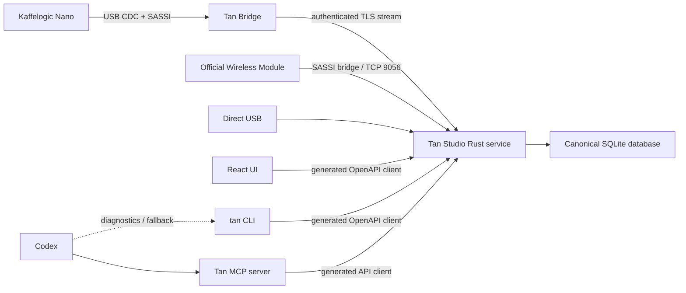
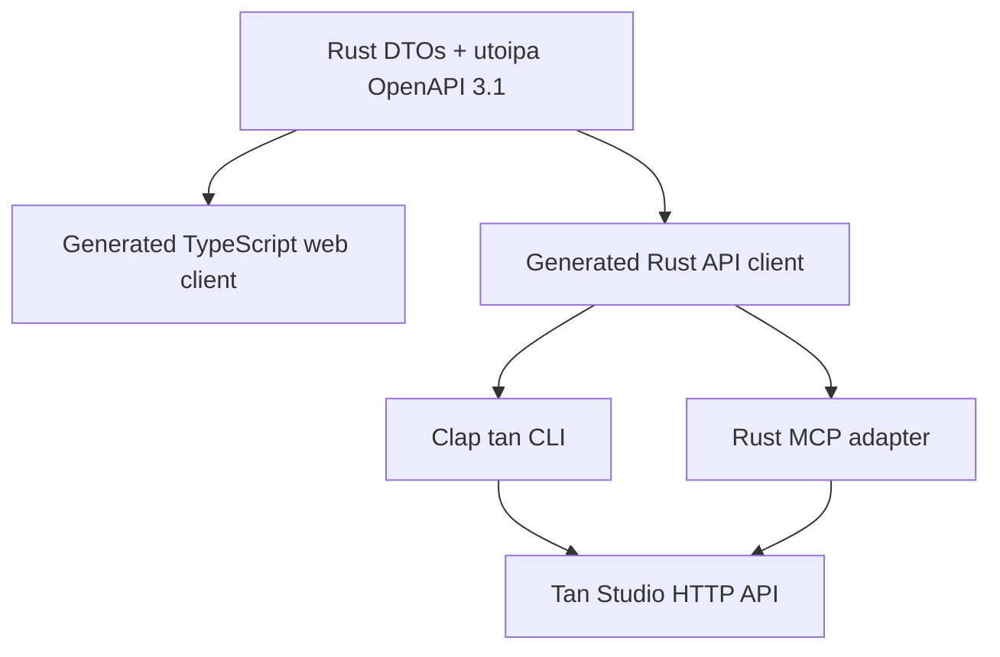

# Tan Bridge and agent interface

Status: architecture decision and implementation investigation, 2026-07-19.

This document defines two related boundaries:

1. a small, always-on network bridge attached to the Kaffelogic Nano USB port;
2. the CLI and MCP interfaces through which Codex and other agents use Tan Studio.

It deliberately separates verified facts from inference. No official Wireless Connect Module was opened, electrically probed, or captured during this investigation, so its exact processor, power topology, firmware, and PCB design remain unknown.

## 1. Decision summary

- Build a **Tan Bridge**, not a second Tan Studio server. It owns the Nano USB connection, the SASSI session, and a bounded durable recovery buffer. It does not own the coffee/roast/brew/note database.
- Keep the existing Rust Tan Studio service as the canonical backend, wherever it runs. Add a transport-neutral `RoasterLink` port with direct USB, official Kaffelogic LAN, and Tan Bridge adapters.
- Prototype the bridge on a separately powered Raspberry Pi Zero 2 W because Linux and USB OTG let it test either USB role. Existing Rust serial/SASSI code is reusable only if the Nano remains a CDC device in accessory mode.
- Target an ESP32-S3 USB-OTG design for the eventual tiny appliance. It integrates 2.4 GHz Wi-Fi and native full-speed USB host/device support and avoids Linux, microSD, and long boot time.
- Do not power a prototype from the Nano until VBUS direction, USB-C CC roles, voltage under load, available current, inrush, and backfeed behavior have been measured.
- Keep OpenAPI 3.1 as the one public data contract. Generate the web client, CLI client, and MCP adapter from it.
- Give Codex both interfaces: `tan` CLI for scripts, diagnostics, and exact reproduction; MCP for discoverable, typed, workflow-level tools. MCP is the preferred interactive interface.
- The bridge itself does not expose MCP. Agents use the canonical backend, never the roaster or the bridge directly.

## 2. What the official module is known to do

### 2.1 Product evidence

Kaffelogic describes the [Wireless Connect Module](https://www.kaffelogic.com/products/wireless-connect-module) as a 49 × 25 × 11 mm module with a 150 mm cable. It lets Studio on macOS, Windows, or Linux monitor and manage a Nano over the local Wi-Fi network, including profiles, logs, and firmware. Early A/B serial families are excluded and some C35 units require a compatibility check.

The [official setup manual](https://cdn.shopify.com/s/files/1/0278/9169/5713/files/KL_-_Wireless_Manual_V2.03_WEB.pdf?v=1771384146) shows this flow:

1. connect the module and Nano by USB;
2. join the module's temporary `KaffeWifiModule_XXXXXX` access point;
3. give Studio the target network credentials;
4. reconnect the computer to that network;
5. Studio automatically discovers and connects to the module when both are on the same LAN.

Product photographs show a sealed plastic enclosure, one USB-C receptacle, an indicator, a magnetic base, and a short cable. They do not expose the PCB or identify the processor.

### 2.2 Software evidence

Static inspection of Studio 7.4.3 establishes:

- the official bridge listens on plain TCP port `9056`;
- its fallback AP address is `192.168.4.1`;
- Studio refers to it as `KaffelogicWM`;
- Studio opens the TCP connection, sends an initial carriage return, and then exchanges SASSI-family frames;
- bridge traffic uses platform code `11` and has distinct packet pairs `51/52`, `53/54`, `109/110`, `113/114`, `115/116`, and `130/131` in addition to the direct packet family;
- bridge information codes cover status, device information, stored SSIDs, scan results, and module log fetch;
- Studio uses a 60-second TCP renewal timeout and a minimum 20-second renewal interval;
- Wi-Fi setup actions exist for credentials and scan refresh;
- the protocol has CRC integrity but no TLS or application authentication found in the inspected client.

The official module is therefore not proven to be a byte-transparent Wi-Fi serial cable. It is a USB peer for the Nano and a SASSI-aware TCP bridge for Studio.

### 2.3 USB-role boundary

The Nano presents an RP2040 USB CDC serial device to a computer during the verified direct-Mac connection. This does **not** prove that it keeps the same role with Kaffelogic's accessory. The official module has no documented separate power input, and compatibility depends on Nano generation. Plausible topologies include:

- Nano remains the USB device and the module acts as a powered USB host;
- Nano switches to USB host/power-source behavior and the module presents a USB gadget;
- product-specific USB-C role and power circuitry implements another controlled topology.

Only a USB-C CC/power measurement and protocol trace can distinguish them. A conventional UART-only Wi-Fi board cannot simply be wired to the Nano's USB connector. Tan Bridge therefore needs a pluggable USB-role adapter until the topology is known.

The module's visible size and function are compatible with a Wi-Fi microcontroller, flash, a regulator/power switch, USB-C role circuitry, and an antenna. That is an engineering inference, not identification of the official PCB.

### 2.4 Still unknown

- processor, flash, regulator, USB protection, antenna, and PCB stack;
- USB host/device role and whether the Nano, the module, or negotiated USB-C roles source VBUS;
- normal, peak, and inrush current;
- AP discovery details beyond what Studio reveals;
- retransmission and recovery behavior during Wi-Fi loss;
- whether the module durably buffers a roast while Studio is absent;
- firmware update and recovery mechanisms;
- whether compatibility exclusions are electrical, firmware-related, or both.

These cannot be responsibly filled in from product photographs. They require an official module and controlled measurements.

## 3. Candidate hardware

| Candidate | Prototype fit | Product fit | Main trade-off |
| --- | --- | --- | --- |
| Raspberry Pi Zero 2 W | Best first prototype | Poor final dongle | Reuses Linux/Rust code, but is 65 × 30 mm, uses microSD, boots slowly, and has a materially larger power envelope. |
| ESP32-S3 | Moderate firmware effort | Best current target | Integrated Wi-Fi and USB host/device OTG in a small MCU, but requires purpose-built CDC/SASSI firmware and board. |
| Raspberry Pi Pico 2 W | Plausible alternative | Possible | Native USB host/device and Wi-Fi fit the bridge, but ESP-IDF currently offers more direct CDC examples. |

The [Raspberry Pi Zero 2 W](https://www.raspberrypi.com/products/raspberry-pi-zero-2-w/) has a 1 GHz quad-core Cortex-A53, 512 MB RAM, 2.4 GHz Wi-Fi, micro-USB OTG, and a 65 × 30 mm board. It is ideal for proving the network boundary because Tan Studio's Rust device code can be extracted or reused on ARM64. It is not a sensible assumption for USB-port power: Raspberry Pi documents a substantially larger recommended supply than a tiny Wi-Fi module, and microSD is vulnerable to abrupt power loss.

The [ESP32-S3](https://documentation.espressif.com/esp32-s3_datasheet_en.pdf) integrates 2.4 GHz Wi-Fi and USB OTG. Espressif supplies both a [USB Host library](https://docs.espressif.com/projects/esp-usb/en/latest/esp32s3/usb_host.html) and [TinyUSB device support](https://docs.espressif.com/projects/esp-idf/en/stable/esp32s3/api-reference/peripherals/usb_device.html). The official [ESP32-S3-USB-OTG board](https://documentation.espressif.com/projects/espressif-esp-dev-kits/en/latest/esp32s3/esp32-s3-usb-otg/user_guide.html) is the right laboratory platform for validating the measured Nano topology before designing a board.

The [Raspberry Pi Pico 2](https://www.raspberrypi.com/products/raspberry-pi-pico-2/) family is a credible MCU alternative with native USB host/device support; the Pico 2 W adds 2.4 GHz Wi-Fi. It remains a fallback until the USB-role experiment and a small CDC proof compare its implementation cost with ESP-IDF.

### 3.1 Prototype power rule

The first Pi and ESP32-S3 experiments use independent, current-limited power. The Nano USB connection is data-only or protected by a USB power switch that prevents backfeed. USB-C cables and adapters must not be modified casually: CC resistors determine roles, and removing only VBUS can change attachment behavior.

Before a Nano-powered design is allowed, record:

- VBUS direction and idle voltage;
- USB-C CC1/CC2 state and negotiated role;
- idle, association, transmit, boot, and reconnect current;
- inrush and brownout behavior;
- voltage under a controlled stepped load;
- roaster behavior across bridge reset and hot-plug;
- backfeed current with either side independently powered.

The measurement setup uses a USB-C protocol/power analyzer, an inline current meter with logging, a current-limited bench supply, and a known safe electronic load. The Nano is never used as the first unknown load source.

## 4. Runtime architecture



Only one `RoasterLink` is active for a physical Nano at a time:

```rust
trait RoasterLink {
    async fn capabilities(&self) -> Result<LinkCapabilities>;
    async fn observe(&self) -> Result<RoasterEventStream>;
    async fn list_files(&self, query: DeviceFileQuery) -> Result<DeviceFilePage>;
    async fn read_file(&self, reference: DeviceFileRef) -> Result<ByteStream>;
    async fn execute(&self, command: VerifiedDeviceCommand) -> Result<CommandReceipt>;
}
```

Adapters:

- `UsbRoasterLink`: current direct serial/SASSI implementation for the verified Nano-as-CDC-device topology;
- `OfficialWifiRoasterLink`: Kaffelogic's bridge-specific TCP 9056 behavior, once captured and tested;
- `TanBridgeRoasterLink`: authenticated Tan Bridge protocol.

Domain and application services depend only on `RoasterLink`. None may inspect serial paths, TCP sockets, mDNS, USB descriptors, or bridge firmware types.

## 5. Tan Bridge responsibilities

### 5.1 It owns

- exclusive USB connection to one Nano through the measured host or gadget adapter;
- SASSI framing, handshake, ACK/retry, deadlines, and reconnect;
- read-only device capability, status, directory, profile, log, and live KLOG acquisition;
- a content-addressed file cache and bounded append-only event spool;
- ordered event sequence numbers and resume cursors;
- Wi-Fi provisioning, watchdog, health, signed updates, and recovery mode;
- mutually authenticated backend connection and local pairing.

### 5.2 It does not own

- coffee, profile, roast, brew, note, label, or settings records;
- the canonical roast number sequence;
- business defaults or pantry recommendations;
- historical search and reporting;
- LLM prompts or MCP tools;
- label rendering or printing;
- arbitrary serial forwarding;
- unverified profile writes, firmware actions, or roast control.

The spool exists only to survive Wi-Fi/backend interruption. Once the backend acknowledges a cursor and the retention floor permits it, the bridge may discard old entries. A small SQLite database is acceptable on the Pi prototype; an embedded append-only flash journal with checksums and wear management is preferred on the MCU.

### 5.3 Native bridge protocol

The bridge initiates an outbound TLS connection to its paired backend. This avoids inbound router configuration and lets the same design work on one LAN or across a future relay.

Minimum messages:

```text
hello            device identity, firmware, capabilities, last acknowledged cursor
device.snapshot  connection and roast state
event.batch      ordered live/status/SASSI-derived events
file.manifest    content hashes and device paths
file.chunk       bounded content-addressed transfer
ack              highest durable event/file cursor
command.prepare  verified command proposal, idempotency key, deadline
command.result   accepted/rejected/completed result
heartbeat        liveness and monotonic clock
```

Each envelope includes `schemaVersion`, `bridgeId`, `bootId`, `seq`, `monotonicMs`, `type`, `payload`, and a message authentication context provided by the TLS session. Backend reconnect supplies the last durable cursor; the bridge resumes or reports an explicit retention gap. Files are SHA-256 addressed and chunk checksummed.

The first release is observation and synchronization only. Device mutation stays absent until direct and official-bridge behavior is captured, modeled, replay-tested, and explicitly enabled by capability.

### 5.4 LAN discovery and pairing

- Advertise `_tan-bridge._tcp` over mDNS with only product, protocol major, and pairing state.
- First pairing requires physical access: hold the bridge button or scan a one-time QR code printed/displayed by the bridge setup flow.
- Exchange long-lived device credentials during pairing; do not use a permanent factory password.
- Do not put tokens in URLs, mDNS TXT records, logs, or diagnostics.
- Reject backend commands when the authenticated identity, capability scope, revision, or idempotency key is missing.

An optional Kaffelogic Studio compatibility mode may later emulate the official discovery and TCP 9056 behavior. It is separate from the native secure protocol, LAN-only, disabled by default, and cannot be claimed until packet captures prove compatibility.

## 6. Reverse-engineering programme

All experiments are non-destructive until an official module owner authorizes a teardown.

### Phase A — black-box official module

1. Photograph markings and record external dimensions without publishing unique identifiers.
2. Use a USB-C analyzer to establish source/sink and host/device roles.
3. Measure power during boot, AP mode, association, idle, traffic, reconnect, and firmware update.
4. Put the module, Nano, and Studio on an isolated lab network.
5. Capture DHCP, DNS, mDNS/multicast, TCP 9056, timing, and reconnect behavior. Redact Wi-Fi credentials and device serials.
6. Capture legitimate Studio workflows: discovery, profile list/read, log list/read, live roast, disconnect/reconnect, and safe preference reads.
7. Compare TCP packets with direct USB SASSI fixtures and identify exact bridge transformations.
8. Test Studio absent, backend absent, LAN loss, AP loss, and power loss during a roast.

### Phase B — Pi Zero proof

1. Measure the official USB topology. If the Nano remains a CDC device, extract the existing USB/SASSI session behind `RoasterLink`; otherwise implement only the required USB gadget adapter and reuse the verified SASSI codec/state behavior.
2. Run a minimal `tan-bridge` image on a separately powered Zero 2 W.
3. Stream device snapshots and a complete roast to a Mac-hosted Tan Studio service.
4. Disconnect Wi-Fi mid-roast, reconnect, replay the spool, and prove a gap-free final KLOG.
5. Reboot both sides independently and prove idempotent file synchronization.
6. Measure CPU, memory, network volume, storage writes, boot time, and power.

### Phase C — ESP32-S3 proof

1. Reproduce the measured Nano USB role with the ESP32-S3 host library or TinyUSB device stack.
2. Implement the required CDC transfers/descriptors and reproduce the verified SASSI handshake.
3. List and download profiles/logs with golden-fixture parity against Rust.
4. Implement the bounded spool and native authenticated protocol.
5. Add signed OTA, watchdog, recovery button, AP provisioning, and fault injection.
6. Only after electrical validation, design a current-limited USB-C board and enclosure.

### Exit criteria

- every profile/log obtained through the bridge hashes or losslessly parses identically to direct USB;
- live roast sequence has no silent gaps and reconciles to the final device KLOG;
- 24-hour reconnect and power-cycle test needs no manual recovery;
- backend outage does not disturb the Nano session or lose buffered evidence;
- corrupt/truncated spool records are detected and never imported as complete;
- bridge credentials and Wi-Fi secrets are absent from diagnostic bundles;
- the Nano remains electrically stable across all permitted power states;
- no write/device-control command exists unless its behavior is verified and gated.

## 7. Codex interface decision

### 7.1 Recommendation

Use **MCP for normal Codex interaction and the CLI as the exact, scriptable escape hatch**. Both are thin adapters over the same generated OpenAPI client. Neither has database access or business logic.

OpenAI's Codex guidance positions MCP as the surface for live external data and actions, with MCP servers configured durably for the CLI, IDE, and desktop app. OpenAI's MCP guidance also emphasizes clear tool names, descriptions, JSON schemas, structured results, and accurate read/write/destructive annotations. Tan Studio should follow that model rather than asking an agent to discover raw HTTP endpoints or shell together `curl` requests.

### 7.2 Why MCP is better interactively

- Codex discovers typed tools and their descriptions without parsing `--help` text.
- Inputs and outputs are JSON Schema validated instead of shell strings.
- read-only and mutating actions are explicitly annotated.
- resources can provide compact, addressable context without making everything a mutation tool.
- results can contain a concise model summary plus structured data.
- authentication, scopes, and approvals are applied consistently.

### 7.3 Why the CLI remains necessary

- humans and CI can reproduce exactly what the agent did;
- JSON output is easy to save, diff, pipe, and attach to bug reports;
- device/bridge diagnostics remain usable when no MCP client is configured;
- bulk import/export is more natural as file-oriented commands;
- it is a stable fallback for Codex in an environment where MCP is unavailable.

The CLI is `tan`; its default output is human-readable and `--json` returns the exact public schema.

```sh
tan status --json
tan pantry list --ready-now --json
tan profile get 8 --json
tan roast list --coffee 3 --sort id:desc --json
tan roast get 15 --include summary,annotations --json
tan brew create --roast 15 --dose-g 16 --water-g 250 --grind 541 --json
tan note add --roast 15 --brew 7 --text "sweet, bright; finish slightly dry" --json
tan label create --roast 15 --json
tan device sync --read-only --json
tan bridge status --json
```

Interactive prompts are opt-in. Mutating commands support `--dry-run`, `--idempotency-key`, and `--if-match`; non-interactive mode never guesses missing destructive input.

## 8. MCP contract

### 8.1 Curated workflow tools

Do not turn every REST operation into an MCP tool. Expose a small, task-shaped surface:

| MCP tool | Behavior | Annotation |
| --- | --- | --- |
| `tan_get_context` | Resolve short IDs and return a compact profile/coffee/roast/brew chain. | read-only |
| `tan_search_roasts` | Typed filters, sorting, pagination, and summary metrics. | read-only |
| `tan_get_roast` | Roast detail; telemetry summary by default, bounded series on request. | read-only |
| `tan_list_pantry` | Available roasted coffee, rest window, estimated remaining amount. | read-only |
| `tan_explain_profile` | Profile parameters, parent/children, and historical roast outcomes. | read-only |
| `tan_prepare_roast` | Validate coffee/profile/defaults and create an uncommitted proposal. | read-only computation |
| `tan_commit_roast_plan` | Commit an accepted proposal with revision and idempotency guard. | private write, non-destructive |
| `tan_record_brew` | Atomically create a brew, apply declared defaults, and optionally attach a note. | private write, non-destructive |
| `tan_add_note` | Add one note linked atomically to one or more resources. | private write, non-destructive |
| `tan_create_label` | Create a label artifact/record; does not claim physical printing. | private write, non-destructive |
| `tan_device_status` | Device, transport, roast activity, and sync health. | read-only |
| `tan_sync_device` | Start a read-only synchronization job and return its ID. | private write/job, non-destructive |
| `tan_bridge_status` | Link, firmware, spool, cursor, and last-contact health. | read-only |

There is intentionally no `tan_execute_sql`, generic `tan_http_request`, raw serial tool, arbitrary device action, or direct profile-write tool.

### 8.2 MCP resources

Read-heavy, stable objects are also addressable resources:

```text
tan://profiles/{id}
tan://coffees/{id}
tan://roasts/{id}
tan://roasts/{id}/context
tan://brews/{id}
tan://pantry
tan://device
tan://bridge
```

Raw telemetry is not embedded by default. A resource returns summaries, units, provenance, related IDs, revision, and links to explicitly bounded series requests.

### 8.3 Prepare/commit writes

Agent-authored changes use two phases when defaults, inference, or device consequences are involved:

1. `prepare` validates references, normalizes human units, states each default applied, returns warnings, expected revisions, and a short-lived `proposalId`;
2. Codex explains the proposal to the user when needed;
3. `commit` supplies `proposalId`, `If-Match` revisions, and an idempotency key;
4. the backend either commits atomically or returns stable Problem Details.

Simple factual notes may be created in one idempotent call. The response still returns the final links, actor, provenance, and revision.

### 8.4 Agent-friendly API requirements

The OpenAPI contract must provide:

- stable, action-oriented `operationId` values;
- request and response schemas with descriptions, units, bounds, defaults, and examples;
- short integer public IDs, never opaque internal hashes in normal workflows;
- explicit fields such as `doseGrams`, `waterGrams`, `temperatureCelsius`, and `durationSeconds` at the agent boundary;
- exact integer storage units internally where precision requires them;
- typed filters and enums instead of a SQL-like expression language;
- cursor pagination and sparse `fields`/bounded `include` parameters;
- context endpoints that perform common joins server-side;
- telemetry summaries by default and raw/downsampled series only when requested;
- `defaultsApplied`, `warnings`, `provenance`, `revision`, and related resource links in mutation results;
- RFC 9457 Problem Details with stable `code`, `retryable`, `fieldErrors`, correlation ID, and a safe suggested action;
- idempotency keys on creates/jobs and ETag/`If-Match` on edits;
- `/api/v1/capabilities` and `/api/v1/openapi.json` discovery;
- an ordered event stream for roast completion, imports, job state, and revision changes.

Audit metadata records `actorType` (`human`, `agent`, `device`, or `system`), a scoped `actorId`, operation ID, correlation ID, and optional concise reason. Conversation content and secrets are not copied into the database.

### 8.5 Implementation shape



Use the official [MCP Rust SDK](https://github.com/modelcontextprotocol/rust-sdk) rather than hand-writing JSON-RPC. Run the local MCP server over stdio for Codex on the same machine. A future remote Streamable HTTP deployment uses HTTPS, scoped credentials, exact host/origin validation, and the same backend authorization; it is not exposed by the tiny bridge.

CLI/MCP commands use a generated client or generated DTOs plus a checked compatibility layer. CI fails if the committed OpenAPI document, generated clients, CLI schemas, or MCP tool schemas drift.

### 8.6 Agent scopes

Initial scopes are deliberately narrow:

```text
read
notes:write
brews:write
roasts:plan
labels:create
device:sync:read
```

There is no destructive device scope in the first release. Profile/device mutation, firmware installation, roast stop, filesystem delete/format, or network credential changes are separate future capabilities with physical/human confirmation.

## 9. Implementation sequence

1. Extract `RoasterLink`; keep direct USB behavior and tests unchanged.
2. Generate a Rust client from the existing OpenAPI document.
3. Implement `tan` read commands, JSON output, auth discovery, and contract tests.
4. Implement MCP read tools/resources with the official Rust SDK; register it in project Codex configuration.
5. Add idempotent note and brew writes, then prepare/commit roast planning.
6. Build the separately powered Pi Zero bridge proof and `TanBridgeRoasterLink`.
7. Capture an official module and implement `OfficialWifiRoasterLink` from replayable fixtures.
8. Validate ESP32-S3 CDC host and bridge protocol; only then design final hardware.

The CLI/MCP work can proceed without bridge hardware. The Pi proof can proceed without an official module. Claiming official Studio compatibility or Nano-powered operation cannot.

## 10. Sources

- [Kaffelogic Wireless Connect Module](https://www.kaffelogic.com/products/wireless-connect-module)
- [Kaffelogic Wireless Module manual V2.03](https://cdn.shopify.com/s/files/1/0278/9169/5713/files/KL_-_Wireless_Manual_V2.03_WEB.pdf?v=1771384146)
- [Raspberry Pi Zero 2 W](https://www.raspberrypi.com/products/raspberry-pi-zero-2-w/)
- [ESP32-S3 datasheet](https://documentation.espressif.com/esp32-s3_datasheet_en.pdf)
- [Espressif USB Host library](https://docs.espressif.com/projects/esp-usb/en/latest/esp32s3/usb_host.html)
- [ESP-IDF USB Device Stack](https://docs.espressif.com/projects/esp-idf/en/stable/esp32s3/api-reference/peripherals/usb_device.html)
- [ESP32-S3-USB-OTG development board](https://documentation.espressif.com/projects/espressif-esp-dev-kits/en/latest/esp32s3/esp32-s3-usb-otg/user_guide.html)
- [Raspberry Pi Pico 2](https://www.raspberrypi.com/products/raspberry-pi-pico-2/)
- [Official MCP Rust SDK](https://github.com/modelcontextprotocol/rust-sdk)
- [OpenAI: Build your MCP server](https://developers.openai.com/apps-sdk/build/mcp-server)
- [OpenAI Codex MCP configuration](https://learn.chatgpt.com/docs/extend/mcp)
