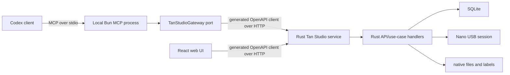

# Tan Studio Codex MCP test plan

Status: executed on 20 July 2026

## Purpose

Prove that the installed Codex plugin is a thin, typed MCP adapter over the production Tan Studio HTTP API; that it does not own coffee data or USB state; and that its read and write workflows behave correctly against both an isolated Rust service and the live Mac service connected to the Kaffeelogic Nano.

The repository does not currently ship a user-facing `tan` CLI. The repeatable programs under `plugins/tan-studio/scripts/` are MCP protocol test clients: they start the MCP server over stdio, enumerate its tools and resources, invoke them, and assert the returned protocol data.

## Runtime topology



Codex starts the installed `dist/server.js` declared by the plugin's `.mcp.json`. The MCP process is local to the Codex client and has no listening TCP port. It exits with its stdio session. It reads the backend URL and a token-file path from local configuration, then authenticates to the separately running Rust service.

The MCP controller depends only on the `TanStudioGateway` interface. The composition root injects `OpenApiTanStudioGateway`, whose request and response types are generated from the Rust OpenAPI document. Unit tests inject an in-memory fake gateway. The architecture checker prevents the MCP controller from importing HTTP, SQLite, filesystem, USB, or backend implementation modules.

### What is actually shared

The React UI and MCP adapter are two clients of the same versioned Rust HTTP API. Consequently, both execute the same Rust validation, defaults, transactions, database queries, device manager, parsers, and error mapping. The MCP owns no database and cannot bypass the HTTP API.

The current Rust core API keeps some application orchestration directly in `core_api.rs` and device endpoints in `api.rs`; it does not yet place every operation behind a separately named Rust application-service/use-case object. Therefore the precise statement is: the UI and MCP reuse the same backend behavior through the same API endpoints, not that two Rust controller adapters inject the same extracted use-case class. This is acceptable for the current topology because MCP is intentionally an external API client. If another in-process Rust controller is added, extracting those handlers into explicit application services would become worthwhile.

## Environments and safety

| Environment | Backend | Data policy | Purpose |
| --- | --- | --- | --- |
| Unit | In-memory gateway fakes | No files or network | MCP schemas, units, annotations, controller-to-port calls |
| Isolated E2E | Real Rust service, random loopback port, temporary SQLite | Creates disposable profile, coffee, roast, brew, notes, and label; deletes the temporary directory | Full MCP → HTTP → Rust → SQLite write and failure paths |
| Live | Installed MCP bundle and production Mac LAN service | Reads all records; optional Nano synchronization is read-only toward the roaster | Installed packaging, real data, every roast graph, resources, and device connection |
| Fresh Codex | Installed plugin in a new `codex exec` task | Read-only prompt; synchronization forbidden | Skill discovery and real agent-to-MCP invocation |

No live test creates a coffee, brew, note, roast, or label. `tan_sync_device` is the only live mutation: it imports device files into the backend and sends no device-write commands.

## Test cases

| ID | Level | Check | Expected result |
| --- | --- | --- | --- |
| MCP-01 | Static | Generate plugin client from Rust OpenAPI and check Git drift | Generated contract is unchanged |
| MCP-02 | Static | Run dependency-boundary checker | MCP controller imports only the gateway port, result helper, unit helper, MCP SDK, and Zod |
| MCP-03 | Unit | Enumerate tool definitions and annotations | Exactly 11 curated tools; no raw HTTP, SQL, serial, or device-write tool |
| MCP-04 | Unit | Convert grams, Celsius, percent, and millimeters | Exact integer API units without floating-point drift |
| MCP-05 | Unit | Validate note kinds and agent attribution | Unsupported kinds fail before HTTP; source is `agent`, metadata identifies `codex` |
| MCP-06 | Isolated E2E | Enumerate tools, static resources, and templates | 11 tools, 2 static resources, 4 resource templates |
| MCP-07 | Isolated E2E | Search and read profile, coffee, roast, brew, pantry, and device | Structured MCP data matches seeded HTTP resources |
| MCP-08 | Isolated E2E | Record brew, linked note, and roast label | Rust persists exact values; note links are atomic; label status does not claim physical printing |
| MCP-09 | Isolated E2E | Missing resource and invalid link | Stable MCP errors; failed linked note leaves no partial record |
| MCP-10 | Isolated E2E | Invalid token and unavailable service | Safe actionable errors; no token appears in output |
| MCP-11 | Live | Enumerate and read every profile, coffee, roast, brew, and resource URI | Every available record is readable through the installed plugin |
| MCP-12 | Live | Load telemetry for every roast | Each series is ordered and bounded to 2,000 returned points |
| MCP-13 | Live | Synchronize the connected Nano | Device remains connected; imported roast count never decreases |
| MCP-14 | Fresh Codex | Ask a new read-only task for status, roast count, and newest ID | Codex discovers the skill, calls MCP tools, and reports backend values without writes |
| MCP-15 | Packaging | Compare installed and repository MCP bundle hashes | Installed cache executes the exact tested bundle |

## Commands

```sh
bun run boundaries
bun run contract:check
bun run --filter @tan-studio/codex-plugin typecheck
bun run --filter @tan-studio/codex-plugin test

TAN_STUDIO_MCP_BUNDLE=/absolute/path/to/installed/dist/server.js \
  bun run --filter @tan-studio/codex-plugin test:e2e

TAN_STUDIO_MCP_BUNDLE=/absolute/path/to/installed/dist/server.js \
TAN_STUDIO_TIMEOUT_MS=60000 \
TAN_STUDIO_SYNC_DEVICE=1 \
  bun run --filter @tan-studio/codex-plugin test:live
```

The isolated E2E client is `plugins/tan-studio/scripts/e2e.ts`. The live read client is `plugins/tan-studio/scripts/live.ts`.

## Execution record

Execution results are recorded after every deliberate run rather than treated as evergreen claims. The 20 July 2026 run used Codex CLI 0.144.6 and installed plugin `tan-studio@personal` version `0.1.0+codex.20260720163506`.

| Area | Result |
| --- | --- |
| Architecture and generated contract | Pass: dependency boundaries held and regenerated OpenAPI clients produced no diff |
| Plugin unit/type checks | Pass: strict TypeScript and 12/12 tests |
| Installed-bundle isolated E2E | Pass: 11 tools, 2 static resources, 4 templates, full disposable write workflow, and five failure classes |
| Live Nano-backed read/sync | Pass: connected before/after; 16 profiles, 15 roasts, 9 pantry records, all 15 telemetry streams and 6,854 ordered points; no compatibility warnings |
| Fresh Codex invocation | Pass: a new read-only task concurrently called `tan_status` and `tan_search_roasts`, reporting 15 roasts and newest ID 15 without writes or synchronization |
| Installed/source bundle identity | Pass: both SHA-256 hashes were `f1e1e193b3c2d131430e1069a837f0c6a4d1b318e1ab0ae26a53f00c28118011` |

The live database contained no coffee-catalog or brew records during this run. Those zero counts were treated as valid empty states; their read paths and mutations were exercised against disposable data in the isolated E2E environment.

## 22 July 2026 bridge-aware regression

Plugin `0.1.0+codex.20260722064907` added typed bridge diagnostics to the
existing `tan_status` controller. The MCP remains a stdio client of the same
Rust HTTP API used by React: the generated gateway now composes bootstrap,
device, and `/api/v1/bridges` responses, while the controller still has no
SQLite, USB, or filesystem access.

The source bundle and reinstalled Codex cache both had SHA-256
`a9262b70eef6e462c8a1f6aedc2f27dc92369f5db3fa517d5618fe9d5ba25c5d`.
The installed-bundle isolated E2E passed all 15 tools, two resources, four
resource templates, the complete disposable profile/coffee/attachment/roast/
brew/note/label write workflow, bridge-page status, and five expected failure
classes. The live read traversal passed with 16 profiles, 6 coffees, 15 roasts,
9 pantry records, 15 telemetry-bearing roasts, and 6,854 ordered telemetry
points. Live mutation and device synchronization were intentionally disabled
because the physical Wi-Fi bridge was offline during this run.
