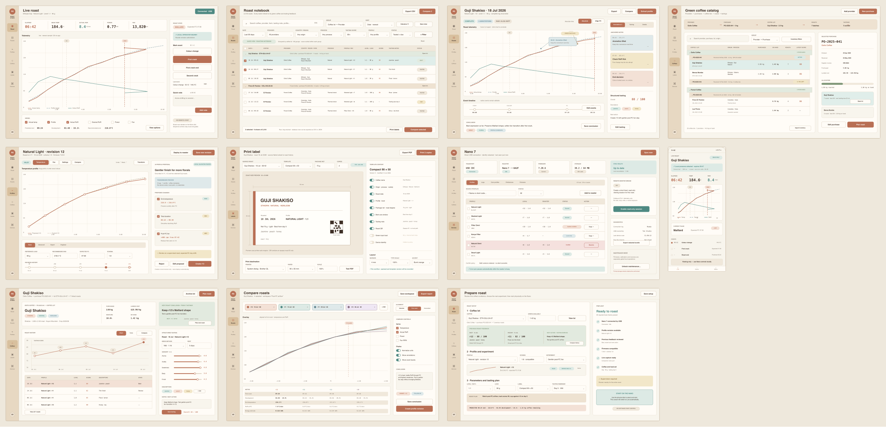

# Tan Studio Excalidraw mockups

This package is the editable UI exploration for the modern Kaffelogic application. The source board is [`kaffelogic-modern-studio.excalidraw`](kaffelogic-modern-studio.excalidraw); it can be opened directly in [Excalidraw](https://excalidraw.com/) with **Open** or by dropping the file onto the canvas.



## Frames

| # | Frame | Main decisions represented |
| --- | --- | --- |
| 1 | Live roast command center | Large telemetry canvas, live values, local event marking, quick note, nearby-operator state, and no software/remote start control. |
| 2 | Roast notebook | Large database-style table grouped by coffee lot and provider; saved views; multi-attribute filters; configurable columns; sorting; tasting scores/status; multi-select comparison; CSV/JSON export. |
| 3 | Log review and annotations | Native events, anchored app notes, structured tasting summary, comparison entry, profile extraction, and raw `.klog` retention. |
| 4 | Profile editor + AI proposal | Editable temperature curve, revisions, progressive settings, selected-context transmission preview, evidence-based field diffs, deterministic validation, and local-revision-only acceptance. |
| 5 | Label composer | Exact physical preview, distinct package-net and green-input-load fields, opaque QR identifier, overflow/privacy checks, system print, and print-ready PDF. |
| 6 | Device and sync center | Redacted identity, USB/storage/firmware state, local-versus-roaster inventory, preserved conflicts, read-only bridge, diagnostics, and gated maintenance. |
| 7 | Remote mobile monitor | Responsive telemetry, event state, connection quality, expiring local-presence attestation, explicit read-only status, and no control surface. |
| 8 | Coffee lot + structured tasting | Explicit provider → purchase → coffee-lot context, roast history, quality trend, linked revisions, sensory scoring, descriptors, and a tasting-derived next-roast conclusion. |
| 9 | Multi-roast compare workspace | Up to four overlays, first-crack/absolute/normalized alignment, shared display controls, metrics table, saved conclusion, and profile-revision handoff. |
| 10 | Roast setup and preflight | Coffee/profile/level/load selection, previous-best versus recent-roast evidence, tasting-derived next action, compatibility and capture checks, prediction, supervision warning, and physical-Nano start handoff. |
| 11 | Green coffee catalog and purchases | Provider → purchase → coffee-lot hierarchy, inventory and optional purchase-cost reference metadata, lot allocations, roast/tasting rollups, and a direct handoff into planning the next roast. |

The original seven primary PRD views are preserved. Frames 8–11 make coffee/tasting, comparison, preflight, and green-coffee procurement first-class rather than hiding those workflows inside a generic log browser.

## Coffee-to-roast information model

The mockups use one visible hierarchy throughout:

```text
Provider → Purchase → Coffee lot → Roast → Tasting → Next-roast conclusion
```

A purchase can allocate quantity and optional cost reference metadata to multiple coffee lots. A roast may be assigned to one physical lot and always retains its raw `.klog`; uncataloged imports remain valid and visible. Each roast can have one or more tasting sessions. Conclusions remain attached to the coffee identity or lot scope so they are visible at preflight the next time that coffee is roasted.

The roast notebook is deliberately table-first. Its displayed fields cover date, coffee, provider, country, region/farm, process, profile/revision, level/load, tasting score, tasting notes, and status. The control row demonstrates saved views, nested grouping, sorting, column configuration, and filters for the attributes requested in the PRD.

## Visual system

The direction is a calm, light Bali-house interior translated into an analytical tool: warm limewash, pale oak and rattan, linen-like surfaces, muted greenery, lagoon water, and sun-washed terracotta. The navigation is intentionally light rather than a heavy dark rail.

| Token | Hex | Role |
| --- | --- | --- |
| Limewash canvas | `#EEE8DC` | Board and app surround |
| Warm paper | `#F8F5ED` | Main app background |
| Linen surface | `#FFFCF7` | Tables, inspectors, charts and controls |
| Espresso | `#3E3027` | Primary text and high-contrast data |
| Pale oak | `#D8C09E` | Selected navigation and material emphasis |
| Rattan wash | `#EEE2D1` | Navigation, purchase rows and secondary bands |
| Sun-washed clay | `#B86F55` | Heat, primary actions and active roast series |
| Sage | `#7E9678` | Coffee-lot context, best results and learning loops |
| Muted lagoon | `#4E8982` | Connected, validated and read-only states |
| Muted ocean | `#668994` | Profile targets and neutral comparison series |
| Soft sand line | `#DED2C1` | Borders and chart grids |
| Fault red | `#A4483F` | Destructive actions, faults and conflicts only |

- Open chart canvases and compact tables replace nested card grids.
- Soft color bands establish hierarchy without sacrificing table density.
- Desktop uses a pale-rattan navigation rail; mobile retains a compact bottom navigation.
- Values use tabular/monospaced figures where scanability matters.
- Clay is never used as an error color; red remains reserved for faults and destructive boundaries.

The safety boundary is intentional: roast start happens on the physical Nano, remote sessions are telemetry-only, and AI proposals create a local revision but never deploy it.

## Files

- `kaffelogic-modern-studio.excalidraw` — editable Excalidraw scene with eleven named frames and individually editable vector/text elements.
- `generate.mjs` — dependency-free deterministic scene and SVG generator.
- `previews/overview.svg` and `previews/overview.png` — whole-board handoff view.
- `previews/<frame>.svg` and `previews/<frame>.png` — one export for each frame.

## Regenerate

From the repository root:

```sh
node mockups/generate.mjs

for source_file in mockups/previews/*.svg; do
  png_file="${source_file%.svg}.png"
  if [ "$(basename "$source_file")" = "overview.svg" ]; then
    rsvg-convert --width 2485 --keep-aspect-ratio "$source_file" -o "$png_file"
  else
    rsvg-convert "$source_file" -o "$png_file"
  fi
done
```

`rsvg-convert` is only needed for PNG exports; the generator itself uses Node built-ins. Running the generator overwrites the generated `.excalidraw` and SVG files. For persistent system-wide edits, change `generate.mjs`; for freeform design exploration, duplicate the `.excalidraw` board before editing.

## Validation

The generated scene uses the open Excalidraw JSON format (`type: excalidraw`, version 2). Every child element points to one of the eleven named frames, and the source contains no device serial, local path, or credential. Preview exports come from the same drawing data as the editable board.
